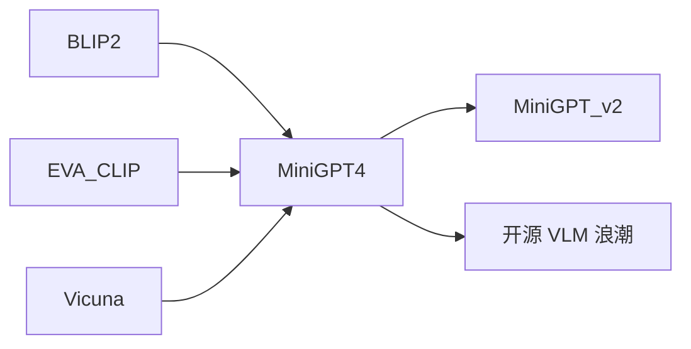

# 🔒 案件 L4-17：MiniGPT-4 — 多模态的"精简主义"

> **《LLM 百案录》第 088 案 · 精简对齐**
> *GPT-4V 闭源、训练贵——MiniGPT-4 说："冻住视觉 + 冻住语言，只学一层投影也能干。"*

🚇 [30秒速览](#速览) ｜ 🚲 [3分钟通读](#通读) ｜ 🚗 [30分钟精读](#精读)

🎭 **叙事母题**：🔒 **精简对齐** —— 一层线性投影 = 视觉与语言的桥

---

## 0️⃣ 案件档案

| 案情要素 | 内容 |
|---|---|
| **案发时间** | 2023-04（Zhu et al., KAUST） · [📄 arXiv 2304.10592](https://arxiv.org/pdf/2304.10592) |
| **受害者** | GPT-4V 的"训练黑箱 + 高成本" |
| **作案凶器** | EVA-CLIP（冻结）+ Vicuna（冻结）+ 一层 linear projection（仅这层训练） |
| **作案动机** | "GPT-4V 的视觉能力很可能就是简单对齐——开源也能做" |
| **结案陈词** | MiniGPT-4 用一层 768→4096 的 linear projection，把 EVA-CLIP 输出对齐到 Vicuna 的 token 空间，开源复现接近 GPT-4V 的能力 |

**精确事实卡**：

| 字段 | 精确值 | 来源 |
|---|---|---|
| **视觉编码** | EVA-CLIP ViT-G/14（冻结） | Section 3 |
| **语言模型** | Vicuna-7B / 13B（冻结） | Section 3 |
| **可训部分** | 仅 linear projection 层 | Section 3 |
| **两阶段训练** | 阶段 1 大规模图文预训练 → 阶段 2 高质量对话微调 | Section 4 |

---

## 1️⃣ <a id="速览"></a>🚇 30 秒速览

> GPT-4V 用了多少多模态训练？OpenAI 不说。
> MiniGPT-4 大胆假设：**只要把视觉特征"翻译"到语言空间，剩下的能力都是 LLM 本身的。**
> 实践：冻结 EVA-CLIP（提取图像特征）+ 冻结 Vicuna（语言能力），中间加一层 linear projection 对齐。
> 结果：**只训练一层投影**，就在描述图像、视觉问答上接近 GPT-4V（虽弱于但开源）。

---

## 2️⃣ <a id="通读"></a>🚲 3 分钟通读：极简的对齐范式（Why）

### 模型架构（极简）
```
图像
  ↓
EVA-CLIP ViT-G/14  ← 冻结（用预训练的强视觉编码器）
  ↓ 图像特征 (Q-Former 压缩到 32 个 token)
  ↓
Linear Projection ← **唯一可训练的部分**
  ↓ 投影到 Vicuna token 空间（4096 维）
[图像 token]
[文本 token]
  ↓
Vicuna 7B / 13B  ← 冻结
  ↓
回答
```

### 两阶段训练
```
阶段 1：粗对齐（大规模噪声数据）
  - 数据：Conceptual Captions、SBU、LAION（5M 图文对）
  - 目标：让 projection 层学会"把视觉特征映射到 LLM 能用的 token"

阶段 2：精调（小规模高质量数据）
  - 数据：3500 条人工筛选的高质量图像描述
  - 目标：让模型生成连贯流畅的 caption / 回答（避免阶段 1 的口语化噪声）
```

---

## 3️⃣ <a id="精读"></a>🚗 30 分钟精读

### Q-Former 与 Projection
```python
# 简化代码
image_features = eva_clip(image)         # (1, 257, 1408)
queries = q_former(image_features)        # (1, 32, 768) ← BLIP-2 的设计
projected = linear(queries)               # (1, 32, 4096)
# 把这 32 个"伪 token"插入到 Vicuna 输入中
prompt_tokens = vicuna_tokenize("Describe this image:")
all_tokens = concat([projected, prompt_tokens])
output = vicuna.generate(all_tokens)
```

### 为什么阶段 2 至关重要
```
阶段 1 后的模型：
  能识别图像内容，但描述很"机器"——
  "A image of a cat sitting on a chair"

阶段 2 用 3500 条精修数据：
  教会模型自然描述 →
  "在这张图里，一只橘色的猫舒服地蜷在椅子上，似乎在打盹。"
```

---

## 4️⃣ 物证清单 & 🔥 Hot Take

### 能力展示
- ✅ 描述图像（中英文都行，Vicuna 多语能力继承）
- ✅ 解释 meme / 笑话
- ✅ 看食材列表 → 给食谱建议
- ❌ 精细 OCR（弱）
- ❌ 数学公式识别（弱）

### 🔥 Hot Take
1. **多模态对齐可能比想象简单**：仅一层线性映射 + 冻结其他，居然能达到这个效果。
2. **数据质量 > 数据量**：3500 条精修数据带来的效果飞跃，验证了"阶段 2"的关键性。
3. **开源派的胜利**：MiniGPT-4 + LLaVA 共同证明 GPT-4V 不是不可复制的黑魔法。

---

## 5️⃣ 🐛 论文没说的坑

1. **细节信息丢失**：32 个 query token 容量有限，无法保留高分辨率细节
2. **指令遵循不稳**：没像 LLaVA 那样用大量 instruction tuning，复杂多轮对话容易跑偏
3. **OCR / 图表理解弱**：因为 EVA-CLIP 本身在这些任务上就一般

---

## 6️⃣ 影响波及



---

## 7️⃣ 侦探手记

MiniGPT-4 让我意识到：**对齐可能比对齐工具想象得简单**。
> 如果一个 linear projection 就够，那"多模态学习"的核心可能就是**找到好的桥梁**——
> 而不是从头训一个端到端的多模态怪物。

---

## 自查清单

**已做到**：
- 解释 MiniGPT-4 的"冻结 + 单层对齐"范式
- 描述两阶段训练的必要性
- 对比 MiniGPT-4 vs LLaVA / GPT-4V 的能力差异

**❌ 未做到**：
- ❌ 未深入分析 Q-Former 的设计动机
- ❌ 未对比 MiniGPT-4 与 BLIP-2 的差异

---

## 🔟 延伸卷宗
- 📚 [L4-15 GPT-4V](./L4-15_GPT4V.md)
- 📚 [L4-16 LLaVA](./L4-16_LLaVA.md)
- 📚 [L4-18 CogVLM](./L4-18_CogVLM.md)

### 🚀 实践入口
[github.com/Vision-CAIR/MiniGPT-4](https://github.com/Vision-CAIR/MiniGPT-4)

---

## 📌 本案归档

| 字段 | 值 |
|---|---|
| 笔记版本 | 「精简对齐版」 |
| 叙事母题 | 🔒 精简对齐 |
| 推荐指数 | ⭐⭐⭐⭐ |
| 学习时长 | 30s / 3min / 30min |
| 上次更新 | 2026-04-30 |
| 下一站 | → [L4-18 CogVLM](./L4-18_CogVLM.md) |
