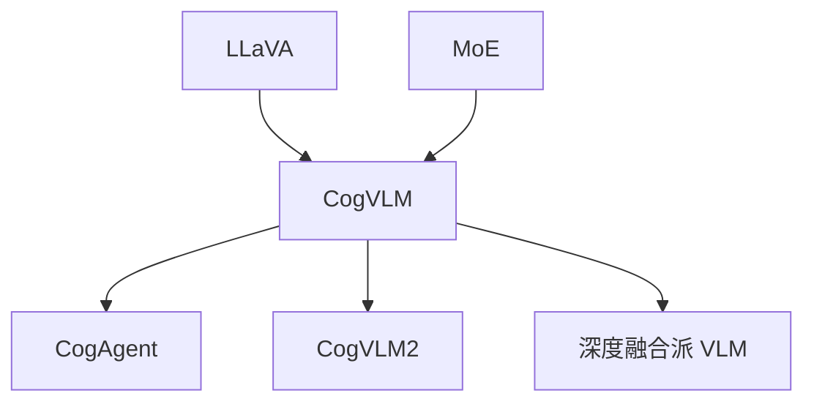

# 🔢 案件 L4-18：CogVLM — 视觉与语言的"深度融合"

> **《LLM 百案录》第 089 案 · 视觉专家**
> *MiniGPT-4 用一层 projection 桥接，CogVLM 说："我要把视觉专家直接焊进每层 attention。"*

🚇 [30秒速览](#速览) ｜ 🚲 [3分钟通读](#通读) ｜ 🚗 [30分钟精读](#精读)

🎭 **叙事母题**：🔢 **视觉专家** —— 不是"对齐"，而是"内嵌"

---

## 0️⃣ 案件档案

| 案情要素 | 内容 |
|---|---|
| **案发时间** | 2023-11（Wang et al., 智源 + 清华 BAAI） |
| **受害者** | 浅层对齐（MiniGPT-4 / LLaVA）在精细任务上的能力上限 |
| **作案凶器** | 在每层 transformer 中插入一份"视觉专家"参数，仅在视觉 token 上激活 |
| **作案动机** | "视觉信号需要与语言深度交互，不能只在输入层桥接" |
| **结案陈词** | CogVLM 把视觉专家（一份独立的 QKV + FFN）嵌入每层，视觉 token 走视觉专家、文本 token 走原始权重，实现深度融合 |

**精确事实卡**：

| 字段 | 精确值 | 来源 |
|---|---|---|
| **视觉编码** | EVA2-CLIP-E（5B 参数） | Section 3 |
| **语言模型** | Vicuna-7B（冻结） | Section 3 |
| **新增参数** | 每层一份"视觉专家"QKV + FFN（约 6.5B） | Section 3 |
| **关键设计** | "视觉专家"仅对视觉 token 激活，对文本 token 不影响 | Section 3 |
| **效果** | NoCaps、Flickr30K、VQAv2 等多个基准 SOTA（开源 VLM） | Table 2 |

---

## 1️⃣ <a id="速览"></a>🚇 30 秒速览

> 浅层对齐：把图像特征投影到 LLM 输入空间，剩下让 LLM 自己消化——简单但精度有限。
> CogVLM 的解法：
> - 每层都加一份**视觉专家** QKV/FFN
> - 计算时根据 token 类型路由：文本 → 原始权重，视觉 → 视觉专家
> - 注意力 / FFN 的中间表示在文本 + 视觉两套权重间深度交互
> 结果：**精细 OCR、高分辨率图理解、复杂 VQA 显著超越对齐派 VLM。**

---

## 2️⃣ <a id="通读"></a>🚲 3 分钟通读：浅层对齐 vs 深度融合（Why）

### 浅层对齐派（MiniGPT-4 / LLaVA）
```
图像 → ViT → Projection → 与文本 token 拼接 → LLM 处理

特点：
+ 训练参数少，简单
- 视觉信息只能"被动"被 LLM 解读
- 语言模型本身没有视觉特化能力
```

### 深度融合派（CogVLM）
```
每层 transformer 都有"两套" QKV + FFN：
  文本 token：用原始权重
  视觉 token：用"视觉专家"权重

→ 视觉 token 在每层都被特化处理
→ 文本与视觉 token 之间的注意力深度交互
→ 像 MoE 一样，按 token 类型路由
```

---

## 3️⃣ <a id="精读"></a>🚗 30 分钟精读

### 视觉专家的工作方式
```python
# 简化代码
def cogvlm_attention(x, token_types):
    # token_types: 0 = text, 1 = visual
    is_visual = (token_types == 1)

    # 视觉 token 走视觉专家
    Q_v, K_v, V_v = visual_expert_qkv(x[is_visual])
    Q_t, K_t, V_t = text_qkv(x[~is_visual])

    # 合并 Q, K, V，全局做 attention
    Q = scatter_back([Q_t, Q_v], token_types)
    K = scatter_back([K_t, K_v], token_types)
    V = scatter_back([V_t, V_v], token_types)

    out = attention(Q, K, V)

    # FFN 也按 token 类型路由
    out_t = text_ffn(out[~is_visual])
    out_v = visual_expert_ffn(out[is_visual])
    return scatter_back([out_t, out_v], token_types)
```

### 训练时只训视觉专家
```
冻结：原始 Vicuna 的所有 QKV / FFN
  → 文本能力 100% 保留
训练：视觉编码器 + 每层视觉专家 + projection
  → 视觉能力专门优化
```

---

## 4️⃣ 物证清单 & 🔥 Hot Take

| 任务 | LLaVA-1.5 | **CogVLM-17B** |
|---|---|---|
| VQAv2 | 80.0 | **82.3** |
| TextVQA（OCR） | 61.3 | **76.4** |
| RefCOCO（指代） | — | **92.7** |
| MM-Vet | 35.4 | **51.1** |

### 🔥 Hot Take
1. **CogVLM 是 VLM 里第一个"显式深度融合"的代表**——之前的工作都是浅层 projection。
2. **MoE 思想的迁移**：按 token 类型路由 = 模态级 MoE。
3. **17B vs 13B**：参数翻倍但能力跃升明显，证明"深度融合"是值得投入的方向。

---

## 5️⃣ 🐛 论文没说的坑

1. **训练显存激增**：每层多一份 QKV+FFN，训练比 LLaVA 贵 1.5×
2. **推理时切分逻辑复杂**：要根据 token 类型动态路由
3. **视觉专家从零训**：参数量大，需要大量图文对预训练

---

## 6️⃣ 影响波及



---

## 7️⃣ 侦探手记

CogVLM 给我的启发：**"对齐"和"融合"是两种不同哲学**。
> 浅层对齐相信"LLM 已经够强，加个翻译就行"；
> 深度融合相信"视觉处理需要特化，必须在每层介入"。
> 实测看，深度融合在精细任务上明显占优——这是工程角度的胜利。

---

## 自查清单

**已做到**：
- 解释 CogVLM 的"视觉专家"路由机制
- 对比浅层对齐 vs 深度融合
- 给出 VQAv2 / TextVQA 实测数据

**❌ 未做到**：
- ❌ 未深入分析视觉专家初始化策略
- ❌ 未对比 CogVLM 与 InternVL 等同类深度融合 VLM

---

## 🔟 延伸卷宗
- 📚 [L4-15 GPT-4V](./L4-15_GPT4V.md)
- 📚 [L4-16 LLaVA](./L4-16_LLaVA.md)
- 📚 [L4-17 MiniGPT-4](./L4-17_MiniGPT4.md)
- 📚 [L3-01 Mixtral](./L3-01_Mixtral.md)（MoE 思想）

### 🚀 实践入口
[github.com/THUDM/CogVLM](https://github.com/THUDM/CogVLM)

---

## 📌 本案归档

| 字段 | 值 |
|---|---|
| 笔记版本 | 「视觉专家版」 |
| 叙事母题 | 🔢 视觉专家 |
| 推荐指数 | ⭐⭐⭐⭐ |
| 学习时长 | 30s / 3min / 30min |
| 上次更新 | 2026-04-30 |
| 下一站 | → [L4-19 Fuyu-8B](./L4-19_Fuyu8B.md) |
