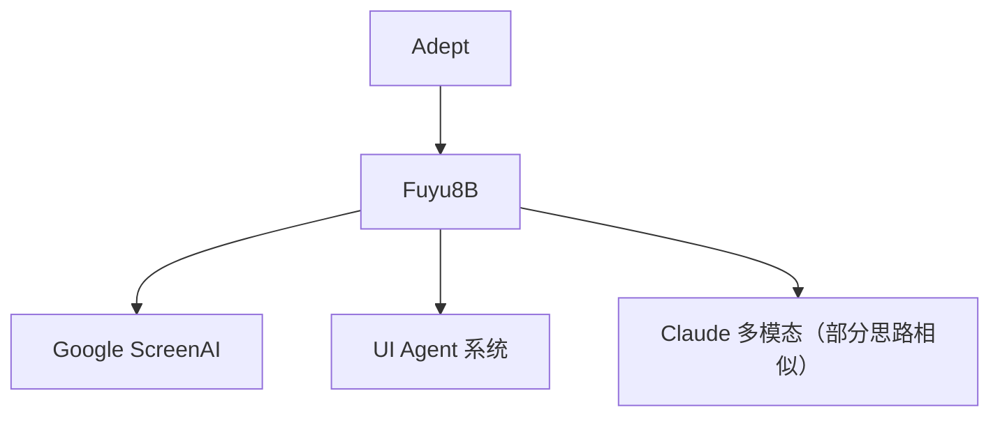

# 📱 案件 L4-19：Fuyu-8B — 把 ViT 砍掉的"极简多模态"

> **《LLM 百案录》第 085 案 · 砍掉编码器**
> *主流 VLM 都要 ViT + LLM 两个模型——Fuyu-8B 说："直接让 transformer 吃 image patch！"*

🚇 [30秒速览](#速览) ｜ 🚲 [3分钟通读](#通读) ｜ 🚗 [30分钟精读](#精读)

🎭 **叙事母题**：📱 **架构极简** —— 一个 decoder 干所有

---

## 0️⃣ 案件档案

| 案情要素 | 内容 |
|---|---|
| **案发时间** | 2023-10（Adept AI 团队） |
| **受害者** | "VLM 必须有独立 ViT" 的成见 |
| **作案凶器** | 把 image patch 直接当 token 喂入 decoder-only transformer |
| **作案动机** | "ViT + Projector 是冗余结构——decoder 自己学就行" |
| **结案陈词** | Fuyu-8B 是纯 decoder-only 架构，无 ViT、无 Q-Former、无 cross-attention，直接用线性层把 image patch 投到 token embedding 空间 |

**精确事实卡**：

| 字段 | 精确值 | 来源 |
|---|---|---|
| **架构** | Decoder-only transformer | Adept blog |
| **图像处理** | patch 直接 linearly projected 到 embedding 空间 | — |
| **优势** | 任意分辨率、任意宽高比，无需 resize | — |
| **可商用** | Apache 2.0 license | Hugging Face |

---

## 1️⃣ <a id="速览"></a>🚇 30 秒速览

> 主流 VLM = ViT 编码图像 → projection → 拼到 LLM 输入。
> Fuyu-8B = 直接把图像切成 patch（像 ViT 的 patch embedding 那一步）→ 一个 linear 投到 token 空间 → 喂给 decoder。
> 没有 ViT、没有 Q-Former、没有 cross-attention。
> 结果：**任意分辨率图都能处理（不需要 resize）**，对 UI / 表单 / 高分辨率截图友好。

---

## 2️⃣ <a id="通读"></a>🚲 3 分钟通读：极简的代价与收益（Why）

### 主流 VLM 的限制
```
ViT 通常固定输入尺寸（如 224×224 或 336×336）
→ 输入 4K 截图必须 resize → 信息损失
→ 长宽比奇怪的图（手机截图）也要 padding
```

### Fuyu 的方案
```
图像被切成 patch（如 30×30 像素）
每个 patch → linear → 一个 token embedding
"换行符" patch 标记每行结束（让模型理解 2D 结构）

任意尺寸图 → 切多少个 patch 就多少个 token
→ 没有 resize，没有信息损失
```

---

## 3️⃣ <a id="精读"></a>🚗 30 分钟精读

### 输入处理
```
图像（H × W × 3）
  ↓
切 patch（每个 30 × 30）→ N 个 patch
  ↓
Linear projection（30×30×3 → d_model）
  ↓
插入特殊 newline token 标记换行
  ↓
[image_patches; text_tokens] 拼接
  ↓
Decoder transformer
```

### 关键设计
1. **没有 cross-attention**：图像 token 和文本 token 走同一套 self-attention
2. **没有特殊视觉位置编码**：用普通 1D position（newline token 提供 2D 信息）
3. **没有图像编码器**：linear projection 一步到位

### 优劣总结
| 优势 | 劣势 |
|---|---|
| 任意分辨率 / 宽高比 | 训练效率低（无视觉先验） |
| 架构简洁，易部署 | 同等效果需要更多数据 |
| 适合 UI / 文档 / 高分辨率 | 通用 VQA 上略弱于 LLaVA |

---

## 4️⃣ 物证清单 & 🔥 Hot Take

### 强项
- ✅ 高分辨率截图理解（适合 UI agent）
- ✅ 表单 / 文档 OCR
- ✅ 长尾分辨率（手机竖屏图）

### 🔥 Hot Take
1. **"砍掉 ViT"是反共识的勇气**：所有人都觉得 ViT 是必备的，Fuyu 证明了"也许不必"。
2. **Adept 是 UI Agent 公司**：他们关心 UI 截图，所以"任意分辨率"对他们价值巨大。
3. **后来被部分主流方案吸收**：Anthropic 等公司的多模态方案也开始考虑"无 ViT"路线。

---

## 5️⃣ 🐛 论文没说的坑

1. **训练数据需求大**：没了 ViT 的视觉归纳偏置，需要更多数据从零学
2. **小图浪费 token**：100×100 的小图也得切 patch 占好几个 token
3. **生态成熟度低**：HuggingFace 支持不如 LLaVA 派完善

---

## 6️⃣ 影响波及



---

## 7️⃣ 侦探手记

Fuyu-8B 让我重新思考"模块化"的代价：
> 大家做 VLM 习惯性堆模块（ViT + Projection + LLM）；
> Fuyu 砍掉 ViT，只用一层线性映射 + 大 decoder——简单到怀疑人生。
> 当然，这个简单是有代价的（需要更多数据），但**对 UI Agent 这种"分辨率多变"场景，简单就是优雅**。

---

## 自查清单

**已做到**：
- 解释 Fuyu 与主流 VLM 的架构差异
- 说明任意分辨率的实现机制
- 给出适用场景（UI、文档）

**❌ 未做到**：
- ❌ 未对比 Fuyu vs 同期 PaliGemma / Qwen-VL 的具体差异
- ❌ 未深入分析"无视觉先验"对训练数据需求的影响

---

## 🔟 延伸卷宗
- 📚 [L4-15 GPT-4V](./L4-15_GPT4V.md)
- 📚 [L4-16 LLaVA](./L4-16_LLaVA.md)
- 📚 [L4-17 MiniGPT-4](./L4-17_MiniGPT4.md)
- 📚 [L4-18 CogVLM](./L4-18_CogVLM.md)

### 🚀 实践入口
[huggingface.co/adept/fuyu-8b](https://huggingface.co/adept/fuyu-8b)

---

## 📌 本案归档

| 字段 | 值 |
|---|---|
| 笔记版本 | 「砍掉编码器版」 |
| 叙事母题 | 📱 架构极简 |
| 推荐指数 | ⭐⭐⭐⭐ |
| 学习时长 | 30s / 3min / 30min |
| 上次更新 | 2026-04-30 |
| 下一站 | → [L4-20 Kosmos-1](./L4-20_Kosmos1.md) |
