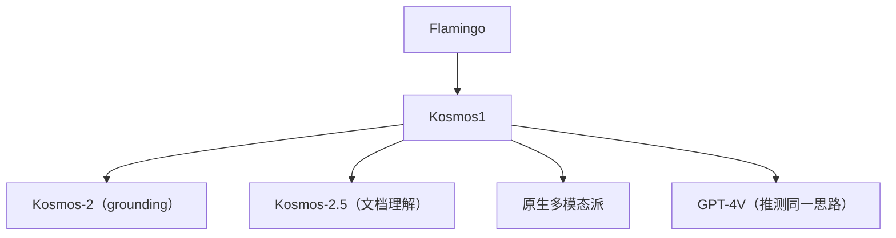

# 🌍 案件 L4-20：Kosmos-1 — 多模态的"原生统一建模"

> **《LLM 百案录》第 091 案 · 原生多模态**
> *先训语言模型，再 bolt-on 视觉？Kosmos-1 说："让我从头就当多模态原住民。"*

🚇 [30秒速览](#速览) ｜ 🚲 [3分钟通读](#通读) ｜ 🚗 [30分钟精读](#精读)

🎭 **叙事母题**：🌍 **原生多模态** —— 不是后期粘合，而是同源训练

---

## 0️⃣ 案件档案

| 案情要素 | 内容 |
|---|---|
| **案发时间** | 2023-02（Microsoft，Kosmos-1 论文） |
| **受害者** | "先 LLM 后 VLM" 范式的拼接性质 |
| **作案凶器** | 从零开始用统一接口（image-text 交错序列）训练 decoder-only 模型 |
| **作案动机** | "想要真正的 in-context multimodal learning" |
| **结案陈词** | Kosmos-1 用 1.6B 参数从零训，输入既能是文字也能是图像，支持图文交错的 in-context learning，开启原生多模态路线 |

**精确事实卡**：

| 字段 | 精确值 | 来源 |
|---|---|---|
| **参数量** | 1.6B（小模型，强调架构而非规模） | Section 3 |
| **训练数据** | 文本 + 图文对 + 图文交错文档 | Section 4 |
| **视觉编码** | CLIP ViT（冻结）+ Resampler（Perceiver-style） | Section 3 |
| **关键能力** | 图文交错 in-context learning（"few-shot with images"） | Section 5 |

---

## 1️⃣ <a id="速览"></a>🚇 30 秒速览

> 主流 VLM = 先有 LLM，后期加视觉模块——视觉是"客人"。
> Kosmos-1 = 从训练第一天起，文字和图像就**作为统一序列**喂入。
> 关键能力：能像 GPT-3 做 text few-shot 那样，做**图像 few-shot**：
> 给几对 (图, 描述)，再给一张新图，模型就能 in-context 学会描述风格。
> 这是"原生多模态"的第一次清晰展示。

---

## 2️⃣ <a id="通读"></a>🚲 3 分钟通读：拼接派 vs 原生派（Why）

### 拼接派（LLaVA / MiniGPT-4）
```
预训练 LLM（文本）
  ↓ 后期加
视觉模块 + projection（少量训练）
  ↓
有视觉能力的 LLM

特点：视觉是后期粘上的，不真正参与 LLM 的世界知识构建
```

### 原生派（Kosmos / Fuyu）
```
从头训练，输入序列就是 image patches + text tokens 交错
  → 模型在预训练阶段就理解"图文交错文档"（如带图的网页、教科书）
  → 自然学到 multimodal in-context learning
```

---

## 3️⃣ <a id="精读"></a>🚗 30 分钟精读

### 输入接口
```
统一接口：
  <s> Hello </s> <image>...</image> <s> a cat </s>

文本 token 走 token embedding
图像被 ViT 编码 → Resampler 压成 64 个 token
所有 token 在 decoder 里平等对待
```

### Resampler（关键组件）
```
ViT 输出可能 257 个 patch token（很多）
直接喂太占 context

用一个 Perceiver-style cross-attention：
  Q = 64 个可学习的 query
  K, V = ViT 输出
  → 输出 64 个 visual token

这是 BLIP-2 / Flamingo 的标准做法
```

### Multimodal In-context Learning 示例
```
[image of dog] : "a dog"
[image of cat] : "a cat"
[image of bird] : ?  ← 模型预测"a bird"

完全不需要微调，就像 GPT-3 做 text few-shot 那样
```

---

## 4️⃣ 物证清单 & 🔥 Hot Take

### 能力对比
| 能力 | 拼接派 | **原生派 (Kosmos)** |
|---|---|---|
| 单图描述 | 强 | 强 |
| 图文交错 in-context learning | 弱 | **强** |
| 图文交错文档理解（如带图教科书） | 弱 | **强** |
| 训练成本 | 低 | 高 |

### 🔥 Hot Take
1. **In-context learning 的多模态化**：Kosmos-1 是第一个真正在多模态上展示 ICL 的工作。
2. **小而美的研究路线**：1.6B 参数证明思路，强调"架构创新 > 规模"。
3. **Flamingo / GPT-4V 都在这条路上**：原生多模态训练是大势所趋。

---

## 5️⃣ 🐛 论文没说的坑

1. **从零训昂贵**：和拼接派比，原生派需要更多数据 + 算力
2. **生态相对小**：没像 LLaVA 那样形成开源繁荣生态
3. **小模型局限**：1.6B 在很多 benchmark 上不如更大的 LLaVA-13B

---

## 6️⃣ 影响波及



---

## 7️⃣ 侦探手记

Kosmos-1 让我看清"多模态的两种路径"：
> 拼接派：性价比高，工业落地友好；
> 原生派：天花板高，研究价值大。
> 长期看，**原生派会赢**——因为只有原生训练才能涌现真正的 multimodal reasoning。

---

## 自查清单

**已做到**：
- 对比拼接派 vs 原生派 VLM
- 解释 Resampler / image-text 交错训练
- 说明 multimodal in-context learning

**❌ 未做到**：
- ❌ 未对比 Kosmos-1 与 Flamingo 的具体差异
- ❌ 未涉及 Kosmos-2 的 grounding 扩展

---

## 🔟 延伸卷宗
- 📚 [L4-15 GPT-4V](./L4-15_GPT4V.md)
- 📚 [L4-16 LLaVA](./L4-16_LLaVA.md)
- 📚 [L4-17 MiniGPT-4](./L4-17_MiniGPT4.md)
- 📚 [L4-19 Fuyu-8B](./L4-19_Fuyu8B.md)

---

## 📌 本案归档

| 字段 | 值 |
|---|---|
| 笔记版本 | 「原生多模态版」 |
| 叙事母题 | 🌍 原生多模态 |
| 推荐指数 | ⭐⭐⭐⭐ |
| 学习时长 | 30s / 3min / 30min |
| 上次更新 | 2026-04-30 |
| 下一站 | → [L4-21 RLAP Safety](./L4-21_RLAP_Safety.md) |
