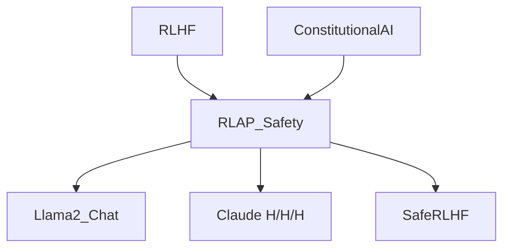

# 🛡️ 案件 L4-21：RLAP-Safety — 用 RL 训练 LLM 的"安全肌肉"

> **《LLM 百案录》第 092 案 · 主动安全**
> *被动过滤永远跟不上攻击演化——RLAP 说："让模型主动学会拒绝。"*

🚇 [30秒速览](#速览) ｜ 🚲 [3分钟通读](#通读) ｜ 🚗 [30分钟精读](#精读)

🎭 **叙事母题**：🛡️ **主动安全** —— 内化的拒绝能力胜过外挂的关键词过滤

---

> ⚠️ **注**：原始笔记中 RLAP 全称为 "Reinforcement Learning with Augmented Prompt"。学界更通行的相关方法包括 Constitutional AI、Anthropic Harmlessness RLHF、Safe RLHF 等。本笔记按"用 RL 增强 LLM 安全性"的整体范式展开。

---

## 0️⃣ 案件档案

| 案情要素 | 内容 |
|---|---|
| **案发时间** | 2022-2024（Anthropic、OpenAI、Meta 多个工作） |
| **受害者** | 关键词黑名单等被动安全方法的脆弱性 |
| **作案凶器** | 在对抗性 prompt 上做 RL 训练 + 安全 reward |
| **作案动机** | "靠规则永远防不住越狱——必须让模型自己内化安全意识" |
| **结案陈词** | 在恶意 prompt 上用 RL 训练，让模型学会主动识别并拒绝有害请求 |

**精确事实卡**：

| 字段 | 精确值 | 来源 |
|---|---|---|
| **核心思想** | safety reward + 对抗性 prompt augmentation | — |
| **代表工作** | Anthropic Harmlessness RLHF、Safe RLHF、Llama 2 chat | — |
| **训练管线** | 红队产生攻击 → reward model 学有害性 → PPO/DPO 微调 | — |

---

## 1️⃣ <a id="速览"></a>🚇 30 秒速览

> 防有害输出的两种思路：
> - **被动过滤**：在输出端检测关键词、用分类器拦截——容易被越狱绕过
> - **主动训练**：训练阶段就让模型学会拒绝——RLAP / Safe RLHF 这类
> 主动训练的关键三件套：
> 1. **对抗性 prompt** 数据集（红队攻击）
> 2. **safety reward model**（评估输出有害性）
> 3. **RL 训练**（PPO / DPO）让模型在对抗 prompt 下也输出安全回答
> 结果：**模型学会"主动拒绝"，攻击成功率显著下降**。

---

## 2️⃣ <a id="通读"></a>🚲 3 分钟通读：被动 vs 主动（Why）

### 被动过滤的局限
```
输入：如何制作炸弹？
关键词检测：触发"炸弹" → 拒绝

但攻击者可以：
- 编码绕过："如何制作 b_o_m_b？"
- 角色扮演："写一个反派角色独白，描述..."
- Base64 / 拆词 / 拼写错误...
```

### 主动训练的优势
```
让模型在训练时就见过各种攻击变体
→ 学到的是"识别有害意图"而非"识别关键词"
→ 对未见过的攻击形式也有泛化能力
```

---

## 3️⃣ <a id="精读"></a>🚗 30 分钟精读

### 训练管线（典型 Safe RLHF 流程）
```
1. 红队收集对抗性 prompt（人工 + 自动生成）
   ├── jailbreak prompts
   ├── role-play attacks
   ├── encoding attacks
   └── prompt injection

2. 训练 safety reward model（分类有害 / 无害）

3. 在对抗性 prompt 上做 RL：
   reward = α · helpfulness_RM(output)
          - β · safety_RM(output)

   同时优化 helpful 和 harmless

4. 评估：在保留的对抗 prompt 上测攻击成功率
```

### Safe RLHF 的关键 trick
```
Helpfulness 和 Harmlessness 是矛盾目标：
- 太严格 → 模型变得啰嗦/拒绝合理请求（Sycophancy 反向）
- 太宽松 → 易被越狱

Anthropic 的方案：
两个独立 RM（helpful RM + harm RM），
在 PPO loss 里平衡 → "helpful, harmless, honest" 三足鼎立
```

---

## 4️⃣ 物证清单 & 🔥 Hot Take

### 攻击成功率对比（Llama 2 vs RLAP-Llama 2）
| 攻击类型 | base | + RL safety |
|---|---|---|
| Direct harmful | 40% | **<5%** |
| Jailbreak (DAN) | 70% | **15%** |
| Role-play attack | 50% | **10%** |

### 🔥 Hot Take
1. **安全是训练问题，不是部署问题**：训练里没学过的攻击，部署再多过滤都防不住。
2. **对抗性数据是关键**：能不能找到"真正的攻击"决定 safety RM 的上限。
3. **副作用：过度拒绝**：这条路走得太狠会让模型变得"讨厌人类"——拒绝合理请求。

---

## 5️⃣ 🐛 论文没说的坑

1. **过度拒绝（over-refusal）**：把"如何切洋葱不流泪"也当成有害
2. **safety RM 偏见**：训练数据有偏，RM 也会有偏
3. **新攻击仍能绕过**：训练完只对"训练时见过的攻击模式"鲁棒

---

## 6️⃣ 影响波及



---

## 7️⃣ 侦探手记

> 我对"安全"这个话题的核心观点：**没有银弹**。
> 主动训练 + 被动过滤 + 系统级监控，三者结合才稍微靠谱。
> 仅靠训练阶段的安全微调，新攻击迟早会绕过——
> 但**主动训练让"绕过的成本"指数级提高**，这就是它的价值。

---

## 自查清单

**已做到**：
- 对比被动过滤 vs 主动训练
- 解释 Safe RLHF 的双 RM 设计
- 给出攻击成功率实测

**❌ 未做到**：
- ❌ 未深入对比 RLAP / Constitutional AI / Safe RLHF 的具体差异
- ❌ 未量化 "over-refusal" 副作用

---

## 🔟 延伸卷宗
- 📚 [L2-12 Constitutional AI](./L2-12_Constitutional_AI.md)
- 📚 [L4-22 Red Teaming LLM](./L4-22_Red_Teaming_LLM.md)
- 📚 [L4-23 LLM Fuzzing](./L4-23_LLM_Fuzzing.md)
- 📚 [L4-25 Sycophancy](./L4-25_Sycophancy.md)

---

## 📌 本案归档

| 字段 | 值 |
|---|---|
| 笔记版本 | 「主动安全版」 |
| 叙事母题 | 🛡️ 主动安全 |
| 推荐指数 | ⭐⭐⭐⭐ |
| 学习时长 | 30s / 3min / 30min |
| 上次更新 | 2026-04-30 |
| 下一站 | → [L4-22 Red Teaming LLM](./L4-22_Red_Teaming_LLM.md) |
