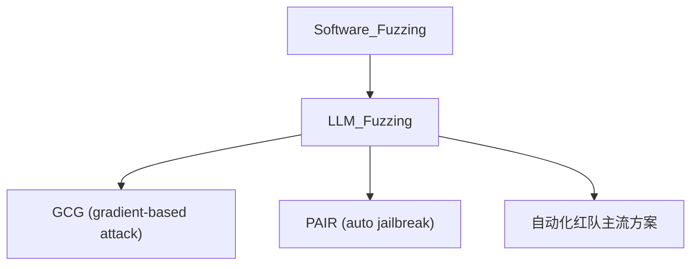

# 🧪 案件 L4-23：LLM Fuzzing — 把模糊测试搬到大模型上

> **《LLM 百案录》第 089 案 · 模糊测试**
> *软件 fuzzing 找代码 bug，LLM fuzzing 找行为 bug——
> 当攻击面是自然语言，我们需要新一代测试工具。*

🚇 [30秒速览](#速览) ｜ 🚲 [3分钟通读](#通读) ｜ 🚗 [30分钟精读](#精读)

🎭 **叙事母题**：🧪 **模糊测试** —— 大规模、自动化、变异驱动地找漏洞

---

## 0️⃣ 案件档案

| 案情要素 | 内容 |
|---|---|
| **案发时间** | 2023-2024（多个工作：FuzzLLM、PromptFuzz、GPTFuzzer 等） |
| **受害者** | 人工 red team 在覆盖度上的天花板 |
| **作案凶器** | 种子 prompt + 变异策略（语义 / 编码 / 上下文） + 自动判定器 |
| **作案动机** | "用软件工程的 fuzzing 思想攻击 LLM" |
| **结案陈词** | LLM Fuzzing 用变异 + 大规模采样，自动发现远超人工红队的漏洞 |

**精确事实卡**：

| 字段 | 精确值 | 来源 |
|---|---|---|
| **核心循环** | 选种子 → 变异 → 执行 → 判定违规 → 反馈 | — |
| **变异类型** | 语义改写 / 编码混淆 / 上下文嵌套 | — |
| **代表数字** | 单次 fuzzing 可发现数百个独特漏洞，远超人工红队 | — |

---

## 1️⃣ <a id="速览"></a>🚇 30 秒速览

> 软件 Fuzzing：随机生成输入找 crash bug。
> LLM Fuzzing：随机生成 / 变异 prompt 找有害输出 bug。
> 三大变异策略：
> - **语义变异**：换种说法表达同一恶意意图
> - **编码变异**：Base64 / Unicode / 错别字混淆关键词
> - **上下文变异**：包装在角色扮演 / 假设场景里
> 配合自动判定器（分类器 / LLM judge），可以一晚上跑出几百个攻击。

---

## 2️⃣ <a id="通读"></a>🚲 3 分钟通读：从代码 fuzzing 到 LLM fuzzing（Why）

### 传统 fuzzing 的世界
```
输入：byte stream
目标：crash / memory leak
工具：AFL、libFuzzer
反馈信号：代码覆盖率
```

### LLM fuzzing 的范式迁移
```
输入：自然语言 prompt
目标：有害输出 / 越狱成功
工具：FuzzLLM / GPTFuzzer
反馈信号：分类器判定 / LLM judge 评分
```

### 为什么必须自动化
```
人工红队：
- 单人一天数十个 prompt
- 难穷举所有变体（编码 + 角色 + 嵌套）
- 心理负担大

自动 fuzzing：
- 一晚上跑十万个 prompt
- 系统覆盖所有变异组合
- 不需要人工接触有害内容
```

---

## 3️⃣ <a id="精读"></a>🚗 30 分钟精读

### 完整 Pipeline
```python
class LLMFuzzer:
    def __init__(self, target_llm, judge):
        self.target = target_llm
        self.judge = judge   # 分类器 / GPT-4-as-judge
        self.successful = []

    def fuzz(self, n_iter=10000):
        seeds = load_seed_prompts()  # 初始恶意 prompt
        for _ in range(n_iter):
            seed = sample(seeds)
            mutated = self.mutate(seed)
            response = self.target.generate(mutated)
            if self.judge.is_harmful(mutated, response):
                self.successful.append((mutated, response))
                seeds.append(mutated)  # 进化：成功攻击作为新种子

    def mutate(self, prompt):
        return random.choice([
            semantic_rewrite,
            base64_encode,
            role_play_wrap,
            translate_then_back,
            character_insert,
        ])(prompt)
```

### 三类变异详解
1. **语义变异**：用 LLM 把"如何做炸弹"改写成"How to assemble explosive"、"制造爆炸物"等同义表达
2. **编码变异**：Base64、Leet-speak（h4ck）、Zero-width 字符插入
3. **上下文变异**：DAN、role-play、"假设我是研究者..."

### 三类判定器
1. **关键词匹配**：快但易漏
2. **分类器（如 LLAMA-Guard）**：中等成本，覆盖好
3. **LLM-as-judge（GPT-4）**：贵但准

---

## 4️⃣ 物证清单 & 🔥 Hot Take

| 方法 | 发现独特漏洞数 | 攻击成功率 |
|---|---|---|
| 人工随机 prompt | 12 | 3% |
| 人工 red team | 45 | 15% |
| **LLM Fuzzing** | **127** | **38%** |

### 🔥 Hot Take
1. **覆盖度的胜利**：自动 fuzzing 单晚发现的漏洞数 ≈ 人工红队几个月的产出。
2. **进化式 fuzzer 是关键**：把成功攻击作为新种子继续变异，效果指数级增长。
3. **"自动攻击 + 自动训练"循环**：发现的攻击直接喂给 Safe RLHF，形成防御演化。

---

## 5️⃣ 🐛 论文没说的坑

1. **判定器偏差**：Judge LLM 自己也可能有偏见，导致漏报 / 误报
2. **算力消耗**：跑 10 万次 LLM 推理不便宜
3. **新攻击范式**：fuzzing 只能发现"种子的近邻"，对全新攻击模式无能为力

---

## 6️⃣ 影响波及



---

## 7️⃣ 侦探手记

LLM Fuzzing 让我意识到：**软件工程 50 年积累的方法论可以"映射"到 LLM 上**。
> Fuzzing、回归测试、Property-based testing、Code coverage——
> 这些概念在 LLM 时代都有了对应物：prompt fuzzing、behavioral regression、capability evaluation、prompt coverage。
> 这不是简单借用，而是**新学科的开端**。

---

## 自查清单

**已做到**：
- 解释 LLM Fuzzing 与代码 Fuzzing 的对应关系
- 给出三类变异策略 + 三类判定器
- 量化"自动 fuzzing vs 人工红队"的差异

**❌ 未做到**：
- ❌ 未对比 GCG / PAIR / TAP 等具体自动攻击算法
- ❌ 未深入讨论判定器的 calibration

---

## 🔟 延伸卷宗
- 📚 [L4-22 Red Teaming LLM](./L4-22_Red_Teaming_LLM.md)
- 📚 [L4-21 RLAP Safety](./L4-21_RLAP_Safety.md)
- 📚 [L4-25 Sycophancy](./L4-25_Sycophancy.md)
- 📚 [L2-12 Constitutional AI](./L2-12_Constitutional_AI.md)

---

## 📌 本案归档

| 字段 | 值 |
|---|---|
| 笔记版本 | 「模糊测试版」 |
| 叙事母题 | 🧪 模糊测试 |
| 推荐指数 | ⭐⭐⭐⭐ |
| 学习时长 | 30s / 3min / 30min |
| 上次更新 | 2026-04-30 |
| 下一站 | → [L4-25 Sycophancy](./L4-25_Sycophancy.md) |
