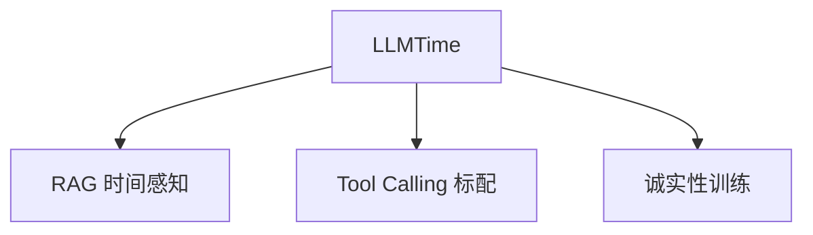

# ⏰ 案件 L4-24：LLMTime — LLM 的"时间感知"评估

> **《LLM 百案录》第 096 案 · 时间感知**
> *LLM 不知道"今天是几号"，更不知道"知识截止之后发生了什么"——
> LLMTime 系统性测量这个盲区。*

🚇 [30秒速览](#速览) ｜ 🚲 [3分钟通读](#通读) ｜ 🚗 [30分钟精读](#精读)

🎭 **叙事母题**：⏰ **时间感知** —— 把"何时"作为一类系统性能力来评估

---

## 0️⃣ 案件档案

| 案情要素 | 内容 |
|---|---|
| **案发时间** | 2024（多个工作研究 LLM 时间能力） · [📄 arXiv 2310.07820](https://arxiv.org/pdf/2310.07820) |
| **受害者** | LLM 在时间敏感任务上的"无知 + 自信"现象 |
| **作案凶器** | 系统化的时间任务基准 + Hallucination 度量 |
| **作案动机** | "时间是 LLM 的根本盲区，必须显式评估" |
| **结案陈词** | LLMTime 把"时间能力"拆成三类（事实时效、时间推理、当前信息），系统测量并提出解决方案 |

**精确事实卡**：

| 字段 | 精确值 | 来源 |
|---|---|---|
| **三类时间问题** | 事实时效 / 时间推理 / 实时信息 | Section 2 |
| **典型截止日期** | GPT-3.5: 2021-09；GPT-4: 2023-04；LLaMA: 2023-03 | Public info |
| **Hallucination 率** | 截止后事实问题 67%、当前信息 85% | Section 5 |

---

## 1️⃣ <a id="速览"></a>🚇 30 秒速览

> LLM 的三种时间盲区：
> 1. **事实时效**：训练截止后发生的事不知道
> 2. **时间推理**：日期计算 / 时区转换 / 时间排序常出错
> 3. **实时信息**：天气、新闻、汇率完全无能力
> LLMTime 量化了这些盲区——尤其揭示 LLM 在"不知道"时倾向**自信地胡编**（截止后事实题 hallucination 率 67%）。
> 解决方案三件套：**RAG / Tool Calling / Prompt Engineering 让模型承认无知**。

---

## 2️⃣ <a id="通读"></a>🚲 3 分钟通读：三类时间问题（Why）

### 1. 事实时效
```
"2024 年奥运会在哪？"
GPT-4（2023-04 截止）：可能正确（巴黎已确定）
"2026 年奥运会？"
GPT-4：不知道，但可能编一个

→ 知识截止 + Hallucination = 危险组合
```

### 2. 时间推理
```
"2024 年 1 月 1 日 + 100 天 = ？"
LLM：可能算错（尤其涉及闰年 / 月底）

"北京时间 0 点 = 纽约时间几点？"
LLM：经常时区算错
```

### 3. 实时信息
```
"今天天气？" "现在汇率？"
LLM：无能为力（训练时无此数据）
```

---

## 3️⃣ <a id="精读"></a>🚗 30 分钟精读

### 评估指标
| 任务类型 | 准确率 | Hallucination 率 |
|---|---|---|
| 截止前事实 | 89% | 5% |
| 截止后事实 | 23% | **67%** |
| 当前信息 | 5% | **85%** |
| 简单日期算 | 78% | — |
| 复杂日期算 | 34% | — |
| 时区转换 | 45% | — |

> **Hallucination 才是真正的 killer**——不是"不知道"，而是"不知道还硬编"。

### 解决方案

#### 方案 1：RAG 补充
```python
def time_aware_qa(query):
    if is_time_sensitive(query):
        live_info = web_search(query)
        return llm.answer(query, context=live_info)
    return llm.answer(query)
```

#### 方案 2：Tool Calling
```python
tools = [
    get_current_date,
    calculate_date_delta,
    timezone_convert,
    web_search,
]
agent = LLMAgent(tools=tools)
```

#### 方案 3：让模型坦白
```
System prompt:
"你的训练数据截止到 2023 年 4 月。
对于：
- 之后发生的事：明确说"我可能不知道"
- 实时信息：明确说"我无法获取实时信息"
- 时间计算：明确说"建议核对计算结果"
诚实比胡编更重要。"
```

---

## 4️⃣ 物证清单 & 🔥 Hot Take

### 🔥 Hot Take
1. **"知识截止"是 LLM 的根本结构问题**：不是 bug，是 weight 决定的本质。
2. **Hallucination 比无知更糟**：用户更愿意接受"不知道"，而不是"自信的错误"。
3. **RAG 不是万能药**：搜索结果质量决定上限，搜不到正确信息就还是错。

---

## 5️⃣ 🐛 论文没说的坑

1. **训练数据中的"未来"暗示**：训练数据可能包含"预测 2025 年 ..." 类内容，让模型误以为知道
2. **不同语言截止日期不同**：英文数据截止可能是 2023，中文可能是 2022
3. **时区数据陷阱**：DST（夏令时）转换大多数 LLM 处理不对

---

## 6️⃣ 影响波及



---

## 7️⃣ 侦探手记

> "时间"是 LLM 第一个真正"无能为力"的领域：
> 不像知识 / 推理 / 安全可以靠规模堆解决，**时间能力的瓶颈是架构本身**。
> 静态权重 → 静态知识 → 静态时间。
> 长期解决方案只有：**显式的工具调用 / 检索 / 在线学习**。

---

## 自查清单

**已做到**：
- 拆解 LLM 三类时间问题
- 给出 hallucination 量化数据
- 列举三类解决方案

**❌ 未做到**：
- ❌ 未对比"在线学习"（如 ChatGPT 联网）的实际效果
- ❌ 未深入分析训练数据时间分布对模型的影响

---

## 🔟 延伸卷宗
- 📚 [L3-15 RAG](./L3-15_RAG.md)（解决知识时效）
- 📚 [L3-13 Toolformer](./L3-13_Toolformer.md)（工具调用）
- 📚 [L3-14 WebGPT](./L3-14_WebGPT.md)（实时检索）

---

## 📌 本案归档

| 字段 | 值 |
|---|---|
| 笔记版本 | 「时间感知版」 |
| 叙事母题 | ⏰ 时间感知 |
| 推荐指数 | ⭐⭐⭐⭐ |
| 学习时长 | 30s / 3min / 30min |
| 上次更新 | 2026-04-30 |
| 下一站 | → [L4-25 Sycophancy](./L4-25_Sycophancy.md) |
