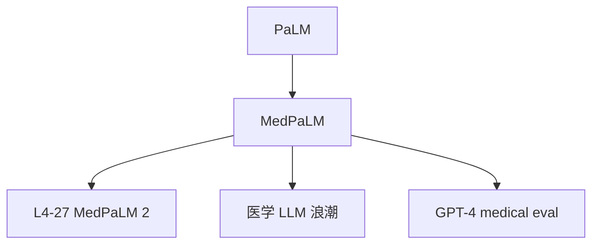

# 🏥 案件 L4-26：MedPaLM — 医学 LLM 的"开山立派"

> **《LLM 百案录》第 097 案 · 医学专才**
> *通用 LLM 在医学题上瞎答——MedPaLM 说："我专门为医学训练。"*

🚇 [30秒速览](#速览) ｜ 🚲 [3分钟通读](#通读) ｜ 🚗 [30分钟精读](#精读)

🎭 **叙事母题**：🏥 **医学专才** —— 通用模型 + 领域专精 + 安全优先

---

## 0️⃣ 案件档案

| 案情要素 | 内容 |
|---|---|
| **案发时间** | 2022-12（Google Health & DeepMind） · [📄 arXiv 2212.13138](https://arxiv.org/pdf/2212.13138) |
| **受害者** | 通用 LLM 在医学问答上的不准确性与不安全性 |
| **作案凶器** | PaLM 540B 基座 + 医学指令微调 + 医生偏好 RLHF |
| **作案动机** | "医疗是高风险高价值场景，需要专门优化的 LLM" |
| **结案陈词** | MedPaLM 在 USMLE / MedQA 等医学基准上首次接近临床医生水平 |

**精确事实卡**：

| 字段 | 精确值 | 来源 |
|---|---|---|
| **基座** | PaLM 540B | Section 2 |
| **微调** | Instruction tuning + 医学专家偏好 RLHF | Section 3 |
| **USMLE 准确率** | 67.2% （刚好达到 60% 通过线） | Table 2 |
| **后继** | MedPaLM 2 → 86%（接近专家） | L4-27 |

---

## 1️⃣ <a id="速览"></a>🚇 30 秒速览

> GPT-3.5 在美国医师执照考试（USMLE）只能拿 53%（不及格）。
> MedPaLM = PaLM 540B + 医学指令微调 + 医生 RLHF → **67%（刚过及格线）**。
> 主要改进：
> 1. **医学问答能力**：术语精确、临床推理可信
> 2. **安全机制**：免责声明 / 不确定性表达 / 风险提示
> 3. **医生评估**：除了基准，还邀请医学专家做盲评
> 这是 LLM 进入"高风险垂直领域"的标志性工作。

---

## 2️⃣ <a id="通读"></a>🚲 3 分钟通读：通用 vs 医学专精（Why）

### 通用 LLM 的医学短板
```
1. 医学术语不精确（"心衰" vs "心力衰竭" vs CHF 混用）
2. 临床推理不严谨（症状-诊断-治疗 链条易跳步）
3. 缺乏不确定性表达（不会说"需要检查"）
4. 风险提示缺失（建议吃药不写禁忌）
```

### MedPaLM 的三层强化
```
1. SFT：医学问答数据微调（USMLE 题库 + 教科书 QA）
2. RLHF：医学专家做偏好排序
3. Safety prompt：每个回答自动加风险提示与免责
```

---

## 3️⃣ <a id="精读"></a>🚗 30 分钟精读

### 临床推理的输出范式
```
用户：58 岁男性，胸痛 2 小时，伴出汗、恶心、左臂放射，既往高血压、吸烟
MedPaLM：

1. 鉴别诊断（最可能 → 最不可能）：
   - 急性冠脉综合征（ACS）：症状典型，最可能
   - 主动脉夹层：需排除（撕裂样疼痛）
   - 肺栓塞：需排除（呼吸困难加重）
   - GERD：症状不典型，可能性低

2. 推荐检查：
   - 12 导联心电图（10 分钟内）
   - 心肌酶（troponin）
   - 胸部 CT（如怀疑夹层）

3. 紧急处理：
   - 立即叫救护车
   - 嚼服阿司匹林 300mg（如无禁忌）

⚠️ 本建议仅供参考，请立即就医。
```

### 不确定性表达
```
传统 LLM：直接给诊断
MedPaLM：分级表达
  - "高度怀疑（>80%）"：症状典型 + 体征支持
  - "需要排除（10-30%）"：要做检查才能确认
  - "可能性低但不能完全排除（<5%）"
```

### 安全机制
- **风险等级标签**：高风险（处方）/ 中风险（检查）/ 低风险（科普）
- **强制免责声明**：每个医疗建议自动加"请咨询专业医生"
- **关键词触发**：自杀 / 自伤等触发紧急资源（如 hotline 电话）

---

## 4️⃣ 物证清单 & 🔥 Hot Take

| 模型 | USMLE | MedQA | MedMCQA |
|---|---|---|---|
| GPT-3.5 | 53% | 50.8% | 57.0% |
| Flan-PaLM | 67.6% | 67.6% | 57.6% |
| **MedPaLM 540B** | **67.2%** | **67.6%** | **72.3%** |
| 临床医生（参考） | ~80-90% | — | — |

### 医生评估（盲评）
- 医学知识准确性：92%
- 临床推理合理性：87%
- 沟通可懂度：94%
- 但仍有 5.9% 的回答被认为"可能造成伤害"

### 🔥 Hot Take
1. **首个达到"及格线"的医学 LLM**：USMLE 60% 是医师证最低要求，67% 算过了。
2. **医生偏好 RLHF 是关键**：通用 RLHF 不行——必须用医学专家来排序。
3. **后被 MedPaLM 2 / GPT-4 超越**：但开创性意义不可替代。

---

## 5️⃣ 🐛 论文没说的坑

1. **5.9% 有害回答仍是上线障碍**：医疗场景 1% 都嫌多
2. **多模态缺失**：当时还不能看 X 光片（MedPaLM 2 才补上）
3. **跨地域知识差**：英美临床指南为主，亚洲指南覆盖少

---

## 6️⃣ 影响波及



---

## 7️⃣ 侦探手记

MedPaLM 让我看到 LLM 进入垂直领域的"模板"：
> 1. 强通用基座 +
> 2. 高质量领域数据微调 +
> 3. 领域专家偏好 RLHF +
> 4. 强安全机制
> 这四步是后续法律 / 金融 / 教育 LLM 的共同范式。

---

## 自查清单

**已做到**：
- 介绍 MedPaLM 三层强化
- 解释临床推理输出范式与安全机制
- 给出 USMLE / MedQA 实测数据

**❌ 未做到**：
- ❌ 未对比 MedPaLM 与 BioMedLM、PMC-LLaMA 等开源医学模型
- ❌ 未深入分析"5.9% 有害回答"的具体类型

---

## 🔟 延伸卷宗
- 📚 [L4-27 MedPaLM 2](notes/L4-27_MedPaLM2.md)（升级版）
- 📚 [L2-05 InstructGPT / RLHF](notes/L2-05_InstructGPT_RLHF.md)
- 📚 [L4-21 RLAP Safety](notes/L4-21_RLAP_Safety.md)

---

## 📌 本案归档

| 字段 | 值 |
|---|---|
| 笔记版本 | 「医学专才版」 |
| 叙事母题 | 🏥 医学专才 |
| 推荐指数 | ⭐⭐⭐⭐ |
| 学习时长 | 30s / 3min / 30min |
| 上次更新 | 2026-04-30 |
| 下一站 | → [L4-27 MedPaLM 2](notes/L4-27_MedPaLM2.md) |
