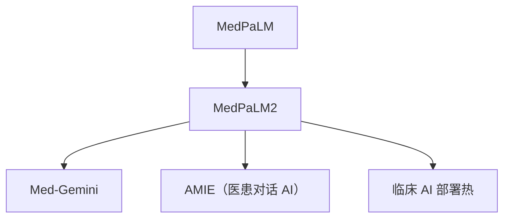

# 🏥 案件 L4-27：MedPaLM 2 — 医学 LLM 的"专家级"

> **《LLM 百案录》第 098 案 · 专家级医学**
> *MedPaLM 67% 才及格，MedPaLM 2 直接 86%——逼近专科医师水平。*

🚇 [30秒速览](#速览) ｜ 🚲 [3分钟通读](#通读) ｜ 🚗 [30分钟精读](#精读)

🎭 **叙事母题**：🏥 **专家级医学** —— 加大基座 + 医学专项优化 + 多模态

---

## 0️⃣ 案件档案

| 案情要素 | 内容 |
|---|---|
| **案发时间** | 2023-05（Google Health & DeepMind） · [📄 arXiv 2305.09617](https://arxiv.org/pdf/2305.09617) |
| **受害者** | MedPaLM 67% 仍距专家水平差距大 |
| **作案凶器** | PaLM 2 基座 + 医学专项优化 + 多模态扩展 + 强化安全 |
| **作案动机** | "把医学 LLM 推到 USMLE 专家水平" |
| **结案陈词** | MedPaLM 2 在 USMLE 上达到 86%，接近专科医师，并加入图像理解能力 |

**精确事实卡**：

| 字段 | 精确值 | 来源 |
|---|---|---|
| **基座** | PaLM 2（更高效） | Section 2 |
| **医学优化** | 数据规模 ↑ + Ensemble Refinement | Section 3 |
| **USMLE** | **86%** | Table 1 |
| **MedQA** | **85%** | Table 1 |
| **多模态** | X 光、病理图像理解 | Section 4 |

---

## 1️⃣ <a id="速览"></a>🚇 30 秒速览

> MedPaLM 2 vs MedPaLM 三大升级：
> 1. **基座升级**：PaLM → PaLM 2，更强 + 更高效
> 2. **Ensemble Refinement**：多次采样后让 LLM 自我精炼答案
> 3. **多模态**：能看 X 光片、病理图像
> USMLE 准确率从 67% → **86%**（专家水平 ~85%），MedMCQA 从 72% → **82%**。
> 这是 LLM 在医学领域第一次"达到专家"。

---

## 2️⃣ <a id="通读"></a>🚲 3 分钟通读：从及格到专家（Why）

### 提升来源拆解
```
MedPaLM (67%)
  +6%（基座升级 PaLM → PaLM 2）
  +8%（医学指令数据 ↑）
  +4%（Ensemble Refinement）
  +1%（更好的 prompt 工程）
  = 86% MedPaLM 2
```

### Ensemble Refinement（关键创新）
```
1. 同一题让模型采样 N 次（不同温度）
2. 把 N 个回答都给模型看："以下是 N 个候选答案，请综合最佳答案"
3. 模型学会从多个候选中提炼出最准确的版本

→ 比单纯 Self-Consistency 投票更强
```

---

## 3️⃣ <a id="精读"></a>🚗 30 分钟精读

### 多模态架构
```
图像（X 光 / 病理 / 皮肤镜）
  ↓ 视觉编码器
visual tokens
  ↓ 拼接到文本
[病史] [图像 tokens] [问题]
  ↓
PaLM 2
  ↓
诊断 + 推理 + 安全提示
```

### 风险分级输出
```python
risk_levels = {
    "高风险": ["处方建议", "剂量调整", "手术建议"],
    "中风险": ["检查建议", "转诊建议"],
    "低风险": ["生活方式建议", "一般科普"]
}

# 高风险建议必须包含：
# - 强制免责声明
# - "请立即就医"或"请咨询专科医生"
# - 不确定性等级
```

### 临床应用场景
1. **临床决策支持**：给医生辅助参考（不替代）
2. **医学教育**：教学生临床推理
3. **远程分诊**：偏远地区初步评估
4. **病人教育**：用通俗语言解释疾病

---

## 4️⃣ 物证清单 & 🔥 Hot Take

| 基准 | GPT-3.5 | GPT-4 | MedPaLM | **MedPaLM 2** | 专家 |
|---|---|---|---|---|---|
| USMLE | 53% | 86% | 67% | **86%** | ~85% |
| MedQA | 50% | 81% | 67% | **85%** | — |
| MedMCQA | 50% | 73% | 72% | **82%** | — |

### 🔥 Hot Take
1. **首个"专家级"医学 LLM**：USMLE 86% = 专科医师水平。
2. **Ensemble Refinement 是黑暗之力**：让模型自评 + 自精炼，比 Self-Consistency 更强。
3. **GPT-4 与 MedPaLM 2 你追我赶**：二者性能相当，但 MedPaLM 2 在不确定性表达和安全性上更稳。

---

## 5️⃣ 🐛 论文没说的坑

1. **闭源**：模型未发布，不能独立验证
2. **基准≠真实**：USMLE 是选择题，真实临床决策更复杂
3. **责任问题**：模型出错谁负责？法律框架未跟上

---

## 6️⃣ 影响波及



---

## 7️⃣ 侦探手记

MedPaLM 2 让我相信：**LLM 进入高风险领域只是时间问题**。
> 一年时间从"及格"到"专家级"，主要靠：基座变强 + 数据更好 + 推理时算力（Ensemble Refinement）。
> 三个维度都还远未饱和——医学 LLM 5 年内会全面超越通才医生。
> 真正的瓶颈在**法律、伦理、责任分配**，而非技术。

---

## 自查清单

**已做到**：
- 拆解 MedPaLM → MedPaLM 2 的提升来源
- 解释 Ensemble Refinement 机制
- 介绍多模态扩展

**❌ 未做到**：
- ❌ 未对比 MedPaLM 2 与 GPT-4 在临床推理细节上的差异
- ❌ 未深入讨论 LLM 医疗的法律责任问题

---

## 🔟 延伸卷宗
- 📚 [L4-26 MedPaLM](./L4-26_MedPaLM.md)（前作）
- 📚 [L4-15 GPT-4V](./L4-15_GPT4V.md)（多模态对照）
- 📚 [L1-15 Self-Consistency](./L1-15_Self_Consistency.md)（Ensemble Refinement 的前身）

---

## 📌 本案归档

| 字段 | 值 |
|---|---|
| 笔记版本 | 「专家级医学版」 |
| 叙事母题 | 🏥 专家级医学 |
| 推荐指数 | ⭐⭐⭐⭐ |
| 学习时长 | 30s / 3min / 30min |
| 上次更新 | 2026-04-30 |
| 下一站 | → [L4-28 AlphaCode](./L4-28_AlphaCode.md) |
