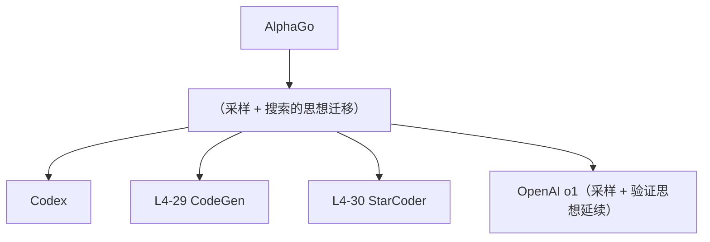

# 💻 案件 L4-28：AlphaCode — 把"蒙特卡洛暴力"用在编程竞赛

> **《LLM 百案录》第 099 案 · 竞赛级代码**
> *Codeforces 题目"做对率 < 0.1%"——AlphaCode 说："那就采样 100 万次。"*

🚇 [30秒速览](#速览) ｜ 🚲 [3分钟通读](#通读) ｜ 🚗 [30分钟精读](#精读) ｜ 🚀 [3小时复现](#复现)

🎭 **叙事母题**：💻 **竞赛级代码** —— 大规模采样 + 智能筛选 = 暴力美学

---

## 0️⃣ 案件档案

| 案情要素 | 内容 |
|---|---|
| **案发时间** | 2022-02（DeepMind, Li et al., Science 论文） |
| **受害者** | 编程竞赛对 LLM 的"难度天花板" |
| **作案凶器** | Massive Sampling + Clustering + Test Filtering |
| **作案动机** | "竞赛题对一题概率极低，那就把'多次尝试'做到极致" |
| **结案陈词** | AlphaCode 用 100 万级采样 + 聚类 + 测试过滤，在 Codeforces 上达到 Top 50%（约银牌选手水平） |

**精确事实卡**：

| 字段 | 精确值 | 来源 |
|---|---|---|
| **模型** | 41B encoder-decoder transformer | Section 3 |
| **采样数** | 单题最多 100 万 | Section 4 |
| **Codeforces** | 平均排名 Top 54.3% | Table 5 |
| **HumanEval** | pass@1 = 17.1%（41B） | Table 1 |

---

## 1️⃣ <a id="速览"></a>🚇 30 秒速览

> 一道竞赛题正解概率 0.1% → 单次采样几乎必然失败。
> AlphaCode 的暴力解法：
> 1. **大规模采样**：单题生成 100 万个候选程序
> 2. **聚类去重**：用嵌入相似度合并近重复，得到约 100 个代表
> 3. **测试过滤**：在公开测试用例上过滤掉错的
> 4. **最后投 10 个最有希望的**到提交系统
> 结果：**Codeforces Top 54.3%**——首次让 LLM 进入"竞赛级编程"。

---

## 2️⃣ <a id="通读"></a>🚲 3 分钟通读：暴力为什么有效（Why）

### 概率论计算
```
单次采样正确率 p = 0.001 (0.1%)
单次失败概率 = 1 - p = 0.999

100 万次至少一次成功 = 1 - 0.999^1,000,000
                   ≈ 1 - e^{-1000}
                   ≈ 1（几乎必然成功）
```

### 但单纯采样不够
```
问题：
1. 100 万候选里大多重复（相似的"暴力 for 循环"）
2. 不能全提交（OJ 限制提交数）
3. 没有 ground truth 标注

解法：
1. 聚类去重 → 保留多样性
2. 用公开 sample test 过滤 → 不通过的直接丢
3. 从聚类中各选 1 个代表，提交最多 10 个
```

---

## 3️⃣ <a id="精读"></a>🚗 30 分钟精读

### 完整 Pipeline
```python
def alphacode_solve(problem, sample_tests):
    # Step 1: 大规模采样
    candidates = []
    for _ in range(1_000_000):
        code = model.sample(problem, temperature=0.8)
        candidates.append(code)

    # Step 2: 聚类（基于嵌入或测试输出）
    embeddings = [embed(c) for c in candidates]
    clusters = kmeans(embeddings, n_clusters=100)
    cluster_reps = [select_representative(c) for c in clusters]

    # Step 3: 测试过滤
    passing = [c for c in cluster_reps if all_pass(c, sample_tests)]

    # Step 4: 提交最多 10 个
    return passing[:10]
```

### 模型结构
- Encoder-Decoder Transformer（41B）
- 输入：题目自然语言描述
- 输出：完整程序

### 训练数据
- **预训练**：GitHub 715GB 多语言代码
- **微调**：Codeforces 13K+ 题目 + 200 万正确解

### 温度采样的多样性
```
低温（0.2）：模型最自信的解 → 都很相似
高温（1.0）：多样化但很多错的

AlphaCode 用动态温度：
  简单题：低温
  难题：高温（0.8-1.2）
```

---

## 4️⃣ 物证清单 & 🔥 Hot Take

### Codeforces 评估
| 等级 | 解决问题率 |
|---|---|
| 铜牌（Top 30%） | ~30% |
| 银牌（Top 50%） | ~50% |
| 金牌（Top 70%） | ~70% |
| **AlphaCode** | **Top 54.3%** ≈ 银牌中段 |

### 🔥 Hot Take
1. **算力换准确率**：100 万次采样的单题成本约 $1-10——竞赛是花钱能解决的，但工业部署不行。
2. **聚类是被低估的关键**：没有聚类，100 万样本里 99% 是重复，相当于浪费。
3. **测试过滤 = 自动 verifier**：竞赛题有 sample test 这点不能复制到通用代码生成。

---

## 5️⃣ 🐛 论文没说的坑

1. **算力天文级别**：单题需要数千 TPU 小时——只有 DeepMind 烧得起
2. **依赖完整 testcase**：现实代码任务没这么完美的 verifier
3. **2022 年的成绩，已被超越**：今天 GPT-4 / Claude 在 LeetCode 难题上更稳

---

## 6️⃣ 影响波及



---

## 7️⃣ 侦探手记

AlphaCode 是"**算力即正义**"的极致体现：
> 模型本身不算超级强（41B），但用 100 万倍 inference time compute 拉到了银牌水平。
> 这预示了 OpenAI o1 / DeepSeek-R1 的核心思想：
> **训练时算力 + 推理时算力，可以互相替换。**
> AlphaCode 是后者方向的早期重要验证。

---

## 自查清单

**已做到**：
- 解释采样 + 聚类 + 过滤 三步流程
- 给出 Codeforces 实测排名
- 量化"百万采样 vs 单次"的概率论

**❌ 未做到**：
- ❌ 未深入分析聚类算法的选型（k-means vs DBSCAN）
- ❌ 未对比 AlphaCode vs GPT-4 在竞赛题上的差异

---

## 🔟 延伸卷宗
- 📚 [L4-29 CodeGen](./L4-29_CodeGen.md)
- 📚 [L4-30 StarCoder](./L4-30_StarCoder.md)
- 📚 [L4-03 MCTS for LLM](./L4-03_MCTS_LLM.md)（推理时搜索的思想延续）
- 📚 [L1-15 Self-Consistency](./L1-15_Self_Consistency.md)（采样投票的简化版）

### 🚀 <a id="复现"></a>3 小时复现路径
- 论文：[arxiv.org/abs/2203.07814](https://arxiv.org/abs/2203.07814)
- 数据集 CodeContests：[github.com/google-deepmind/code_contests](https://github.com/google-deepmind/code_contests)
- 平民版：用 Code Llama-13B + 1000 次采样 + sample test 过滤试试

---

## 📌 本案归档

| 字段 | 值 |
|---|---|
| 笔记版本 | 「竞赛级代码版」 |
| 叙事母题 | 💻 竞赛级代码 |
| 推荐指数 | ⭐⭐⭐⭐⭐ |
| 学习时长 | 30s / 3min / 30min / 3h |
| 上次更新 | 2026-04-30 |
| 下一站 | → [L4-29 CodeGen](./L4-29_CodeGen.md) |
