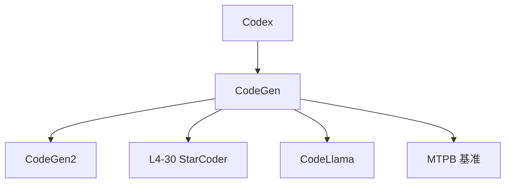

# 🎓 案件 L4-29：CodeGen — 代码生成的"多面手"

> **《LLM 百案录》第 100 案 · 多任务代码模型**
> *单一任务训练的代码模型不够用——CodeGen 说："让我同时干生成、补全、解释、翻译。"*

🚇 [30秒速览](#速览) ｜ 🚲 [3分钟通读](#通读) ｜ 🚗 [30分钟精读](#精读)

🎭 **叙事母题**：🎓 **多任务代码** —— 一专多能而非专精单一

---

## 0️⃣ 案件档案

| 案情要素 | 内容 |
|---|---|
| **案发时间** | 2022-03（Salesforce, Nijkamp et al.，CodeGen 论文） · [📄 arXiv 2203.13474](https://arxiv.org/pdf/2203.13474) |
| **受害者** | Codex 等闭源 + 单一任务的代码模型 |
| **作案凶器** | 多语言数据 + Conversational Programming + 350M ~ 16B 多档参数 |
| **作案动机** | "开源 + 多任务 + 对话式编程的代码模型" |
| **结案陈词** | CodeGen 提供 350M / 2B / 6B / 16B 多个开源代码模型，支持多语言生成与对话式增量编程 |

**精确事实卡**：

| 字段 | 精确值 | 来源 |
|---|---|---|
| **参数档位** | 350M, 2B, 6B, 16B | Section 4 |
| **训练数据** | Pile + BigQuery (代码) + BigPython | Section 3 |
| **关键能力** | Multi-turn 对话式编程（Conversational Code Synthesis） | Section 5 |
| **HumanEval** | 16B 模型达到 29.3% pass@1（2022 当时领先） | Table 1 |

---

## 1️⃣ <a id="速览"></a>🚇 30 秒速览

> Codex（GPT-3 微调代码版）是闭源的——CodeGen 是开源版 Codex。
> CodeGen 的两大特色：
> 1. **多档开源**（350M/2B/6B/16B）：从笔记本能跑到工业部署都覆盖
> 2. **对话式编程**：把复杂程序拆成多轮简单需求，每轮生成一段代码
> 结果：**HumanEval pass@1 29.3%**（2022 年开源 SOTA），多语言代码生成的奠基工作。

---

## 2️⃣ <a id="通读"></a>🚲 3 分钟通读：对话式编程的洞察（Why）

### 一次性生成的痛
```
需求："写一个能爬豆瓣电影、按评分排序、保存到 CSV 的爬虫"
模型一次生成完整代码 → 长、错误率高、用户难校验
```

### Conversational Code Synthesis
```
Turn 1：用 requests 写一个抓取豆瓣 Top250 的函数
Turn 2：解析 HTML 提取电影名和评分
Turn 3：把结果按评分排序
Turn 4：写入 CSV

每轮短、简单、易校验
模型可以基于之前的代码继续生成
```

CodeGen 在训练时就用类似的"渐进式开发"数据，让模型擅长这种交互。

---

## 3️⃣ <a id="精读"></a>🚗 30 分钟精读

### 训练数据分层
```
1. Pile（825GB 通用文本，含部分代码）→ 通用语言基础
2. BigQuery（118GB 多语言代码，C/Java/JS/Python 等）→ 多语言代码能力
3. BigPython（217GB Python 代码）→ Python 专精
```

### 三个变体
- **CodeGen-NL**：仅在 Pile 上训
- **CodeGen-Multi**：NL → 加 BigQuery
- **CodeGen-Mono**：Multi → 加 BigPython（Python 最强）

### Conversational Programming Benchmark (MTPB)
论文同时发布了一个新基准 MTPB：包含 115 个多轮编程任务，每个任务 5+ 轮交互，用来评估"对话式编程"能力。

---

## 4️⃣ 物证清单 & 🔥 Hot Take

| 模型 | HumanEval pass@1 | MBPP pass@1 |
|---|---|---|
| GPT-NEO 2.7B | 6.4% | — |
| GPT-J 6B | 11.6% | — |
| Codex 12B (closed) | 28.8% | — |
| **CodeGen-Mono 16B** | **29.3%** | **35.3%** |

### 🔥 Hot Take
1. **开源 Codex 替代品**：CodeGen 是 2022 年开源代码模型的天花板。
2. **MTPB 基准的价值**：开创性地评估"多轮对话式编程"，影响后来 SWE-bench 等。
3. **后被 StarCoder / Code Llama 超越**：但 CodeGen 的设计哲学（多档开源 + 多任务）影响深远。

---

## 5️⃣ 🐛 论文没说的坑

1. **数据集不完全开放**：BigPython 部分数据集未开放
2. **多语言能力不均衡**：Python 强，C/Java 显著弱
3. **2022 年的 SOTA，今天已被超越**：StarCoder 2、DeepSeek-Coder、Sonnet 4.5 都更强

---

## 6️⃣ 影响波及



---

## 7️⃣ 侦探手记

CodeGen 在 2022 年是"开源代码模型的样板间"：
> 多档参数、多语言、对话式编程——三大设计选择影响了后来所有开源代码模型。
> 虽然技术上已被超越，但**设计哲学的影响力远超模型本身**。

---

## 自查清单

**已做到**：
- 介绍 CodeGen 三个变体（NL/Multi/Mono）
- 解释对话式编程范式
- 给出 HumanEval / MBPP 实测对比

**❌ 未做到**：
- ❌ 未深入对比 CodeGen 与 Codex 在数据上的差异
- ❌ 未涉及 CodeGen 2 的改进点

---

## 🔟 延伸卷宗
- 📚 [L4-28 AlphaCode](./L4-28_AlphaCode.md)
- 📚 [L4-30 StarCoder](./L4-30_StarCoder.md)
- 📚 [L3-13b Tool Learning Code Llama](./L3-13_Tool_Learning_CodeLlama.md)

### 🚀 实践入口
[huggingface.co/Salesforce/codegen-16B-mono](https://huggingface.co/Salesforce/codegen-16B-mono)

---

## 📌 本案归档

| 字段 | 值 |
|---|---|
| 笔记版本 | 「多任务代码版」 |
| 叙事母题 | 🎓 多任务代码 |
| 推荐指数 | ⭐⭐⭐⭐ |
| 学习时长 | 30s / 3min / 30min |
| 上次更新 | 2026-04-30 |
| 下一站 | → [L4-30 StarCoder](./L4-30_StarCoder.md) |
