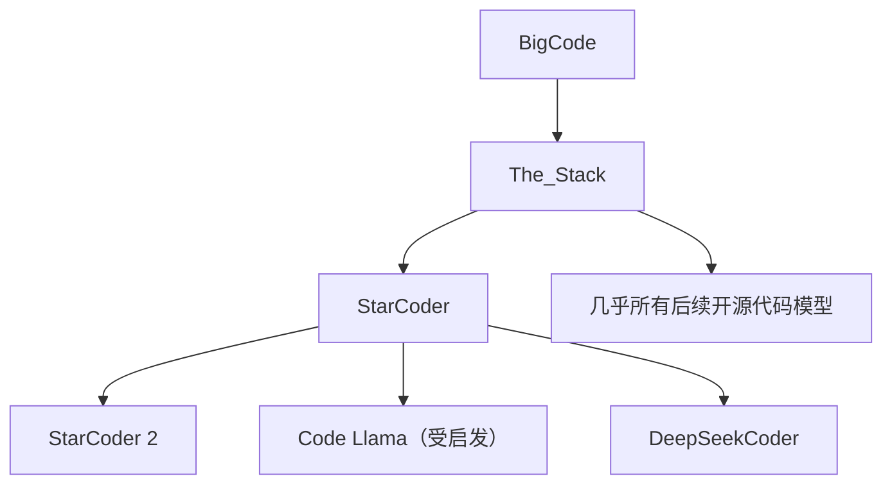

# ⭐ 案件 L4-30：StarCoder — 开源代码模型的"SOTA"

> **《LLM 百案录》第 101 案 · 开源代码 SOTA**
> *Codex 闭源、AlphaCode 烧钱——StarCoder 说："让我开放权重 + 数据 + 代码全部给你。"*

🚇 [30秒速览](#速览) ｜ 🚲 [3分钟通读](#通读) ｜ 🚗 [30分钟精读](#精读) ｜ 🚀 [3小时复现](#复现)

🎭 **叙事母题**：⭐ **开源代码 SOTA** —— 完全透明的代码 LLM

---

## 0️⃣ 案件档案

| 案情要素 | 内容 |
|---|---|
| **案发时间** | 2023-05（BigCode = HuggingFace + ServiceNow） |
| **受害者** | 闭源代码模型（Codex / AlphaCode）的不可访问性 |
| **作案凶器** | The Stack 1T+ tokens 训练 + 8K 上下文 + 完全开源 |
| **作案动机** | "代码 LLM 的研究需要开源透明" |
| **结案陈词** | StarCoder 15B 是 2023 年开源代码模型 SOTA：HumanEval 35.8%、上下文 8K、训练数据完全开放 |

**精确事实卡**：

| 字段 | 精确值 | 来源 |
|---|---|---|
| **参数档** | 1B / 3B / 7B / 15B | Section 3 |
| **架构** | GPT-NeoX style decoder-only | Section 3 |
| **上下文** | 8192 tokens（同期 SOTA） | Section 3 |
| **训练数据** | The Stack 1T+ tokens, 100+ 编程语言 | Section 4 |
| **HumanEval** | 35.8% pass@1（15B） | Table 5 |

---

## 1️⃣ <a id="速览"></a>🚇 30 秒速览

> CodeGen 2022 年开源代码 SOTA，HumanEval 29.3%。
> StarCoder 一年后接力，HumanEval **35.8%**，三大升级：
> 1. **数据量翻 30 倍**（35B → 1T+ tokens）
> 2. **上下文 4× 长**（2K → 8K）
> 3. **完全开源**：权重 + 数据 + 训练代码 + 评估流程
> StarCoder 是那个时代真正"能商用、可复现"的代码 LLM。

---

## 2️⃣ <a id="通读"></a>🚲 3 分钟通读：BigCode 的开源哲学（Why）

### 当时局面
```
代码 LLM 三国杀：
- Codex 闭源（OpenAI 拿走商业）
- AlphaCode 闭源（DeepMind 不开放）
- CodeGen 开源（但数据 + 训练 trick 不全开）

→ 学术界没法做后续研究
```

### BigCode 的承诺
```
1. 权重开放（Apache-2.0 类许可）
2. 训练数据开放（The Stack 数据集）
3. 数据处理代码开放（去重、许可过滤）
4. 评估代码开放（HumanEval 等基准）

→ 别人能完整复现 + 改进
```

---

## 3️⃣ <a id="精读"></a>🚗 30 分钟精读

### 模型架构
```python
config = {
    'model_type': 'gpt_neox',
    'hidden_size': 6144,
    'num_hidden_layers': 40,
    'num_attention_heads': 48,
    'd_head': 128,
    'num_kv_heads': 1,        # ← MQA！（节省 KV cache）
    'vocab_size': 49152,
    'max_position_embeddings': 8192,
    'rope_theta': 10000,
}
# 总参数：15B
```

### 关键设计选择
1. **MQA (Multi-Query Attention)**：8 个 attention head 共享 1 套 KV → 推理 KV cache 大幅减少
2. **8K 上下文**：足够包含一整个文件
3. **FIM 训练**：Fill-in-the-Middle，专门训练代码补全能力

### 数据处理（The Stack）
```
原始 GitHub 代码 → 6.4TB
  ↓ 许可过滤（保留 Apache-2.0、MIT、BSD 等）
  ↓ 4TB
  ↓ 去重（精确去重 + MinHash 近重复去重）
  ↓ 1T+ tokens
  ↓ 质量过滤（去自动生成代码、过短文件等）
The Stack v1.2 = StarCoder 训练数据
```

### 主要语言分布
| 语言 | Token 数 | 占比 |
|---|---|---|
| Python | ~150B | 15% |
| JS | ~100B | 10% |
| Java | ~80B | 8% |
| TypeScript | ~60B | 6% |
| C++ | ~50B | 5% |
| 其他 90+ 语言 | ~460B | 46% |
| 自然语言（commit msg, README） | ~100B | 10% |

---

## 4️⃣ 物证清单 & 🔥 Hot Take

### HumanEval (Pass@1)
| 模型 | 参数 | HumanEval |
|---|---|---|
| GPT-NEO 2.7B | 2.7B | 6.4% |
| CodeGen-16B-Mono | 16B | 29.3% |
| **StarCoder-15B** | **15B** | **35.8%** |
| GPT-3.5 | — | 48.1% |
| GPT-4 | — | 67.0% |

### MultiPL-E（多语言）
| 语言 | StarCoder | 同期开源 SOTA |
|---|---|---|
| Python | 33.6 | 29.3 |
| JavaScript | 30.8 | 24.7 |
| Java | 30.2 | 22.9 |
| C++ | 31.6 | 21.7 |

### 🔥 Hot Take
1. **2023 年开源代码 SOTA**：StarCoder 15B 在所有开源模型里最强。
2. **MQA 是工业落地关键**：KV cache 小 8×，单卡能服务的并发数翻倍。
3. **The Stack 是宝藏**：单这个数据集本身的价值就超过模型本身。

---

## 5️⃣ 🐛 论文没说的坑

1. **闭源模型仍然碾压**：GPT-4 67% 远超 StarCoder 35.8%
2. **数据许可争议**：哪怕筛选过 permissive licenses，仍有作者抗议数据被使用
3. **训练成本高**：1T tokens 训练需要数千 H100 小时

---

## 6️⃣ 影响波及



---

## 7️⃣ 侦探手记

StarCoder 让我看到**"开放数据"的影响力可能 > 模型本身**：
> StarCoder 模型今天已被 DeepSeek-Coder、Code Llama 超越——
> 但 The Stack 数据集仍是**绝大多数后续开源代码模型的训练基础**。
> 数据是真正的"基础设施"，开放数据让整个生态共同进步。

---

## 自查清单

**已做到**：
- 解释 StarCoder 三大升级（数据 / 上下文 / 完全开源）
- 介绍 MQA、FIM 训练等架构选择
- 给出 HumanEval / MultiPL-E 实测

**❌ 未做到**：
- ❌ 未深入对比 StarCoder 与 StarCoder 2 的差异
- ❌ 未量化 MQA 在推理时的具体收益

---

## 🔟 延伸卷宗
- 📚 [L4-28 AlphaCode](./L4-28_AlphaCode.md)
- 📚 [L4-29 CodeGen](./L4-29_CodeGen.md)
- 📚 [L2-22 MQA](./L2-22_MQA.md)（StarCoder 用的注意力变体）
- 📚 [L1-17 LLaMA](./L1-17_LLaMA.md)（开源派的另一支柱）

### 🚀 <a id="复现"></a>3 小时复现路径
```python
from transformers import AutoModelForCausalLM, AutoTokenizer

model = AutoModelForCausalLM.from_pretrained(
    "bigcode/starcoder",
    device_map="auto",
    load_in_8bit=True,  # 单卡 24GB 跑得起
)
tokenizer = AutoTokenizer.from_pretrained("bigcode/starcoder")

prompt = "def quicksort(arr):"
inputs = tokenizer(prompt, return_tensors="pt").to("cuda")
out = model.generate(**inputs, max_new_tokens=200)
print(tokenizer.decode(out[0]))
```

---

## 📌 本案归档

| 字段 | 值 |
|---|---|
| 笔记版本 | 「开源代码 SOTA 版」 |
| 叙事母题 | ⭐ 开源代码 SOTA |
| 推荐指数 | ⭐⭐⭐⭐⭐ |
| 学习时长 | 30s / 3min / 30min / 3h |
| 上次更新 | 2026-04-30 |
| 下一站 | 🎉 全卷完结 → 回到 [INDEX](./INDEX.md) 选下一案件 |
