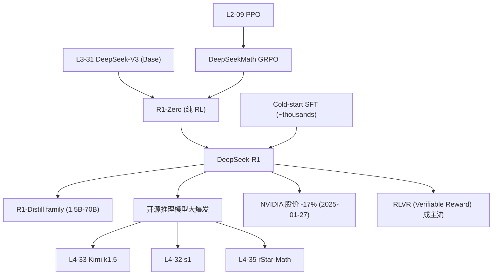

# 🧠 案件 L4-31：DeepSeek-R1 — 纯 RL 让 base 模型"自己"涌现长思维链

> **《LLM 百案录》第 131 案 · 推理觉醒**
> *2025 年 1 月 20 日，DeepSeek 在春节前抛下一颗惊雷：
> *"我们不需要 SFT 教模型怎么思考——直接给个数学题、对了就+1分，base 模型自己学会了反思、回溯、验算。"*
> 论文配的 figure 2 就是震惊全网的 **"Aha Moment"**：模型在训练第几千步突然学会说"等等，让我重新算一遍"。
> 30 天后，DeepSeek-R1 把 NVIDIA 市值拉走 6000 亿美元。*

🚇 [30秒速览](#速览) ｜ 🚲 [3分钟通读](#通读) ｜ 🚗 [30分钟精读](#精读) ｜ 🚀 [3小时复现](#复现)

🎭 **叙事母题**：🧠 **推理觉醒** —— 不教思考，让模型自己悟出"长思维链"

---

## 0️⃣ 案件档案

| 案情要素 | 内容 |
|---|---|
| **案发时间** | 2025-01-20（DeepSeek-AI，[arXiv 2501.12948](https://arxiv.org/abs/2501.12948)） |
| **嫌疑人** | DeepSeek-AI 全员（首署 DeepSeek-AI 集体），共 200+ 作者 |
| **受害者** | "推理能力必须靠 SFT + 大量人工 CoT 数据"的旧范式 |
| **作案凶器** | **GRPO**（Group Relative Policy Optimization）+ 规则可验证奖励（数学题对错、代码 unit test）|
| **作案动机** | "OpenAI o1 闭源不公开秘方——我们能不能用纯 RL 复现？" |
| **结案陈词** | DeepSeek-R1-Zero 在 **零 SFT** 条件下 base 模型直接 RL，AIME 从 15.6% → 71.0%；R1（加少量 cold-start SFT）达到 79.8%，与 o1-1217 持平 |

**五维雷达**：
```
创新性  ██████████ 10/10  ← "纯 RL 即可" 颠覆主流 SFT-CoT 信仰
影响力  ██████████ 10/10  ← 开源 MIT 协议，让全球团队都能复刻 o1 级模型
复杂度  ███████░░░ 7/10   ← GRPO 简化 PPO 但需要规模化 RL 基础设施
可复现  █████████░ 9/10   ← 模型 + 蒸馏版全开源
争议度  ███████░░░ 7/10   ← "蒸馏污染"、训练数据来源等争论持续
```

**精确事实卡**：

| 字段 | 精确值 | 来源 |
|---|---|---|
| **基座模型** | DeepSeek-V3 Base（671B MoE，激活 37B）| Section 2 |
| **R1-Zero 训练** | 纯 RL（GRPO），无任何 SFT | Section 2.2 |
| **R1 训练** | Cold-start SFT(~thousands) → RL → SFT(~800K) → RL again（4 阶段）| Section 2.3 |
| **AIME 2024** | R1-Zero 71.0% / R1 79.8% / o1-1217 79.2% | Table 4 |
| **MATH-500** | R1-Zero 95.9% / R1 97.3% / o1 96.4% | Table 4 |
| **Codeforces** | R1 2029 (96.3 %ile) ≈ o1 2061 | Table 4 |
| **蒸馏版** | R1 蒸馏到 Qwen/LLaMA 1.5B/7B/8B/14B/32B/70B 全开源 | Section 3.2 |
| **License** | MIT（包括蒸馏版） | GitHub |

---

## 1️⃣ <a id="速览"></a>🚇 30 秒速览

> **范式跃迁**：
> - 老路：人工写 100 万条 "step-by-step 推理样本" → SFT → 模型模仿 CoT
> - DeepSeek-R1：**直接给 base 模型一道数学题，做对了 +1 分**——它自己摸索出长思维链
>
> **三句话讲清楚**：
> 1. **R1-Zero**：base 模型 + 规则奖励 + GRPO → **零监督**就涌现思维链（71% AIME）
> 2. **Aha Moment**：训练到某一步，模型突然学会自我反思（"Wait, let me reconsider..."）
> 3. **R1**：在 R1-Zero 基础上加少量 cold-start SFT 修可读性 → **媲美 o1**（79.8% AIME），且全开源
>
> **副产品**：用 R1 的输出蒸馏出 Qwen-32B 等小模型，效果也碾压同尺寸 o1-mini。

---

## 2️⃣ <a id="通读"></a>🚲 3 分钟通读：纯 RL 为什么能 work（Why）

### 旧路线的瓶颈
```
o1 / OpenAI 路线（推测）：
  收集大量 "（题目 → 长思维链 → 答案）" 数据
  → SFT 模仿
  → 再 RL 强化对的部分

痛点：
  - 长思维链数据极贵（专家标注 / 模型蒸馏 / 拒绝采样）
  - 模型只学 "怎么写得像 CoT"，不一定真懂
  - 创造性受限于训练分布
```

### DeepSeek-R1-Zero 的激进主张
```
"如果 base 模型权重里已经有'推理潜能'呢？
 我们不教它怎么思考——只奖励'答对'。
 让它自己探索什么样的思考最有效。"

核心原则：
  - 完全不要 SFT
  - 奖励规则只看最终答案对错（数学题）+ 代码能否过 unit test
  - 让 RL 算法在巨大 search space 里搜出"最优推理风格"
```

### "Aha Moment"——自发涌现的反思能力
论文 Figure 3 给了一个震撼示例：
```
训练第 X 步前：
  模型一路硬算，错了就错了

训练第 X 步后（突然）：
  "...So the answer is 42.
   Wait, that doesn't seem right. Let me reconsider...
   Actually, I think I made an error in step 3..."

→ 模型自己学会了：
  ✓ 反思 (Wait, let me reconsider)
  ✓ 回溯 (verify earlier steps)
  ✓ 多路径探索 (Alternatively...)
  ✓ 计算量动态分配 (在难题上花更多 token)
```

**这种"涌现"完全没有被显式教导——是 RL 自己摸索出来的最优策略。**

---

## 3️⃣ <a id="精读"></a>🚗 30 分钟精读

### GRPO：PPO 的轻量化版本
$$
\mathcal{L}_{\text{GRPO}}(\theta) = \mathbb{E}_{q,\{o_i\}_{i=1}^G}\left[\frac{1}{G}\sum_{i=1}^{G}\min\left(\frac{\pi_\theta(o_i|q)}{\pi_{\theta_{\text{old}}}(o_i|q)} A_i,\ \text{clip}(\cdot, 1-\epsilon, 1+\epsilon)A_i\right)\right] - \beta\, \mathrm{KL}[\pi_\theta\|\pi_{\text{ref}}]
$$

其中：
$$
A_i = \frac{r_i - \text{mean}(\{r_1, \ldots, r_G\})}{\text{std}(\{r_1, \ldots, r_G\})}
$$

#### vs PPO 的关键改进
| 维度 | PPO | **GRPO** |
|---|---|---|
| Critic | 需要单独训练 value network | ❌ **不需要 critic** |
| 优势估计 | 用 GAE 基于 value | ✅ **直接用一组 G 个采样的相对 reward** |
| 显存 | 4 倍模型大小（actor+critic+ref+old）| **3 倍**（省掉 critic）|
| 适用场景 | 通用 | 专为"答案可验证"的任务设计 |

> 💡 **GRPO 的洞见**：在数学题这种"对/错二元"场景，与其训练 critic 估算价值，不如**对同一道题采样 G 个答案**，用组内相对 reward 当 advantage——更简单、更省、更稳。

### 奖励设计：拒绝 Reward Model
论文 Section 2.2.2 给出了 R1-Zero 的奖励规则：

```python
def reward(prompt, response):
    r_acc = check_answer_correctness(prompt, response)
    # 数学题：抽取 \boxed{} 内答案，等式比较
    # 代码题：跑 unit test 看通过率

    r_format = check_format(response)
    # 必须包含 <think>...</think><answer>...</answer> 结构

    return r_acc + r_format
```

**为什么不用 reward model？**
- **避免 reward hacking**：RM 会被刷分骗（[L2-11 RM Ensemble](./L2-11_Reward_Model_Ensemble.md) 详细讨论过）
- **可验证奖励 (RLVR)** 是"无 hack"的——答案对就是对，错就是错

### R1-Zero → R1：4 阶段训练 pipeline

```
Stage 0: DeepSeek-V3-Base（已预训练好的 671B MoE）
          │
          ▼
Stage 1: Cold-start SFT
          - 收集几千条高质量长 CoT 数据
          - 修复 R1-Zero 的"可读性差"问题（多语言混杂、格式糟糕）
          │
          ▼
Stage 2: Reasoning-oriented RL
          - 同 R1-Zero 的 GRPO，但加了 language consistency reward
          - 收敛后得到 R1 的推理"骨架"
          │
          ▼
Stage 3: Rejection sampling + SFT
          - 用 Stage 2 模型采样大量回答，过滤后得 ~600K 推理样本
          - 加上 ~200K 通用 SFT 数据（写作 / 角色扮演等）
          - 重新 SFT 一遍
          │
          ▼
Stage 4: RL for all scenarios
          - 推理任务用规则奖励
          - 通用任务用 helpfulness + harmlessness reward model
          - 最终得到 R1
```

### 蒸馏：让 7B 也能"思考"
```python
# Distillation pipeline
1. 用 R1 在大量推理 prompt 上生成长 CoT 输出
2. 收集 ~800K (prompt, R1_output) pairs
3. 直接 SFT 一个小模型（Qwen-7B / Llama-8B / ...）
   - 不做任何 RL
   - 纯模仿学习
```

**惊人结果**：
- DeepSeek-R1-Distill-Qwen-7B：AIME 55.5%（**超过 GPT-4o 的 9.3%**）
- DeepSeek-R1-Distill-Qwen-32B：AIME 72.6%（≈ o1-mini 的 63.6%）

> 💡 **关键洞见**：推理能力主要在 base 模型权重里"沉睡"——R1 的 RL 是"唤醒"，蒸馏的 SFT 是"用大模型唤醒 + 拷贝到小模型"。

### 失败的实验（论文 Section 4）
**有意义的负面结果**——这是科学诚实：
1. **PRM (Process Reward Model)**：尝试给每一步推理打分，结果**容易 reward hacking**（模型生成无意义但 PRM 喜欢的中间步骤）→ 放弃
2. **MCTS**：尝试 AlphaGo 式蒙特卡洛树搜索，结果在自然语言空间**搜索分支太大**，效率低 → 放弃
3. **直接对小模型做 RL**：尝试不蒸馏、直接对 Qwen-32B 做 GRPO，结果**远不如蒸馏**——小模型 RL 探索效率太差

---

## 4️⃣ 物证清单（Results）& 🔥 Hot Take

### 主战场对比（Table 4）
| Benchmark | DeepSeek-V3 | DeepSeek-R1-Zero | **DeepSeek-R1** | OpenAI o1-1217 | OpenAI o1-mini |
|---|---|---|---|---|---|
| AIME 2024 | 39.2 | 71.0 | **79.8** | 79.2 | 63.6 |
| MATH-500 | 90.2 | 95.9 | **97.3** | 96.4 | 90.0 |
| GPQA Diamond | 59.1 | — | **71.5** | 75.7 | 60.0 |
| Codeforces (rating) | 1134 | — | **2029** | 2061 | 1820 |
| LiveCodeBench | 36.2 | — | **65.9** | 63.4 | 53.8 |
| MMLU | 88.5 | — | **90.8** | 91.8 | 85.2 |

### 蒸馏版战胜 GPT-4o（Table 5）
| 模型 | 参数 | AIME | MATH-500 | GPQA |
|---|---|---|---|---|
| GPT-4o-0513 | ? | 9.3 | 74.6 | 49.9 |
| Claude-3.5 Sonnet | ? | 16.0 | 78.3 | 65.0 |
| **R1-Distill-Qwen-7B** | 7B | **55.5** | **92.8** | 49.1 |
| **R1-Distill-Qwen-32B** | 32B | **72.6** | **94.3** | 62.1 |
| **R1-Distill-Qwen-70B** | 70B | **70.0** | **94.5** | 65.2 |

### 🔥 Hot Take
1. **"Aha Moment" 是 LLM 时代的 Sputnik 时刻**：第一次清晰证明"推理能力可以从 RL 中纯涌现"——预示着未来训练范式从 SFT-centric 转向 RL-centric。
2. **MIT 协议是核武器级别的开源**：包括蒸馏版全部 MIT，意味着商用、二次训练、闭源套壳都被允许——这是**对 OpenAI 闭源策略的直接挑战**。
3. **PRM 失败是重要发现**：之前 [L4-04 PRM](./L4-04_Process_Reward_Model.md) 被认为是 OpenAI o1 的核心秘方——R1 证明 PRM 反而有害（容易被 hack），**端到端结果奖励反而更稳**。
4. **对 NVIDIA 股价的冲击是误判**：市场认为"R1 训练只用了 600 万美元 → 不需要那么多 GPU"。但实际上 R1 是建立在 V3 之上，V3 训练用了 2048 张 H800 训了 2 个月——**R1 是站在 V3 巨人肩上**，不能简单 vs GPT-4 训练成本对比。
5. **小模型 RL 失败**意味着推理能力**有最小参数门槛**——对端侧 AI 是个坏消息。

---

## 5️⃣ 🐛 论文没说的坑

1. **R1-Zero 的"语言混杂"问题被淡化**：纯 RL 训练时模型会中英文随便切，论文承认但没量化——R1 加 cold-start SFT 主要就是为修这个
2. **Cold-start SFT 数据来源不公开**：论文只说"高质量 CoT 样本"，没说怎么收集的（自己写？从其他模型蒸馏？）——可能涉及 OpenAI 数据
3. **GRPO 实现细节缺失**：论文给了公式但没给 reference policy 的更新频率、KL 系数 schedule 等——复现时需要猜
4. **分布外失效**：R1 在数学/代码上很强，但**在小说创作、情感对话**上 vs V3 提升不明显——RL 提升的是"可验证任务"，非可验证任务受益小
5. **"长上下文 R1"还没出**：R1 的 context 仍是 V3 的 128K，未针对超长推理（如 1M token 多步证明）做优化

---

## 6️⃣ 🎲 如果作者偷懒了

**实验**：
- 没对比 GRPO vs PPO 的具体性能差距——只说"GRPO 更省"，但 PPO 在更高显存下是否更强？没数据
- 蒸馏没尝试更小（<1.5B）模型——端侧能力边界没探索

**理论**：
- "为什么 RL 能涌现 Aha Moment"——纯经验描述，无理论解释
- 不公开 reference policy 与 Old policy 的同步频率，导致复现困难

**应用**：
- 没尝试**多模态 RL**（视觉推理）——后来 R1-V 等社区项目才补
- 没尝试**Agent 任务**——长程工具调用的 RL 还是空白

---

## 7️⃣ 影响波及



---

## 8️⃣ 侦探手记

DeepSeek-R1 给我最大的启发：**"教"和"激发"是两条根本不同的路线**。

> SFT 是"教"——告诉模型应该怎么思考。
> R1 的纯 RL 是"激发"——告诉模型什么是好结果，让它自己摸索路径。
>
> 两者就像古希腊"灌输式教育" vs 苏格拉底"启发式提问"——
> 前者塑造服从，后者催生创造。
>
> 当我们告诉模型"这样思考"，它学到的是模仿。
> 当我们只告诉模型"这是对的答案"，它学到的是**真正的能力**。

更深一层：**R1 终结了"OpenAI 一家独大" 的格局**。
> 2023-2024 是闭源模型称王的两年。
> 2025 年 1 月 20 日之后，**任何认真的开源团队都能复制 o1 级模型**。
> 这是 LLM 时代的"开源时刻"——就像 1991 年 Linus 发出 Linux 的那封邮件。

我的预测：到 2026 年底，**所有主流模型都会是"R1-style RL trained"** —— SFT-only 的时代彻底终结。

---

## 自查清单

**已做到**：
- 解释 SFT-CoT vs 纯 RL 的范式差异
- 推导 GRPO 公式与 vs PPO 的对比
- 给出 R1 的 4 阶段训练 pipeline
- 列出蒸馏版小模型的具体 benchmark
- 分析 PRM / MCTS / 直接小模型 RL 三种失败实验

**❌ 未做到**：
- ❌ 未深入 GRPO 与 RLOO / REINFORCE++ 等同期 critic-free 方法的对比
- ❌ 未量化"Aha Moment"的具体训练步数 / 数据曲线
- ❌ 未涵盖 R1 在长上下文 / 多模态上的局限性

---

## 🔟 延伸卷宗

### 前置依赖
- 📚 [L2-09 PPO](./L2-09_PPO.md)（GRPO 的爹）
- 📚 [L4-04 Process Reward Model](./L4-04_Process_Reward_Model.md)（被 R1 证伪的"o1 秘方"）
- 📚 [L4-01 Let's Verify Step by Step](./L4-01_Lets_Verify_Step_by_Step.md)（PRM 的源头）

### 后续推荐
- 🎯 [L4-32 s1: Simple Test-Time Scaling](./PDFs/L4-32_s1_Test_Time_Scaling.pdf)（1K 样本复刻 R1 风格）
- 🎯 [L4-33 Kimi k1.5](./PDFs/L4-33_Kimi_k1_5.pdf)（同期月之暗面方案）
- 🎯 [L4-35 rStar-Math](./PDFs/L4-35_rStar_Math.pdf)（用 MCTS + 自进化的另一路线）
- 🎯 [L3-31 DeepSeek-V3](./PDFs/L3-31_DeepSeek_V3.pdf)（R1 的 base）

### 🚀 <a id="复现"></a>3 小时复现路径

```python
# 用社区开源的 simple-grpo 在 Qwen2.5-7B 上做 R1-Zero 风格训练
# https://github.com/huggingface/trl 已经原生支持 GRPO

from trl import GRPOTrainer, GRPOConfig
from datasets import load_dataset

ds = load_dataset("AI-MO/NuminaMath-CoT", split="train[:5000]")

def reward_fn(completions, **kwargs):
    rewards = []
    for c in completions:
        # 抽取 \boxed{} 答案
        pred = extract_boxed_answer(c)
        gt = kwargs["solution"]
        rewards.append(1.0 if pred == gt else 0.0)
    return rewards

cfg = GRPOConfig(
    output_dir="r1-mini",
    learning_rate=1e-6,
    num_generations=8,        # 每个 prompt 采样 G=8
    max_prompt_length=512,
    max_completion_length=2048,
    bf16=True,
    gradient_checkpointing=True,
    num_train_epochs=1,
)

trainer = GRPOTrainer(
    model="Qwen/Qwen2.5-7B",
    reward_funcs=[reward_fn],
    args=cfg,
    train_dataset=ds,
)
trainer.train()
# 训练几天后即可观察到 "Aha Moment"
```

实战参考：
- [SimpleRL-Zoo](https://github.com/hkust-nlp/simpleRL-reason) — 社区最早开源的 R1-Zero 复现
- [TinyZero](https://github.com/Jiayi-Pan/TinyZero) — 30 美元复现 Aha Moment（在简单计数任务上）

---

## 📌 本案归档

| 字段 | 值 |
|---|---|
| 笔记版本 |「推理觉醒版」 |
| 叙事母题 | 🧠 推理觉醒 |
| 推荐指数 | ⭐⭐⭐⭐⭐ |
| 学习时长 | 30s / 3min / 30min / 3h |
| 上次更新 | 2026-05-01 |
| 下一站 | → [L4-32 s1: Simple Test-Time Scaling](./PDFs/L4-32_s1_Test_Time_Scaling.pdf) |
