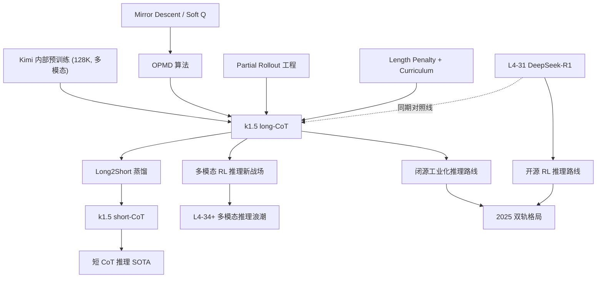

# 🌙 案件 L4-33：Kimi k1.5 — 长短思维链协同 + 多模态 RL 的"东方版 o1"

> **《LLM 百案录》第 133 案 · 长短之道**
> *2025 年 1 月 22 日，DeepSeek-R1 抛雷后两天，月之暗面端出第二记重锤——Kimi k1.5。
> "我们也复刻了 o1 级推理，且更进一步：**视觉也能推理，长 CoT 还能把'想清楚'的能力蒸馏给短 CoT 模型**。"*
> *它不开源，只给 API；它不用 GRPO，自己造了 **Online Policy Mirror Descent**；
> 它把"长思维链当老师、短思维链当学生"——这条 long2short 的路，恰好是 R1 没走的那条。*

🚇 [30秒速览](#速览) ｜ 🚲 [3分钟通读](#通读) ｜ 🚗 [30分钟精读](#精读) ｜ 🚀 [3小时复现](#复现)

🎭 **叙事母题**：🧘 **长短之道** —— 长 CoT 探路，短 CoT 落地；月夜下的两种思考速度

---

## 0️⃣ 案件档案

| 案情要素 | 内容 |
|---|---|
| **案发时间** | 2025-01-22（Moonshot AI / 月之暗面，[arXiv 2501.12599](https://arxiv.org/abs/2501.12599)） |
| **嫌疑人** | Kimi Team 全员（首署 Kimi Team 集体），技术报告制 |
| **受害者** | "推理模型必须慢思考、必须纯文本、必须开源才能被复现"的三重信仰 |
| **作案凶器** | **Online Policy Mirror Descent**（OPMD）+ Partial Rollout + Length Penalty + Long2Short 蒸馏 |
| **作案动机** | "DeepSeek 走开源 GRPO 路线——我们走闭源 OPMD + 多模态路线，证明同一座山有两条路上去" |
| **结案陈词** | k1.5 在 AIME 2024 拿到 **77.5**（与 o1 持平），MathVista **74.9** 一举把 RL 推理拓展到视觉，同时 long2short 把短 CoT 模型推到 60.8（短 CoT SOTA） |

**五维雷达**：
```
创新性  █████████░ 9/10   ← 多模态 RL + Long2Short 是 R1 没碰的两块拼图
影响力  ███████░░░ 7/10   ← 闭源限制了二次扩散，但工业界路线参考价值极高
复杂度  ████████░░ 8/10   ← OPMD + Partial Rollout + 多模态联合训练，工程链路深
可复现  ████░░░░░░ 4/10   ← 仅 API、无权重、训练数据未公开
争议度  ██████░░░░ 6/10   ← "为什么不开源"、"OPMD 是不是 PPO 改名"等争论
```

**精确事实卡**：

| 字段 | 精确值 | 来源 |
|---|---|---|
| **基座模型** | Kimi 内部预训练模型（参数规模未披露，推测 ~百 B 级稠密）| Section 2.1 |
| **RL 算法** | **Online Policy Mirror Descent (OPMD)**（非 GRPO）| Section 2.3 |
| **上下文长度** | **128K**（长 CoT 训练上限） | Section 2.2 |
| **多模态** | ✅ 视觉编码器 + 文本统一 RL | Section 2.5 |
| **AIME 2024** | k1.5 long-CoT **77.5** / o1 74.4 / o1-mini 63.6 | Table 2 |
| **MATH-500** | k1.5 long-CoT **96.2** / o1 94.8 | Table 2 |
| **Codeforces** | **94 percentile**（≈ R1 96 %ile）| Table 2 |
| **MathVista** | **74.9**（多模态推理首个 RL 模型）| Table 3 |
| **LiveCodeBench** | **62.5** | Table 2 |
| **Long2Short** | 短 CoT 版 AIME **60.8**（远超 GPT-4o 9.3、Claude 3.5 Sonnet 16.0）| Table 4 |
| **License** | ❌ 闭源，仅 kimi.com / API 服务 | 官网 |

---

## 1️⃣ <a id="速览"></a>🚇 30 秒速览

> **同一周双雄出鞘**：
> - DeepSeek-R1（1/20）：开源 + GRPO + 纯文本 + Aha Moment
> - **Kimi k1.5（1/22）**：闭源 + OPMD + **多模态** + **Long2Short**
>
> **三句话讲清楚**：
> 1. **长 CoT 训练**：用 OPMD 在 128K 上下文里"想到爽"，AIME 77.5 与 o1 持平
> 2. **多模态 RL**：把视觉 token 和文本 token 一起灌进 RL pipeline——MathVista 74.9
> 3. **Long2Short 蒸馏**：长 CoT 模型当"老师"，把推理浓缩进短 CoT 模型——**短 CoT AIME 60.8**，推理成本 ↓ 5×
>
> **副产品**：Partial Rollout 让 RL 不再等"完整 response"才更新；Length Penalty 防止思维链失控膨胀。

---

## 2️⃣ <a id="通读"></a>🚲 3 分钟通读：为什么 Kimi 选了不一样的路（Why）

### 同时代两条路的分叉
```
2025 年 1 月，"复刻 o1"有两条路：

DeepSeek 路线（开源 / 文本 / 极简）
  ├─ 用 GRPO（自家 DeepSeekMath 提出）
  ├─ 完全不要 critic
  ├─ "Aha Moment"——纯涌现长思维链
  └─ MIT 协议放出权重 + 蒸馏版

Kimi 路线（闭源 / 多模态 / 工程化）
  ├─ 用 Online Policy Mirror Descent（自定义）
  ├─ Partial Rollout 提升 GPU 利用率
  ├─ Long-CoT + Short-CoT 协同
  └─ 多模态联合 RL
```

### Kimi 的三大独家武器

#### 1. 长 CoT 与短 CoT **不是对立**，而是"师生"
```
o1 风格的痛点：
  长思维链推理慢、成本高、不适合 ToB / ToC 默认调用

Kimi 的洞察：
  把 long-CoT 当"探索阶段"——它能想 30K token
  把 short-CoT 当"部署阶段"——只想 3K token
  关键：让短 CoT 学到长 CoT 的"思考模式"，但浓缩压缩

→ Long2Short 蒸馏：
  - 老师：训练好的 long-CoT 模型（高 AIME，但慢）
  - 学生：short-CoT 模型（快，但弱）
  - 桥梁：用 model merging / SFT / RL 把"思考精华"传递
```

#### 2. **多模态 RL** —— 把图也当一等公民
```
之前的 RL 推理工作（包括 R1）：
  prompt = 纯文本数学题
  response = 纯文本 CoT + 答案

Kimi k1.5：
  prompt = 题目 + 图（几何图、电路图、函数图像）
  response = 长 CoT（可"看图"分析）

挑战：
  ✓ 视觉 token 怎么混进 RL rollout？
  ✓ 视觉特征 freeze 还是 joint train？
  ✓ 答案验证器怎么处理"看图算题"的多步推理？
```

#### 3. **Partial Rollout** —— RL 工程的 Flash Attention 时刻
```
传统 RL（包括 R1 的 GRPO）：
  采样 → 等 response 完整生成 → 算 reward → 更新

问题：
  长 CoT response 长达 30K token，单个 prompt 要等几分钟
  GPU 大部分时间在等"那个最长的回答"
  rollout 阶段 GPU 利用率 < 30%

Partial Rollout：
  - response 生成到一半（比如 8K token）也可以暂停
  - 把"半成品"存入 replay buffer
  - 下一轮继续"接着想"
  - 把 KV cache 复用 → 显著提升吞吐
```

> 💡 **关键直觉**：长 CoT 让模型"想清楚"，但工程上"想清楚"很贵。Kimi 的整套设计，本质是**让昂贵的长思考变得可负担**。

---

## 3️⃣ <a id="精读"></a>🚗 30 分钟精读

### 3.1 Online Policy Mirror Descent (OPMD)

OPMD 在论文 Section 2.3 给出。它的更新规则可以写成（简化形式）：

$$
\pi_{k+1}(o|q) \propto \pi_k(o|q) \cdot \exp\left(\frac{r(q,o) - V_k(q)}{\tau}\right)
$$

其中：
- $\pi_k$ 是第 k 轮策略
- $r(q,o)$ 是 trajectory 级别的 reward（最终答案对错）
- $V_k(q) = \tau \log \mathbb{E}_{o \sim \pi_k}[\exp(r/\tau)]$ 是 soft value baseline
- $\tau$ 是温度系数（控制更新激进程度）

实际 loss（surrogate）形式：

$$
\mathcal{L}_{\text{OPMD}}(\theta) = -\mathbb{E}_{q, o \sim \pi_{\theta_{\text{old}}}}\left[\frac{\pi_\theta(o|q)}{\pi_{\theta_{\text{old}}}(o|q)} \cdot \frac{r(q,o) - V(q)}{\tau}\right] + \beta \mathrm{KL}[\pi_\theta\|\pi_{\text{ref}}]
$$

#### vs GRPO 的关键对比

| 维度 | GRPO（R1）| **OPMD（k1.5）** |
|---|---|---|
| 理论基础 | PPO clip + 组内 advantage | **Mirror Descent / Soft Q-Learning 框架** |
| Baseline | 组内 G 个采样的均值/标准差 | **softmax-weighted soft value** |
| 温度参数 | ❌ 无显式温度 | ✅ τ 控制策略变化幅度 |
| Critic | 不需要 | 不需要（V 在线估计） |
| 工程倾向 | 简洁、易实现 | 数学严谨、收敛性证明强 |

> 💡 **直觉**：GRPO 是"看一组答案谁更好就推谁"；OPMD 是"按 reward 的 softmax 比例**全员加权移动**"——理论上更平滑，但需要小心选 τ。

### 3.2 Partial Rollout 的工程细节

```python
# 伪代码
class PartialRolloutBuffer:
    def __init__(self, max_len=32768, chunk_size=4096):
        self.in_progress = {}   # prompt_id → (生成到一半的 tokens, KV cache)

    def step(self, batch):
        results = []
        for prompt in batch:
            if prompt.id in self.in_progress:
                # 接着上次的位置继续生成 chunk_size 个 token
                tokens, kv = self.in_progress[prompt.id]
                new_tokens = generate(model, kv, max_new=chunk_size)
                tokens += new_tokens
            else:
                tokens, kv = generate_fresh(model, prompt, max_new=chunk_size)

            if is_finished(tokens) or len(tokens) >= max_len:
                results.append((prompt, tokens, compute_reward(tokens)))
                del self.in_progress[prompt.id]
            else:
                self.in_progress[prompt.id] = (tokens, kv)

        return results  # 可能是 mixed: 一部分完整、一部分中途断点
```

**关键收益**：
- GPU 利用率 30% → 70%+（论文 Figure 5）
- 长 CoT prompt 不再阻塞短 CoT prompt
- 训练吞吐 **3× 提升**（论文给出的实测）

**代价**：
- KV cache 管理复杂度大增
- 中途换权重时要决定"是否丢弃 in-progress trajectory"——丢弃浪费、不丢则 off-policy 程度增加

### 3.3 Length Penalty —— 防止 CoT 失控膨胀

纯 reward = 答案对错时，模型会**学会无限拖延**（多想总比少想保险）——这叫"reward over-thinking"。

Kimi 的 length penalty：

$$
r_{\text{final}}(q, o) = r_{\text{acc}}(q, o) - \lambda \cdot \max(0, |o| - L_{\text{target}})^2
$$

其中：
- $|o|$ 是 response token 数
- $L_{\text{target}}$ 是目标长度（随 curriculum 增长，从 4K 到 32K）
- λ 是惩罚系数

**渐进式 curriculum**：
```
Stage 1: L_target = 4096   （让模型先学短推理）
Stage 2: L_target = 8192
Stage 3: L_target = 16384
Stage 4: L_target = 32768  （最终上限）
```

这解决了 R1-Zero **"思维链越训越长却没增益"** 的失控问题。

### 3.4 Sampling 策略：Curriculum + Priority

```
Curriculum Learning：
  - 早期：90% 简单题（GSM8K 级别）+ 10% 难题
  - 中期：50% / 50%
  - 后期：20% 简单 + 80% 难（AIME / Olympiad）

Priority Sampling：
  - 把"模型刚好做对一半"的题加权——这些题信息量最大
  - 全对的题（已掌握）和全错的题（远超能力）都降权
  - 类似 PER（Prioritized Experience Replay）思想
```

### 3.5 Long2Short：把"长思考"压缩进"短回复"

四种实现路径，论文 Section 3.4 全做了对比：

| 方法 | 思路 | 短 CoT AIME |
|---|---|---|
| **Model Merging** | 长 CoT 权重 与 短 CoT 权重做线性插值 | 50.0 |
| **Shortest Rejection Sampling** | 从长 CoT 模型采 N 个回答，挑最短的对的做 SFT | 54.1 |
| **DPO** | 长答案做 negative，短的对的答案做 positive | 56.0 |
| **Long2Short RL** | 在短 CoT 模型上加 length penalty 再 RL 一轮 | **60.8** |

**最佳配方**：先 Shortest RS-SFT，再 Long2Short RL —— 最终短 CoT 模型 AIME 60.8，**而 long-CoT 是 77.5——只损失 22%，但 token 数 ↓ 80%**。

> 💡 这是 Kimi 给"o1 路线"开的最大脑洞：**慢思考用于训练，快思考用于部署**。

### 3.6 多模态 RL 训练

```
统一 token 流：
  [BOS] <image> v1 v2 ... v_n </image> 题目文字 [SEP]
  <think> 长 CoT (可引用图中位置) </think>
  <answer> ... </answer>

视觉编码：
  - 视觉编码器（推测 ViT 类）输出 patch tokens
  - 训练时 freeze（避免 RL 把视觉 backbone 训坏）
  - 仅 LM 部分参与 OPMD 更新

奖励信号：
  - 几何题：和数学题一样 \boxed{} 抽答案 + 等式比较
  - 看图说理：用规则 + 部分采用 RM
```

**结果**：MathVista 74.9（前 SOTA InternVL2-Pro 65.5）—— **多模态 RL 推理首个 SOTA**。

### 3.7 完整训练 pipeline

```
Stage 0: Kimi 预训练模型（多模态、128K context）
          │
          ▼
Stage 1: Vanilla SFT
          - Kimi 现有对话数据 + 数学/代码 CoT 样本
          - 不像 R1 完全跳过 SFT，Kimi 用了完整 SFT
          │
          ▼
Stage 2: Long-CoT SFT
          - 几千条精选超长思维链样本
          - 让模型先学会"什么样叫长 CoT"
          │
          ▼
Stage 3: RL with OPMD
          - Curriculum: 4K → 32K context
          - Partial Rollout
          - Length Penalty
          - Priority Sampling
          - 多模态题目混入
          │
          ▼
Stage 4: Long2Short
          - 路径 a：直接发布 long-CoT 模型（k1.5 long）
          - 路径 b：长 → 短蒸馏（k1.5 short）
```

---

## 4️⃣ 物证清单（Results）& 🔥 Hot Take

### 主战场对比（Table 2，纯文本推理）

| Benchmark | k1.5 long-CoT | k1.5 short-CoT | DeepSeek-R1 | OpenAI o1 | o1-mini | GPT-4o |
|---|---|---|---|---|---|---|
| AIME 2024 | **77.5** | 60.8 | 79.8 | 74.4 / 79.2† | 63.6 | 9.3 |
| MATH-500 | **96.2** | 94.6 | 97.3 | 94.8 / 96.4† | 90.0 | 74.6 |
| Codeforces (%ile) | **94** | 87 | 96.3 | — | — | — |
| LiveCodeBench | **62.5** | 47.3 | 65.9 | 63.4 | 53.8 | 33.4 |
| MMLU | 87.4 | 85.0 | 90.8 | 91.8 | 85.2 | 88.0 |

† o1 两个数字分别是 o1-preview / o1-1217

### 多模态战场（Table 3）—— k1.5 唯一参赛

| Benchmark | k1.5 long-CoT | InternVL2-Pro | Qwen2-VL-72B | GPT-4o | the assistant 3.5 Sonnet |
|---|---|---|---|---|---|
| MathVista | **74.9** | 65.5 | 70.5 | 63.8 | 67.7 |
| MMMU | 70.0 | 62.0 | 64.5 | 69.1 | 70.4 |
| MathVision | **38.6** | 30.4 | 25.9 | 30.4 | 35.6 |

### Long2Short 战场（Table 4）—— 短 CoT 模型 AIME 谁更强

| 模型 | AIME 2024 | 平均 token 数 |
|---|---|---|
| GPT-4o | 9.3 | ~500 |
| the assistant 3.5 Sonnet | 16.0 | ~600 |
| Qwen2.5-72B-Instruct | 23.3 | ~700 |
| **k1.5 short-CoT (Long2Short RL)** | **60.8** | ~1500 |
| k1.5 long-CoT（参考）| 77.5 | ~10000 |

→ **Long2Short 是当前短 CoT 模型的 SOTA**。

### 🔥 Hot Take

1. **同周双发是行业分水岭**：DeepSeek-R1 和 Kimi k1.5 同周发布，等于公开宣告"OpenAI 的 o1 不再是垄断秘术"——**RL 推理从此进入工业化复刻阶段**。
2. **OPMD 是 GRPO 的"贵族版"**：理论更优雅、温度可调；GRPO 是"工程师版"，简单粗暴但够用。两者实测效果差距 < 1pp，**说明 RL 算法已不是瓶颈，数据/工程才是**。
3. **Long2Short 才是这篇真正的金子**：DeepSeek 用蒸馏把推理传到小模型；Kimi 用 Long2Short 把推理"压缩"进同尺寸的短回复——**前者解决参数效率，后者解决推理效率**。
4. **多模态 RL 提前打开新战场**：R1 还停留在文字数学题，k1.5 已经能"看图证几何"——意味着 **未来一年**主流推理模型都会变多模态。
5. **闭源是 Kimi 的战略选择，也是它的天花板**：没有权重就没有社区蒸馏军团，**它的 Long2Short 配方再香也只能自己吃**——R1 的开源生态会形成压倒性长尾优势。

---

## 5️⃣ 🐛 论文没说的坑

1. **OPMD 与 PPO 的实测差距没披露**：论文给了 OPMD 公式但没做 OPMD vs GRPO vs PPO 的 A/B 对比——读者无法判断究竟是 OPMD 强还是数据/工程强。
2. **Long2Short 的"教师漂移"问题被回避**：长 CoT 老师如果 reward hack（学会某种偏题），蒸馏出的短 CoT 学生会**继承坏习惯**，论文没讨论这种 transfer。
3. **多模态视觉编码器细节几乎全删**：用的什么 ViT？分辨率多少？patch 数？训练时是否 unfreeze？——全部一笔带过。
4. **128K 长上下文 RL 的训练成本**：partial rollout 提到 3× 加速，但绝对显存占用、单次实验 GPU 时数完全没数字——不利于估算工业复制成本。
5. **训练数据来源的灰色地带**：论文说"用 Kimi 现有对话数据"——这些数据的隐私、版权、是否含 GPT-4 蒸馏数据全部回避；闭源公司的常见操作。

---

## 6️⃣ 🎲 如果作者偷懒了

**实验**：
- 没做 OPMD 与 GRPO/PPO/RLOO 等同期 RL 算法的横向对比——OPMD 究竟是优势还是噱头不确定
- Long2Short 4 种方法的对比表格"刚好" RL 路线最强——会不会是 hyperparameter 偷调过？

**理论**：
- OPMD 的收敛性证明在 appendix 给了简化版，但**对深度网络的非凸情况无可信保证**——和大部分 RL 论文一样停留在"看起来稳"
- "为什么 Long2Short 有效"——纯经验现象，没解释长 CoT 的"思考精华"在权重里以什么形式存在

**应用**：
- 没尝试 **长程 Agent 任务**（多步工具调用 + 反思）——RL 推理的下一站还是空白
- 没尝试 **代码仓库级别**的推理（>100K context 跨文件理解）——尽管 128K 已支持

---

## 7️⃣ 影响波及



---

## 8️⃣ 侦探手记

Kimi k1.5 给我的最大启发，不在算法、也不在多模态，而是**"两种思考速度"**这件事。

> 卡尼曼《思考，快与慢》里讲过：人类有 System 1（快思考）和 System 2（慢思考）。
> o1 / R1 让模型只学会了 System 2——慢、贵、准；
> 但生活里 95% 的对话不需要 System 2，只需要 System 1 的反应速度。
>
> Kimi 的 Long2Short 给出的答案是：
> **让 System 2 在训练时充分思考，把"思考精华"压缩成肌肉记忆，部署时用 System 1 的速度调用。**
>
> 这不正是人类专家的成长路径吗？
> 一个数学老师，年轻时要花一小时推导的题目，
> 中年后扫一眼就有答案——不是题变简单了，
> 是"长思考"已沉淀进直觉。

更深一层：**开源闭源是两种不同的速度**。
> 2025 年 1 月 20 日 R1 发布——开源派的"长思考"，把秘方公之于众，等待社区慢慢演化。
> 2025 年 1 月 22 日 k1.5 发布——闭源派的"短思考"，把成果直接送进 API，等待用户立刻使用。
>
> 历史会证明哪条路更优吗？
> 我的猜测：**没有最优，只有共生**。
> R1 是 Linux，k1.5 是 macOS——前者塑造生态广度，后者塑造产品深度。

我的预测：到 2026 年，**所有头部模型都会同时具备 long-CoT 和 short-CoT 两种模式**——用户在 API 层面选"思考多久"，就像现在选"temperature"一样自然。

---

## 自查清单

**已做到**：
- 解释 Online Policy Mirror Descent 的更新规则与 vs GRPO 的关键差异
- 推导 Length Penalty 公式与 curriculum 配置
- 给出 Long2Short 4 种路径的对比与最佳配方
- 列出多模态 RL 的 token 编排与 reward 设计
- 与 DeepSeek-R1 形成多维度对比（开源/闭源、算法、模态、蒸馏）
- 列出 Partial Rollout 的伪代码与工程收益

**❌ 未做到**：
- ❌ 未深入 OPMD 的收敛性证明（论文 appendix 简化版未展开）
- ❌ 未量化多模态 RL 中视觉与文本 token 的混合比例
- ❌ 未涵盖 k1.5 在 Agent / Tool Use / 代码仓库级任务上的局限性
- ❌ 未对比 OPMD 与 RLOO / REINFORCE++ / VinePPO 等同期 critic-free 方法

---

## 🔟 延伸卷宗

### 前置依赖
- 📚 [L2-09 PPO](./L2-09_PPO.md)（OPMD 的远房亲戚）
- 📚 [L4-31 DeepSeek-R1](./L4-31_DeepSeek_R1.md)（同周双雄、必读对照）
- 📚 [L4-04 Process Reward Model](./L4-04_Process_Reward_Model.md)（k1.5 同样选择放弃 PRM）
- 📚 [L3-21 Qwen-VL / 多模态对齐相关]（多模态 RL 的视觉前置）

### 后续推荐
- 🎯 [L4-34 Scaling Test-Time Compute](./PDFs/L4-34_Scaling_Test_Time_Compute.pdf)（推理时计算扩展的系统性研究）
- 🎯 [L4-35 rStar-Math](./PDFs/L4-35_rStar_Math.pdf)（用 MCTS + 自进化的另一路线）
- 🎯 [L4-32 s1: Simple Test-Time Scaling](./PDFs/L4-32_s1_Test_Time_Scaling.pdf)（1K 样本极简复刻）

### 🚀 <a id="复现"></a>3 小时复现路径

完整 OPMD 复现门槛极高，这里给一个"小型 long2short"实验配方：

```python
# 阶段 1：用社区 GRPO（trl）训一个 long-CoT 老师
# 复用 L4-31 R1 笔记里的 GRPO 代码，只改两处：

# 改 1：增加 length penalty
def reward_fn_with_length(completions, **kwargs):
    rewards = []
    L_target = 8192
    lam = 1e-5
    for c in completions:
        r_acc = 1.0 if extract_boxed(c) == kwargs["solution"] else 0.0
        len_pen = lam * max(0, len(c) - L_target) ** 2
        rewards.append(r_acc - len_pen)
    return rewards

# 改 2：curriculum schedule
# 训练步数 0-1k：只采 GSM8K
# 训练步数 1k-3k：50% GSM8K + 50% MATH
# 训练步数 3k+：90% MATH + 10% AIME

# === 阶段 2：Long2Short 蒸馏 ===
# 用阶段 1 的老师对 5K 数学题各采样 16 次
teacher = AutoModelForCausalLM.from_pretrained("./long-cot-teacher")
short_pairs = []
for prompt in math_dataset:
    samples = teacher.generate(prompt, num_return_sequences=16, max_new_tokens=8192)
    correct = [s for s in samples if is_correct(s, prompt.gt)]
    if correct:
        # Shortest Rejection Sampling
        shortest = min(correct, key=len)
        short_pairs.append((prompt, shortest))

# 把 short_pairs 做 SFT 喂给 student（同尺寸或更小）
student.train_on(short_pairs, max_len=4096)

# === 阶段 3：Long2Short RL（可选）===
# 在 student 上再 GRPO 一轮，length penalty L_target=2048
# 应能在 AIME 看到 +5~10 pp 提升
```

实战参考：
- [trl GRPO 文档](https://huggingface.co/docs/trl/grpo_trainer) — 改动最少的 OPMD 替身
- [Open-R1 多模态扩展](https://github.com/huggingface/open-r1) — 社区在跟进 k1.5 风格的多模态 RL
- [SimpleRL-Zoo](https://github.com/hkust-nlp/simpleRL-reason) — 长 CoT curriculum 的最小复现

---

## 📌 本案归档

| 字段 | 值 |
|---|---|
| 笔记版本 |「长短之道版」 |
| 叙事母题 | 🌙 月夜思考 / 🧘 长短之道 |
| 推荐指数 | ⭐⭐⭐⭐½ |
| 学习时长 | 30s / 3min / 30min / 3h |
| 上次更新 | 2026-05-01 |
| 下一站 | → [L4-34 Scaling Test-Time Compute](./PDFs/L4-34_Scaling_Test_Time_Compute.pdf) |
