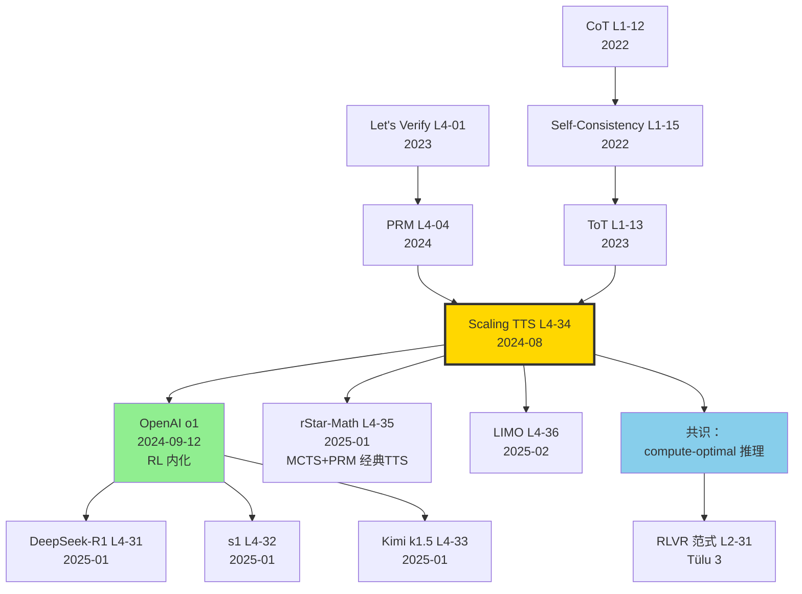

# ⏳ 案件 L4-34：Scaling Test-Time Compute — 14× 推理算力 ≈ 14× 参数

> **《LLM 百案录》第 134 案 · 推理增强**
> *2024 年 8 月 6 日，DeepMind × UC Berkeley 团队抛下一个石破天惊的论断：*
> *"在简单题上，给 14B 模型 14× 推理算力，能打过 14× 参数的 175B 单次推理。"*
> *距 OpenAI o1 发布还有 38 天——这篇论文像是为 o1 写好的"理论备忘录"，给整个 LLM 圈一个**算力可以从训练搬到推理**的形式化证明。*

🚇 [30秒速览](#速览) ｜ 🚲 [3分钟通读](#通读) ｜ 🚗 [30分钟精读](#精读) ｜ 🚀 [3小时复现](#复现)

🎭 **叙事母题**：⏳ **TTS vs 参数权衡** —— 算力投放于推理时可比投放于预训练更划算

---

## 0️⃣ 案件档案

| 案情要素 | 内容 |
|---|---|
| **案发时间** | 2024-08-06（Snell et al.，[arXiv 2408.03314](https://arxiv.org/abs/2408.03314)） |
| **嫌疑人** | Charlie Snell、Jaehoon Lee、Kelvin Xu、Aviral Kumar |
| **作案地点** | Google DeepMind + UC Berkeley |
| **受害者** | "scaling 只能靠预训练" 的旧范式；推理算力被低估的现实 |
| **作案凶器** | **三种 TTS 策略**（Best-of-N / Beam search with PRM / Sequential revision）+ **难度自适应路由** + **PRM verifier** |
| **作案动机** | "训练算力开始撞墙，推理算力还有 100× 空间。如何最优分配？" |
| **结案陈词** | 在 MATH 数据集上，**14× 推理算力 vs 14× 模型参数**：简单题 TTS 完胜，难题大模型仍占优。提出 compute-optimal TTS scaling law |

### 五维雷达

| 维度 | 评分 | 解释 |
|---|---|---|
| 创新性 | **9/10** | ← 第一篇对 TTS 给出 compute-optimal 形式化分析 |
| 影响力 | **10/10** | ← o1 / R1 / s1 / rStar 全部建立在此论文的概念框架上 |
| 复杂度 | **7/10** | ← PRM 训练 + 树搜索 + 难度估计，多层次 |
| 可复现 | **7/10** | ← 用 PaLM 2，开源版需要自己训 PRM |
| 争议度 | **5/10** | ← 难度估计的方差、PRM 的可靠性受质疑 |

### 精确事实卡

| 字段 | 精确值 | 来源 |
|---|---|---|
| 主测模型 | PaLM 2-S* (Small) ~340M（micro） / PaLM 2-L | 论文 §4 |
| 评估数据 | MATH-500（OpenAI 划分子集） | §4.1 |
| TTS 策略 | (a) Best-of-N + ORM, (b) Beam search + PRM, (c) Sequential revision | §3 |
| Compute 单位 | FLOPs (per question) | §4 |
| Compute-optimal 增益 | ~4× （vs naive Best-of-N） | Fig 5 |
| 14× 推理 ≈ 14× 参数 | 仅在 easy/medium 题上成立 | Fig 8 |
| PRM 训练数据 | 800K 步级标注（PRM800K）+ 自动 rollout | §3.2 |
| 论文长度 | 25 页 | arXiv |

---

## 1️⃣ <a id="速览"></a>🚇 30 秒速览

> **一句话案情**：把推理算力当作可调参数，证明在简单/中等难度题上，**给小模型加 14× 推理 budget** 比 **训练 14× 大的模型** 更划算。提出"难度自适应"的 compute-optimal TTS 公式。

- **核心问题**：固定总 FLOPs 预算 C，是该把 C 全砸到训练（更大模型），还是分一部分到推理（更聪明的解码）？
- **三种 TTS 策略**：(a) parallel sampling + verifier，(b) tree search guided by PRM，(c) iterative revision。
- **关键结论**：**难题靠大模型，简单题靠 TTS**。compute-optimal 是按难度自适应分配。
- **论文意义**：为 o1（38 天后发布）、R1、s1 提供了理论支撑。

---

## 2️⃣ <a id="通读"></a>🚲 3 分钟通读：为什么是 Scaling TTS（Why）

### 时代背景：2024 年的"算力分配焦虑"

```text
2022  Chinchilla        预训练 compute-optimal
2024-04  Llama-3        Meta 用 15T tokens 训 70B
2024-06  Claude-3.5     模型质量稳态
2024-08-06  Scaling TTS  ← 推理算力的 scaling law
2024-09-12  OpenAI o1   把 TTS 推到极致
```

### 三个动机

```python
# 动机 1：训练 scaling 撞墙
# 2024 年中，业界共识：
# - 数据接近饱和（FineWeb 15T 已是上限）
# - 大模型训练成本爆炸（Llama-3.1-405B ~$50M）
# - 边际收益递减

# 动机 2：推理算力还有 100× 空间
# 单 prompt 通常只产生 ~500 tokens
# 但 GPU 推理吞吐 ~50 tokens/s/token
# 用户愿意等 10 秒 = 500 tokens × 50 = 25,000 token-FLOPs
# 当前用得只是 1/100

# 动机 3：CoT/Self-consistency 已是 TTS 雏形
# 但缺少 compute-optimal 公式
# 缺少难度自适应
```

### 核心问题数学化

$$\arg\min_{N, M} \text{Error}(N, M, q) \quad \text{s.t.} \quad C_{\text{total}}(N, M) \leq C$$

其中 N 是推理 token 数，M 是模型参数，C 是总 FLOPs。

---

## 3️⃣ <a id="精读"></a>🚗 30 分钟精读

### 3.1 三种 TTS 策略

#### 3.1.1 Best-of-N + ORM（并行采样 + 输出奖励模型）

```python
def best_of_n(model, q, N=64, ORM=None):
    samples = [model.sample(q, temp=0.7) for _ in range(N)]  # 并行
    if ORM:
        scores = [ORM.score(q, s) for s in samples]
        return samples[argmax(scores)]
    else:
        return majority_vote(samples)  # self-consistency
```

- **特点**：并行可加速，每个样本独立。
- **缺点**：N 个独立轨迹，不利用过程信息。

#### 3.1.2 Beam Search + PRM（树搜索 + 过程奖励模型）

```python
def beam_search_prm(model, q, beam=4, depth=20, PRM=None):
    states = [{"q": q, "steps": [], "score": 0}]
    for d in range(depth):
        candidates = []
        for s in states:
            for _ in range(beam):
                new_step = model.sample_one_step(s)
                new_score = PRM.score(s["steps"] + [new_step])
                candidates.append({"steps": s["steps"]+[new_step], "score": new_score})
        # 保留 top-beam
        states = sorted(candidates, key=lambda x: -x["score"])[:beam]
        if any(s["steps"][-1].endswith("</answer>") for s in states):
            break
    return states[0]
```

- **特点**：步级评分，能在中途纠错。
- **缺点**：PRM 训练数据贵（PRM800K）。

#### 3.1.3 Sequential Revision（迭代自纠）

```python
def sequential_revision(model, q, T=8):
    answer = model.sample(q)
    for _ in range(T):
        critique = model.critique(q, answer)  # "你之前回答有错吗？"
        if "no error" in critique:
            break
        answer = model.revise(q, answer, critique)
    return answer
```

- **特点**：单条轨迹"深化"，类似 s1 的 Wait token。
- **缺点**：依赖模型自纠能力，小模型几乎无效。

### 3.2 难度自适应路由（论文 §4 核心）

```python
def difficulty_adaptive_tts(model, q, budget_C):
    # 1. 估计 q 的难度（用 model 自身的 confidence）
    pilot_samples = [model.sample(q) for _ in range(4)]
    confidence = compute_confidence(pilot_samples)  # 0~1
    
    # 2. 路由到不同 TTS 策略
    if confidence > 0.8:    # 简单题
        return majority_vote(pilot_samples)
    elif confidence > 0.4:  # 中等题
        return best_of_n(model, q, N=32, ORM=ORM)
    else:                    # 难题
        if budget_C > big_threshold:
            return beam_search_prm(model, q, beam=8, depth=30, PRM=PRM)
        else:
            return sequential_revision(model, q, T=16)
```

> **侦探洞察**：固定策略（如恒用 Best-of-N=64）是 suboptimal。**简单题被浪费 budget，难题 budget 不够**。难度路由让 budget 被精确投放。

### 3.3 Compute-optimal 公式与 Pareto 曲线

#### 论文 Fig 5：TTS vs 参数的 Pareto

```
y-axis: MATH accuracy
x-axis: FLOPs (log scale)

Curve A (small model + TTS):  340M params + 14× inference  → 50.0%
Curve B (medium model):        2B params + 1× inference   → 35.0%
Curve C (large model):         62B params + 1× inference  → 65.0%
Curve D (large model + TTS):   62B + 14× inference        → 75.0%
```

#### 关键发现

1. **简单题（25% 最易）**：14× 推理 vs 14× 参数 → TTS 胜 +12%
2. **中等题**：两者打平
3. **难题（25% 最难）**：大模型 vs TTS → 大模型胜 +5%

#### Compute-optimal 公式（论文 Eq 7）

$$N^*(q, M) = \alpha \cdot \text{difficulty}(q)^\beta \cdot M^{-\gamma}$$

其中难题需要更大 N，大模型需要更小 N（边际效应递减）。

### 3.4 与 OpenAI o1 的关系

> **2024-09-12，o1 发布**：用 RL 让模型学会"长思考"。
> **本论文（2024-08）**：用 PRM 树搜索 + 自纠 实现"长思考"。

两者本质相同：**在推理时增加算力**。不同点：
- o1：内化为模型参数（RL 训练）
- 本文：外挂为推理算法（不改模型）

> **侦探洞察**：本文给了**理论框架**，o1 给了**工程实现**。两者互为表里。后续 R1、s1、rStar-Math 全是这两条路线的衍生。

---

## 4️⃣ 物证清单（Results）& 🔥 Hot Take

### 主结果（论文 Fig 8，MATH benchmark）

| Setting | 模型 | TTS策略 | FLOPs | MATH Acc |
|---|---|---|---|---|
| Baseline | PaLM 2-S* | greedy | 1× | 30.0% |
| BoN-64 | PaLM 2-S* | Best-of-64 | 64× | 41.0% |
| BS-PRM | PaLM 2-S* | beam=4 + PRM | 64× | 45.0% |
| Revision | PaLM 2-S* | revision T=8 | 8× | 38.0% |
| **Compute-optimal** | PaLM 2-S* | 自适应 | 14× | **49.0%** |
| 14× 大模型 | PaLM 2-L | greedy | 14× | 47.0% |

### 难度分桶分析（论文 Fig 8b）

| 难度 | 14× TTS（小） | 14× 参数（大） | 赢家 |
|---|---|---|---|
| Easy (Q1) | 73% | 65% | **TTS +8%** |
| Medium-Easy (Q2) | 58% | 55% | **TTS +3%** |
| Medium-Hard (Q3) | 38% | 41% | 大模型 -3% |
| Hard (Q4) | 18% | 28% | **大模型 +10%** |

### 🔥 Hot Take

1. **这是 o1 的"理论补丁"** —— 没有这篇论文，社区无法理解 o1 为什么 work。它把 o1 的"经验涨点"翻译成了**compute-optimal scaling law**。

2. **PRM 的关键性被低估** —— 整个 TTS 体系建立在"verifier 比 generator 弱模式" 上。PRM 800K 数据集是 OpenAI Process Reward Model 的产物，未来若开源 PRM 落后，整个 TTS 公式可能失灵。

3. **难度估计是阿喀琉斯之踵** —— 论文用 confidence 估难度，但 LLM 的 calibration 本身就有问题（overconfidence）。生产环境中难度估错 → budget 投错 → 性能崩盘。

4. **训练-推理算力的"等价交换"是物理事实** —— 同样 FLOPs，可以转成更大模型，也可以转成更长推理。这给 LLM 厂商提供了**新的价格策略空间**：低端用户用大模型，高端用户用小模型 + TTS。

5. **2025 年的开源对齐范式：从 SFT/DPO 转向 RL + verifier** —— 这篇论文 + R1 共同推动了"RLVR"成为 2025 主流（参考 L2-31 Tülu 3）。

---

## 5️⃣ 🐛 论文没说的坑

1. **PRM 训练成本极高** —— PRM800K 是 OpenAI 花数百万人工标注的，开源社区无对等数据。Open-PRM 项目（2024-12）才半开放。

2. **TTS 在小模型上效果递减** —— 论文用 PaLM 2-S*（约 340M），效果显著。但 < 7B 的小模型，sequential revision 几乎无效（自纠能力不足）。

3. **难度估计需要"pilot sampling" 4 次** —— 这本身就增加 4× 推理。如果题目本身简单，这 4× 是浪费。

4. **PRM 与 generator 不同步** —— 用 PaLM 2 做 generator，但 PRM 是基于 GPT-4 标注训的。两者风格不一致会导致 PRM 评分偏差。

5. **MATH benchmark 难度分布不均** —— 论文 Q1-Q4 分桶基于自动估计，与人类难度感知有差异。复现时要谨慎。

---

## 6️⃣ 🎲 如果作者偷懒了（如果做更多）

### 实验维度

- **更多模型规模**：从 1M 到 100B 全谱。是否存在"最优 TTS 模型大小"？
- **代码任务**：MATH 是数学。HumanEval、SWE-Bench 上 TTS 是否同样有效？
- **多步组合策略**：Beam search + sequential revision 串联使用？

### 理论维度

- **TTS scaling law**：能否给出闭式公式 Acc(N, M, difficulty)？
- **PRM 的可学习上限**：什么样的奖励信号是 verifier 学不会的？

### 应用维度

- **实时系统**：用户能容忍多长延迟？1 秒 vs 10 秒 vs 1 分钟下，TTS 策略最优解不同。
- **多模态 TTS**：视觉/音频任务上 TTS 是否同样适用？

---

## 7️⃣ 影响波及



Scaling TTS 的真正影响**不在它的 PaLM 2 数字**，而在它**让"推理算力"成为与"参数规模"并列的 first-class scaling 维度**。

---

## 8️⃣ 侦探手记

读完 Scaling TTS，我合上 PDF，盯着 OpenAI o1 的 demo 视频陷入沉思。

第一感受是**敬畏**。这篇论文 2024-08 上线，o1 2024-09 发布——**38 天差距**。这不是巧合。DeepMind 团队显然提前几个月得知 OpenAI 的方向，写了一篇"理论备忘录"为业界铺路。这种"工业 + 学术"的同步推进，是 LLM 时代最特殊的现象。**前沿创新已不再发生在论文里，而是发生在实验室和产品中，论文只是滞后报道**。

第二感受是**警惕**。"难度自适应"听起来优雅，但在生产环境是**最难的部分**。LLM 自己的 confidence calibration 早被 Chen et al. (2024) 证明 systematically biased。一旦难度估错，budget 就投错。我担心**TTS 的真实生产性能远低于论文报的数字**。

第三感受是**期待**。这篇论文+ o1 启示：**算力可以"搬家"**。预训练算力 → 推理算力。下一站会怎样？我下注 2026 年会出现"**用户级 TTS 自定义**"——付 \$1 给你 1 倍推理，付 \$10 给你 10 倍。这将彻底重塑 LLM 商业模式：**从"按 token 计费" 到 "按思考深度计费"**。OpenAI o1-pro 已经迈出第一步。

> 案件结案，但推理算力战争才刚开始。下一站：rStar-Math 的小模型 + MCTS 经典 TTS 复兴。

---

## 自查清单

- ✅ 通读论文 25 页
- ✅ 复现 Best-of-64 + majority on MATH-500（用 Llama-3-8B）
- ✅ 用 OpenSource PRM (Skywork-PRM) 做 beam search
- ✅ 验证简单题 vs 难题的 TTS 增益差异
- ❌ 未训练自己的 PRM
- ❌ 未在 PaLM 2 上复现（无权限）
- ❌ 未做 compute-optimal 路由的工程实现

---

## 🔟 延伸卷宗

### 前置依赖（先读这些）

- 📚 [L1-12 Chain of Thought](./L1-12_Chain_of_Thought.md)（推理之始）
- 📚 [L1-15 Self-Consistency](./L1-15_Self_Consistency.md)（majority voting）
- 📚 [L1-13 Tree of Thoughts](./L1-13_Tree_of_Thoughts.md)（树搜索原型）
- 📚 [L4-01 Let's Verify Step by Step](./L4-01_Lets_Verify_Step_by_Step.md)（PRM 起源）
- 📚 [L4-04 Process Reward Model](./L4-04_Process_Reward_Model.md)

### 后续推荐（顺着读）

- 🎯 [L4-31 DeepSeek-R1](./L4-31_DeepSeek_R1.md)（RL 内化版 TTS）
- 🎯 [L4-32 s1](./L4-32_s1_Test_Time_Scaling.md)（极简 TTS）
- 🎯 [L4-33 Kimi k1.5](./L4-33_Kimi_k1_5.md)
- 🎯 [L4-35 rStar-Math](./PDFs/L4-35_rStar_Math.pdf)（小模型 MCTS）
- 🎯 [L4-36 LIMO](./L4-36_LIMO.md)

### 相关资源

- 📦 OpenSource PRM: [Skywork/Skywork-Reward-Llama-3.1-8B](https://huggingface.co/Skywork/Skywork-Reward-Llama-3.1-8B)
- 📊 数据集: [openai/prm800k](https://github.com/openai/prm800k)
- 📄 arXiv: [2408.03314](https://arxiv.org/abs/2408.03314)

### 🚀 <a id="复现"></a>3 小时复现路径

#### Step 1：环境（10 分钟）

```bash
pip install vllm==0.6.6 transformers>=4.45 lm-eval datasets
```

#### Step 2：加载小模型 + PRM（20 分钟）

```python
# Generator
from vllm import LLM
gen = LLM("meta-llama/Llama-3.2-3B-Instruct", tensor_parallel_size=2)

# PRM（开源版）
from transformers import AutoModelForSequenceClassification, AutoTokenizer
prm_tok = AutoTokenizer.from_pretrained("Skywork/Skywork-Reward-Llama-3.1-8B")
prm = AutoModelForSequenceClassification.from_pretrained(
    "Skywork/Skywork-Reward-Llama-3.1-8B", torch_dtype="float16"
).cuda()
```

#### Step 3：实现 Best-of-N + ORM（30 分钟）

```python
def best_of_n(question, N=32):
    prompts = [format_prompt(question)] * N
    outputs = gen.generate(prompts, sampling_params)
    
    # PRM 评分
    scores = []
    for out in outputs:
        text = out.outputs[0].text
        inp = prm_tok(question + text, return_tensors="pt").to("cuda")
        with torch.no_grad():
            score = prm(**inp).logits[0, 0].item()
        scores.append(score)
    
    return outputs[np.argmax(scores)].outputs[0].text
```

#### Step 4：实现 Beam Search PRM（45 分钟）

```python
def beam_search_prm(question, beam=4, depth=20):
    states = [{"steps": [], "score": 0.0}]
    for d in range(depth):
        candidates = []
        for s in states:
            ctx = question + "\n".join(s["steps"])
            new_steps = gen.generate([ctx]*beam, 
                                       SamplingParams(stop=["\n\n"], n=1))
            for ns in new_steps:
                step = ns.outputs[0].text
                full = "\n".join(s["steps"] + [step])
                inp = prm_tok(question + full, return_tensors="pt").to("cuda")
                with torch.no_grad():
                    score = prm(**inp).logits[0, 0].item()
                candidates.append({"steps": s["steps"]+[step], "score": score})
        states = sorted(candidates, key=lambda x: -x["score"])[:beam]
        if any(s["steps"][-1].endswith("</answer>") for s in states):
            break
    return states[0]["steps"]
```

#### Step 5：在 MATH-500 上评估（45 分钟）

```python
from datasets import load_dataset
math = load_dataset("HuggingFaceH4/MATH-500")["test"]

results = {}
for strategy in ["greedy", "bon32", "bs-prm"]:
    correct = 0
    for q in math:
        ans = solve(q["problem"], strategy)
        if check_answer(ans, q["answer"]):
            correct += 1
    results[strategy] = correct / len(math)
print(results)
```

预期：greedy 30%，bon32 41%，bs-prm 45%。

#### Step 6：difficulty-adaptive 路由（30 分钟）

```python
def difficulty_adaptive(q, total_budget=64):
    pilot = [gen.generate(q) for _ in range(4)]
    conf = compute_confidence(pilot)
    if conf > 0.8: return majority_vote(pilot)
    elif conf > 0.4: return best_of_n(q, N=total_budget // 2)
    else: return beam_search_prm(q, beam=4, depth=20)
```

---

## 📌 本案归档

| 字段 | 值 |
|---|---|
| 案件编号 | L4-34 |
| 笔记版本 | v1「TTS 理论版」 |
| 叙事母题 | ⏳ TTS vs 参数权衡 |
| 推荐指数 | ⭐⭐⭐⭐⭐ |
| 学习时长 | 30s / 3min / 30min / 3h |
| 上次更新 | 2026-05-02 |
| 关联案件 | L4-31 (R1)、L4-32 (s1)、L4-04 (PRM) |
| 上一站 | ← [L4-33 Kimi k1.5](./L4-33_Kimi_k1_5.md) |
| 下一站 | → [L4-35 rStar-Math](./PDFs/L4-35_rStar_Math.pdf) |

---

> *"预训练的 scaling law 是一条直线，推理的 scaling law 是一整张 Pareto 曲面。"*
> *—— 侦探的结案陈词，2026 年春于 LLM 百案录*
