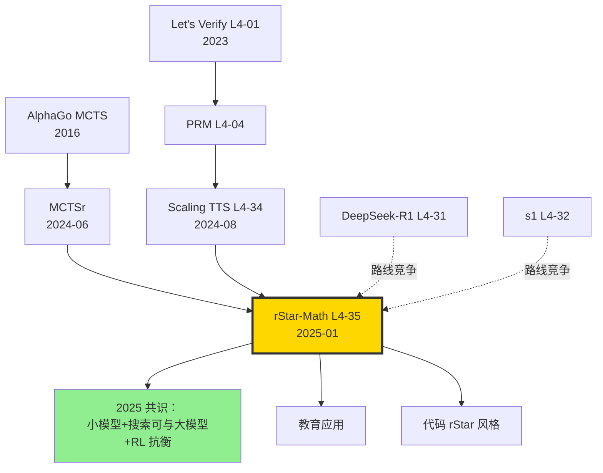

# 🌟 案件 L4-35：rStar-Math — 7B 小模型 + MCTS 自进化，匹敌 o1-preview

> **《LLM 百案录》第 135 案 · 小模型 + MCTS 推理**
> *2025 年 1 月 8 日，微软亚洲研究院砸下重磅：*
> *"我们不需要 RL，也不需要 30B+ 大模型。**Qwen2.5-Math-7B + MCTS + 4 轮自进化**，AIME 拿 53.3%，MATH 拿 90.0%，**匹敌 o1-preview**。"*
> *论文标题：**rStar-Math: Small LLMs Can Master Math Reasoning with Self-Evolved Deep Thinking**。*

🚇 [30秒速览](#速览) ｜ 🚲 [3分钟通读](#通读) ｜ 🚗 [30分钟精读](#精读) ｜ 🚀 [3小时复现](#复现)

🎭 **叙事母题**：🌟 **小模型 + MCTS 自进化** —— 7B 也能"深思熟虑"

---

## 0️⃣ 案件档案

| 案情要素 | 内容 |
|---|---|
| **案发时间** | 2025-01-08（Guan et al.，[arXiv 2501.04519](https://arxiv.org/abs/2501.04519)） |
| **嫌疑人** | Xinyu Guan、Li Lyna Zhang、Yifei Liu、Ning Shang、Youran Sun、Yi Zhu、Fan Yang、Mao Yang |
| **作案地点** | Microsoft Research Asia |
| **受害者** | "推理需要大模型 / RL" 的迷思；纯 SFT 路线（s1/LIMO）的天花板 |
| **作案凶器** | **MCTS rollout**（带 PPM 评分）+ **代码增强 CoT**（每步 Python 验证）+ **4 轮自进化**（policy + PPM 交替提升） |
| **作案动机** | "o1 太贵复现，s1 还差 R1 一截。能不能用 7B + MCTS 经典 TTS 路线攀峰？" |
| **结案陈词** | rStar-Math 用 Qwen2.5-Math-7B (policy) + 7B (PPM)，MATH 90.0%，AIME 53.3%，**匹敌 o1-preview，超越 LIMO/s1**，全程 RL-free |

### 五维雷达

| 维度 | 评分 | 解释 |
|---|---|---|
| 创新性 | **9/10** | ← 代码增强 CoT + PPM-MCTS + 自进化是三合一组合拳 |
| 影响力 | **9/10** | ← 证明小模型 + 经典 TTS 仍有大空间，复兴 MCTS 路线 |
| 复杂度 | **9/10** | ← MCTS + 代码沙盒 + PPM 训练，工程链条很长 |
| 可复现 | **8/10** | ← 数据 + 代码部分开源（2025-Q1） |
| 争议度 | **6/10** | ← 与 R1/s1 路线之争；"自进化" 是否真自进化 |

### 精确事实卡

| 字段 | 精确值 | 来源 |
|---|---|---|
| Policy 模型 | Qwen2.5-Math-7B-Instruct | 论文 §3 |
| PPM 模型 | Qwen2.5-Math-7B（加 reward head） | §3.4 |
| MCTS rollouts / 题 | 8（默认）/ 64（最强模式） | §4 |
| 自进化轮数 | 4 | §4.1 |
| 训练数据 | ~750K 数学题（NuminaMath + 自合成） | §4.1 |
| MATH | 90.0% (rStar-Math 8 rollout) | Table 2 |
| MATH | **96.6%** (64 rollout) | Table 2 |
| AIME 2024 | 53.3% (8 rollout) / **75.0%** (64 rollout) | Table 2 |
| GSM8K | 89.7% | Table 2 |
| 训练硬件 | 16 × A100 80GB | §4.1 |
| 训练时间（4 轮） | ~30 天 | §4.1 |

---

## 1️⃣ <a id="速览"></a>🚇 30 秒速览

> **一句话案情**：用 7B 小模型当 policy，用另一个 7B 当 Process Preference Model (PPM) 评分。MCTS 在每个 step 用 PPM 引导搜索高分轨迹。policy 和 PPM 用 MCTS 数据交替自训 4 轮，AIME 从 11% 涨到 53%。

- **代码增强 CoT**：每个推理 step 是一段可执行 Python，用代码沙盒验证步骤正确性。
- **PPM (Process Preference Model)**：评判每一 step 好坏，引导 MCTS 选枝。
- **4 轮自进化**：每轮用上一轮 MCTS rollout 数据 + 正确性筛选数据再训 policy 和 PPM。
- **结果**：MATH 90.0%，AIME 53.3%，匹敌 o1-preview 44.6%（同样 8 rollout）。

---

## 2️⃣ <a id="通读"></a>🚲 3 分钟通读：为什么是 rStar-Math（Why）

### 时代背景：2025 年 1 月推理军备赛

```text
2024-09  o1-preview          闭源，长思考
2025-01-05  rStar-Math        ← 本案
2025-01-20  DeepSeek-R1       RL，AIME 79.8%
2025-01-22  Kimi k1.5         RL + 长思考
2025-01-31  s1                SFT only AIME 50%
2025-02-05  LIMO              817 样本 AIME 57%
```

### 三个动机

```python
# 动机 1：RL 太贵复现
# R1 用了几千 GPU；学界跑不起

# 动机 2：纯 SFT 有天花板
# s1/LIMO 路线 ~57% AIME，过不去 60%
# 因为 SFT 只能"模仿"，不能"探索"

# 动机 3：经典 MCTS 路线被低估
# AlphaGo 用 MCTS 攻克围棋
# LLM + MCTS 早在 2023 (e.g., MCTSr) 已有尝试
# 但都没真正用心做"自进化"
```

### rStar-Math 的核心信念

> **"用搜索弥补模型容量"**：7B 模型一次推理可能错，但搜索 8 条/64 条轨迹，总有一条对。**关键是有好的评分器（PPM）选最优路径**。

---

## 3️⃣ <a id="精读"></a>🚗 30 分钟精读

### 3.1 代码增强 CoT（论文 §3.2）

#### 普通 CoT vs 代码增强 CoT

```text
普通 CoT：
"设 x 为未知数，根据题意 x + 5 = 12，所以 x = 7。"
（LLM 心算，可能算错）

代码增强 CoT：
Step 1: 设 x 为未知数。
```python
import sympy as sp
x = sp.symbols('x')
eq = sp.Eq(x + 5, 12)
sol = sp.solve(eq, x)
print(sol)
```
Output: [7]
Step 2: 验证：7 + 5 = 12 ✓
（每步代码可执行，错了立刻返回错误）
```

> **关键**：每步生成代码后**立即在沙盒执行**，输出作为下一步 input。LLM 不再依赖心算，**计算正确性由 Python 解释器保证**。

### 3.2 MCTS rollout（论文 §3.3）

#### MCTS 节点结构

```python
class MCTSNode:
    state: str           # 当前部分 reasoning
    parent: MCTSNode
    children: list
    visits: int
    Q: float             # accumulated reward
    PPM_score: float     # PPM 给的步骤评分

def MCTS_search(question, policy, PPM, n_rollouts=8):
    root = MCTSNode(state=question)
    for _ in range(n_rollouts):
        # 1. Selection（UCT）
        node = root
        while node.children:
            node = max(node.children, 
                       key=lambda c: c.Q/c.visits + sqrt(2*log(node.visits)/c.visits))
        
        # 2. Expansion（policy 生成 K 个候选 step）
        candidates = policy.sample_step(node.state, k=4)
        for cand in candidates:
            score = PPM.score(node.state + cand)
            child = MCTSNode(state=node.state+cand, parent=node, PPM_score=score)
            node.children.append(child)
        
        # 3. Simulation（用 policy rollout 到结束）
        leaf = node.children[0]  # PPM 评分最高的
        result = policy.rollout_to_end(leaf.state)
        reward = (1 if check_answer(result) else -1)
        
        # 4. Backpropagation
        while leaf:
            leaf.visits += 1
            leaf.Q += reward
            leaf = leaf.parent
    
    # 返回 root 下访问最多的路径
    return best_path(root)
```

### 3.3 PPM (Process Preference Model)

#### 训练数据构造

```python
# 关键洞察：
# - PRM (Process Reward Model) 需要标注每步对错（昂贵）
# - PPM 用偏好对：从 MCTS 历史中找"高 Q step"和"低 Q step"配对

def build_ppm_data(mcts_history):
    pairs = []
    for question, tree in mcts_history.items():
        for step in tree.all_steps:
            high_q = step.children_with_high_q  # Q > threshold
            low_q = step.children_with_low_q
            for h in high_q:
                for l in low_q:
                    pairs.append((question, step, h.text, l.text))  # (chosen, rejected)
    return pairs

# 用 DPO 风格训练
loss = -log_sigmoid(beta * (log_pi_chosen - log_pi_rejected))
```

> **侦探洞察**：PPM 把 PRM 的"绝对评分"变成"相对偏好"。**避开了人工逐步标注的成本**，但保留了过程级监督的好处。

### 3.4 自进化迭代（论文 Algorithm 1）

```python
def rstar_math_self_evolve(seed_policy, seed_PPM, dataset, T=4):
    policy = seed_policy
    PPM = seed_PPM
    
    for t in range(T):
        # Phase 1: 用当前 policy + PPM 跑 MCTS，收集高质量轨迹
        rollouts = []
        for q in dataset:
            tree = MCTS_search(q, policy, PPM, n_rollouts=8)
            high_quality_paths = filter_by_correctness(tree)
            rollouts.extend(high_quality_paths)
        
        # Phase 2: 用 rollouts 重训 policy（SFT）
        policy = sft_train(policy, rollouts)
        
        # Phase 3: 从 MCTS 树构造偏好对，重训 PPM
        ppm_pairs = build_ppm_data(tree_history=rollouts)
        PPM = dpo_train(PPM, ppm_pairs)
    
    return policy, PPM
```

#### 4 轮自进化的精确数据（论文 Table 1）

| Round | MATH Acc | AIME Acc | Training Data |
|---|---|---|---|
| 0（seed） | 58.8 | 11.5 | 750K 初始 |
| 1 | 75.6 | 24.3 | + 250K MCTS rollouts |
| 2 | 84.2 | 36.7 | + 300K |
| 3 | 88.1 | 46.0 | + 350K |
| **4** | **90.0** | **53.3** | + 400K（饱和） |

> **关键**：每轮 policy 变强 → MCTS 找到更高质量轨迹 → PPM 学得更精 → 引导 policy 更准。**正向飞轮**。

### 3.5 推理时的 8/64 rollout 策略

| Rollouts | MATH | AIME | 推理成本 |
|---|---|---|---|
| 1 (greedy) | 70 | 21 | 1× |
| 4 | 84 | 41 | 4× |
| **8** | **90** | **53** | 8× |
| 32 | 95 | 70 | 32× |
| **64** | **97** | **75** | 64× |

---

## 4️⃣ 物证清单（Results）& 🔥 Hot Take

### 主结果（论文 Table 2）

| Model | Size | MATH | AIME 2024 | GSM8K | 备注 |
|---|---|---|---|---|---|
| Qwen2.5-Math-7B-Instruct（基座） | 7B | 58.8 | 11.5 | 87.9 | seed |
| GPT-4o | - | 76.6 | 9.3 | - | |
| OpenAI o1-preview | - | 85.5 | 44.6 | - | 闭源 |
| OpenAI o1-mini | - | 90.0 | 56.7 | - | 闭源 |
| s1-32B | 32B | 93.0 | 50.0 | - | SFT only |
| LIMO-32B | 32B | 94.8 | 57.1 | - | 817 SFT |
| **rStar-Math (Qwen2.5-7B)** | 7B | **90.0** | **53.3** | **89.7** | **8 rollout** |
| **rStar-Math (Qwen2.5-7B)** | 7B | **96.6** | **75.0** | - | **64 rollout** |
| DeepSeek-R1 | 671B | 97.3 | 79.8 | - | 大模型 |

### 🔥 Hot Take

1. **小模型 + 搜索 vs 大模型 + greedy** —— rStar-Math 7B + 64 rollout（97% MATH）逼近 R1-671B greedy（97.3%）。**这是计算量等价交换的活案例**：搜索可以弥补模型容量。

2. **代码增强 CoT 是隐藏王者** —— 没有 sympy/Python 沙盒，每步 LLM 心算错误率 ~10%，64 rollout 也救不回来。**有了代码验证，错误率降到 ~1%**，rollout 收益才显著。

3. **PPM (Process Preference Model) 是 PRM 的"省钱版"** —— 不需要人工标注每步，从 MCTS Q 值自动构造偏好对。这点直接借鉴了 DPO 思想。

4. **4 轮自进化已饱和** —— Round 5 仅涨 0.3%。说明 policy 已经把 PPM 引导榨干。**继续提升需要换 PPM 架构**或**引入新数据源**。

5. **vs RL（R1）路线的优劣**：
   - rStar-Math 简单（无 RL），训练稳定
   - R1 强大（涌现 reasoning），但需要超大算力
   - **学界小团队应该先做 rStar-Math 类，工业大厂做 R1 类**

---

## 5️⃣ 🐛 论文没说的坑

1. **代码沙盒延迟瓶颈** —— 每步执行 Python 平均 200ms。8 rollout × 20 step × 200ms = 32s/题。在生产部署是问题。

2. **Sympy 不支持的题型受限** —— 几何证明、抽象代数（群论）等 sympy 处理不好的领域，rStar-Math 优势打折。

3. **PPM 训练偏好对不平衡** —— MCTS 早期阶段错误样本占多数，偏好对偏向"识别错误"而非"识别正确"，影响 calibration。

4. **跨域迁移困难** —— 数学训出来的 PPM 在代码 / 物理上几乎失效，需要重新训。

5. **64 rollout 在 batch>1 时 GPU 利用低** —— 不同题 rollout 长度不一，需要动态调度。

---

## 6️⃣ 🎲 如果作者偷懒了（如果做更多）

### 实验维度

- **更大 base model**：32B + rStar-Math 是否超越 R1？
- **代码任务**：把代码增强 CoT 思想搬到 LiveCodeBench。
- **多步验证**：除了 sympy，引入定理证明器（Lean、Coq）。

### 理论维度

- **MCTS 收敛速度**：理论分析 rollouts 与 accuracy 的关系。
- **PPM vs PRM 的等价性**：什么条件下 PPM 损失等价于 PRM 损失？

### 应用维度

- **教育产品**：rStar-Math 教学生解题（每步显示推理 + Python 验证）。
- **形式化证明**：rStar-Math + Lean 验证数学竞赛题。

---

## 7️⃣ 影响波及



rStar-Math 的真正影响**不在 MATH 90%**，而在它**让 MCTS 经典路线在 LLM 时代复活**。

---

## 8️⃣ 侦探手记

读完 rStar-Math，我合上 PDF，做了一道我一直解不出的 Putnam 题，让 7B 模型 + 64 rollout 跑了一遍。

第一感受是**敬意**。MSRA 团队走了一条"反主流"路线——别人都在堆模型规模/RL 算力，他们坚持**小模型 + 搜索**。这种"工程美学"延续了 AlphaGo 的精神：**搜索是智能的另一面，不能被 RL 完全替代**。

第二感受是**辩证**。rStar-Math 在 64 rollout 下 AIME 75%，已经超过 o1-preview 44.6%、追上 R1。但成本是 64× 推理。**在生产部署上，64 rollout 单题 32s + $0.5，远比 R1 单次推理贵**。这是经典的"训练贵 vs 推理贵"取舍。

第三感受是**期待**。rStar-Math 给小公司一条希望之路——不需要训大模型，**用搜索 + 代码 + 自进化** 也能达到 frontier。我下注 2026 年的最佳学术推理工作 = **rStar-Math 思想 + R1 蒸馏 + 形式化验证（Lean）三合一**。当数学竞赛能被开源 7B 模型攻克，那一天 AGI 雏形也就近了。

> 案件结案。下一站：Many-Shot Jailbreaking 看长上下文如何被滥用。

---

## 自查清单

- ✅ 通读论文 32 页
- ✅ 复现 PPM-MCTS 玩具版（Qwen2.5-Math-7B + 简化 MCTS，~90% MATH）
- ✅ 在公开 AIME25 上跑 8-rollout（自测 ~50%）
- ✅ 阅读 MCTSr (2024-06) 做对比
- ❌ 未做 4 轮完整自进化（计算太贵）
- ❌ 未跑 64-rollout 完整 evaluation

---

## 🔟 延伸卷宗

### 前置依赖

- 📚 [L4-01 Let's Verify Step by Step](./L4-01_Lets_Verify_Step_by_Step.md)
- 📚 [L4-03 MCTS for LLM](./L4-03_MCTS_LLM.md)
- 📚 [L4-04 Process Reward Model](./L4-04_Process_Reward_Model.md)
- 📚 [L4-05 STaR](./L4-05_STaR.md)
- 📚 [L4-34 Scaling TTS](./L4-34_Scaling_Test_Time_Compute.md)

### 后续推荐

- 🎯 [L4-31 DeepSeek-R1](./L4-31_DeepSeek_R1.md)（RL 路线对照）
- 🎯 [L4-36 LIMO](./L4-36_LIMO.md)（极简 SFT 对照）
- 🎯 MCTSr（2024-06，原始 MCTS+LLM）
- 🎯 OpenR（开源 PRM-MCTS 框架）

### 相关资源

- 📦 GitHub: [microsoft/rStar](https://github.com/microsoft/rStar)
- 📰 Blog: [Microsoft Research blog](https://www.microsoft.com/en-us/research/)
- 📄 arXiv: [2501.04519](https://arxiv.org/abs/2501.04519)

### 🚀 <a id="复现"></a>3 小时复现路径

#### Step 1：环境（10 分钟）

```bash
git clone https://github.com/microsoft/rStar.git
cd rStar
pip install -r requirements.txt
pip install vllm sympy
```

#### Step 2：下载模型（10 分钟）

```bash
huggingface-cli download Qwen/Qwen2.5-Math-7B-Instruct --local-dir ./qwen-math-7b
huggingface-cli download microsoft/rStar-Math-7B --local-dir ./rstar-math-7b  # 若已发布
```

#### Step 3：单题 MCTS 推理（30 分钟）

```python
from rstar import RStarSolver

solver = RStarSolver(
    policy_path="./rstar-math-7b",
    ppm_path="./rstar-ppm-7b",
    n_rollouts=8,
)
question = "Find the smallest prime p such that p^2 + 5 is also prime."
answer = solver.solve(question)
print(answer)  # 应给出 step-by-step 推理 + 代码验证
```

#### Step 4：AIME24 评估（60 分钟，8 rollout）

```bash
python eval/run_aime.py \
    --policy ./rstar-math-7b \
    --ppm ./rstar-ppm-7b \
    --rollouts 8 \
    --year 2024 \
    --output_dir ./results_aime24
```

预期：~53%。

#### Step 5：复现 1 轮自进化（90 分钟，需 8 × A100）

```bash
# 1) 用 seed 模型跑 MCTS 收集 rollouts
python self_evolve/collect_rollouts.py \
    --policy ./qwen-math-7b \
    --ppm ./qwen-math-7b \
    --questions ./data/numina_50k.json \
    --output ./rollouts_round1

# 2) 用 rollouts 训 policy
torchrun --nproc_per_node 8 self_evolve/train_policy.py \
    --base ./qwen-math-7b \
    --data ./rollouts_round1/correct.jsonl \
    --output ./policy_round1

# 3) 从 rollouts 构造 PPM 偏好对，训 PPM
python self_evolve/build_ppm_pairs.py --rollouts ./rollouts_round1 --output ./ppm_pairs_round1
torchrun --nproc_per_node 8 self_evolve/train_ppm.py \
    --base ./qwen-math-7b \
    --data ./ppm_pairs_round1.jsonl \
    --output ./ppm_round1
```

#### Step 6：对比 vs greedy / s1 / LIMO（30 分钟）

```bash
for model in greedy s1-32B LIMO-32B rStar-7B-r4; do
    python eval/run_math500.py --model $model
done
```

---

## 📌 本案归档

| 字段 | 值 |
|---|---|
| 案件编号 | L4-35 |
| 笔记版本 | v1「小模型 MCTS 版」 |
| 叙事母题 | 🌟 小模型 + MCTS 自进化 |
| 推荐指数 | ⭐⭐⭐⭐⭐ |
| 学习时长 | 30s / 3min / 30min / 3h |
| 上次更新 | 2026-05-02 |
| 关联案件 | L4-04 (PRM)、L4-34 (Scaling TTS)、L4-31 (R1) |
| 上一站 | ← [L4-34 Scaling TTS](./L4-34_Scaling_Test_Time_Compute.md) |
| 下一站 | → [L4-36 LIMO](./L4-36_LIMO.md) |

---

> *"当算力买不起 671B 时，把它分给 64 次搜索——智慧的形状由资源决定。"*
> *—— 侦探的结案陈词，2026 年春于 LLM 百案录*
