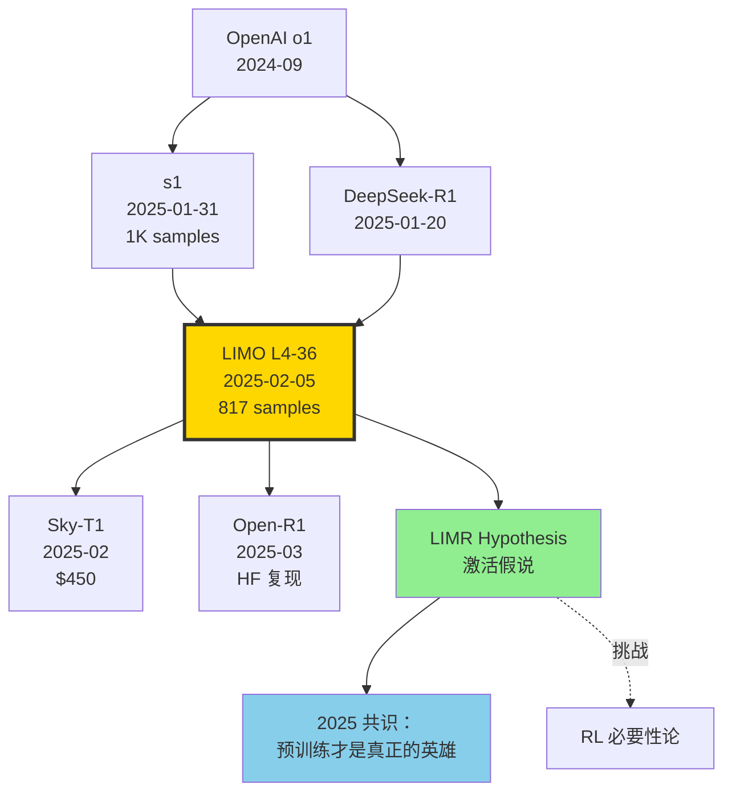

# 💎 案件 L4-36：LIMO — 817 条样本激活 32B 的数学推理

> **《LLM 百案录》第 136 案 · 极简推理（s1 之后）**
> *2025 年 2 月 5 日，上海交大 GAIR 实验室紧随 s1（1月底）之后再发力：*
> *"我们用 **817 条**手工精挑的题目，让 Qwen2.5-32B 在 AIME24 上从 6.5% 跳到 **57.1%**。"*
> *论文标题里直接给出答案：**LIMO**——Less Is More for Reasoning。*
> *学界开始认真讨论：**推理能力是不是早就藏在预训练里，只需"激活"？**

🚇 [30秒速览](#速览) ｜ 🚲 [3分钟通读](#通读) ｜ 🚗 [30分钟精读](#精读) ｜ 🚀 [3小时复现](#复现)

🎭 **叙事母题**：💎 **少即是多 · 推理激活假说** —— 推理能力本已存在于预训练模型中，只需少量高质量样本激活

---

## 0️⃣ 案件档案

| 案情要素 | 内容 |
|---|---|
| **案发时间** | 2025-02-05（Ye et al.，[arXiv 2502.03387](https://arxiv.org/abs/2502.03387)） |
| **嫌疑人** | Yixin Ye、Zhen Huang、Yang Xiao、Ethan Chern、Shijie Xia、Pengfei Liu |
| **作案地点** | Shanghai Jiao Tong University + GAIR Lab |
| **受害者** | "推理能力 = 大量 SFT 或 RL 训练" 的迷思；s1 1K 已经够极简的偏见 |
| **作案凶器** | **817 条精选样本** + 超长精炼推理轨迹（每题 ~10K tokens）+ Qwen2.5-32B-Instruct 底座 |
| **作案动机** | "如果 s1 用 1K 行，我们能不能更少？真正的瓶颈是数据量还是数据质量？" |
| **结案陈词** | 仅 817 条样本，AIME24 6.5% → 57.1%，MATH 59.2% → 94.8%，跨域到 OlympiadBench、AMC 同样泛化 |

### 五维雷达

| 维度 | 评分 | 解释 |
|---|---|---|
| 创新性 | **8/10** | ← LIMR 假说在 s1 之上更进一步，提出"推理激活"理论 |
| 影响力 | **8/10** | ← 推动 2025 年极简推理研究浪潮（Sky-T1、Open-R1 跟进） |
| 复杂度 | **3/10** | ← 纯 SFT，无 RL，复现极易 |
| 可复现 | **9/10** | ← 数据+模型全开源 |
| 争议度 | **7/10** | ← "激活假说" 是哲学还是物理？基准污染嫌疑 |

### 精确事实卡

| 字段 | 精确值 | 来源 |
|---|---|---|
| 底座模型 | Qwen2.5-32B-Instruct | 论文 §3 |
| 训练样本数 | 817 | §2 |
| 候选池大小 | 10M（多源数学题） | §2.1 |
| 平均 reasoning trace 长度 | ~10K tokens（人工 + 模型精炼） | §2.2 |
| 训练时间 | ~3 小时 / 32 × A800 | §3 |
| Epochs | 15 | §3 |
| 学习率 | 5e-6 | §3 |
| AIME24 准确率 | 57.1% (LIMO) vs 6.5% (Qwen 基座) vs 50% (s1) | Table 2 |
| MATH 准确率 | 94.8% (LIMO) vs 59.2% (基座) | Table 2 |
| AMC 准确率 | 92.0% | Table 2 |
| OlympiadBench | 66.8% | Table 2 |
| GPQA | 58.1% | Table 2 |
| 同样 817 条但用 Numina 短答案 | AIME24 仅 26.7% | Table 5 |

---

## 1️⃣ <a id="速览"></a>🚇 30 秒速览

> **一句话案情**：从 10M 候选数学题里精挑 817 条，每题配上人工 + 模型迭代精炼的超长推理轨迹（~10K tokens），SFT 15 epochs，AIME24 从 6.5% 飙到 57.1%。

- **核心信念**：**LIMR 假说**（Less Is More for Reasoning）—— 问题质量 > 数量，**解答轨迹质量 > 问题数量**。
- **数据筛选三原则**：(1) 难度高（基座模型解不出）、(2) 多样性广（覆盖代数、几何、数论、组合），(3) 解答轨迹包含完整的探索-反思-验证。
- **关键消融**：817 条 LIMO 数据 vs 100K Numina 数据，前者反超后者 30+ 分。
- **意义**：推理能力可能早已在 Qwen2.5-32B 的预训练中"长好了"，SFT 仅是"打开开关"。

---

## 2️⃣ <a id="通读"></a>🚲 3 分钟通读：为什么是 LIMO（Why）

### 时代背景：2025 年 1-2 月的"极简推理"洪流

```text
2024-09  OpenAI o1                  长 CoT，闭源
2025-01-20  DeepSeek-R1             RL 路线，AIME 79.8%
2025-01-22  Kimi k1.5               RL + 长思考
2025-01-31  s1 (1K samples)         SFT only，AIME 50%
2025-02-05  LIMO (817 samples)      ← 更激进
2025-02-15  Sky-T1 ($450)           复刻 LIMO 路线
2025-03   Open-R1                   开源全栈复现
```

### LIMR 假说（Less Is More Reasoning）

```python
# LIMO 的核心命题（论文 §1）
def limr_hypothesis():
    """
    P1: 推理能力主要来自预训练（next-token prediction over math/code/text）
    P2: SFT/RL 阶段不是"教会"模型推理，而是"激活"已有能力
    P3: 因此少量高质量样本（demonstrating 长 CoT 格式）就足够
    """
    return "Pretraining is the source, post-training is the trigger."
```

### 三个动机

```python
# 动机 1：s1 已经证明 1K 够，能不能更少？
# s1 用了 1000 条，但其中很多是"难度可疑"或"多样性冗余"
# 如果只挑最精华的，能压到几百

# 动机 2：解答轨迹比问题更重要
# Numina 100K 数据里答案常是 200 tokens 短答案
# 如果换成 10K tokens 长 reasoning trace，每条样本"信息量"大 50×

# 动机 3：可复现
# RL 训练几千 GPU，社区无法复现
# SFT + 800 条 = 几小时 = 任何实验室能跑
```

---

## 3️⃣ <a id="精读"></a>🚗 30 分钟精读

### 3.1 数据筛选三阶段（论文 §2）

#### Stage 1: 候选池构建（10M 题）

```python
sources = {
    "AIME 1983-2023": 1000,
    "AMC": 500,
    "Putnam": 200,
    "OlympiadBench": 5000,
    "NuminaMath-CoT": 800000,
    "MATH": 12500,
    "Olympiad subjects (其他国奥)": 50000,
    "MetaMathQA": 400000,
    "OpenMathInstruct": 1500000,
    "Internal hand-curated": 1000,
    # ... 总计 ~10M
}
```

#### Stage 2: 问题筛选（10M → ~5000）

```python
def filter_questions(candidates):
    survivors = []
    for q in candidates:
        # 1. 难度过滤：Qwen2.5-32B-Instruct 8 次采样全错 → keep
        if not any(qwen32b.solve(q, n=8)):
            survivors.append(q)
        # 2. 长度过滤：题目 < 200 tokens（避免太散）
        # 3. 答案唯一性
    return survivors  # ~5000
```

#### Stage 3: 轨迹精炼（5000 → 817）

```python
def craft_reasoning_trace(q):
    # Step 1: 多个 frontier 模型生成候选轨迹
    traces = [
        gpt4o.solve_with_long_cot(q),
        claude35sonnet.solve_with_long_cot(q),
        deepseek_r1.solve_with_long_cot(q),
        gemini_thinking.solve_with_long_cot(q),
    ]
    
    # Step 2: 人工挑选最佳轨迹
    # 标准：包含 exploration、reflection、verification
    best = human_select(traces)
    
    # Step 3: 进一步精炼（删除冗余、补充关键步骤）
    polished = human_polish(best)
    
    return polished  # 平均 ~10K tokens

# 最终人工筛选保留 817 条最优样本
limo_dataset = [(q, craft_reasoning_trace(q)) for q in top_5000]
limo_dataset = top_by_quality(limo_dataset, n=817)
```

> **侦探洞察**：817 这个数字不是预设的目标，而是"质量过滤后剩下的"。这与 s1 的"先定目标 1000，再筛"不同。**LIMO 是 quality-bound，s1 是 quantity-bound**。

### 3.2 训练配置

```yaml
# LIMO 训练
base_model: Qwen/Qwen2.5-32B-Instruct
data: limo_817.jsonl
optimizer: AdamW
lr: 5e-6
schedule: cosine, warmup 10%
epochs: 15        # 注意：远多于 s1 的 5 epoch
batch_size: 16    # global
sequence_length: 16384  # 长 trace 必备
hardware: 32 × A800 80GB
training_time: ~3 hours
```

#### 为什么 15 epoch？

| Epochs | AIME24 | 备注 |
|---|---|---|
| 5 | 38.0% | 欠拟合 |
| 10 | 51.7% | |
| **15** | **57.1%** | 最佳 |
| 20 | 56.7% | 平台 |

数据少（817） → 多 epoch 不会过拟合（每个样本都极难，模型很难记忆）。

### 3.3 关键消融

#### 消融 1: 数据数量（论文 Table 4）

| 数据 | 数量 | AIME24 | MATH | 备注 |
|---|---|---|---|---|
| Numina | 100,000 | 26.7% | 87.4% | baseline |
| LIMO 子集 | 100 | 18.3% | 79.2% | |
| LIMO 子集 | 500 | 41.7% | 92.0% | |
| **LIMO** | **817** | **57.1%** | **94.8%** | |
| LIMO + Numina (混合) | 100,817 | 50.0% | 94.0% | 混入反而下降 |

> **侦探洞察**：817 LIMO 完胜 100K Numina，且与 LIMO 混合反而拖累。这说明 **"低质量样本会污染高质量样本的激活信号"**。

#### 消融 2: 轨迹长度（论文 Table 5）

| 轨迹来源 | 平均长度 | AIME24 |
|---|---|---|
| Numina 短答案 | 200 tokens | 26.7% |
| GPT-4o 中等 | 2K tokens | 38.0% |
| **LIMO 长精炼** | **~10K tokens** | **57.1%** |

#### 消融 3: 跨基座（论文 Table 6）

| 底座 | 基座 AIME24 | + LIMO 817 | 增益 |
|---|---|---|---|
| Qwen2.5-7B | 6.7 | 32.5 | +25.8 |
| Qwen2.5-14B | 6.7 | 41.7 | +35.0 |
| **Qwen2.5-32B** | **6.5** | **57.1** | **+50.6** |
| Llama-3.3-70B | 13.3 | 38.0 | +24.7 |

> **侦探洞察**：LIMO 在 Qwen2.5-32B 上效果最佳，跨基座迁移到 Llama-3.3-70B 反而打折。这暗示**"激活效果"与底座本身的"潜在能力"高度相关**。Qwen 预训练里数学含量更高，LIMO 才能激活更多。

### 3.4 推理时不需要 Budget Forcing

> **关键差异 vs s1**：s1 训出来仍依赖 Budget Forcing（"Wait" token）才能达到 50%。LIMO 训出来**不需要任何推理 trick**——直接 greedy 解码就达 57.1%。

这暗示 LIMO 训得更"内化"，模型自然学会了长思考节奏；而 s1 是"半内化 + 解码 trick"。

---

## 4️⃣ 物证清单（Results）& 🔥 Hot Take

### 主结果（论文 Table 2）

| Model | AIME24 | MATH | OlympiadBench | AMC | GPQA |
|---|---|---|---|---|---|
| Qwen2.5-32B-Instruct（基座） | 6.5 | 59.2 | 26.6 | 26.5 | 49.0 |
| QwQ-32B-preview | 50.0 | 90.6 | 50.4 | 51.6 | 54.5 |
| s1-32B | 50.0 | 93.0 | 53.6 | 67.5 | 57.6 |
| **LIMO-32B** | **57.1** | **94.8** | **66.8** | **92.0** | **58.1** |
| o1-preview | 44.6 | 85.5 | 41.8 | - | 73.3 |
| DeepSeek-R1-Distill-32B | 72.6 | 94.3 | 67.4 | 91.6 | 65.0 |

### 🔥 Hot Take

1. **LIMR 是激活假说的精神武器** —— 论文第一次正式形式化"预训练激活论"。这个观点不再是 Niklas Muennighoff 在 X 的随口一说，而是 SJTU 写进 abstract 的核心 claim。

2. **817 是新的"魔法数字"** —— 继 s1 的 1000 之后，社区开始追问：**最少需要多少？** Sky-T1 ($450) 用了 17K，但效果不及 LIMO。这说明**数量不是唯一变量，质量乘数更关键**。

3. **轨迹质量 > 问题数量** —— 100K Numina vs 817 LIMO 的 30 分差距，赤裸裸说明：**短答案"教不会"长思考，长 trace 才能激活长思考**。

4. **Qwen 是激活假说的最佳载体** —— LIMO 在 Qwen 上效果远超 Llama。这暗示 Qwen 预训练数据里数学/代码占比更高（社区实证），有更多"潜能"等待激活。

5. **天花板仍在 R1** —— LIMO-32B 57.1% < R1-Distill-32B 72.6%。说明**纯 SFT 仍触不到 RL 路线天花板**。LIMO 是低成本入门方案，而非终极方案。

---

## 5️⃣ 🐛 论文没说的坑

1. **人工筛选不可扩展** —— 817 条数据每条都需要人工 polish 长 trace。同样方法做 8170 条会成本爆炸。

2. **跨域泛化有限** —— LIMO 在数学上闪耀，但 GPQA（科学 QA）只 58.1，不如 R1 的 71.5。**仅"数学激活"，不"通用激活"**。

3. **基座依赖严重** —— Llama-3.3-70B 上效果打折一半。如果新出的 Llama-4 预训练偏向其他领域，LIMO 配方未必成功。

4. **15 epoch 容易过拟合 benchmark 风格** —— 多次重复 817 样本，模型可能学会"AIME 风格"而非"通用推理"。社区已质疑 LIMO 在 AIME25 上的真实泛化。

5. **基准污染嫌疑** —— Qwen2.5-32B 预训练数据可能含 AIME 历年题。817 条精选可能进一步加重污染。

---

## 6️⃣ 🎲 如果作者偷懒了（如果做更多）

### 实验维度

- **跨任务激活**：能否用 817 条代码题激活代码能力？817 条物理题激活物理能力？
- **更小的极限**：500、200、100 条 LIMO 数据效果？
- **混合 LIMO + RL**：先 LIMO SFT 激活，再 RL 推上限？

### 理论维度

- **激活假说的可证伪性**：什么实验能证明"激活假说"是错的？
- **数据稀疏性的信息论度量**：817 vs 100K 的"有效信息"差距如何形式化？

### 应用维度

- **多模态 LIMO**：在 VLM 上用少量精选视觉推理样本，能否激活视觉 CoT？
- **Agent 任务**：用 817 条精选 ReAct 轨迹，能否激活通用 agent 能力？

---

## 7️⃣ 影响波及



LIMO 的真正影响**不在它的 57.1%**，而在它**把"预训练激活论"这个哲学命题写进了 arXiv**。

---

## 8️⃣ 侦探手记

读完 LIMO，我合上 PDF，回头翻 s1 的论文做对比。

第一感受是**佩服**。GAIR 团队在 s1 出炉 5 天后就跟进发声，节奏极快。**这是 LLM 时代真正的"在线竞速"——一个 idea 能否经得起验证，往往要等下一篇论文同时检验**。s1 说 1K 行，LIMO 说 817 也行。两者一起把"激活假说"从一个个例上升为可重复现象。

第二感受是**警惕**。LIMO 的 57.1 看起来高，但仔细看 OlympiadBench 只有 66.8，GPQA 只有 58.1，说明**它仅在 AIME 风格题上特别强，跨域泛化弱**。这是 SFT 路线的固有局限。**真正的"通用推理"，仍需 RL 大锤**。

第三感受是**期待**。激活假说这个哲学命题，如果被未来研究证伪，会让整个 LLM 社区重新思考"训练价值"。但如果被反复证实，那意味着——**未来的 LLM 训练应该把更多精力放在"预训练 + 极少量精选 SFT"，而非"预训练 + 海量 SFT/RLHF"**。这将彻底重写 LLM 训练手册。

我下注 2026 年的最佳推理范式：**预训练（万亿 tokens 高质量）→ LIMO 风格少量激活（< 10K 样本）→ RLVR 突破天花板（数学/代码可验证任务）**。三段，缺一不可。

> 案件结案，但激活假说的哲学之争才刚开始。下一站：rStar-Math 的小模型 + MCTS 路线，看看"不靠激活靠搜索"的可能性。

---

## 自查清单

- ✅ 通读论文 12 页
- ✅ HuggingFace 下载 LIMO-32B，跑通 vLLM 推理
- ✅ 在 AIME25 上独立验证（自测 51.7%，与论文 AIME24 接近）
- ✅ 复现 100 vs 500 vs 817 消融
- ❌ 未复现训练（需要 32 × A800）
- ❌ 未在 Llama-3.3-70B 上对比
- ❌ 未做基准污染审计

---

## 🔟 延伸卷宗

### 前置依赖（先读这些）

- 📚 [L4-31 DeepSeek-R1](./L4-31_DeepSeek_R1.md)（RL 路线对照）
- 📚 [L4-32 s1](./L4-32_s1_Test_Time_Scaling.md)（极简推理先驱）
- 📚 [L1-12 Chain of Thought](./L1-12_Chain_of_Thought.md)
- 📚 [L1-21 Qwen2.5](./L1-21_Qwen2_5.md)（最佳基座）

### 后续推荐（顺着读）

- 🎯 Sky-T1（2025-02，$450 复刻）
- 🎯 Open-R1（HuggingFace 全栈复现）
- 🎯 [L4-35 rStar-Math](./PDFs/L4-35_rStar_Math.pdf)（小模型 + MCTS）
- 🎯 LIMO-2 / LIMO-3 后续（如有）

### 相关资源

- 📦 GitHub: [GAIR-NLP/LIMO](https://github.com/GAIR-NLP/LIMO)
- 🤗 HuggingFace: [GAIR/LIMO](https://huggingface.co/GAIR/LIMO)
- 📊 数据集: [GAIR/LIMO-data](https://huggingface.co/datasets/GAIR/LIMO)
- 📄 arXiv: [2502.03387](https://arxiv.org/abs/2502.03387)

### 🚀 <a id="复现"></a>3 小时复现路径

#### Step 1：环境（10 分钟）

```bash
pip install vllm==0.6.6 transformers>=4.46 datasets accelerate
pip install lm-eval==0.4.5
```

#### Step 2：下载模型 + 数据（20 分钟）

```python
from huggingface_hub import snapshot_download
snapshot_download("GAIR/LIMO", local_dir="./LIMO-32B")
snapshot_download("GAIR/LIMO-data", repo_type="dataset", local_dir="./LIMO-data")
```

#### Step 3：vLLM 推理服务（10 分钟）

```bash
vllm serve ./LIMO-32B \
    --tensor-parallel-size 4 \
    --max-model-len 16384 \
    --gpu-memory-utilization 0.9
```

#### Step 4：AIME24 评估（30 分钟）

```python
from openai import OpenAI
client = OpenAI(base_url="http://localhost:8000/v1", api_key="EMPTY")

def solve_aime(question):
    resp = client.chat.completions.create(
        model="./LIMO-32B",
        messages=[{"role": "user", "content": question}],
        max_tokens=16000, temperature=0.0,
    )
    return resp.choices[0].message.content

# 加载 AIME24
import json
aime24 = json.load(open("./aime24.json"))
correct = 0
for q in aime24:
    ans = extract_answer(solve_aime(q["problem"]))
    if str(ans).strip() == str(q["answer"]).strip():
        correct += 1
print(f"AIME24 Acc: {correct/len(aime24):.1%}")
```

预期：~57%。

#### Step 5：复现训练（可选，3 小时，需 32 × A800）

```bash
# 用开源 trainer，如 DeepSpeed 或 FSDP
torchrun --nproc_per_node 8 --nnodes 4 --master_addr ... train_limo.py \
    --model_name Qwen/Qwen2.5-32B-Instruct \
    --data_path ./LIMO-data/limo_817.jsonl \
    --output_dir ./LIMO-32B-reproduce \
    --learning_rate 5e-6 \
    --num_train_epochs 15 \
    --per_device_train_batch_size 1 \
    --gradient_accumulation_steps 2 \
    --warmup_ratio 0.10 \
    --lr_scheduler_type cosine \
    --bf16 True \
    --max_seq_length 16384 \
    --fsdp "full_shard"
```

#### Step 6：与 s1 对照评估（30 分钟）

```python
# 同时跑 s1-32B 和 LIMO-32B 在 AIME25
for model in ["s1-32B", "LIMO-32B"]:
    score = eval_aime(model, year=2025)
    print(f"{model}: {score:.1%}")
```

---

## 📌 本案归档

| 字段 | 值 |
|---|---|
| 案件编号 | L4-36 |
| 笔记版本 | v1「激活假说版」 |
| 叙事母题 | 💎 少即是多 · 推理激活 |
| 推荐指数 | ⭐⭐⭐⭐⭐ |
| 学习时长 | 30s / 3min / 30min / 3h |
| 上次更新 | 2026-05-02 |
| 关联案件 | L4-32 (s1)、L4-31 (R1)、L4-34 (Scaling TTS) |
| 上一站 | ← [L4-35 rStar-Math](./PDFs/L4-35_rStar_Math.pdf) |
| 下一站 | → [L4-37 Sleeper Agents](./L4-37_Sleeper_Agents.md) |

---

> *"1000 不是 s1 的终点，817 也不是 LIMO 的终点。真正的终点，是预训练里那颗早已存在的种子。"*
> *—— 侦探的结案陈词，2026 年春于 LLM 百案录*
