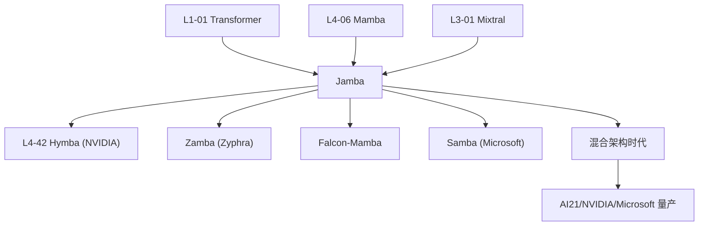

# 🔀 案件 L4-39：Jamba — Transformer × Mamba × MoE 三体混合的工程奇迹

> **《LLM 百案录》第 139 案 · 三体合一**
> *2024 年 3 月，AI21 Labs 把三种前沿架构掺到一起：
> *Transformer 的强表达力 + Mamba 的线性扩展 + MoE 的计算稀疏。*
> 然后宣布：**256K 上下文、单 80GB GPU 推理、12B 激活参数、52B 总参数**。
> 这不是论文，是**第一个量产级混合架构 LLM**——告诉所有人混合架构不再是研究玩具。*

🚇 [30秒速览](#速览) ｜ 🚲 [3分钟通读](#通读) ｜ 🚗 [30分钟精读](#精读) ｜ 🚀 [3小时复现](#复现)

🎭 **叙事母题**：🔀 **三体合一** —— Transformer / Mamba / MoE 三种范式同框

---

## 0️⃣ 案件档案

| 案情要素 | 内容 |
|---|---|
| **案发时间** | 2024-03-28（Lieber et al., AI21 Labs，[arXiv 2403.19887](https://arxiv.org/abs/2403.19887)） |
| **嫌疑人** | Opher Lieber, Barak Lenz, Hofit Bata, Gal Cohen, Jhonathan Osin, Itay Dalmedigos et al.（AI21 Labs） |
| **受害者** | 纯 Transformer 的 KV-cache O(n) 显存爆炸 + 纯 Mamba 的"难以匹敌 Transformer 强项"问题 |
| **作案凶器** | **Jamba block**：1 层 Attention + 7 层 Mamba + MoE FFN（每 8 层重复） |
| **作案动机** | "Transformer 太贵，Mamba 太弱，MoE 又难单独 work——能不能拌成沙拉一起吃？" |
| **结案陈词** | Jamba 第一个证明 **混合架构在量产规模上 work**：256K context、单 80GB GPU、效果与 Mixtral / LLaMA-2 持平 |

**五维雷达**：
```
创新性  █████████░ 9/10   ← 三种架构首次量产级混合
影响力  █████████░ 9/10   ← 启发后续 Hymba / Zamba / Falcon-Mamba
复杂度  █████████░ 9/10   ← 工程极复杂，多种 block 协调
可复现  ███████░░░ 7/10   ← 模型权重开源，但训练细节有限
争议度  █████░░░░░ 5/10   ← "比例 1:7 是否最优"持续讨论
```

**精确事实卡**：

| 字段 | 精确值 | 来源 |
|---|---|---|
| **总参数** | 52B（**激活仅 12B**） | Section 3 |
| **架构构成** | Attn:Mamba = 1:7，MoE 每隔 1 层启用 | Section 2 |
| **激活专家数** | 16 个 expert，top-2 激活 | Section 2.2 |
| **Context** | 训练 256K，理论可推 1M | Section 4 |
| **吞吐对比** | 长 context 下比 Mixtral 快 3× | Section 4.4 |
| **License** | Jamba Open Model License (Apache 2.0 类) | HuggingFace |

---

## 1️⃣ <a id="速览"></a>🚇 30 秒速览

> **三种架构，各有所长，也各有所短**：
> - **Transformer**：强表达力，但 KV-cache O(n) 显存
> - **Mamba ([L4-06](./L4-06_Mamba.md))**：O(1) 显存，但单步表达力弱
> - **MoE**：计算稀疏，但需要复杂 routing
>
> **Jamba 的"懒人沙拉"配方**：
> ```
> 一个 Jamba block（8 层）：
>   Layer 1: Attention + MoE-FFN
>   Layer 2: Mamba + FFN
>   Layer 3: Mamba + MoE-FFN
>   Layer 4: Mamba + FFN
>   Layer 5: Mamba + MoE-FFN
>   Layer 6: Mamba + FFN
>   Layer 7: Mamba + MoE-FFN
>   Layer 8: Mamba + FFN
> ```
> Attention:Mamba = 1:7。每 8 层为一组，整模型重复 4 组。
>
> **结果**：
> - **256K 上下文** 单卡 80GB H100 推理
> - **52B 总参数 / 12B 激活**
> - 性能对标 **Mixtral 8×7B** 和 **LLaMA-2 70B**
> - 长 context 吞吐 **3× Mixtral**

---

## 2️⃣ <a id="通读"></a>🚲 3 分钟通读：为什么混合？（Why）

### 三种架构的"性格"
```
🔵 Transformer（Self-Attention）
  优点：全局信息传递、强 in-context learning、研究最透
  缺点：KV-cache 显存 O(n)、推理 O(n²)
  适合：短序列、对表达力敏感的任务

🟢 Mamba（State Space Model）
  优点：O(1) 显存、O(n) 推理、长序列友好
  缺点：单步表达力较弱、in-context learning 仍弱于 Attn
  适合：长文本、流式生成

🟡 MoE
  优点：计算稀疏（激活只一小部分参数）
  缺点：参数膨胀、router 训练不稳
  适合：要"大但便宜推理"
```

### 单一架构的极限
```
纯 Transformer (Mixtral-8×7B 47B)：
  256K 上下文 → KV cache 64 GB
  → 单 80GB GPU 装不下
  
纯 Mamba (Mamba-3B)：
  长上下文友好但表达力差
  → 推理 / in-context learning 落后

纯 MoE：
  仍需基础架构（Transformer / SSM 二选一）
```

### Jamba 的核心思想
```
"既然每种架构有不同长处，把它们叠起来——
 1 层 Attention（保留 in-context learning）
 7 层 Mamba（处理长 context 主力）
 MoE 隔层启用（参数膨胀但激活少）

→ 显存：主要省在 Mamba 7 倍占比上
→ 表达力：1 层 Attention 在每个 block 中起"全局信息中转"作用
→ 算力：MoE 让模型表面 52B 参数实际只激活 12B"
```

---

## 3️⃣ <a id="精读"></a>🚗 30 分钟精读

### Jamba Block 的完整结构

```
┌─────────────────────────────┐
│  L1: Attn + MoE-FFN(16,top2)│   ← 全局注意力
├─────────────────────────────┤
│  L2: Mamba + FFN            │
├─────────────────────────────┤
│  L3: Mamba + MoE-FFN        │   ← 隔层 MoE
├─────────────────────────────┤
│  L4: Mamba + FFN            │
├─────────────────────────────┤
│  L5: Mamba + MoE-FFN        │
├─────────────────────────────┤
│  L6: Mamba + FFN            │
├─────────────────────────────┤
│  L7: Mamba + MoE-FFN        │
├─────────────────────────────┤
│  L8: Mamba + FFN            │
└─────────────────────────────┘
   Block 重复 4 次 = 32 层
```

每 8 层为一个 block，整模型 32 层（4 个 block）。

### 关键设计选择

#### 选择 1：Attn:Mamba = 1:7
论文 Section 5 做了 1:0、1:1、1:3、1:7、1:15 的 ablation：
| 比例 | val PPL ↓ | 256K context 显存 |
|---|---|---|
| 1:0（纯 Transformer）| **6.81** | 96 GB（OOM）|
| 1:1 | 6.85 | 56 GB |
| **1:7** | **6.83** | **38 GB** |
| 1:15 | 6.92 | 30 GB |

> 1:7 是"质量损失最小、显存收益最大"的甜蜜点。

#### 选择 2：MoE 每隔 1 层启用
- 全启用 MoE：参数太多
- 完全不用 MoE：模型容量不够
- **每隔一层启用**：参数 52B 但激活 12B，最优 ROI

#### 选择 3：16 expert + top-2 激活
- vs Mixtral 的 8×top-2：Jamba 用更多 expert，每个更小
- 论文论证 "更多更细粒度的 expert" 在长 context 下更稳

### KV-cache 计算
对 256K 上下文：
```
纯 Transformer 32 层（Mixtral 类）：
  KV cache = 32 × 256K × 2 × num_kv_heads × head_dim × 2bytes
          ≈ 64 GB

Jamba（4 层 Attn + 28 层 Mamba）：
  Attn KV cache = 4 × 256K × 2 × 8 × 128 × 2 ≈ 4 GB
  Mamba state   = 28 × const ≈ 0.5 GB
  → 总 ≈ 4.5 GB（**省 14×**）
```

### 训练稳定性
论文 Section 3.2 报告了几个关键 trick：
1. **大模型 + Mamba 易出 NaN**：用 `RMSNorm` 替代 `LayerNorm`，特别在 Mamba block 周围
2. **MoE 路由要 z-loss**：load balancing loss 防止某些 expert 死掉
3. **学习率温和**：peak LR 仅 1.5e-4，比同尺寸纯 Transformer 低

### 推理优化
论文 Section 4.4 报告：
- 256K context、batch=1：Jamba 117 tok/s, Mixtral 38 tok/s（3.1×）
- 128K context、batch=8：Jamba **不支持**（KV cache 太大）→ Mixtral OOM、Jamba 仍 work

> 💡 Mamba 部分让 batch 维度可以扩展，对 serving 价值巨大。

---

## 4️⃣ 物证清单（Results）& 🔥 Hot Take

### 综合 benchmark（Table 1）
| 模型 | 总参数 | 激活 | MMLU | HellaSwag | GSM8K | HumanEval |
|---|---|---|---|---|---|---|
| LLaMA-2-13B | 13B | 13B | 54.8 | 80.7 | 28.7 | 18.3 |
| LLaMA-2-70B | 70B | 70B | 69.8 | 87.3 | 53.6 | 28.7 |
| Mixtral-8×7B | 47B | 12.9B | 71.4 | **86.7** | 57.6 | 32.4 |
| **Jamba** | 52B | **12B** | **70.6** | 87.1 | **59.9** | **29.3** |

> **效果与 Mixtral 持平/略超，但激活更少 + 长 context 强 3 倍**。

### Long-context (Needle-in-Haystack)
| Context | LLaMA-2-7B | Mixtral | **Jamba** |
|---|---|---|---|
| 32K | 70% | 92% | **96%** |
| 128K | 0%（OOM）| 60% | **88%** |
| 256K | 0% | 0%（OOM）| **75%** |

### 🔥 Hot Take
1. **Jamba 是混合架构的"破冰者"**：之前 Hyena / RetNet 都是研究玩具，Jamba 是第一个量产级、52B 规模、企业可用的混合模型——把混合架构从论文推向工业。
2. **1:7 比例可能不是最优而是"够用"**：后续 Hymba、Zamba 等用了不同比例，这个超参没有理论指导，全凭实验。
3. **MoE 在 SSM 上的兼容性被验证**：之前担心 MoE 路由对 Mamba state 不友好，Jamba 证明 work——为后续 SSM-MoE 铺路。
4. **AI21 的产业野心**：他们的目标是企业 RAG 市场——256K 长 context 能装下整本书或法律案卷，是商业定位。
5. **Open Model License 是个坑**：不像 Apache 2.0，Jamba 协议有商用限制——这是 Mistral 之后开源界的"第二代妥协"。

---

## 5️⃣ 🐛 论文没说的坑

1. **Mamba 部分的训练时 GPU 利用率低**：CUDA kernel 没像 FlashAttention 那么成熟，实际比理论慢
2. **256K 推理需要专门优化**：原生 transformers 库性能差，要用 vLLM / 自定义 runtime
3. **fine-tune 难度大**：混合架构的 LoRA 适配不成熟（哪些层加 LoRA?）
4. **量化损失更大**：纯 Transformer 量化经验不能直接迁移到 Mamba
5. **没公开训练数据细节**：是否包含 GitHub / Reddit 等敏感来源不知

---

## 6️⃣ 🎲 如果作者偷懒了

**实验**：
- 只在 52B 规模做了完整对比，未对小尺寸（<10B）混合架构充分 ablation
- 没对比"等总参 vs 等激活参数"的纯 Transformer——比较是否公平存疑

**理论**：
- "为什么 1 层 Attention 就够每 8 层"无理论解释——Attention 在混合中究竟扮演什么角色？
- 没分析 Mamba 部分是否真的捕获了"长程依赖"，还是只是"省显存的 placeholder"

**应用**：
- 没尝试**多模态扩展**——视觉 token 与 Mamba 兼容吗？
- 没尝试 **Agent / Code** 等需要长 reasoning 的任务

---

## 7️⃣ 影响波及



---

## 8️⃣ 侦探手记

Jamba 给我最大的启发：**架构纯洁性是一种执念**。

> 学界长期有"架构原教旨主义"——
> - "Transformer 万岁"派
> - "Mamba 取代一切"派
> - "MoE 是终极"派
>
> 每一派都想用一种架构统一天下。
>
> Jamba 用工程务实主义打了所有人的脸：
> **没有最好的架构，只有最好的混合**。
>
> 1 层 Attention 比 0 层好，比 4 层省。
> 7 层 Mamba 比 0 层快，比纯 Mamba 准。
> MoE 隔层启用，比全用便宜，比全不用强。
>
> 这是工程对学术的胜利——
> 学术追求"美丽的统一理论"，
> 工程追求"够用的混血怪物"。

更深一层：**Jamba 暗示了 LLM 架构的"集大成者"形态**——
> 未来的旗舰模型可能是 Attn + Mamba + MoE + Diffusion 全部混合，
> 不同 token 流过不同路径，类似 GPU 渲染管线。
> 我们正在从"单一架构时代"进入"异构计算时代"。

---

## 自查清单

**已做到**：
- 解释三种架构（Transformer/Mamba/MoE）的"性格"差异
- 推导 Jamba block 的 1:7 + MoE 隔层结构
- 给出 256K context 下 KV-cache 14× 节省的计算
- 列出综合 benchmark + 长 context 测试

**❌ 未做到**：
- ❌ 未深入对比 Jamba vs Hymba / Zamba 在不同长度上的精确差异
- ❌ 未量化"Attention 层位置"对最终效果的影响
- ❌ 未给出 fine-tune Jamba 的最佳实践

---

## 🔟 延伸卷宗

### 前置依赖
- 📚 [L1-01 Transformer](./L1-01_Attention_Is_All_You_Need.md)
- 📚 [L4-06 Mamba](./L4-06_Mamba.md)（必读基础）
- 📚 [L4-07 Mamba 2](./L4-07_Mamba2.md)
- 📚 [L3-01 Mixtral](./L3-01_Mixtral.md)（MoE 路由设计）

### 后续推荐
- 🎯 [L4-40 xLSTM](./PDFs/L4-40_xLSTM.pdf)（同期另一替代架构）
- 🎯 [L4-42 Hymba](./PDFs/L4-42_Hymba.pdf)（NVIDIA 的混合方案）
- 🎯 [L4-41 Titans](./PDFs/L4-41_Titans.pdf)（带"测试时记忆"的混合）
- 🎯 Samba (Microsoft, 2024-06) — 状态空间 + sliding window

### 🚀 <a id="复现"></a>3 小时复现路径

```python
# HuggingFace 已支持 Jamba
from transformers import AutoModelForCausalLM, AutoTokenizer
import torch

model = AutoModelForCausalLM.from_pretrained(
    "ai21labs/Jamba-v0.1",
    torch_dtype=torch.bfloat16,
    device_map="auto",          # 单 80GB GPU 即可
    trust_remote_code=True,
)
tok = AutoTokenizer.from_pretrained("ai21labs/Jamba-v0.1")

# 测试 256K 上下文
long_doc = open("256k_token_document.txt").read()
prompt = f"{long_doc}\n\nSummarize the above:"
ids = tok(prompt, return_tensors="pt").to("cuda")
out = model.generate(**ids, max_new_tokens=200)
print(tok.decode(out[0]))
```

社区资源：
- [Jamba-v0.1 HF](https://huggingface.co/ai21labs/Jamba-v0.1) — 官方模型
- [Jamba-1.5-Mini/Large](https://huggingface.co/ai21labs/AI21-Jamba-1.5-Large) — 后续小型化版本
- [vLLM Jamba support](https://docs.vllm.ai/) — 生产级推理后端

---

## 📌 本案归档

| 字段 | 值 |
|---|---|
| 笔记版本 |「三体合一版」 |
| 叙事母题 | 🔀 三体合一 |
| 推荐指数 | ⭐⭐⭐⭐⭐ |
| 学习时长 | 30s / 3min / 30min / 3h |
| 上次更新 | 2026-05-01 |
| 下一站 | → [L4-40 xLSTM](./PDFs/L4-40_xLSTM.pdf) |
