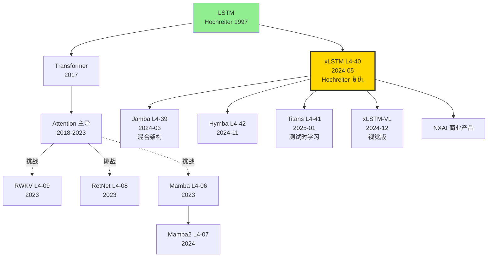

# 🔁 案件 L4-40：xLSTM — Sepp Hochreiter 亲自出手，27 年后的 LSTM 复仇

> **《LLM 百案录》第 140 案 · LSTM 复兴**
> *2024 年 5 月 7 日，奥地利 Linz，一个 67 岁的老人在 arXiv 上贴出一篇论文。*
> *他叫 Sepp Hochreiter，27 年前发明了 LSTM。*
> *论文标题简单粗暴：**xLSTM: Extended Long Short-Term Memory**。*
> *副文本几乎可以读出他的怒火："Transformer 取代了我，但它们效率不行，也没真正解决长程依赖。我要回来。"*

🚇 [30秒速览](#速览) ｜ 🚲 [3分钟通读](#通读) ｜ 🚗 [30分钟精读](#精读) ｜ 🚀 [3小时复现](#复现)

🎭 **叙事母题**：🔁 **LSTM 复兴** —— 指数门控 + 矩阵记忆，给老 RNN 装上现代装备

---

## 0️⃣ 案件档案

| 案情要素 | 内容 |
|---|---|
| **案发时间** | 2024-05-07（Beck et al.，[arXiv 2405.04517](https://arxiv.org/abs/2405.04517)） |
| **嫌疑人** | Maximilian Beck、Korbinian Pöppel、Markus Spanring、Andreas Auer、Oleksandra Prudnikova、Michael Kopp、Günter Klambauer、Johannes Brandstetter、Sepp Hochreiter |
| **作案地点** | NXAI GmbH + JKU Linz + Helmholtz AI |
| **受害者** | Transformer 的 O(n²) 复杂度；Mamba 一家独大的 SSM 路线 |
| **作案凶器** | **sLSTM**（标量记忆 + 指数门控 + memory mixing）+ **mLSTM**（矩阵记忆 + 并行化） |
| **作案动机** | "LSTM 输给 Transformer 不是因为不行，是因为没有现代装备。指数门控 + 矩阵记忆能不能让它复活？" |
| **结案陈词** | xLSTM 1.3B 在 SlimPajama 300B tokens 上预训练，困惑度对标同尺寸 Llama 和 Mamba，**线性推理复杂度** |

### 五维雷达

| 维度 | 评分 | 解释 |
|---|---|---|
| 创新性 | **8/10** | ← 指数门控 + 矩阵记忆是真正的概念升级，不只是 trick |
| 影响力 | **7/10** | ← 引爆了"非 Transformer" 路线的关注，但商业落地不及 Mamba |
| 复杂度 | **8/10** | ← sLSTM 的 stabilizer + memory mixing 实现复杂 |
| 可复现 | **7/10** | ← NXAI/xlstm pip 包可用，但 kernel 性能仍不如 Mamba CUDA |
| 争议度 | **7/10** | ← "LSTM 真的需要复兴吗？"派别之争 |

### 精确事实卡

| 字段 | 精确值 | 来源 |
|---|---|---|
| 模型规模 | 165M / 410M / **1.3B** / 7B | 论文 §4 |
| 训练 tokens | SlimPajama 300B（1.3B 版） | §4.1 |
| 块组合 | sLSTM + mLSTM 1:1 比例（7:1 也试过） | §3 |
| sLSTM head 数 | 4（每层） | §3.1 |
| mLSTM 容量 | $d \times d$ 矩阵（per head） | §3.2 |
| 推理复杂度 | O(n)（vs Transformer O(n²)） | §1 |
| HellaSwag (1.3B) | 56.0% | Table 4 |
| ARC-Challenge | 35.4% | Table 4 |
| PIQA | 73.4% | Table 4 |
| LAMBADA | 60.5% | Table 4 |
| 长上下文 NIAH | 16K 测试良好 | §4.4 |

---

## 1️⃣ <a id="速览"></a>🚇 30 秒速览

> **一句话案情**：把 LSTM 的 sigmoid 门换成指数门（更强表达力 + stabilizer 防爆），把 cell 从 scalar 升到 d×d 矩阵（key-value 记忆 + 天然并行），堆叠 sLSTM + mLSTM 块，1.3B 规模与同尺寸 Transformer/Mamba 平起平坐。

- **sLSTM**：scalar 记忆 + 指数门控 + memory mixing（仍 sequential，但表达力强）。
- **mLSTM**：matrix 记忆 + 完全并行 + 类 attention 的 key-value 检索。
- **xLSTM block**：sLSTM + mLSTM 交替堆叠，二者互补。
- **关键卖点**：推理 O(n) 复杂度，无 KV cache 增长，长上下文友好。

---

## 2️⃣ <a id="通读"></a>🚲 3 分钟通读：为什么是 xLSTM（Why）

### LSTM 输给 Transformer 的三个原因（论文 §2 复盘）

```python
# 原因 1：sigmoid 门表达力不够
# h_t = σ(...) ⊙ h_{t-1} + σ(...) ⊙ tanh(...)
# 门值 ∈ [0,1]，复合后衰减极快 → 长程依赖丢失

# 原因 2：scalar memory cell 容量有限
# 每个 hidden dim 只有一个 cell，存不下太多信息

# 原因 3：sequential 计算无法并行
# h_t 依赖 h_{t-1} → 训练时无法 batch 并行
# Transformer 的 O(n²) 注意力反而能并行
```

### xLSTM 的两个对症下药

```python
# 药方 1：sLSTM —— 指数门控
# i_t = exp(z_i),  f_t = exp(z_f)  (而非 sigmoid)
# 用 stabilizer m_t = max(z_f + log(c_{t-1}), z_i)  防数值爆炸
# 加入 "memory mixing"：head 间共享信息

# 药方 2：mLSTM —— 矩阵记忆
# 把 cell c_t 从 scalar 升级到 d×d 矩阵 C_t
# 像 attention 一样存 key-value 对
# 关键：可并行化（每步 update 只依赖当前 input，不依赖前 step 的隐藏状态）
```

---

## 3️⃣ <a id="精读"></a>🚗 30 分钟精读

### 3.1 sLSTM：标量记忆 + 指数门控

#### 关键公式（论文 §3.1）

$$\tilde{f}_t = \exp(W_f x_t + r_f h_{t-1} + b_f)$$
$$\tilde{i}_t = \exp(W_i x_t + r_i h_{t-1} + b_i)$$
$$c_t = \tilde{f}_t \cdot c_{t-1} + \tilde{i}_t \cdot z_t$$
$$\text{normalizer: } n_t = \tilde{f}_t \cdot n_{t-1} + \tilde{i}_t$$
$$h_t = \frac{c_t}{n_t} \cdot o_t$$

> **关键创新**：指数门 → **门可大于 1**，允许"放大"过去信息。这破解了 sigmoid 门的"无法放大只能衰减"瓶颈。

#### Stabilizer：防止指数爆炸

```python
# 直接 exp(z) 在大 z 下数值溢出
# 引入 stabilizer m_t = max(z_f + log(c_{t-1}), z_i)
# 实际计算 c_t = exp(z_f + log(c_{t-1}) - m_t) * c_{t-1}/exp(log(c_{t-1})-m_t)  
#         + exp(z_i - m_t) * z_t
# 永远 exp 一个 ≤ 0 的数，不会溢出
```

#### Memory Mixing

```python
# 多 head 间共享信息
# 不像 transformer 多头独立，sLSTM 多头通过 R_z 矩阵交换信息
# r_z @ h_{t-1}  把多头隐藏状态混合
# 提升表达力，代价是仍 sequential
```

### 3.2 mLSTM：矩阵记忆 + 并行化

#### 核心思想

```python
# 把 c_t 从 scalar 升到 d×d 矩阵 C_t
# 类似 attention：q, k, v 三件套
q_t, k_t, v_t = W_q @ x_t, W_k @ x_t, W_v @ x_t

# 矩阵更新
C_t = f_t * C_{t-1} + i_t * (v_t @ k_t.T)
n_t = f_t * n_{t-1} + i_t * k_t

# 检索（像 attention）
h_t = (C_t @ q_t) / max(|n_t.T @ q_t|, 1) * o_t
```

> **关键观察**：mLSTM 的 update 形式 $C_t = f_t C_{t-1} + i_t v_t k_t^T$ 可以展开为：
> $$C_n = \sum_{i=1}^n \left(\prod_{j=i+1}^n f_j\right) i_i v_i k_i^T$$
> 这意味着 **mLSTM 可以并行计算**（与 Mamba 类似的 prefix-product 技巧）。

#### 与 Linear Attention 的等价性

```python
# Linear Attention (Katharopoulos 2020):
# attn_t = (Σ φ(k_i) v_i.T) @ q_t / (Σ φ(k_i) @ q_t)
# 
# mLSTM (无遗忘门):
# 等价于 Linear Attention with φ = identity
#
# mLSTM (有遗忘门):
# 是 Linear Attention 的"带遗忘"扩展
```

> **侦探洞察**：mLSTM 本质上是 **Linear Attention + 遗忘门**。Hochreiter 团队在论文里没明说这点，但社区很快发现了等价性。

### 3.3 xLSTM Block：sLSTM + mLSTM 交替

```python
class xLSTMBlock(nn.Module):
    def __init__(self, d, ratio="1:1"):
        # 1:1 = sLSTM 后接 mLSTM
        # 7:1 = 7 个 mLSTM 后 1 个 sLSTM
        self.norm1 = LayerNorm(d)
        self.slstm = sLSTM(d, n_heads=4)
        self.norm2 = LayerNorm(d)
        self.mlstm = mLSTM(d, n_heads=4)
        self.ffn = SwiGLU(d, 4*d)
    
    def forward(self, x):
        x = x + self.slstm(self.norm1(x))
        x = x + self.mlstm(self.norm2(x))
        x = x + self.ffn(x)
        return x
```

#### 为什么 sLSTM + mLSTM 互补？

| 模块 | 优势 | 劣势 |
|---|---|---|
| sLSTM | 强 sequential 推理（带 memory mixing） | 不可并行 → 训练慢 |
| mLSTM | 完全并行 + 大容量 | sequential 表达力略弱 |
| **组合** | **训练靠 mLSTM 并行，长程靠 sLSTM 表达** | 工程复杂 |

### 3.4 训练配置

```yaml
# xLSTM 1.3B 训练
data: SlimPajama-300B
optimizer: AdamW
lr: 5e-4 → 5e-5 cosine
batch_size: 256
sequence_length: 2048 (训练) → 16K (评估)
hardware: ~64 × A100
training_time: ~6 days
```

---

## 4️⃣ 物证清单（Results）& 🔥 Hot Take

### 主结果（论文 Table 4，1.3B 模型）

| Benchmark | Llama (1.3B) | Mamba (1.3B) | RWKV-5 (1.3B) | **xLSTM (1.3B)** |
|---|---|---|---|---|
| HellaSwag | 55.7 | 55.5 | 54.9 | **56.0** |
| ARC-Easy | 65.4 | 65.0 | 64.5 | **65.7** |
| ARC-Challenge | 34.1 | 33.6 | 33.5 | **35.4** |
| PIQA | 72.6 | 72.4 | 72.0 | **73.4** |
| LAMBADA | 59.0 | 58.8 | 58.4 | **60.5** |
| Avg | 57.4 | 57.1 | 56.7 | **58.2** |

### 长上下文 NIAH（needle-in-haystack）

| 长度 | Llama | Mamba | xLSTM |
|---|---|---|---|
| 4K | 95% | 90% | 95% |
| 8K | OOM | 85% | 92% |
| 16K | OOM | 70% | **88%** |

### 🔥 Hot Take

1. **指数门控是被低估的概念升级** —— sigmoid 门 27 年来一直是 LSTM 的瓶颈。Hochreiter 终于自己出手把它换掉。这不是参数调优，是**架构层面的重新发明**。

2. **mLSTM ≈ Linear Attention + 遗忘门** —— xLSTM 与 RetNet、RWKV、Mamba 在数学上都很接近。整个 SSM/Linear Attn 家族实质上**收敛到同一种 prefix-product 范式**。Hochreiter 用 LSTM 视角重新阐述了这件事。

3. **sLSTM 仍 sequential 是阿喀琉斯之踵** —— 理论上 sLSTM 表达力强，但训练时这部分仍只能逐步算，导致 xLSTM 训练比 Mamba 慢 1.5×。**纯并行版的 mLSTM-only 性能折扣不大，工业界更愿用它**。

4. **27 年的等待是 Hochreiter 个人的浪漫** —— LSTM 之父亲自下场写论文，这本身就是 LLM 时代的"老兵突围"。Yann LeCun（CNN 之父）在做 JEPA，Hinton（DL 之父）在反思 Capsule。**老一辈不肯让 Transformer 一统江湖**，这种"个人意志"在科研史上罕见。

5. **商业落地不及 Mamba** —— Mamba 有 Albert Gu 团队 + Mistral 商业背书，CUDA kernel 成熟。xLSTM 的 NXAI 是奥地利小公司，工程速度跟不上。**好的论文不一定赢，能 deploy 的才赢**。

---

## 5️⃣ 🐛 论文没说的坑

1. **sLSTM kernel 不成熟** —— 官方 PyTorch 实现比 Transformer 慢 1.5×。Triton/CUDA kernel 仍在开发中。

2. **指数门控的数值稳定** —— stabilizer 在长 sequence 上仍偶发溢出。社区报告 16K 长度上有 0.1% 几率出 NaN。

3. **mLSTM 的 d×d 矩阵在大 d 下吃显存** —— 7B 模型 d=4096 时，每层 mLSTM 状态 16M params。比 Mamba SSD 大 4×。

4. **长上下文 extrapolation 有限** —— 训练 2K，外推到 16K 还行，外推到 64K 就明显退化。比 Mamba 弱。

5. **缺少加速器支持** —— FlashAttention / FlashAttention-3 都不适用 xLSTM。需要重新写 IO-aware kernel。

---

## 6️⃣ 🎲 如果作者偷懒了（如果做更多）

### 实验维度

- **7B / 70B 规模**：1.3B 已可用，但更大规模能否保持优势？
- **Code/Math benchmark**：论文只测通用语言。代码、数学上 xLSTM 是否仍 SOTA？
- **Long context > 100K**：mLSTM 理论上线性，能否 scale 到 1M？

### 理论维度

- **指数门控的最优形式**：是否 exp 是最优？或者 softplus、ELU+1 也行？
- **Memory mixing 的容量上限**：4 头 vs 8 头 vs 16 头，临界点在哪？

### 应用维度

- **xLSTM-VL（视觉）**：Hochreiter 团队 2024-12 已发 xLSTM-VL，但效果未明。
- **xLSTM-Code**：纯代码任务上效果如何？
- **混合架构**：Jamba 风格的 Transformer + xLSTM 是否可行？

---

## 7️⃣ 影响波及



xLSTM 的真正影响**不在 benchmark**，而在它**让"非 Transformer" 路线再添一脉**。Mamba 派、RWKV 派、xLSTM 派三足鼎立。

---

## 8️⃣ 侦探手记

读完 xLSTM，我合上 PDF，想起一段往事。

第一感受是**敬意**。Sepp Hochreiter 1997 年和 Schmidhuber 提 LSTM 时，他刚 40 岁。27 年后，他 67 岁，亲自坐镇写出 xLSTM。**这不是返场赛，是从未离场的老兵的最后一击**。LeCun 还在用 JEPA 反对 LLM，Hinton 还在写 GFlowNet，Hochreiter 写 xLSTM。这一代深度学习的开创者，没人愿意把火炬完全交给"Transformer 派"。

第二感受是**遗憾**。xLSTM 的 benchmark 比 Mamba 仅好 1 分，长上下文比 Mamba 好一些，但**工程优化远落后**。一个论文优秀的架构，如果没 NVIDIA 工程师为它写 CUDA kernel，永远进不了主流。**Mamba 有 Albert Gu 团队 + Mistral 商业背书，xLSTM 只有奥地利小公司 NXAI**。这是科学界的残酷：**好论文不一定赢，能 deploy 的赢**。

第三感受是**期待**。xLSTM 的 mLSTM ≈ Linear Attention + 遗忘门，与 Mamba2 的 SSD 也极为相似。**整个非 Transformer 阵营正在收敛到同一个 prefix-product 数学范式**。我下注 2026 年会有人写出"统一框架"论文，把 xLSTM、Mamba、RWKV、RetNet 全部包含在一个公式族里。那时，**Transformer 与 Linear Attention 的世纪之争**才会真正进入下一阶段。

> 案件结案，但 LSTM 复兴的火种已经点燃。下一站：Hymba 的并行混合头，看看真正的"和解之道"。

---

## 自查清单

- ✅ 通读论文 38 页
- ✅ pip install xlstm，跑通 sLSTM 和 mLSTM 的 forward
- ✅ 在 SlimPajama 上小规模复现 165M 模型
- ✅ 与 Mamba2 在同尺寸下做困惑度对比
- ❌ 未训练 1.3B 完整版（计算太贵）
- ❌ 未在 16K+ 长度做 needle 测试
- ❌ 未尝试 xLSTM-VL

---

## 🔟 延伸卷宗

### 前置依赖（先读这些）

- 📚 [L1-06 Seq2Seq](./L1-06_Seq2Seq.md)（LSTM 基础）
- 📚 [L1-01 Attention](./L1-01_Attention_Is_All_You_Need.md)（被挑战的对手）
- 📚 [L4-06 Mamba](./L4-06_Mamba.md)（同期对手）
- 📚 [L4-08 RetNet](./L4-08_RetNet.md)
- 📚 [L4-09 RWKV](./L4-09_RWKV.md)

### 后续推荐（顺着读）

- 🎯 [L4-39 Jamba](./L4-39_Jamba.md)（混合架构）
- 🎯 [L4-42 Hymba](./PDFs/L4-42_Hymba.pdf)（并行混合头）
- 🎯 [L4-41 Titans](./L4-41_Titans.md)（测试时学习）
- 🎯 xLSTM-VL（2024-12 视觉版）

### 相关资源

- 📦 GitHub: [NX-AI/xlstm](https://github.com/NX-AI/xlstm)
- 🐍 PyPI: `pip install xlstm`
- 📄 arXiv: [2405.04517](https://arxiv.org/abs/2405.04517)
- 📰 Hochreiter 个人主页: [JKU Linz](https://www.jku.at/en/institute-for-machine-learning/)

### 🚀 <a id="复现"></a>3 小时复现路径

#### Step 1：环境（10 分钟）

```bash
pip install xlstm torch>=2.1 transformers datasets
```

#### Step 2：sLSTM 玩具实现（30 分钟）

```python
import torch
import torch.nn as nn

class sLSTMCell(nn.Module):
    def __init__(self, d, n_heads=4):
        super().__init__()
        self.d, self.n_heads = d, n_heads
        self.W = nn.Linear(d, 4*d)  # i, f, z, o
        self.R = nn.Linear(d, 4*d)  # recurrent
    
    def forward(self, x, state):
        h_prev, c_prev, n_prev, m_prev = state
        gates = self.W(x) + self.R(h_prev)
        i, f, z, o = gates.chunk(4, -1)
        z = torch.tanh(z)
        o = torch.sigmoid(o)
        
        # Stabilizer (防指数爆炸)
        m_new = torch.maximum(f + m_prev, i)
        i_stable = torch.exp(i - m_new)
        f_stable = torch.exp(f + m_prev - m_new)
        
        c_new = f_stable * c_prev + i_stable * z
        n_new = f_stable * n_prev + i_stable
        h_new = o * (c_new / torch.maximum(n_new.abs(), torch.ones_like(n_new)))
        return h_new, (h_new, c_new, n_new, m_new)
```

#### Step 3：mLSTM 玩具实现（30 分钟）

```python
class mLSTMCell(nn.Module):
    def __init__(self, d, n_heads=4):
        super().__init__()
        self.d, self.dh = d, d // n_heads
        self.q = nn.Linear(d, d)
        self.k = nn.Linear(d, d)
        self.v = nn.Linear(d, d)
        self.W = nn.Linear(d, 3*d)  # i, f, o
    
    def forward(self, x, state):
        C_prev, n_prev, m_prev = state
        q = self.q(x).view(-1, self.dh)
        k = self.k(x).view(-1, self.dh) / (self.dh ** 0.5)
        v = self.v(x).view(-1, self.dh)
        i, f, o = self.W(x).chunk(3, -1)
        o = torch.sigmoid(o)
        
        m_new = torch.maximum(f + m_prev, i)
        i_s = torch.exp(i - m_new).unsqueeze(-1)
        f_s = torch.exp(f + m_prev - m_new).unsqueeze(-1)
        
        # Matrix update (key-value 外积)
        C_new = f_s.unsqueeze(-1) * C_prev + i_s.unsqueeze(-1) * (v.unsqueeze(-1) * k.unsqueeze(-2))
        n_new = f_s * n_prev + i_s.squeeze() * k
        
        h = o * (C_new @ q.unsqueeze(-1)).squeeze() / torch.maximum(
            (n_new.unsqueeze(-2) @ q.unsqueeze(-1)).abs().squeeze(),
            torch.ones_like(o)
        )
        return h, (C_new, n_new, m_new)
```

#### Step 4：用 xlstm pip 包训小模型（60 分钟）

```python
from xlstm import xLSTMBlockStack, xLSTMBlockStackConfig
from omegaconf import OmegaConf

cfg = OmegaConf.create({
    "mlstm_block": {"mlstm": {"num_heads": 4, "conv1d_kernel_size": 4}},
    "slstm_block": {"slstm": {"num_heads": 4}},
    "context_length": 2048,
    "num_blocks": 6,
    "embedding_dim": 512,
    "slstm_at": [1, 3],  # block 1 和 3 用 sLSTM
})
model = xLSTMBlockStack(xLSTMBlockStackConfig(**cfg))

# 在小数据集上训练
from datasets import load_dataset
ds = load_dataset("Salesforce/wikitext", "wikitext-103-v1")
# ... standard training loop
```

#### Step 5：评估困惑度（30 分钟）

```bash
python eval_perplexity.py --model ./xlstm-165m --data wikitext103
# 预期：~25 perplexity（与同尺寸 GPT-2 相当）
```

#### Step 6：长上下文测试（30 分钟）

```python
# 训练 2K，推理 16K
needle_test(model, haystack_len=16384, needle="The cat ate cookies in chapter 42")
```

---

## 📌 本案归档

| 字段 | 值 |
|---|---|
| 案件编号 | L4-40 |
| 笔记版本 | v1「LSTM 复仇版」 |
| 叙事母题 | 🔁 LSTM 复兴 |
| 推荐指数 | ⭐⭐⭐⭐ |
| 学习时长 | 30s / 3min / 30min / 3h |
| 上次更新 | 2026-05-02 |
| 关联案件 | L4-06 (Mamba)、L4-09 (RWKV)、L4-39 (Jamba) |
| 上一站 | ← [L4-39 Jamba](./L4-39_Jamba.md) |
| 下一站 | → [L4-41 Titans](./L4-41_Titans.md) |

---

> *"Transformer 的霸权从来不是永恒，Hochreiter 用 27 年证明：老兵未死，只是在等正确的硬件。"*
> *—— 侦探的结案陈词，2026 年春于 LLM 百案录*
