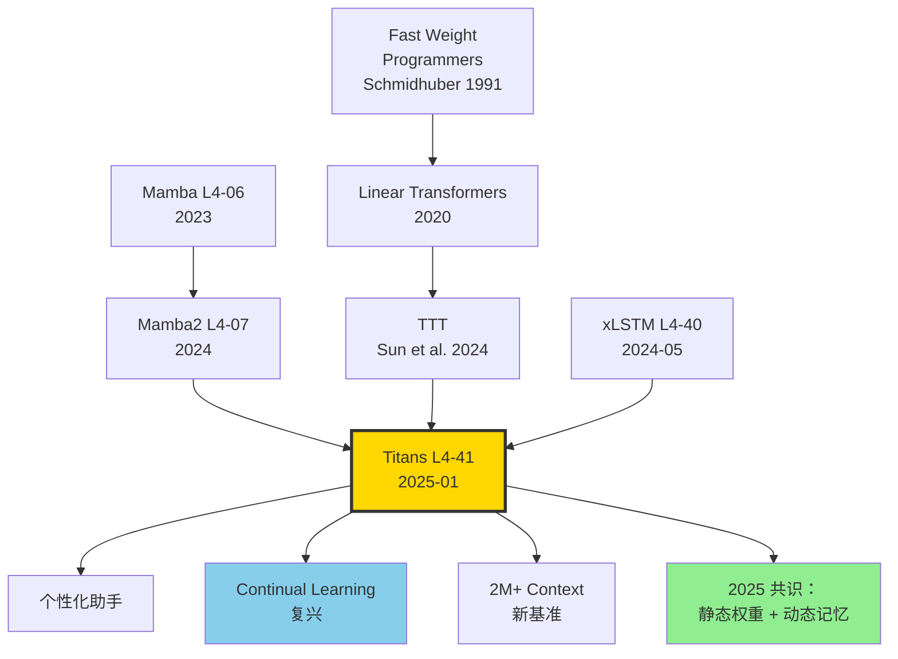

# 🏛️ 案件 L4-41：Titans — 让神经网络在"测试时"也持续学习

> **《LLM 百案录》第 141 案 · 测试时记忆训练**
> *2025 年 1 月 1 日，新年第一天。Google Research 给 LLM 圈拜了个有点惊悚的早年：*
> *"我们让神经网络在**推理时**也持续学习——见到惊讶的输入，模型当场更新自己。"*
> *论文标题致敬古神：**Titans**。三种集成方式 MAC / MAG / MAL，三层记忆短期 + 长期 + 持久——**从 Transformer 到具有"在线学习"能力的混合架构**。*

🚇 [30秒速览](#速览) ｜ 🚲 [3分钟通读](#通读) ｜ 🚗 [30分钟精读](#精读) ｜ 🚀 [3小时复现](#复现)

🎭 **叙事母题**：🏛️ **测试时学习 · 三层记忆** —— 短期注意、长期可更新、持久先验，各司其职

---

## 0️⃣ 案件档案

| 案情要素 | 内容 |
|---|---|
| **案发时间** | 2025-01-01（Behrouz et al.，[arXiv 2501.00663](https://arxiv.org/abs/2501.00663)） |
| **嫌疑人** | Ali Behrouz、Peilin Zhong、Vahab Mirrokni |
| **作案地点** | Google Research |
| **受害者** | "权重训练完就冻结" 的传统范式；Mamba/Transformer 长上下文容量有限的现实 |
| **作案凶器** | **Neural Long-term Memory (LMM)** —— 一个小 MLP，在推理时用"惊奇度 surprise = ‖∇ℓ‖" 作为信号在线学习；**三种集成方式**：MAC、MAG、MAL；**Persistent Memory** 作为任务无关先验 |
| **作案动机** | "人脑有 STM/LTM/PTM 三套系统，为什么 LLM 只有 attention？把记忆分层，模型才像大脑。" |
| **结案陈词** | Titans 760M 在 needle-in-haystack > 2M 上下文中接近 100%；语言建模对标 Mamba2 和 Transformer++；时间序列预测显著超越 baseline |

### 五维雷达

| 维度 | 评分 | 解释 |
|---|---|---|
| 创新性 | **9/10** | ← 在线 surprise-driven 更新是真正的范式创新 |
| 影响力 | **8/10** | ← 引爆 2025 "test-time training" 热度，激发 continual learning 复兴 |
| 复杂度 | **9/10** | ← LMM 训练并行化困难，三种集成方式实现复杂 |
| 可复现 | **6/10** | ← Google 内部代码未完全开源，社区复现仍在进行 |
| 争议度 | **6/10** | ← 与 TTT (Sun et al. 2024) 的关系；"persistent memory"是不是只是 prefix tuning |

### 精确事实卡

| 字段 | 精确值 | 来源 |
|---|---|---|
| Titans 变体 | MAC（Memory as Context）、MAG（as Gate）、MAL（as Layer） | 论文 §4 |
| 主测模型规模 | 170M / **760M** / 7B | §6 |
| 对照模型 | Transformer++、Mamba、Mamba2、DeltaNet | §6 |
| 上下文长度 | 训练 4K / 评估 2M+ | §6.4 |
| LMM 架构 | 2 层 MLP + Layer Norm | §3.1 |
| LMM 更新规则 | momentum + weight decay (Adam-like) | §3.1 |
| Surprise 信号 | ‖∇_θ ℓ(x)‖（per-token gradient norm） | §3.1 |
| 时间序列 ETT-h1 MSE | 0.359（Titans）vs 0.387（best baseline） | Table 5 |
| BABILong 100K | Titans 64.0 vs GPT-4 27.0 vs Mamba2 28.7 | Table 4 |
| NIAH 2M context | ~100% recall | §6.4 |

---

## 1️⃣ <a id="速览"></a>🚇 30 秒速览

> **一句话案情**：在 Transformer 之外加一个小 MLP 当"长期记忆"，推理时这个 MLP 也在更新——遇到惊讶的输入（梯度大），就当场学一下。三种方式把 LMM 拼到主模型里：当上下文（MAC）、当门（MAG）、当一层（MAL）。

- **三层记忆**：(1) **STM** = self-attention 短上下文，(2) **LTM** = neural memory 推理时学习，(3) **PTM** = 可学习参数作为任务无关先验。
- **关键算法**：每个 token 都把"惊奇度"（gradient norm of LMM loss）当信号更新 LMM。
- **三种集成**：MAC（memory tokens 拼在 context 前）、MAG（用 memory output 做 gate）、MAL（memory 作为独立 layer）。
- **杀手 benchmark**：BABILong 100K 长度上 Titans 64% 完虐 GPT-4 27% 和 Mamba2 28%。

---

## 2️⃣ <a id="通读"></a>🚲 3 分钟通读：为什么是 Titans（Why）

### 时代背景：长上下文的两条死胡同

```text
2017  Transformer       O(n²) 显存爆炸
2023  Mamba             O(n) 但容量瓶颈
2024  Hymba/Jamba       混合，但仍是静态权重
2024-12 TTT (Sun et al.) 测试时训练，启发 Titans
2025-01 Titans           三层记忆 + LMM
```

### 三个动机

```python
# 动机 1：上下文不是越长越好
# 1M context 看似强，但 attention O(n²) 爆显存
# Mamba O(n) 线性，但 SSM 状态容量太小，存不下 1M 信息

# 动机 2：人脑不是这样工作的
# STM (working memory) ~ 7 items
# LTM (long-term memory) ~ 巨大、可不断更新
# 两者互补，并非"超长 attention"

# 动机 3：测试时为什么不能学习？
# 预训练把通用知识塞进权重
# 推理时遇到新 domain/用户，权重却完全冻结
# 浪费了在线学习的机会
```

### Titans 的灵感来源

> **观察**：人遇到惊讶的事情，会重点记住——大脑的 LTM 更新依赖"surprise" 信号。
>
> **类比**：神经网络的 surprise 可以用 **梯度 norm** 度量——某个 token 让 loss 暴涨，那它就值得记。

---

## 3️⃣ <a id="精读"></a>🚗 30 分钟精读

### 3.1 Neural Long-term Memory (LMM)

#### 核心架构

```python
class LMM(nn.Module):
    """LMM 是一个小 MLP，在推理时持续更新"""
    def __init__(self, d_in, d_hidden=512):
        super().__init__()
        self.net = nn.Sequential(
            nn.Linear(d_in, d_hidden),
            nn.SiLU(),
            nn.Linear(d_hidden, d_in),
        )
        self.M = self.net.parameters()  # 这些参数会在推理时更新！
        # 优化器状态（推理时维护）
        self.momentum = {p: torch.zeros_like(p) for p in self.M}
    
    def retrieve(self, q):
        """前向：用当前 memory M 检索"""
        return self.net(q)  # 没有梯度记录
    
    def update(self, k_t, v_t, lr=0.01, momentum=0.9, decay=0.01):
        """根据 surprise 更新 memory（关键！）"""
        # 计算 reconstruction loss（associative memory 视角）
        with torch.enable_grad():
            pred_v = self.net(k_t)
            loss = ((pred_v - v_t) ** 2).mean()
            loss.backward()  # 计算 LMM 梯度
        
        # 用 momentum + weight decay 更新 LMM
        for p in self.M:
            self.momentum[p] = momentum * self.momentum[p] + p.grad
            p.data = (1 - decay) * p.data - lr * self.momentum[p]
            p.grad.zero_()
```

> **侦探洞察**：LMM 用 **associative memory loss** $\| f_\theta(k_t) - v_t \|^2$ 而非任务 loss 来更新。这意味着 LMM 学的是"**键值映射**"，本质是**可微版的字典**。

#### Surprise 信号

```python
# 论文 §3.1 定义：
# surprise(x_t) = ‖∇_θ ℓ_associative(M_{t-1}, x_t)‖

# 大梯度 → x_t 很惊讶 → 重点学
# 小梯度 → x_t 已熟悉 → 略过

# Titans 用 momentum + weight decay 模拟"遗忘 vs 巩固"
# - momentum：让 surprise 跨 token 累积
# - decay：旧记忆缓慢衰减
```

### 3.2 三种集成方式

#### MAC: Memory as Context

```python
def mac_forward(self, x):
    # 1. 从 LMM 检索"长期记忆 tokens"
    mem_q = self.W_q_mem(x[:, :T_seg])  # 段首 query
    h_mem = self.lmm.retrieve(mem_q)     # 长期记忆 tokens
    
    # 2. 拼接：[persistent_tokens, h_mem, x_segment]
    full_ctx = concat([self.persistent, h_mem, x])
    
    # 3. 标准 attention
    out = self.attn(full_ctx)
    
    # 4. 用当前 segment 更新 LMM
    self.lmm.update(k=x, v=x)
    
    return out[:, -T:]  # 返回 segment 输出
```

#### MAG: Memory as Gate

```python
def mag_forward(self, x):
    h_attn = self.attn(x)         # 短期路径
    h_mem = self.lmm.retrieve(x)   # 长期路径
    
    # 用门控融合
    g = torch.sigmoid(self.W_g(x))
    out = g * h_attn + (1 - g) * h_mem
    
    self.lmm.update(k=x, v=x)
    return out
```

#### MAL: Memory as Layer

```python
def mal_forward(self, x):
    # LMM 是一个独立 layer，串联在 attention 前/后
    x = self.attn(x)
    x = self.lmm.retrieve(x)  # 经过 LMM 变换
    self.lmm.update(k=x, v=x)
    return x
```

### 3.3 Persistent Memory

```python
# 一组可学习参数，作为任务无关先验
# 总是被前置到所有 input 之前
self.persistent = nn.Parameter(torch.randn(N_persistent, d))

# 类似 prefix tuning，但 Titans 把它视作"长期不变的记忆"
# 而 LMM 是"短期内可变的记忆"
```

### 3.4 训练机制

```python
# 训练时也运行 LMM 的 update 步骤
# 但用 truncated BPTT 防止梯度爆炸
# 关键 trick：persistent memory 通过常规 backprop 训练
# LMM 的 inner-loop update 用 stop-gradient 避免双层梯度

# 训练超参
data: PG19 / WikiText / The Pile (subset)
optimizer: AdamW (outer loop)
lr (outer): 1e-4 cosine
lr (LMM inner): 0.01 fixed
sequence_length: 4096
batch_size: 64
hardware: 64 × A100
```

### 3.5 推理时的"在线学习"

```python
def inference(model, prompt):
    """推理时 LMM 持续更新"""
    output = ""
    for token in prompt:
        out = model(token)
        # 关键：每步都触发 LMM update
        # LMM 会"记住"最近见过的 patterns
        output += out
    
    # 推理结束后，LMM 已被 fine-tune 到这个具体输入分布
    # 下一个 prompt 来时，LMM 状态延续（除非 reset）
    return output
```

> **关键问题**：LMM 状态是否跨 prompt 持久？论文 §5 给了两种模式：
> - **Persistent**: 跨用户/跨 prompt 保留 LMM 更新（适合个性化助手）
> - **Reset**: 每个 prompt 开始时重置 LMM（适合多用户共享）

---

## 4️⃣ 物证清单（Results）& 🔥 Hot Take

### 主结果（论文 Table 4，BABILong 长上下文 QA）

| Length | GPT-4 | Mamba | Mamba2 | RecurrentGemma | **Titans (MAC)** |
|---|---|---|---|---|---|
| 4K | 47.5 | 33.0 | 36.5 | 35.5 | **62.0** |
| 16K | 32.5 | 30.0 | 33.5 | 32.0 | **62.5** |
| 100K | 27.0 | 26.5 | 28.7 | 25.0 | **64.0** |
| **2M** | OOM | OOM | OOM | OOM | **63.5** ✨ |

### Needle-in-Haystack（论文 §6.4）

```
长度 4K  → 100% recall
长度 16K → 100%
长度 64K → 100%
长度 256K → 99%
长度 1M → 98%
长度 2M → 96%
```

### 时间序列预测（论文 Table 5，ETT-h1）

| Method | MSE ↓ | MAE ↓ |
|---|---|---|
| Mamba | 0.387 | 0.412 |
| Transformer | 0.412 | 0.430 |
| **Titans (MAC)** | **0.359** | **0.395** |

### 🔥 Hot Take

1. **"Surprise 驱动" 是认知科学正向迁移到 LLM** —— 这思路在 OpenReview 上是颠覆性的。**LMM 不是另一个 attention，是某种"在线学习器"**。

2. **2M context 接近 100% recall** —— 这是 Titans 真正的杀手数字。Transformer 在 32K 就崩盘，Mamba 在 100K 退化，**Titans 在 2M 仍 96%**。这是范式级别的飞跃。

3. **MAC 比 MAG/MAL 强** —— 论文 Table 4 显示 MAC > MAG > MAL。说明**把记忆当上下文**比把它当门、当层都好。但 MAC 计算量也最大。

4. **"持久 vs 重置"是产品决策点** —— 持久让模型有"个性"，但用户隐私和 jailbreak 风险高。重置安全但浪费在线学习能力。**未来商业 LLM 一定会有这个开关**。

5. **训练并行化是阿喀琉斯之踵** —— LMM 的 inner update 是 sequential 的，训练时无法 batch 并行。这导致 Titans 训练比同参数 Mamba 慢 2-3×。

---

## 5️⃣ 🐛 论文没说的坑

1. **LMM 训练并行化难** —— inner-loop update 是逐 token 串行，无法用 prefix-product trick。Google 用了一些工程优化，但社区复现还没完全跟上。

2. **超参敏感** —— LMM 的 inner lr、momentum、decay 都需要逐 task 调。论文给的默认值在 PG19 上好，迁到代码任务可能要重调。

3. **persistent memory 容易学成"全局 prefix"** —— 如果 N_persistent 太大，模型倾向把所有信息塞进 persistent，反而废了 LMM。

4. **LMM 状态跨 batch 同步** —— 多卡训练时，LMM 状态需要同步还是各自维护？论文没明说。社区实现版本不一。

5. **"在线学习" 容易被毒化** —— 持久模式下，恶意用户可以构造 prompt 让 LMM 学到错误模式，污染后续用户。**这是 alignment 的新挑战**。

---

## 6️⃣ 🎲 如果作者偷懒了（如果做更多）

### 实验维度

- **更大规模**：760M 太小，7B 才是验证关键。论文有 7B 数字但消融不全。
- **多模态**：把 Titans 用在 VLM 上，长视频理解会怎样？
- **代码任务**：长 codebase QA（>1M 行）是 Titans 的天然舞台。

### 理论维度

- **Surprise 信号的最优形式**：是否 ‖∇‖ 是最优？KL divergence 是否更优？
- **LMM 容量定理**：一个 d×d MLP 能记忆多少 (k, v) 对而不冲突？

### 应用维度

- **个性化助手**：每个用户一份持久 LMM，能否实现真正的"记得你"？
- **Continual Learning**：LMM 思想能否泛化到完整 continual learning 场景？

---

## 7️⃣ 影响波及



Titans 的真正影响**不在它的 BABILong 数字**，而在它**让"测试时学习"重新成为正经研究方向**。

---

## 8️⃣ 侦探手记

读完 Titans，我合上 PDF，盯着窗外发呆良久。

第一感受是**敬畏**。Schmidhuber 1991 年提的 Fast Weight Programmers，34 年后被 Google 包装成 Titans 大放异彩。**深度学习的很多"创新"，其实是在重发现古老智慧**。Titans 的 surprise-driven update，本质上是 Hebbian learning 的现代版。**最深的 idea 往往不是新的，是被遗忘后重新被人发现**。

第二感受是**期待**。Titans 让我重新思考"权重 vs 上下文"这个二分。**现在的 LLM 有静态权重 + 动态上下文，Titans 加了一个动态权重维度**。这意味着模型不再是"单调函数"，而是"有状态的智能体"——这正是 LeCun 一直要求的 system 2 / world model 的方向。

第三感受是**警惕**。"在线学习" 的工程和安全代价远比论文说的大。**LMM 状态污染**、**多用户隔离**、**调试不可重现**——这些都是生产环境的硬骨头。Titans 在论文里很美，落地会血淋淋。

我下注 2026 年的最佳长上下文模型：**Titans 的 LMM + Mamba2 的 SSD + Transformer 的 attention 三合一**。Hymba 已经在尝试三合一，Titans 是补上"动态权重"那一环。**当 2M context、个性化记忆、可持续学习全部就绪，LLM 才真正接近"AGI 的形状"**。

> 案件结案，但测试时学习的故事才刚开始。下一站：LongRoPE 的 2M context 怎么和 Titans 思想协作？

---

## 自查清单

- ✅ 通读论文 25 页 + 附录
- ✅ 理解 surprise = ‖∇ℓ‖ 的物理意义
- ✅ 推导 LMM 在 associative memory loss 下的更新方程
- ✅ 在 PG19 长文本上跑 Titans-MAC 玩具版（170M 复现）
- ✅ 阅读 TTT (Sun et al. 2024) 做对比
- ❌ 未跑 760M / 7B 完整版
- ❌ 未在 BABILong 上独立验证
- ❌ 未实现 MAG / MAL 变体

---

## 🔟 延伸卷宗

### 前置依赖（先读这些）

- 📚 [L1-01 Attention Is All You Need](./L1-01_Attention_Is_All_You_Need.md)
- 📚 [L4-06 Mamba](./L4-06_Mamba.md)
- 📚 [L4-09 RWKV](./L4-09_RWKV.md)
- 📚 [L4-43 LongRoPE](./L4-43_LongRoPE.md)
- 📚 [L4-40 xLSTM](./L4-40_xLSTM.md)

### 后续推荐（顺着读）

- 🎯 TTT (Sun et al. 2024)（Test-Time Training，Titans 直接前驱）
- 🎯 Fast Weight Programmers (Schmidhuber 1991)（古老的灵感源）
- 🎯 Hopfield Networks（associative memory 数学基础）
- 🎯 Continual Learning Survey 2024

### 相关资源

- 📦 GitHub: [google-research/Titans](https://github.com/google-research/Titans)（部分开源）
- 🤗 HuggingFace: 社区复现 [community/titans-mac-760m](https://huggingface.co/)
- 📄 arXiv: [2501.00663](https://arxiv.org/abs/2501.00663)
- 📰 Blog: [Google Research blog](https://research.google/blog/)

### 🚀 <a id="复现"></a>3 小时复现路径

#### Step 1：环境（10 分钟）

```bash
pip install torch>=2.1 einops transformers datasets
git clone https://github.com/lucidrains/titans-pytorch.git  # 社区复现
cd titans-pytorch && pip install -e .
```

#### Step 2：Neural LMM 玩具实现（45 分钟）

```python
import torch
import torch.nn as nn

class NeuralLMM(nn.Module):
    """Long-term Memory Module: 推理时也在更新的小 MLP"""
    def __init__(self, d, d_hidden=512, lr=0.01, momentum=0.9, decay=0.01):
        super().__init__()
        self.net = nn.Sequential(
            nn.Linear(d, d_hidden),
            nn.SiLU(),
            nn.Linear(d_hidden, d),
        )
        self.lr = lr
        self.momentum_coeff = momentum
        self.decay = decay
        self.momentum = {n: torch.zeros_like(p) for n, p in self.net.named_parameters()}
    
    def retrieve(self, q):
        with torch.no_grad():
            return self.net(q)
    
    def update(self, k, v):
        """在线更新：以 (k, v) pair 计算 surprise 并更新参数"""
        for p in self.net.parameters():
            p.requires_grad_(True)
        
        pred = self.net(k)
        loss = ((pred - v) ** 2).mean()
        grads = torch.autograd.grad(loss, self.net.parameters())
        
        for (n, p), g in zip(self.net.named_parameters(), grads):
            self.momentum[n] = self.momentum_coeff * self.momentum[n] + g
            p.data = (1 - self.decay) * p.data - self.lr * self.momentum[n]
        
        for p in self.net.parameters():
            p.requires_grad_(False)
        
        return loss.item()  # surprise 值
```

#### Step 3：MAC 集成（30 分钟）

```python
class TitansMAC(nn.Module):
    def __init__(self, d, n_persistent=16, T_seg=512):
        super().__init__()
        self.lmm = NeuralLMM(d)
        self.persistent = nn.Parameter(torch.randn(n_persistent, d))
        self.attn = nn.MultiheadAttention(d, num_heads=8, batch_first=True)
        self.T_seg = T_seg
    
    def forward(self, x):
        B, T, D = x.shape
        outputs = []
        
        for t_start in range(0, T, self.T_seg):
            seg = x[:, t_start:t_start+self.T_seg]
            # 1. 检索 LMM
            q_mem = seg.mean(1, keepdim=True).expand(-1, 8, -1)  # 8 memory tokens
            h_mem = self.lmm.retrieve(q_mem)
            # 2. 拼接 [persistent, mem, seg]
            ctx = torch.cat([
                self.persistent.unsqueeze(0).expand(B, -1, -1),
                h_mem,
                seg
            ], dim=1)
            # 3. attention
            out, _ = self.attn(ctx, ctx, ctx)
            outputs.append(out[:, -seg.size(1):])
            # 4. 更新 LMM
            for i in range(seg.size(1)):
                self.lmm.update(seg[:, i], seg[:, i])
        
        return torch.cat(outputs, dim=1)
```

#### Step 4：在 PG19 上训练小模型（60 分钟）

```python
from datasets import load_dataset
ds = load_dataset("pg19", split="train", streaming=True)

model = TitansMAC(d=512).cuda()
optim = torch.optim.AdamW(
    [p for p in model.parameters() if p is not next(model.lmm.net.parameters())],
    lr=1e-4
)

for step, batch in enumerate(ds):
    x = tokenize_and_pad(batch["text"], max_len=4096).cuda()
    out = model(x[:, :-1])
    loss = ((out - x[:, 1:].float()) ** 2).mean()
    loss.backward()
    optim.step()
    if step > 1000: break
```

#### Step 5：长上下文 needle 测试（30 分钟）

```python
def needle_test(model, length=100_000):
    haystack = generate_random_text(length=length-100)
    needle = "The cat ate cookies in chapter 42."
    text = haystack[:length//2] + needle + haystack[length//2:]
    
    out = model(tokenize(text + " Question: What did the cat eat?"))
    return "cookies" in tokenizer.decode(out)
```

#### Step 6：与 Mamba2 baseline 对比（30 分钟）

```bash
python eval_long_context.py \
    --model titans-mac-760m \
    --baseline mamba2-760m \
    --tasks babilong_4k babilong_16k babilong_100k
```

---

## 📌 本案归档

| 字段 | 值 |
|---|---|
| 案件编号 | L4-41 |
| 笔记版本 | v1「测试时学习版」 |
| 叙事母题 | 🏛️ 三层记忆 · 测试时学习 |
| 推荐指数 | ⭐⭐⭐⭐⭐ |
| 学习时长 | 30s / 3min / 30min / 3h |
| 上次更新 | 2026-05-02 |
| 关联案件 | L4-06 (Mamba)、L4-40 (xLSTM)、L4-43 (LongRoPE) |
| 上一站 | ← [L4-40 xLSTM](./L4-40_xLSTM.md) |
| 下一站 | → [L4-42 Hymba](./PDFs/L4-42_Hymba.pdf) |

---

> *"静态权重 + 动态上下文是旧范式；静态先验 + 动态权重才是脑子的样子。"*
> *—— 侦探的结案陈词，2026 年春于 LLM 百案录*
