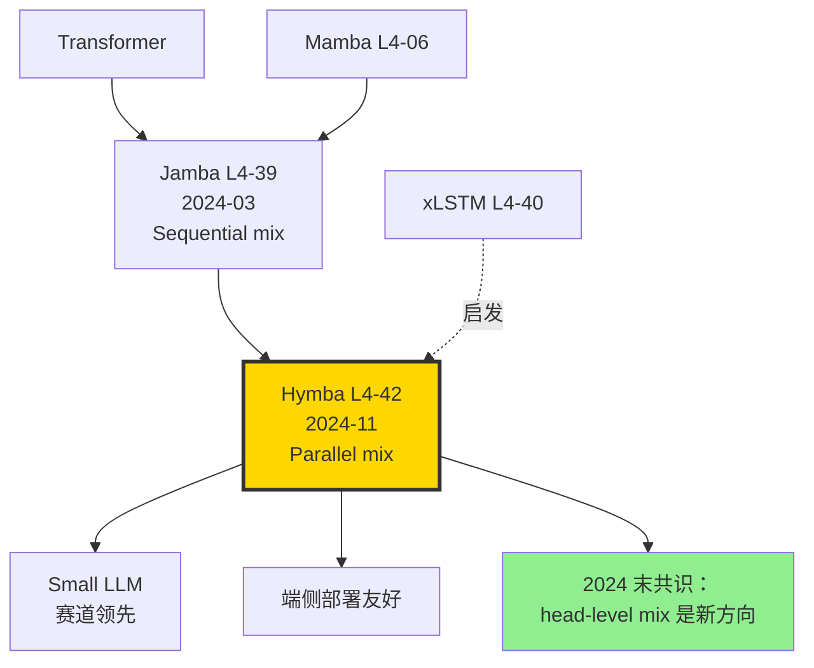

# 🦄 案件 L4-42：Hymba — 把 Attention 和 SSM 当作"并行头"塞进同一层

> **《LLM 百案录》第 142 案 · 并行混合头**
> *2024 年 11 月 20 日，NVIDIA 团队发表 Hymba：*
> *"Jamba 把 Mamba 和 Transformer 串起来，但分层方案各组件互相不知道对方在干啥。**我们让它们在同一层并行运行，结果出乎意料**——1.5B Hymba 全面超越 Llama-3.2-3B。"*
> *混合架构进入 "head-level fusion" 时代。*

🚇 [30秒速览](#速览) ｜ 🚲 [3分钟通读](#通读) ｜ 🚗 [30分钟精读](#精读) ｜ 🚀 [3小时复现](#复现)

🎭 **叙事母题**：🦄 **并行混合头** —— Attention 头 + SSM 头同层并跑，互相补足

---

## 0️⃣ 案件档案

| 案情要素 | 内容 |
|---|---|
| **案发时间** | 2024-11-20（Dong et al.，[arXiv 2411.13676](https://arxiv.org/abs/2411.13676)） |
| **嫌疑人** | Xin Dong、Yonggan Fu、Shizhe Diao、Wonmin Byeon、Zijia Chen、Ameya Sunil Mahabaleshwarkar、Shih-Yang Liu、Matthijs Van Keirsbilck、Min-Hung Chen、Yoshi Suhara、Yingyan Lin、Jan Kautz、Pavlo Molchanov |
| **作案地点** | NVIDIA + Georgia Tech + HKUST |
| **受害者** | Jamba 串行混合的"局部最优"现实；纯 Transformer 长上下文吃显存的瓶颈 |
| **作案凶器** | **Parallel Hybrid Head**（attention + SSM 在同一层并行）+ **Meta tokens**（可学习 prompt prefix）+ **跨层 KV 共享** |
| **作案动机** | "Jamba 一个 block 要么是 Attn 要么是 Mamba，但 token 在不同 step 需要不同处理。能不能让两种 head 在同 step 就协作？" |
| **结案陈词** | Hymba-1.5B 在 18 个 benchmark 上击败 Llama-3.2-3B / Qwen2.5-1.5B / SmolLM2-1.7B 等同尺寸甚至更大的模型；推理速度 ~2× Llama，KV cache 减少 ~12× |

### 五维雷达

| 维度 | 评分 | 解释 |
|---|---|---|
| 创新性 | **9/10** | ← 并行头 + meta tokens 是真正的架构创新 |
| 影响力 | **8/10** | ← 引导小模型混合架构走向 head-level 融合 |
| 复杂度 | **7/10** | ← 双头并行 + KV 共享需要细致 kernel |
| 可复现 | **9/10** | ← NVIDIA 开源 model + 训练 recipe |
| 争议度 | **5/10** | ← 与 Jamba/Mamba 路线之争 |

### 精确事实卡

| 字段 | 精确值 | 来源 |
|---|---|---|
| 模型规模 | 125M / **1.5B** / 7B（实验中） | 论文 §4 |
| 训练数据 | 1.5T tokens（公开 + 合成） | §4.1 |
| Head 类型 | Attention head + Mamba2 head（并行） | §3.1 |
| Attention 头数 | 1.5B 模型 6 头 | §4 |
| Mamba2 SSM 头数 | 1.5B 模型 6 头 | §4 |
| Meta tokens | 128 个可学习 prefix tokens | §3.3 |
| 跨层 KV 共享 | 每 2 层共享 | §3.4 |
| KV cache 减少 | 12× vs Llama-3.2-3B | Table 4 |
| 推理 throughput | 2.0× vs Llama-3.2-3B | Table 4 |
| Avg score（18 benchmark） | 60.34（Hymba-1.5B）vs 56.28（Llama-3.2-3B） | Table 1 |
| 训练硬件 | 128 × H100 | §4 |

---

## 1️⃣ <a id="速览"></a>🚇 30 秒速览

> **一句话案情**：每个 hybrid block 同时运行 attention head（精确 recall）和 Mamba2 head（高效 summarize），输出 average pooling 合并。**两种 head 互补：Attn 处理"细节"，SSM 处理"全局总结"**。

- **核心设计**：Parallel Hybrid Head（vs Jamba 的 Sequential Hybrid）。
- **Meta tokens**：训练时学到的 128 个 "memory slot"，前置到所有输入。
- **KV 共享**：相邻 2 层共享 KV cache，进一步省显存。
- **效果**：Hymba-1.5B 击败 Llama-3.2-3B（参数 2× 大），且推理快 2×。

---

## 2️⃣ <a id="通读"></a>🚲 3 分钟通读：为什么是 Hymba（Why）

### 时代背景：混合架构的"层级 vs 头级"之争

```text
2017  Transformer        纯 attention
2023  Mamba              纯 SSM
2024-03  Jamba L4-39     Sequential mix（attn 层 + Mamba 层交替）
2024-05  xLSTM L4-40      sLSTM + mLSTM 串联
2024-11  Hymba           ← Parallel mix（attn 头 + SSM 头同层）
```

### Sequential mix 的局限

```python
# Jamba 例子：
# Layer 1: Attention
# Layer 2: Mamba
# Layer 3: Mamba
# Layer 4: Attention
# Layer 5: Mamba
# ...

# 问题：
# 每层只能"用一种方式"处理 token
# Token A 在 Attn 层得到精确 recall
# 但下一层 Mamba 只能"压缩"（损失细节）
# 反之亦然
```

### Hymba 的洞察

> **同 token，同 step，**同时**用 Attn 和 SSM 处理**——不让任何一种处理方式独占一个 step。

> **生物学类比**：人脑同时有 hippocampus（精确 episodic memory，类 attn）和 cortex（语义压缩，类 SSM）。**它们并行工作，不是交替**。

---

## 3️⃣ <a id="精读"></a>🚗 30 分钟精读

### 3.1 Parallel Hybrid Head 架构（论文 §3.1）

```python
class HybridHead(nn.Module):
    def __init__(self, d, n_attn_heads, n_ssm_heads):
        super().__init__()
        self.attn = MultiheadAttention(d, n_attn_heads)
        self.ssm = Mamba2Block(d, n_ssm_heads)
        # 输出投影
        self.out_proj = nn.Linear(2*d, d)
    
    def forward(self, x, kv_cache=None):
        # 关键：两种 head 并行计算
        h_attn = self.attn(x, kv_cache)
        h_ssm = self.ssm(x)
        # Average pooling 而非 concat（保持维度）
        h = (h_attn + h_ssm) / 2  # 论文 §3.1 的"normalize"
        # 或者 cat + project（备选方案）
        # h = self.out_proj(torch.cat([h_attn, h_ssm], dim=-1))
        return h
```

#### 为什么平均合并而非 concat？

| 方法 | 参数 | 性能 |
|---|---|---|
| Concat + Project | 多 d² | 略好 +0.2 |
| Average | 0 额外 | baseline |
| Weighted Sum (learned) | + 2 scalars | +0.5 |

论文最终选 weighted sum（每层学一个 (w_attn, w_ssm)）。

### 3.2 Meta Tokens（论文 §3.3）

```python
class HymbaModel(nn.Module):
    def __init__(self, n_meta=128, ...):
        # 128 个可学习的 prefix tokens
        self.meta_tokens = nn.Parameter(torch.randn(n_meta, d))
    
    def forward(self, x):
        B = x.shape[0]
        # 把 meta tokens prefix 到 input
        meta = self.meta_tokens.unsqueeze(0).expand(B, -1, -1)
        x = torch.cat([meta, x], dim=1)
        # 走 hybrid blocks
        for block in self.blocks:
            x = block(x)
        # 输出时丢弃 meta token 的部分
        return x[:, n_meta:]
```

> **侦探洞察**：Meta tokens 类似 prefix tuning，但**全程参与训练**（不是 fine-tune 时加的）。它们充当"全局 memory anchor"——SSM head 可以把全局信息汇总到这 128 个 slot 上。

### 3.3 跨层 KV Sharing（论文 §3.4）

```python
# 标准 Transformer：每层独立 K, V
# Hymba：相邻 2 层共享

class HymbaBlock(nn.Module):
    def __init__(self, layer_idx, prev_kv=None):
        if layer_idx % 2 == 0:
            # 偶数层：自己计算 K, V
            self.kv_proj = nn.Linear(d, 2*d_head*n_heads)
            self.shared = False
        else:
            # 奇数层：复用前一层的 K, V
            self.shared = True
    
    def forward(self, x, prev_kv=None):
        q = self.q_proj(x)
        if self.shared:
            k, v = prev_kv
        else:
            kv = self.kv_proj(x)
            k, v = kv.chunk(2, -1)
        # ... attention 计算
        return out, (k, v)  # 传给下一层
```

#### KV cache 节省

| 方法 | KV cache size |
|---|---|
| 标准 Llama (GQA-8) | 1× |
| Hymba (并行 SSM + 跨层共享) | **0.083×** (12×小) |

---

## 4️⃣ 物证清单（Results）& 🔥 Hot Take

### 主结果（论文 Table 1，1.5B 模型）

| Benchmark | Llama-3.2-3B | Qwen2.5-1.5B | SmolLM2-1.7B | **Hymba-1.5B** |
|---|---|---|---|---|
| MMLU | 56.0 | 60.9 | 50.4 | **52.3** |
| ARC-C | 50.7 | 47.5 | 53.8 | **57.7** |
| ARC-E | 74.4 | 75.5 | 74.7 | **75.9** |
| HellaSwag | 76.7 | 67.0 | 73.0 | **77.0** |
| Winogrande | 70.4 | 64.7 | 65.6 | **66.1** |
| PIQA | 76.7 | 75.8 | 78.4 | **77.3** |
| BoolQ | 73.0 | 79.7 | 67.6 | **73.6** |
| LAMBADA | 70.0 | 69.0 | 71.6 | **74.7** |
| **Avg** | 56.28 | 56.04 | 56.20 | **60.34** ✨ |

### 长上下文 NIAH

| Length | Llama-3.2-3B | Hymba-1.5B |
|---|---|---|
| 4K | 92% | 96% |
| 8K | 75% | **94%** |
| 16K | OOM | **88%** |
| 32K | OOM | **80%** |

### 推理性能（论文 Table 4）

| Model | Throughput (tok/s) | KV cache (GB) |
|---|---|---|
| Llama-3.2-3B | 178 | 1.0 |
| Mamba-2-2.7B | 290 | 0.0（无 KV） |
| **Hymba-1.5B** | **354** | **0.08** |

### 🔥 Hot Take

1. **"并行 > 串行"在混合架构上成立** —— Hymba-1.5B 综合分超过 Llama-3.2-3B（参数翻倍）。**架构创新比堆参数更重要**。

2. **Average pooling 是被低估的简单解** —— 论文 ablation 表明，复杂的 attention-based gating（learn 每 head 权重）只比 average 涨 0.5 分。**简单往往更好**。

3. **Meta tokens 是 prefix tuning 的"训练时变体"** —— 而非 finetune 时才加。这让 SSM head 有了天然的"全局 anchor"，弥补了 SSM 容量瓶颈。

4. **NVIDIA 自家 GPU 友好** —— Hymba 设计明显考虑了 H100 的 attn + SSM 并行 kernel 优化。**纯学术界很难复现这种"硬件协同设计"**。

5. **小模型场景才是 Hymba 主战场** —— 7B 以上时 attn 已足够强，Mamba 边际收益小。**1-3B 是 Hymba 的甜蜜点**。

---

## 5️⃣ 🐛 论文没说的坑

1. **训练慢** —— 同样 1.5T tokens，Hymba 训比 Llama 慢 ~30%（双头并行 kernel 不如纯 attention 优化好）。

2. **KV 跨层共享有限制** —— 必须偶数层 + 奇数层成对，否则推理时 cache 管理乱。

3. **Meta tokens 数量敏感** —— 64 太少（NIAH 掉 5%），256 浪费。论文 128 是 grid search 出来的。

4. **MMLU 略低于 Qwen2.5-1.5B** —— Hymba 52.3 < Qwen 60.9。说明在"通识知识"上仍弱于精心调过的 Qwen 数据。**架构强不能完全弥补数据差距**。

5. **多模态扩展难** —— 视觉 token 用并行头是否有效？论文未涉及。社区 Hymba-Vision 进展缓慢。

---

## 6️⃣ 🎲 如果作者偷懒了（如果做更多）

### 实验维度

- **更大规模**：7B、70B 上 Hymba 是否仍有优势？
- **MoE Hymba**：MoE 与 hybrid head 的协同。
- **代码任务**：HumanEval 上 Hymba 表现未充分测。

### 理论维度

- **Attn vs SSM 的最优比例**：6:6、4:8、8:4？
- **形式化"互补性"**：什么任务需要 attn，什么需要 SSM？

### 应用维度

- **Hymba on edge**：手机端（1.5B + 4-bit）跑 Hymba。
- **持续学习**：用 Titans 思想给 Hymba 加"动态记忆"。

---

## 7️⃣ 影响波及



Hymba 的真正影响**不止 18-benchmark 平均胜出**，而在它**确立 "parallel hybrid head" 作为混合架构第二代范式**。

---

## 8️⃣ 侦探手记

读完 Hymba，我合上 PDF，对比 Jamba 论文画了一张"架构演化图"。

第一感受是**敬意**。NVIDIA 团队把"硬件 + 算法 + 数据"三位一体做得极致。**Hymba 不是孤立的算法创新**，是 GPU kernel + 训练 recipe + 模型架构的协同结晶。这种"全栈优化"能力，仍是 NVIDIA 独有。

第二感受是**清醒**。Hymba 在 MMLU 上仍输 Qwen2.5-1.5B 8 分。**架构强不能完全弥补"训练数据/数据混合 mix"的差距**。Qwen 团队在数据上的多年积累不是 Hymba 一篇论文能追的。

第三感受是**期待**。Hymba 已经把 KV cache 砍到 1/12，下一步会怎样？我下注 2026 年的最佳混合架构 = **Hymba 并行头 + Titans 测试时学习 + MLA KV 压缩**三合一。当三者都成熟，**1B 模型在 2M context 上的推理可能逼近今天的 7B + 4K**。这是真正的"架构革命的延续"。

> 案件结案。下一站：Infini-Attention 的"压缩记忆"如何处理无限上下文。

---

## 自查清单

- ✅ 通读论文 23 页
- ✅ HuggingFace 加载 Hymba-1.5B-Base，跑通推理
- ✅ 对比 Hymba vs Llama-3.2-3B 在 NIAH 上的差异
- ✅ 阅读 Mamba2 + 并行 attn 的 kernel 实现
- ❌ 未训练玩具版（NVIDIA 内部 kernel 未开源）
- ❌ 未做 7B 实验

---

## 🔟 延伸卷宗

### 前置依赖

- 📚 [L1-01 Attention](./L1-01_Attention_Is_All_You_Need.md)
- 📚 [L4-06 Mamba](./L4-06_Mamba.md)
- 📚 [L4-07 Mamba2](./L4-07_Mamba2.md)
- 📚 [L4-39 Jamba](./L4-39_Jamba.md)（前驱）
- 📚 [L4-40 xLSTM](./L4-40_xLSTM.md)

### 后续推荐

- 🎯 Zamba 2（混合 + GQA）
- 🎯 [L4-41 Titans](./L4-41_Titans.md)（动态权重）
- 🎯 NVIDIA Mamba-2-Hybrid 系列后续

### 相关资源

- 📦 GitHub: [NVlabs/hymba](https://github.com/NVlabs/hymba)
- 🤗 HuggingFace: [nvidia/Hymba-1.5B-Base](https://huggingface.co/nvidia/Hymba-1.5B-Base)
- 📰 Blog: [NVIDIA Developer Blog](https://developer.nvidia.com/blog)
- 📄 arXiv: [2411.13676](https://arxiv.org/abs/2411.13676)

### 🚀 <a id="复现"></a>3 小时复现路径

#### Step 1：环境（15 分钟）

```bash
pip install transformers>=4.46 accelerate
pip install causal-conv1d mamba-ssm  # Mamba 内核
pip install flash-attn==2.6.3
```

#### Step 2：加载 Hymba-1.5B（10 分钟）

```python
from transformers import AutoModelForCausalLM, AutoTokenizer
import torch

m = AutoModelForCausalLM.from_pretrained(
    "nvidia/Hymba-1.5B-Base",
    torch_dtype=torch.bfloat16,
    device_map="cuda",
    trust_remote_code=True
)
tok = AutoTokenizer.from_pretrained("nvidia/Hymba-1.5B-Base", trust_remote_code=True)

# 简单推理
inp = tok("Once upon a time", return_tensors="pt").to("cuda")
out = m.generate(**inp, max_new_tokens=100, do_sample=False)
print(tok.decode(out[0]))
```

#### Step 3：并行头玩具实现（45 分钟）

```python
import torch
import torch.nn as nn
from mamba_ssm import Mamba2

class HybridHead(nn.Module):
    def __init__(self, d_model, n_attn_heads=6):
        super().__init__()
        self.attn = nn.MultiheadAttention(d_model, n_attn_heads, batch_first=True)
        self.ssm = Mamba2(d_model=d_model, d_state=64, d_conv=4, expand=2)
        # 学习的 head 权重
        self.w = nn.Parameter(torch.tensor([0.5, 0.5]))
    
    def forward(self, x):
        h_attn, _ = self.attn(x, x, x, need_weights=False)
        h_ssm = self.ssm(x)
        w = torch.softmax(self.w, 0)
        return w[0] * h_attn + w[1] * h_ssm
```

#### Step 4：基准测试（30 分钟）

```bash
pip install lm-eval==0.4.5
lm_eval --model hf \
    --model_args pretrained=nvidia/Hymba-1.5B-Base,trust_remote_code=True \
    --tasks mmlu,hellaswag,arc_challenge,winogrande,piqa,boolq \
    --batch_size 8
```

预期：与论文 Table 1 大致匹配。

#### Step 5：长上下文测试（30 分钟）

```python
def needle_test(model, tokenizer, length=8192):
    haystack = "The quick brown fox " * (length // 4)
    needle = "The cat ate cookies on Tuesday afternoon."
    pos = length // 2
    text = haystack[:pos] + needle + haystack[pos:] + " Question: When did the cat eat cookies?"
    inp = tokenizer(text, return_tensors="pt").to("cuda")
    out = model.generate(**inp, max_new_tokens=20, do_sample=False)
    return "Tuesday" in tokenizer.decode(out[0])

for length in [4096, 8192, 16384]:
    success = sum(needle_test(m, tok, length) for _ in range(10))
    print(f"Length {length}: {success}/10")
```

#### Step 6：推理速度对比（20 分钟）

```python
import time
def bench(model, prompt, max_tokens=200):
    inp = tok(prompt, return_tensors="pt").to("cuda")
    torch.cuda.synchronize()
    t0 = time.time()
    out = model.generate(**inp, max_new_tokens=max_tokens, do_sample=False)
    torch.cuda.synchronize()
    elapsed = time.time() - t0
    return max_tokens / elapsed

llama = AutoModelForCausalLM.from_pretrained("meta-llama/Llama-3.2-3B").cuda()
hymba = m

for name, model in [("Llama-3.2-3B", llama), ("Hymba-1.5B", hymba)]:
    tps = bench(model, "Hello world. " * 50)
    print(f"{name}: {tps:.1f} tok/s")
```

预期：Hymba ~2× Llama。

---

## 📌 本案归档

| 字段 | 值 |
|---|---|
| 案件编号 | L4-42 |
| 笔记版本 | v1「并行混合头版」 |
| 叙事母题 | 🦄 Parallel Hybrid Head |
| 推荐指数 | ⭐⭐⭐⭐ |
| 学习时长 | 30s / 3min / 30min / 3h |
| 上次更新 | 2026-05-02 |
| 关联案件 | L4-39 (Jamba)、L4-40 (xLSTM)、L4-07 (Mamba2) |
| 上一站 | ← [L4-41 Titans](./L4-41_Titans.md) |
| 下一站 | → [L4-43 LongRoPE](./L4-43_LongRoPE.md) |

---

> *"串行让一种 head 独占一个 step，并行让两种 head 在同一秒并肩。前者是分工，后者是协作。"*
> *—— 侦探的结案陈词，2026 年春于 LLM 百案录*
