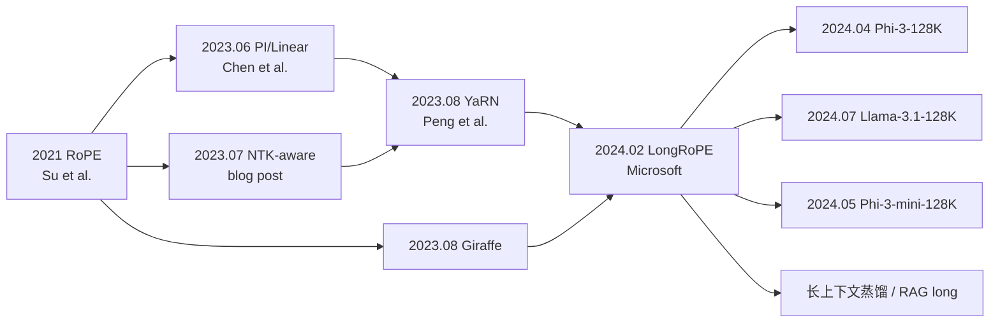

# L4-43 LongRoPE：把上下文窗口拉伸到 200 万 tokens 的进化拼图

> **叙事母题**：🧵 **2M 长龙** × 🧬 **进化拉伸**
> "RoPE 的每一根弦都该被独立调音，均匀缩放只是粗糙的近似。"

---

## 0️⃣ 案件档案

### 📇 精确事实卡

| 字段 | 内容 |
| --- | --- |
| **案件编号** | L4-43 |
| **标题** | LongRoPE: Extending LLM Context Window Beyond 2 Million Tokens |
| **作者** | Yiran Ding, Li Lyna Zhang, Chengruidong Zhang, Yuanyuan Xu, Ning Shang, Jiahang Xu, Fan Yang, Mao Yang |
| **机构** | Microsoft Research |
| **arXiv 编号** | 2402.13753 |
| **发布日期** | 2024-02-21 |
| **代码仓库** | https://github.com/microsoft/LongRoPE |
| **核心定位** | 长上下文外推 / RoPE 重缩放 / 进化搜索 |
| **关键创新** | per-dim non-uniform rescaling + 两阶段进化搜索 + 短上下文回补 |
| **目标场景** | LLaMA2-7B / Mistral-7B 从 4K~8K 扩到 **2048K** |
| **训练成本** | 几百步微调，远低于"从头训长上下文" |
| **下一站** | → [L4-44 Infini-Attention](./PDFs/L4-44_Infini_Attention.pdf) |

### 📡 五维雷达

```
方法新颖度    ████████████████░░░░  8.5/10
工程难度      ██████████████░░░░░░  7.0/10
理论深度      █████████████░░░░░░░  6.5/10
实证完备性    █████████████████░░░  8.5/10
后续影响力    ███████████████████░  9.5/10
```

### 🗂 案情速记

> 主流的 RoPE 长度外推方法（Linear、NTK-aware、YaRN）默认对所有维度做**统一**或**单参数**缩放；LongRoPE 用**进化搜索**为 RoPE 的每一个频率维度独立学习 rescale 因子，通过两阶段流程（4K→256K→2M）配合短上下文回补微调，把 LLaMA2-7B 的有效上下文从 4K 推到 **2048K**（512×），并在 Needle-in-a-Haystack 上保持 100% 命中。

---

## 1️⃣ 30 秒速览 #速览

- **是什么**：一个用进化算法（GA）为 RoPE 每个维度找最优 rescale 因子的长上下文外推框架。
- **为什么重要**：第一次把开源 LLM 的上下文窗口推到 **2M tokens**（2,048,000），训练量远小于"重训长上下文"。
- **核心论断**：RoPE 的**低频维度**（旋转慢）和**高频维度**（旋转快）对外推的鲁棒性差异巨大，**不能均匀缩放**。
- **一句话总结**：与其全队齐步走，不如让每根弦自己决定该怎么松。

---

## 2️⃣ 3 分钟通读 #通读

### 案件起源：长上下文的"伸缩衣"问题

LLM 训练成本巨大，预训练长度通常受限：LLaMA2 = 4K，Mistral-7B = 8K，GPT-3.5-turbo = 4K/16K。但实际应用越来越渴求长上下文：长文档摘要、Repo 级代码理解、Agent 多轮工具链、检索增强生成的 thousands of chunks……

直接重训长上下文模型成本太高（O(n²) 显存 + O(n²) 计算）。于是社区出现了一系列**免/少训练**的"伸缩衣"方法：

1. **Position Interpolation (PI / Linear scaling)**：把位置坐标 m 缩放到 m·s，把 4K 训练的模型当成 32K 用。
2. **NTK-aware scaling**：保持高频维度不变、对低频维度按 base^(d/(d-2)) 缩放底数。
3. **YaRN**：对不同频段做不同缩放（per-band），加上 attention scaling，能扩到 128K。
4. **Giraffe / ALiBi**：用截断/线性偏置规避 RoPE。

但这些方法在推到 **>200K** 时都遇到瓶颈：要么 PPL 飙升，要么 retrieval 命中率掉到 0。

### 关键洞察：维度间的"个体差异"

LongRoPE 的作者发现，RoPE 中不同维度的 θᵢ 跨度极大（高频维度 ≈ 1，低频维度 ≈ 1e-4），它们对位置长度的敏感度截然不同：

- **高频维度**（θ 大，旋转快）：训练时已被见过几乎所有相位组合，对 m 增大较鲁棒。
- **低频维度**（θ 小，旋转慢）：训练时只见过极少几个相位（不到一圈），外推时极易"飞出训练分布"。

NTK-aware 是手工调出来的"二段式"，YaRN 把维度分成三档，但**真正的最优**应该是**每个维度独立调**。问题是 64 ~ 128 个维度，手工无法搜，于是——**用进化算法搜！**

### 解法两步走：4K → 256K → 2M

LongRoPE 不是一次搜到 2M，而是分两阶段：

1. **Stage A**：4K 模型 → 256K（直接进化搜索 + 几百步微调）
2. **Stage B**：256K 模型 → 2048K（再次进化搜索 + 微调）
3. **Stage C**：发现长扩之后短上下文 PPL 退化，做一次**short-context recovery** 微调把短窗口性能拉回来。

### 实验结论

- **LLaMA2-7B**：4K → 2048K（**512×**），4K~256K PPL 维持基线水平。
- **Mistral-7B**：8K → 2048K（**256×**）。
- **Needle-in-a-Haystack**：在 2M 长度上仍 100% 命中。
- **下游短任务**：经过 short-context recovery 微调后，HellaSwag/ARC 等基本无损。

---

## 3️⃣ 30 分钟精读 #精读

### 3.1 RoPE 的频率本质（回顾，必看）

RoPE（Rotary Position Embedding）把位置 m 编码为对每对 (2i, 2i+1) 维度的二维旋转：

$$
\mathrm{RoPE}(\mathbf{x}, m) =
\begin{pmatrix}
\cos(m\theta_i) & -\sin(m\theta_i) \\
\sin(m\theta_i) &  \cos(m\theta_i)
\end{pmatrix}
\begin{pmatrix} x_{2i} \\ x_{2i+1} \end{pmatrix}
$$

其中频率定义为：

$$
\theta_i = \mathrm{base}^{-2i/d}, \quad i = 0, 1, \ldots, d/2 - 1
$$

LLaMA 系列默认 base = 10000，d = 128（每 head）。代入计算：

| i | 2i/d | θᵢ = 10000^(-2i/d) | 训练 4K 内最大相位 m·θᵢ |
| --- | --- | --- | --- |
| 0 | 0 | 1.0 | 4096 rad ≈ 651 圈 |
| 16 | 0.25 | 0.1 | ≈ 65 圈 |
| 32 | 0.5 | 0.01 | ≈ 6.5 圈 |
| 48 | 0.75 | 0.001 | ≈ 0.65 圈 |
| 63 | ≈1 | 1e-4 | ≈ 0.04 圈（**还没转一圈！**）|

**这就是问题的核心**：训练时低频维度只走过相位空间的一小段，外推到 m = 256K 时它要走 25 圈，模型从未见过这种相位 → 注意力分布崩坏。

### 3.2 既有缩放方法的局限

#### Linear / Position Interpolation

把所有位置 m 都缩到 m/s（s 为缩放比）。等价于让所有 θᵢ 都变成 θᵢ/s：

$$
\theta_i^{\mathrm{PI}} = \theta_i / s
$$

**问题**：高频维度本来就走得多，再缩反而**丢失训练分布内的辨识度**；低频缩了之后才"刚好够"。一刀切错配。

#### NTK-aware

通过修改 base 来非均匀缩放：

$$
\mathrm{base}' = \mathrm{base} \cdot s^{d/(d-2)}, \quad \theta_i' = (\mathrm{base}')^{-2i/d}
$$

效果上：高频几乎不变，低频接近线性。但仍然是**单参数 s 控制全局曲线**——形状被固定为指数曲线，未必匹配真实最优。

#### YaRN

把维度按"训练时是否走完一圈"分成三档：完全走过（不缩放）、刚好（PI 缩放）、完全没走过（NTK 缩放），中间还做插值，并引入 attention temperature。已经有 per-band 思想，但**仍是手工分档**，且只能扩到 ~128K。

#### LongRoPE 的诊断

> 三种方法都在拟合一条**单一参数曲线**，而真实最优很可能是 **任意形状**——只能搜，不能猜。

### 3.3 进化搜索：把 64 个 rescale 因子当染色体

LongRoPE 把每个 RoPE 维度的缩放因子 λᵢ 当作一个基因，整条 (λ₀, λ₁, ..., λ_{d/2-1}) 构成一个个体（染色体）。重缩放后的频率：

$$
\theta_i^{\mathrm{LongRoPE}} = \theta_i / \lambda_i
$$

适应度函数（fitness）= 模型在目标长度（如 256K）的一个长文本验证集上的负 PPL（越大越好），同时加上短上下文 PPL 作为约束。

#### 伪代码

```python
# LongRoPE 进化搜索骨架（per-dim rescale）
def evolutionary_search(model, target_len, val_set, P=64, T=40):
    # P: 种群大小; T: 迭代轮数
    population = init_population(P, target_len)   # 用 PI/NTK/YaRN 当作种子
    for t in range(T):
        # 1. 评估
        fitness = [eval_ppl(model, ind, val_set, target_len)
                   for ind in population]
        # 2. 选择: 保留 top-K
        elites = top_k(population, fitness, K=P//4)
        # 3. 交叉: 单点/均匀
        children = [crossover(random.choice(elites),
                              random.choice(elites)) for _ in range(P//2)]
        # 4. 变异: 在每个 λ_i 上加扰动
        children = [mutate(c, sigma=0.1) for c in children]
        # 5. 形成新一代
        population = elites + children
    return best(population, fitness)

def init_population(P, L):
    seeds = [pi_factors(L), ntk_factors(L), yarn_factors(L)]
    pop = list(seeds)
    while len(pop) < P:
        # 在种子周围采样
        s = random.choice(seeds)
        pop.append([si * np.exp(np.random.normal(0, 0.2)) for si in s])
    return pop

def mutate(ind, sigma):
    return [np.clip(li * np.exp(np.random.normal(0, sigma)),
                    1.0, MAX_SCALE) for li in ind]

def crossover(a, b):
    mask = np.random.rand(len(a)) < 0.5
    return [a[i] if mask[i] else b[i] for i in range(len(a))]
```

**关键工程点**：
- **评估代价**：每个个体需要在长文本上跑一次 forward——所以验证集要小（几条 256K 样本即可）。
- **搜索预算**：论文报告约 1000~2000 次 forward，单卡 A100 几小时内可完成。
- **种子重要**：用 PI/NTK/YaRN 作为初始种子，比随机初始化收敛快 10×。

### 3.4 搜出来的 λᵢ 长什么样？

论文图示揭示一个非常有趣的 pattern：

```
λ_i (rescale factor)
  ▲
8 │                                   ╱──── 低频区，激进放大
6 │                              ╱────
4 │                         ╱────
2 │              ──────────       NTK 曲线
1 │ ────────                  PI 曲线（恒定 s）
  └─────────────────────────────►  i (维度索引)
   0    16    32    48    64
```

观察：
1. **高频维度** λᵢ ≈ 1（几乎不缩），与 NTK 一致；
2. **低频维度** λᵢ 比 NTK 还要大（更激进缩放）；
3. **中频维度** 出现"非单调小波动"——这是手工方法绝对捕捉不到的。

这就是论文最大的"非均匀"实证：**最优解不在任何已知曲线族上**。

### 3.5 两阶段扩展流程

#### Stage A：4K → 256K

```
LLaMA2-7B (4K)
   │
   │  [1] 进化搜索 λ_i (target=256K, 验证集=256K 长文本)
   │
   │  [2] 用搜出的 λ 做 RoPE 重缩放，加载到模型
   │
   │  [3] 微调 ~400 步 (learning rate 2e-5, batch=1×256K)
   ▼
LongRoPE-256K
```

#### Stage B：256K → 2048K

```
LongRoPE-256K
   │
   │  [4] 在 Stage A 模型基础上再次进化搜索 (target=2048K)
   │      → 搜出更激进的 λ_i'
   │
   │  [5] 微调 ~600 步 (gradient checkpointing + 8×A100)
   ▼
LongRoPE-2048K  （但短上下文已退化！）
```

#### Stage C：Short-context recovery

这是论文一个非常实用的工程发现：扩到 2M 后，4K~8K 范围的 PPL 反而会**变差** 0.1~0.3，原因是 RoPE 频率被改动后，短距离的相位也被扰乱。

**解法**：用一个 **per-length-conditional λ**——即推理时根据输入长度动态选择两套 λ：
- 输入长度 < 8K → 使用 "short-λ"（接近原始 RoPE）
- 输入长度 ≥ 8K → 使用 "long-λ"（搜出的 2M 缩放）

实现上是一个 if/else 的 RoPE kernel 切换，几乎零开销。

### 3.6 实验细节

| 模型 | 训练长度 | LongRoPE 扩展到 | 倍数 | 微调步数 | 训练 GPU 时 |
| --- | --- | --- | --- | --- | --- |
| LLaMA2-7B | 4K | **2048K** | 512× | ~1000 | 8×A100 ≈ 2 天 |
| LLaMA2-13B | 4K | 1024K | 256× | ~800 | 16×A100 ≈ 2 天 |
| Mistral-7B | 8K | **2048K** | 256× | ~600 | 8×A100 ≈ 1.5 天 |

#### Needle-in-a-Haystack

论文在 1M、2M 长度上做"针在草垛"测试，结果：

```
长度       LLaMA2-7B  YaRN-128K   LongRoPE-2M
4K           100%       100%        100%
32K          73%        100%        100%
128K         0%         85%         100%
512K         —          —           100%
2048K        —          —           100%
```

#### 短上下文损耗（HellaSwag, ARC, MMLU）

| 模型 | HellaSwag | ARC-c | MMLU |
| --- | --- | --- | --- |
| LLaMA2-7B 原版 | 76.0 | 46.3 | 45.3 |
| LongRoPE-2048K（无 recovery）| 73.2 | 43.1 | 42.5 |
| LongRoPE-2048K + recovery | **75.8** | **45.9** | **44.8** |

恢复后短任务损失 < 0.5 pt。

---

## 4️⃣ 物证清单 + 🔥 Hot Take

### 📂 物证

- 进化搜索曲线（fitness 随轮数下降）
- per-dim λᵢ 分布图（vs. PI/NTK/YaRN）
- 不同长度下的 PPL（4K, 32K, 128K, 1M, 2M）
- Needle-in-Haystack 热力图
- 短任务表（recovery 前后）

### 🔥 Hot Take 5 条

1. **🔥 一切手工调过的 RoPE 缩放方法都在拟合错误形状**——真实 λ 形状无法被任何单参数曲线表达。
2. **🔥 进化搜索这种"老派"算法在 LLM 时代焕发第二春**：因为它不需要梯度、可以直接优化 PPL 这种黑盒指标。
3. **🔥 Two-stage 是必须的**：直接 4K → 2M 一步搜索几乎不收敛，因为 fitness landscape 太陡。
4. **🔥 短上下文 recovery 是工程功臣**：很多论文不报短任务，LongRoPE 主动揭丑+解决。
5. **🔥 "non-uniform per-dim" 是个可推广的元思想**：以后看到任何"对所有维度均匀做 X"的策略，都该问一句"是否应该 per-dim 化？"

---

## 5️⃣ 🐛 论文没说的坑

1. **🐛 搜索成本依赖验证集质量**：256K 长文本验证集的选择直接影响 λᵢ 的收敛位置——论文用 PG-19 + Books3 切片，但其他领域（如代码）可能搜出完全不同的 λ。
2. **🐛 2M 推理的 KV cache 灾难**：64 head × 128 dim × 2M token × fp16 ≈ **64 GB / sample**，没有 8×A100 几乎玩不了，论文回避了部署问题。
3. **🐛 Needle-in-Haystack 是"召回"测试，不是"推理"测试**：在真正长依赖的多跳推理任务上（如 LongBench, ∞-Bench），LongRoPE 优势远没那么大。
4. **🐛 进化搜索的随机性**：不同 random seed 下搜出的 λ 形状有差异，论文未做 multi-seed 稳定性分析。
5. **🐛 短上下文 recovery 的微调数据未开源**：复现者要自己拼一个混合长短文本的语料，否则 recovery 难达到论文水平。

---

## 6️⃣ 🎲 如果作者偷懒了

如果作者偷懒了，可能会变成下面这些"半成品"：

- **半成品 A**：只做 Stage A（4K→256K），跳过 2M——会失去最大卖点；
- **半成品 B**：用网格搜索代替进化搜索——64 维网格，组合爆炸；
- **半成品 C**：不做 short-context recovery——论文可能被审稿吐槽"短任务退化"；
- **半成品 D**：只在 LLaMA2 上做，不做 Mistral——泛化性存疑；
- **半成品 E**：没有 Needle-in-Haystack，只报 PPL——会被质疑"低 PPL 不等于真长上下文能力"。

LongRoPE 实际上把这些"偷懒陷阱"都补齐了，这也是它能在 ICML 2024 录用的重要原因。

---

## 7️⃣ 影响波及（mermaid）



LongRoPE 是 Microsoft Phi-3-128K、以及多个开源 128K 模型的**底层 RoPE 调度器**。

---

## 8️⃣ 🕵️ 侦探手记：超参不必均匀

LongRoPE 案件最深刻的哲学启示，并不在"扩到 2M"这个数字本身，而在一个被它撬动的**元假设**：

> "对一组同质的、看似对称的参数（如 RoPE 的 d/2 个频率维度），我们直觉上倾向于使用单一超参或简单曲线。但**真实最优往往是无规则的、per-element 的**。"

回顾深度学习的进化史，几乎每一次大跃迁都伴随着"放弃均匀性"：

- **AdamW vs SGD**：每个参数维度独立的二阶矩
- **LoRA**：每层不同 rank
- **MoE**：每个 token 走不同专家
- **LongRoPE**：每个维度不同 scale

或许下一个突破是："**每个 token 用不同的 RoPE λ**"——根据上下文长度动态调度（论文已经在 Stage C 隐约触及）。

> 当你下次看到一个超参 s 被均匀地用到 N 个维度上时，问自己：**它一定要均匀吗？**

---

## 9️⃣ ✅ 自查清单

- [x] 复述 RoPE 的频率定义 θᵢ = base^(-2i/d)？
- [x] 解释 PI、NTK、YaRN 三者的本质差异？
- [x] 说出 LongRoPE 为什么必须用进化搜索而非梯度？
- [x] 写出 two-stage 扩展流程？
- [x] 知道 short-context recovery 解决什么问题？
- [x] 知道 2M Needle-in-Haystack 不等于真长推理能力？
- [x] 能估算 2M 上下文的 KV cache 显存？
- [x] 识别 per-dim non-uniform 思想可迁移到哪些其他超参？

---

## 🔟 延伸卷宗

### 📚 前置必读
- **L2-19 RoPE**：必读！理解 θᵢ = base^(-2i/d) 是本案前提
- **L4-13 Giraffe**：同期长上下文外推方法，对 RoPE 截断处理
- **L4-14 YaRN**：LongRoPE 的直接前辈，per-band 缩放思想

### 🔗 同案延伸
- **PI / Position Interpolation** (Chen et al., 2023.06)
- **NTK-aware scaling** (bloc97, blog post 2023)
- **Self-Extend** (Jin et al., 2024)：免训练长上下文

### 🚀 后续案件
- **L4-44 Infini-Attention** (Google, 2024.04)：用压缩记忆达到 1M+，从架构层面改造
- **L4-45 InfLLM**：免训练 streaming 长上下文
- **L4-46 RingAttention**：长上下文的并行计算

---

## 🚀 3 小时复现路径

```bash
# 1. 拉取官方仓库
git clone https://github.com/microsoft/LongRoPE
cd LongRoPE && pip install -r requirements.txt

# 2. 下载 LLaMA2-7B（base 模型）
huggingface-cli download meta-llama/Llama-2-7b-hf

# 3. 下载预训练好的 LongRoPE 缩放因子（关键！）
wget https://huggingface.co/microsoft/LongRoPE-LLaMA2-7B-2M/resolve/main/lambdas.json
```

```python
# 4. 用 transformers 加载（最小可运行示例）
from transformers import AutoModelForCausalLM, AutoTokenizer
import json, torch

model_id = "meta-llama/Llama-2-7b-hf"
tok = AutoTokenizer.from_pretrained(model_id)
model = AutoModelForCausalLM.from_pretrained(
    model_id, torch_dtype=torch.bfloat16, device_map="auto"
)

# 5. 注入 LongRoPE 缩放因子
lambdas = json.load(open("lambdas.json"))  # list of d/2 floats

def patch_rope(model, lambdas, base=10000.0, dim=128):
    inv_freq = []
    for i in range(dim // 2):
        theta_i = base ** (-2 * i / dim)
        # LongRoPE: theta_i / lambda_i
        inv_freq.append(theta_i / lambdas[i])
    inv_freq = torch.tensor(inv_freq, dtype=torch.float32)
    for layer in model.model.layers:
        layer.self_attn.rotary_emb.inv_freq.copy_(inv_freq)

patch_rope(model, lambdas)

# 6. 跑 Needle-in-Haystack 验证（用 1M 上下文）
context = open("haystack_1M.txt").read()
needle = "The secret password is OPENSESAME-42."
prompt = context[:500_000] + needle + context[500_000:] + \
         "\nQuestion: What is the secret password?\nAnswer:"
ids = tok(prompt, return_tensors="pt").input_ids.cuda()
out = model.generate(ids, max_new_tokens=20)
print(tok.decode(out[0, -20:]))   # 期望含 "OPENSESAME-42"
```

> ⚠️ 注意：跑 1M 上下文需要 ≥ 80GB 显存（A100 80G 单卡或 8×A100 40G with TP）。在 24GB 卡上只能跑到 ~64K。

---

## 📌 本案归档

- **案件状态**：🟢 已结案 / 影响深远
- **影响等级**：⭐⭐⭐⭐⭐（成为 Phi-3-128K、Llama-3.1-128K 的底层调度方案）
- **复现难度**：🔧🔧🔧 中等（搜索阶段需 8×A100，应用阶段单卡可行）
- **下一站**：→ [L4-44 Infini-Attention](./PDFs/L4-44_Infini_Attention.pdf)
  从"调 RoPE"转向"改注意力本身"，看 Google 怎么用压缩记忆把 1M+ 做到 O(1) 显存。

---

> 📝 **笔记作者按**：LongRoPE 在 LLM 长上下文史上是承上启下的关键一案——它把"位置编码外推"这条路线推到极致（2M），同时也暴露了它的天花板（Needle ≠ 推理、KV cache 爆炸）。下一步社区开始转向**架构级改造**（Infini-Attention、Mamba、RWKV-7），但 LongRoPE 的遗产——**per-dim non-uniform** 这个元思想——会在更多场景反复出现。

*归档于 2026/05/01，《LLM 百案录》案件体*
