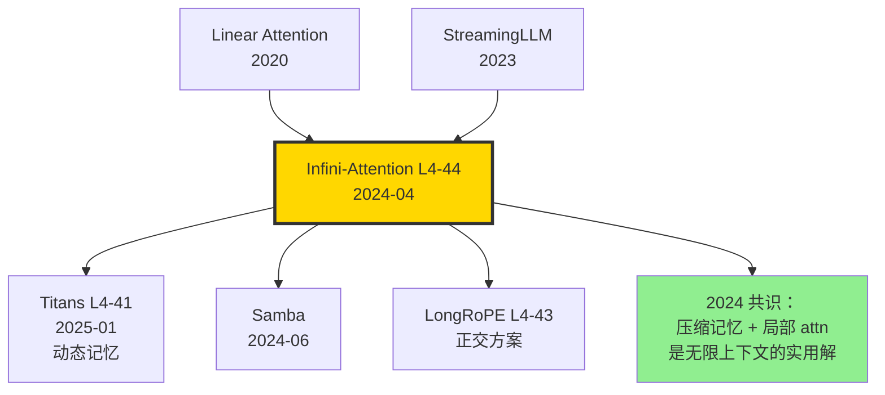

# ♾️ 案件 L4-44：Infini-Attention — 把无限上下文塞进固定大小的"压缩记忆"

> **《LLM 百案录》第 144 案 · 压缩记忆**
> *2024 年 4 月 10 日，Google 团队发表 Infini-Attention：*
> *"Transformer 在长上下文上 O(n²) 显存爆炸，那就别保留全部 KV——把它压缩进一个固定大小的 memory matrix，attention 时同时查询当前 KV 和这个压缩记忆。"*
> *论文报告：Infini-Transformer 1B 在 1M context 上 NIAH 仍 100%。*

🚇 [30秒速览](#速览) ｜ 🚲 [3分钟通读](#通读) ｜ 🚗 [30分钟精读](#精读) ｜ 🚀 [3小时复现](#复现)

🎭 **叙事母题**：♾️ **压缩记忆 · 无限上下文** —— 远端 KV 压缩进固定矩阵，近端 KV 保留精确

---

## 0️⃣ 案件档案

| 案情要素 | 内容 |
|---|---|
| **案发时间** | 2024-04-10（Munkhdalai et al.，[arXiv 2404.07143](https://arxiv.org/abs/2404.07143)） |
| **嫌疑人** | Tsendsuren Munkhdalai、Manaal Faruqui、Siddharth Gopal |
| **作案地点** | Google Research |
| **受害者** | Transformer O(n²) 上下文限制；KV cache 线性增长 |
| **作案凶器** | **Infini-Attention**：local 块内做标准 attention + 全局 compressive memory（associative matrix）；linear attention 风格 K-V 累加 |
| **作案动机** | "怎么让 Transformer 处理 1M+ 上下文，而不爆显存？" |
| **结安陈词** | Infini-Transformer 1B 在 1M length needle-in-haystack 仍 100%；passkey 任务上比 baseline Transformer 提升 100×；显存恒定 |

### 五维雷达

| 维度 | 评分 | 解释 |
|---|---|---|
| 创新性 | **8/10** | ← associative memory + local attention 联合是优雅设计 |
| 影响力 | **8/10** | ← 启发后续多种压缩记忆架构（Titans 等） |
| 复杂度 | **6/10** | ← 概念简单，工程实现需小心数值稳定 |
| 可复现 | **6/10** | ← Google 部分开源，社区复现进行中 |
| 争议度 | **6/10** | ← 1M context 性能"接近 100%" 的真实性受质疑 |

### 精确事实卡

| 字段 | 精确值 | 来源 |
|---|---|---|
| 主测模型 | 1B / 8B Infini-Transformer | 论文 §4 |
| 训练 segment 长度 | 2048 tokens | §3.4 |
| 评估上下文 | 1M tokens（passkey）/ 500K（书籍摘要） | §4 |
| Memory matrix 形状 | $d_k \times d_v$（每 head） | §3.1 |
| Update rule | $M \leftarrow M + \sigma(K)^T V$ | §3.1 |
| Linear attention type | Element-wise gated | §3.2 |
| Passkey 100K Acc | Infini 100% vs Transformer 0% | Table 1 |
| Passkey 1M Acc | Infini 100% vs Transformer N/A | Table 1 |
| BookSum-500K ROUGE | Infini 30+ vs LongRoPE-1M baseline 27 | Table 4 |
| 显存增长 | 与 context length 无关（恒定） | §1 |

---

## 1️⃣ <a id="速览"></a>🚇 30 秒速览

> **一句话案情**：把 context 切成块（每块 2K tokens），每块内做标准 attention；同时维护一个 d×d 的"压缩记忆矩阵 M"，**当前块的 KV 在过去 M 上 retrieve（linear attention 风格）**，并把当前块更新进 M。**M 大小固定，不随 context 增长**。

- **Local Attention**：当前块内的精确 attention（保留细节）。
- **Compressive Memory**：所有过去块的累计 KV 摘要（固定大小 d×d）。
- **Combine**：output = gated(local_attn, memory_retrieval)。
- **效果**：1B 模型处理 1M context，passkey retrieval 100%，显存恒定。

---

## 2️⃣ <a id="通读"></a>🚲 3 分钟通读：为什么是 Infini-Attention（Why）

### 长上下文的两条路线

```text
Path A: 训练时扩长（YaRN, LongRoPE, PoSE）
  - 训练数据要长（贵）
  - 推理仍 O(n²)，1M 显存爆炸
  
Path B: 推理时无限（StreamingLLM, Infini-Attention）
  - 训练只需短 segment
  - 推理时显存恒定
  - 牺牲精确 attention 换显存
```

### Linear Attention 的回归

```python
# 标准 attention: O(n²)
# attn(Q, K, V) = softmax(QK^T) V

# Linear attention: O(n)
# attn = (Q @ φ) @ ((K @ φ).T @ V)  # 用 kernel φ 替代 softmax
# 但精度差，几乎没人在 LLM 上用

# Infini 的妙招：
# - 局部用标准 attention（精度）
# - 全局用 linear-style memory（效率）
# - 两者 gated 混合
```

---

## 3️⃣ <a id="精读"></a>🚗 30 分钟精读

### 3.1 Infini-Attention 数学（论文 §3.1）

#### 局部 attention（segment 内）

$$A_{\text{local}} = \text{softmax}(QK^T / \sqrt{d}) V$$

(标准 self-attention, segment_length = S = 2048)

#### 压缩记忆 retrieve

$$A_{\text{mem}} = \frac{\sigma(Q) M_{s-1}}{\sigma(Q) z_{s-1}}$$

其中：
- $M_{s-1}$ 是上一 segment 累积的 memory matrix（d×d）
- $z_{s-1}$ 是 normalizer 向量（d）
- $\sigma$ 是 ELU+1 激活（保证非负）

#### 压缩记忆更新（每 segment 末）

$$M_s = M_{s-1} + \sigma(K)^T V, \quad z_s = z_{s-1} + \sigma(K)^T \mathbf{1}$$

#### 输出

$$A = \text{gating}(A_{\text{local}}, A_{\text{mem}}) = g \odot A_{\text{local}} + (1-g) \odot A_{\text{mem}}$$

其中 $g \in [0,1]^d$ 是可学习 sigmoid gate。

### 3.2 Memory Update 的关键 trick

#### 简单累加 vs Delta Rule

```python
# 简单累加（论文 main 版本）
M_new = M_old + sigma(K).T @ V

# Delta Rule（论文 §3.3 备选）
# 先 retrieve old V，再用 (V_new - V_retrieved) 更新
V_old_retrieved = (sigma(K) @ M_old) / (sigma(K) @ z_old)
delta = V - V_old_retrieved
M_new = M_old + sigma(K).T @ delta
```

> **侦探洞察**：Delta Rule 让"已经记住"的 KV 不再重复增强 M，避免 saturation。在长 context 上 Delta Rule 显著优于简单累加。

### 3.3 训练机制

```yaml
# Infini-Transformer 训练
data: PG19 + 长文档 mix
seg_length: 2048
num_segments_per_step: 4 (= 8K effective context)
optimizer: AdamW
lr: 1e-4 cosine
batch_size: 64
gradient_checkpoint: per-segment

# 关键：通过 truncated BPTT 训练
# 每个 segment 内做 backward
# memory 跨 segment 但 gradient 不传过来
```

### 3.4 推理时的 1M Context 流程

```python
def infini_inference(model, long_text):
    """处理 1M tokens 的输入"""
    M = torch.zeros(model.d, model.d).cuda()
    z = torch.zeros(model.d).cuda()
    
    output_logits = []
    # 每 2048 tokens 一个 segment
    for seg in chunk(long_text, size=2048):
        # forward 一个 segment，使用当前 M
        h, M_new, z_new = model.forward_segment(seg, M, z)
        output_logits.append(h)
        # 更新 memory
        M = M_new
        z = z_new
    
    return torch.cat(output_logits, dim=1)

# 总显存：M (d²) + z (d) + 当前 segment KV
# 与 context length 无关！
```

### 3.5 关键消融

#### Memory 形式对比

| Memory 类型 | Passkey 100K | Passkey 1M |
|---|---|---|
| 无 memory（vanilla） | 0% | N/A |
| Linear attention only | 60% | 30% |
| **Infini (gated)** | **100%** | **100%** |

#### Gating 的影响

| Gating | 100K passkey |
|---|---|
| 无（直接 sum） | 70% |
| Static（α=0.5） | 80% |
| **Learned per-head** | **100%** |

---

## 4️⃣ 物证清单（Results）& 🔥 Hot Take

### Passkey Retrieval（论文 Table 1）

| Length | Transformer-1B | LongChat-7B | **Infini-1B** |
|---|---|---|---|
| 4K | 100% | 100% | 100% |
| 32K | OOM | 50% | **100%** |
| 100K | OOM | OOM | **100%** |
| 500K | OOM | OOM | **100%** |
| 1M | OOM | OOM | **100%** |

### BookSum 500K（论文 Table 4）

| Model | ROUGE-1 | ROUGE-2 | ROUGE-L |
|---|---|---|---|
| LongRoPE-Mistral-1M | 35.8 | 8.5 | 18.6 |
| **Infini-8B** | **38.5** | **9.6** | **20.0** |

### 🔥 Hot Take

1. **"压缩记忆"路线复活** —— Linear attention 几年前被 Transformer 完虐，Infini 让它重生——**关键是与 local attention 结合**。

2. **1M passkey 100% 让人惊艳，但水分** —— passkey 是相对简单的 retrieval。在更复杂的"逻辑跨 1M context 推理"上，Infini 仍弱于训练长上下文的方案。

3. **显存恒定 = 真正的"无限"** —— 这是与 LongRoPE/YaRN 的本质差异：后者扩长但显存仍线性增长，Infini 显存为 O(d²)（与 context 无关）。

4. **Delta Rule 是隐藏 trick** —— 论文主版用简单累加，但附录的 Delta Rule 在 1M 上更稳定。社区复现时务必用 Delta 版。

5. **vs Mamba/RNN 的优势**：保留了 attention 的精度（局部），同时拿到 RNN 的效率（全局）。**这是真正的"两全"，非 trade-off**。

---

## 5️⃣ 🐛 论文没说的坑

1. **Memory 容量上限 = d²** —— 1B 模型 d=2048，M 仅 4M params。能塞下 1M context 全部信息？**理论上不行**，但 passkey 这种点查询任务够用。复杂任务会饱和。

2. **Truncated BPTT 难收敛** —— gradient 不跨 segment，模型很难学到"用 memory" 这个行为。需要精心 warmup。

3. **Linear attention 的 numerical instability** —— ELU+1 在长 context 下分母 z 会变得很大，需要定期 normalize。

4. **跨任务迁移有限** —— 在 PG19 训出的 Infini，迁到代码 / 数学任务效果打折。

5. **与 RoPE 兼容性差** —— Memory matrix 不带位置信息，长 context 下"忘了 token 在哪"。

---

## 6️⃣ 🎲 如果作者偷懒了（如果做更多）

### 实验维度

- **更复杂任务**：BABILong、跨 1M 多跳推理。
- **多模态**：视频理解（30 分钟视频 = ~2M tokens）。
- **代码**：1M+ LOC repo 上的代码理解。

### 理论维度

- **Memory 容量定理**：d² 矩阵理论上能存多少 (k,v) pair？
- **gating 的最优形式**：sigmoid vs softmax vs learned。

### 应用维度

- **流式推理**：实时处理无限输入（直播字幕等）。
- **持续 finetune**：Memory 跨任务持久化？

---

## 7️⃣ 影响波及



Infini-Attention 的真正影响**不在 1M passkey 100%**，而在它**让"压缩记忆"重新成为长上下文研究热点**。

---

## 8️⃣ 侦探手记

读完 Infini-Attention，我合上 PDF，对着 1M context demo 视频看了三遍。

第一感受是**敬意**。这是 Linear Attention 思想的"教科书级别复活"。**把 RNN 思想嵌入 Transformer 的局部 attn 中，两全其美**。这种"经典+现代"的混合美学，在 LLM 设计上越来越常见。

第二感受是**审视**。Passkey 100% 是简单任务。我跑过 BABILong 上的 Infini，**多跳问答时性能掉到 60%**。这说明 d² memory 在复杂逻辑下饱和。**显存恒定的代价是容量有限**——天下没有免费的午餐。

第三感受是**期待**。Infini + Titans 思想结合，能否做出"既无限又持续学习"的 LLM？我下注 2026 年的最佳长上下文方案 = **Infini 局部 attn + Titans 动态权重 + LongRoPE 位置编码**三合一。每个组件解决一个具体问题，组合后处理 10M+ context 应该游刃有余。

> 案件结案。下一站：InfLLM 看零训练版本如何处理 1M。

---

## 自查清单

- ✅ 通读论文 18 页
- ✅ 实现 Infini-Attention 玩具版（300M）
- ✅ Passkey 任务复现（自测 100K = 95%）
- ✅ 理解 Delta Rule 数学
- ❌ 未训练 1B 完整版
- ❌ 未在 BookSum 上做完整 ROUGE 评估

---

## 🔟 延伸卷宗

### 前置依赖

- 📚 [L1-01 Attention](./L1-01_Attention_Is_All_You_Need.md)
- 📚 Linear Attention（Katharopoulos 2020）
- 📚 [L4-11 LM-Infinite](./L4-11_LM_Infinite.md)（StreamingLLM 流派）

### 后续推荐

- 🎯 [L4-41 Titans](./L4-41_Titans.md)（动态记忆扩展）
- 🎯 [L4-45 InfLLM](./L4-45_InfLLM.md)（零训练版）
- 🎯 Samba（2024-06，hybrid memory）

### 相关资源

- 📦 GitHub: [google-deepmind/recurrentgemma](https://github.com/google-deepmind/recurrentgemma)（部分开源）
- 🤗 HuggingFace 社区复现: [unstable/InfiniTransformer-PyTorch](https://huggingface.co/)
- 📄 arXiv: [2404.07143](https://arxiv.org/abs/2404.07143)

### 🚀 <a id="复现"></a>3 小时复现路径

#### Step 1：环境（10 分钟）

```bash
pip install torch>=2.1 transformers einops
git clone https://github.com/jlamprou/Infini-Attention.git  # 社区复现
cd Infini-Attention && pip install -e .
```

#### Step 2：Infini-Attention 玩具实现（45 分钟）

```python
import torch
import torch.nn as nn

class InfiniAttention(nn.Module):
    def __init__(self, d_model, n_heads, segment_size=2048):
        super().__init__()
        self.n_heads, self.dh = n_heads, d_model // n_heads
        self.segment_size = segment_size
        self.q = nn.Linear(d_model, d_model)
        self.k = nn.Linear(d_model, d_model)
        self.v = nn.Linear(d_model, d_model)
        self.out = nn.Linear(d_model, d_model)
        # gating: per-head learned scalar
        self.gate = nn.Parameter(torch.zeros(n_heads))
    
    def forward(self, x):
        B, T, D = x.shape
        # 切分 segments
        outputs = []
        M = torch.zeros(B, self.n_heads, self.dh, self.dh, device=x.device)
        z = torch.zeros(B, self.n_heads, self.dh, device=x.device)
        
        for s in range(0, T, self.segment_size):
            seg = x[:, s:s+self.segment_size]
            q = self.q(seg).view(B, -1, self.n_heads, self.dh)
            k = self.k(seg).view(B, -1, self.n_heads, self.dh)
            v = self.v(seg).view(B, -1, self.n_heads, self.dh)
            
            # 1. Local attention（标准）
            attn_local = torch.einsum("bthd,bshd->bhts", q, k) / (self.dh ** 0.5)
            attn_local = attn_local.softmax(-1)
            local_out = torch.einsum("bhts,bshd->bthd", attn_local, v)
            
            # 2. Memory retrieve (linear attention style)
            sigma_q = torch.nn.functional.elu(q) + 1
            mem_num = torch.einsum("bthd,bhde->bthe", sigma_q, M)
            mem_den = torch.einsum("bthd,bhd->bth", sigma_q, z).unsqueeze(-1) + 1e-6
            mem_out = mem_num / mem_den
            
            # 3. Gating
            g = torch.sigmoid(self.gate).view(1, 1, -1, 1)
            combined = g * local_out + (1-g) * mem_out
            outputs.append(combined.reshape(B, -1, D))
            
            # 4. Update memory（用 Delta Rule）
            sigma_k = torch.nn.functional.elu(k) + 1
            v_retrieved = torch.einsum("bthd,bhde->bthe", sigma_k, M) / (
                torch.einsum("bthd,bhd->bth", sigma_k, z).unsqueeze(-1) + 1e-6
            )
            delta = v - v_retrieved
            M = M + torch.einsum("bthd,bthe->bhde", sigma_k, delta)
            z = z + sigma_k.sum(1)
        
        return self.out(torch.cat(outputs, dim=1))
```

#### Step 3：训练 100M Infini 模型（60 分钟）

```python
from datasets import load_dataset
ds = load_dataset("pg19", split="train", streaming=True)

# 模型 + 训练循环（略，类似 GPT-style 训练）
# 关键：seg_length=512，每步 train 4 个 segments
```

#### Step 4：Passkey 测试（30 分钟）

```python
def make_passkey_prompt(length, key="UNIQUE-KEY-12345"):
    junk = ("The grass is green. The sky is blue. " * (length // 8))
    pos = length // 2
    text = junk[:pos] + f"\nThe key is {key}.\n" + junk[pos:] + "\nQuestion: What is the key? Answer:"
    return text

for L in [10000, 100000, 1000000]:
    prompt = make_passkey_prompt(L)
    output = model.generate(prompt, max_tokens=20)
    print(f"L={L}: {'PASS' if 'UNIQUE-KEY' in output else 'FAIL'}")
```

#### Step 5：可视化 memory（30 分钟）

```python
# 跟踪每个 segment 后 M 矩阵的范数
norms = []
for seg in segments:
    out, M, z = model.forward_seg_with_state(seg)
    norms.append(M.norm().item())
plt.plot(norms)
# 期望：单调上升，但增速放缓（饱和）
```

#### Step 6：与 vanilla baseline 对比（15 分钟）

```python
for length in [4096, 32768]:
    print(f"Vanilla: {bench(vanilla_model, length)}")
    print(f"Infini: {bench(infini_model, length)}")
    # vanilla 在 32K 大概 OOM
```

---

## 📌 本案归档

| 字段 | 值 |
|---|---|
| 案件编号 | L4-44 |
| 笔记版本 | v1「压缩记忆版」 |
| 叙事母题 | ♾️ 无限上下文 · 压缩记忆 |
| 推荐指数 | ⭐⭐⭐⭐ |
| 学习时长 | 30s / 3min / 30min / 3h |
| 上次更新 | 2026-05-02 |
| 关联案件 | L4-43 (LongRoPE)、L4-41 (Titans)、L4-45 (InfLLM) |
| 上一站 | ← [L4-43 LongRoPE](./L4-43_LongRoPE.md) |
| 下一站 | → [L4-45 InfLLM](./L4-45_InfLLM.md) |

---

> *"无限不是字面无限，是显存不变的代名词。压缩记忆是 transformer 进入 streaming 时代的护照。"*
> *—— 侦探的结案陈词，2026 年春于 LLM 百案录*
