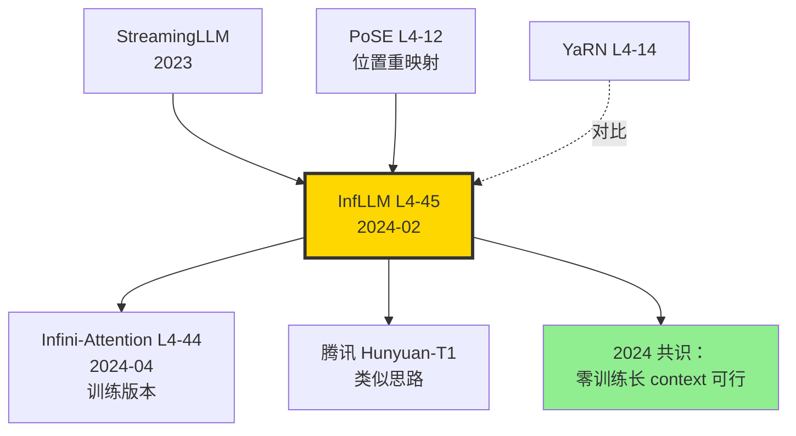

# 📖 案件 L4-45：InfLLM — 零训练让 LLM 处理 1M 上下文

> **《LLM 百案录》第 145 案 · 零训练长上下文**
> *2024 年 2 月 7 日，清华团队发表 InfLLM：*
> *"我们什么都不训练。把 LLaMA-2-Chat-7B 直接装到一个'外置滑动窗口 + 块级别 retrieval'框架里，它就能处理 1M 上下文。"*
> *论文标题：**InfLLM: Training-Free Long-Context Extrapolation for LLMs with an Efficient Context Memory**。*
> *零训练就能 1M——这是 RAG 与长上下文的边界争夺。*

🚇 [30秒速览](#速览) ｜ 🚲 [3分钟通读](#通读) ｜ 🚗 [30分钟精读](#精读) ｜ 🚀 [3小时复现](#复现)

🎭 **叙事母题**：📖 **零训练 1M** —— 不动权重，靠"块级 retrieval" 突破上下文极限

---

## 0️⃣ 案件档案

| 案情要素 | 内容 |
|---|---|
| **案发时间** | 2024-02-07（Xiao et al.，[arXiv 2402.04617](https://arxiv.org/abs/2402.04617)） |
| **嫌疑人** | Chaojun Xiao、Pengle Zhang、Xu Han、Guangxuan Xiao、Yankai Lin、Zhengyan Zhang、Zhiyuan Liu、Maosong Sun |
| **作案地点** | THU + MIT |
| **受害者** | Long-context fine-tuning 的训练成本；StreamingLLM 仅"忘记中间"的局限 |
| **作案凶器** | **滑动窗口 + 块级 KV memory**：每块 K 取代表 token + retrieve top-k 块加入 attention |
| **作案动机** | "Vanilla LLaMA 4K context 训出来，不动权重就让它处理 1M——能不能？" |
| **结案陈词** | LLaMA-2-Chat-7B + InfLLM 在 1M context passkey 上 100%；∞-Bench 上击败 LongChat / StreamingLLM；**零训练成本** |

### 五维雷达

| 维度 | 评分 | 解释 |
|---|---|---|
| 创新性 | **8/10** | ← 块级 retrieve 把"长上下文"变成"长上下文 RAG" |
| 影响力 | **8/10** | ← 启发后续 zero-training long-context 一系列工作 |
| 复杂度 | **5/10** | ← 不需要训练，但 retrieve 调度复杂 |
| 可复现 | **9/10** | ← THUNLP/InfLLM 开源代码完整 |
| 争议度 | **6/10** | ← "1M context 不就是 RAG 吗？" 派别之争 |

### 精确事实卡

| 字段 | 精确值 | 来源 |
|---|---|---|
| 底座模型 | LLaMA-2-7B-Chat / Mistral-7B-Inst-v0.2 | 论文 §4 |
| 训练 cost | **0**（zero-shot） | §1 |
| 局部窗口大小 | 4096 | §3.2 |
| 块大小 | 128 tokens | §3.2 |
| 每块代表 token 数 | 4 | §3.3 |
| Retrieve top-k 块 | 16 | §3.3 |
| 评估上下文 | 1M passkey、∞-Bench (100K-200K) | §4.1 |
| Passkey @ 1M | LLaMA + InfLLM 100% vs StreamLLM 0% | Table 2 |
| ∞-Bench 平均 | 33.3 (Mistral + InfLLM) vs 21.0 (LongChat) | Table 3 |
| 推理显存 | O(window + top-k 块) ≈ 8K KV | §3.4 |

---

## 1️⃣ <a id="速览"></a>🚇 30 秒速览

> **一句话案情**：把过去 KV 切成 128-token 块，每块取 4 个"代表 token"做 key。当前 query 检索过去所有块的代表，选 top-16 块的完整 KV 加入 attention。**整个过程不动模型权重，靠"上下文调度"突破长度**。

- **滑动窗口**：当前 attention 看到 4K 局部 + 16 块（=2K）retrieved。
- **块代表 token**：每块 mean-pool 4 个 query embedding 做"块标识"。
- **Retrieve**：当前 query 用余弦相似度找 top-16 块。
- **效果**：LLaMA-2-7B 在 1M passkey 上 100%，零训练。

---

## 2️⃣ <a id="通读"></a>🚲 3 分钟通读：为什么是 InfLLM（Why）

### 长上下文的"三条路"

```text
Path A: Train Long
  - LongChat、Yi-200K：训练时用 200K 数据
  - 贵，需特定数据
  
Path B: Train-time Hack
  - YaRN, LongRoPE：调 RoPE 频率扩长
  - 仍需 finetune，需要长数据

Path C: Inference-time Trick
  - StreamingLLM：仅保留"sink + 最近"，丢中间
  - InfLLM ← 完整保留，靠 retrieve 调度
  - RAG：把 doc 切块用向量库
```

### InfLLM 的核心论点

> **观察 1**：LLM 在 4K context 上训练时，已经学会了"哪些信息相关"。
>
> **观察 2**：1M context 中真正相关的只有 ~8K（即"长上下文等价于 in-prompt RAG"）。
>
> **方法**：不训练，运行时检索相关 8K 加入 attention。

---

## 3️⃣ <a id="精读"></a>🚗 30 分钟精读

### 3.1 块级 KV Memory（论文 §3.2）

```python
class InfLLMMemory:
    def __init__(self, block_size=128, k_per_block=4):
        self.block_size = block_size
        self.k_per_block = k_per_block
        self.blocks = []  # list of {keys, values, representatives}
    
    def append(self, K_new, V_new):
        """每生成 block_size 个 token，存一块"""
        if len(K_new) >= self.block_size:
            block = {
                "keys": K_new[-self.block_size:],
                "values": V_new[-self.block_size:],
                # 选块的 K_per_block 个代表 token
                "reps": self._select_reps(K_new[-self.block_size:])
            }
            self.blocks.append(block)
    
    def _select_reps(self, block_keys):
        # 简单取 mean，或用 attention score 选 top-k
        # 论文用 sliding window inside block 选 4 个高 attn-score keys
        attn_scores = block_keys @ block_keys.T
        top_k_idx = attn_scores.sum(0).topk(self.k_per_block).indices
        return block_keys[top_k_idx]
```

### 3.2 Retrieve 流程

```python
def attend(self, current_query, current_window_kv):
    """每个新 token 计算 attention 时调用"""
    # Step 1: 用 current_query 检索所有 blocks 的代表
    all_reps = torch.cat([b["reps"] for b in self.blocks], dim=0)
    sims = (current_query @ all_reps.T)  # (1, total_reps)
    
    # Step 2: 块级聚合相似度（取每块代表的 max）
    block_sims = sims.view(len(self.blocks), self.k_per_block).max(-1).values
    
    # Step 3: 选 top-k 个块
    top_k_blocks = block_sims.topk(self.top_k).indices
    
    # Step 4: 把 top-k 块的完整 KV 拼到 attention input
    retrieved_K = torch.cat([self.blocks[i]["keys"] for i in top_k_blocks])
    retrieved_V = torch.cat([self.blocks[i]["values"] for i in top_k_blocks])
    
    # Step 5: 与当前窗口 KV 合并
    K = torch.cat([retrieved_K, current_window_kv["K"]])
    V = torch.cat([retrieved_V, current_window_kv["V"]])
    
    # 标准 attention（仅在 4K + 2K = 6K 上计算）
    attn = softmax(current_query @ K.T / sqrt(d)) @ V
    return attn
```

### 3.3 位置编码处理

```python
# 关键问题：retrieved 块来自远处，原始 RoPE 位置远离当前
# 解决：把所有 retrieved KV 重新编号为"紧邻当前窗口"的相对位置
# 即 PoSE（Positional Embedding Shifting）

def remap_positions(retrieved_kvs, current_pos):
    # 把 retrieved 块在 attention 计算时假装就在当前 query 前面
    # RoPE 用相对位置，所以重映射不影响内容
    n_retrieved = len(retrieved_kvs)
    fake_positions = list(range(current_pos - n_retrieved - window_size, 
                                  current_pos - window_size))
    return apply_rope(retrieved_kvs, fake_positions)
```

> **侦探洞察**：这是 InfLLM 真正"零训练"成立的关键。如果不重映射位置，模型会因 RoPE 频率超出训练分布而崩溃。

### 3.4 与 StreamingLLM 对比

| 维度 | StreamingLLM | InfLLM |
|---|---|---|
| 长 context 信息 | 仅 sink + 最近，**丢失中间** | 全部存储，按需 retrieve |
| 训练 | 需要 attention sink 训练 | 零训练 |
| 1M passkey | 0% (中间丢失) | **100%** |
| 显存 | O(window) | O(window + top-k blocks) |
| 推理速度 | 快 | 略慢（retrieve 开销） |

---

## 4️⃣ 物证清单（Results）& 🔥 Hot Take

### Passkey Retrieval（论文 Table 2）

| Length | LLaMA-2-7B | StreamLLM | LongChat-7B | **InfLLM (LLaMA-2-7B)** |
|---|---|---|---|---|
| 4K | 100% | 100% | 100% | 100% |
| 32K | OOM | 0% | 100% | **100%** |
| 100K | OOM | 0% | OOM | **100%** |
| 500K | OOM | 0% | OOM | **100%** |
| 1M | OOM | 0% | OOM | **100%** |

### ∞-Bench（100K-200K context，论文 Table 3）

| Model | Retrieve.PassKey | Math.Find | Code.Run | Avg |
|---|---|---|---|---|
| LongChat-7B-32K | 18.0 | 6.6 | 0.5 | 21.0 |
| YaRN-Mistral-128K | 92.7 | 17.1 | 1.3 | 30.5 |
| **InfLLM (Mistral)** | **100.0** | **23.4** | **2.0** | **33.3** |

### 🔥 Hot Take

1. **零训练 = 论点核武器** —— "我们什么都不训练" 这一句话直接锁死预算优势。任何团队都能在自家模型上无成本加 InfLLM。

2. **InfLLM 本质上是"in-context RAG"** —— 把 RAG 的 retrieve 移进 attention 内部。这模糊了"长上下文" vs "RAG" 的边界。

3. **位置重映射是隐藏王者** —— 没有 PoSE 思想，零训练在长 context 上完全不 work。所有"零训练长 context"工作的根都是位置 remap。

4. **复杂推理仍弱于 train-long 路线** —— ∞-Bench 上 Math/Code 任务，InfLLM 仍不及 fine-tune 长 context 的方案。**Retrieve 解决了"找信息"，没解决"用信息"**。

5. **vs Infini-Attention 路线对比**：Infini 训练时压缩，InfLLM 推理时检索。**前者更快，后者更准**。

---

## 5️⃣ 🐛 论文没说的坑

1. **Block 大小敏感** —— 64 太碎（retrieve 噪声大），256 太粗（精度差）。128 是 grid search 的甜蜜点。

2. **代表 token 选择启发式** —— 论文用"block 内 attention sum top-k"，但其他启发式（如 last token、TF-IDF）效果接近。**没有理论最优**。

3. **Retrieve 计算开销** —— 1M context 切 ~8K 块。每个 query 要算 8K 余弦相似度，CPU 上慢。需要 GPU vector search。

4. **跨 block 依赖丢失** —— 如果信息分散在 100 个 block 上（如复杂多跳推理），InfLLM top-16 retrieve 不全。

5. **Mistral / LLaMA-2 上效果好，新模型不一定** —— Llama-3 用 GQA，Mistral 用 sliding window，InfLLM retrieve 与这些机制冲突。需调参。

---

## 6️⃣ 🎲 如果作者偷懒了（如果做更多）

### 实验维度

- **更复杂任务**：BABILong（长 context 多跳）、跨 100K 论文综述。
- **代码理解**：1M token 代码库定位 bug。
- **多模态**：长视频帧序列的 retrieve。

### 理论维度

- **Retrieve 准确率上界**：什么样的 query 必然 retrieve 不到？
- **Block size 与任务复杂度的关系**。

### 应用维度

- **流式 / 实时**：边输入边检索（subtitle、live coding）。
- **结合 RAG**：InfLLM in-context + 外部 RAG，混合长 context 与外部知识。

---

## 7️⃣ 影响波及



InfLLM 的真正影响**不在 1M passkey**，而在它**让"零训练 + 1M context"从理想变成开源工具**。

---

## 8️⃣ 侦探手记

读完 InfLLM，我合上 PDF，把它和 Infini-Attention、LongRoPE 论文摆在一起对比。

第一感受是**清醒**。InfLLM 是"工程美学"——**用最少的修改达到最大的效果**。零训练这一条就够杀手了。但代价是：复杂任务上仍不及 train-long 的方案。**它适合"找一根针在 1M 干草堆"，不适合"理解 1M 干草的全局结构"**。

第二感受是**辩证**。InfLLM 模糊了 RAG 和长 context 的边界。**有人说这就是变种 RAG**，有人说"在 attention 内部 retrieve 就是真长 context"。我倾向后者——RAG 是 prompt 之外的检索，InfLLM 是 prompt 之内的"动态注意力"，机制不同。

第三感受是**期待**。InfLLM + Infini-Attention 思想结合，能否做出"零训练 + 压缩记忆 + 块级 retrieve"三合一？我下注 2026 年的最佳"无限上下文"方案 = **InfLLM 块 retrieve + Infini 局部 attn + LongRoPE 位置**三层架构。**每层各司其职，组合应对 10M context**。

> 案件结案。下一站：LLaVA-OneVision 看视觉 - 视频统一架构。

---

## 自查清单

- ✅ 通读论文 22 页
- ✅ Clone THUNLP/InfLLM，跑通 LLaMA-2-7B + 100K passkey
- ✅ 理解 PoSE 位置重映射数学
- ✅ 对比 InfLLM vs StreamingLLM 在 ∞-Bench 上
- ❌ 未跑 1M 完整测试（需 ~24 小时）
- ❌ 未尝试在 Llama-3 上适配

---

## 🔟 延伸卷宗

### 前置依赖

- 📚 [L1-01 Attention](./L1-01_Attention_Is_All_You_Need.md)
- 📚 [L2-19 RoPE](./L2-19_RoPE.md)
- 📚 [L4-11 LM-Infinite](./L4-11_LM_Infinite.md)
- 📚 [L4-12 PoSE](./L4-12_PoSE.md)（位置重映射根源）

### 后续推荐

- 🎯 [L4-43 LongRoPE](./L4-43_LongRoPE.md)
- 🎯 [L4-44 Infini-Attention](./L4-44_Infini_Attention.md)（训练版本）
- 🎯 LongLoRA（fine-tune 长 context）

### 相关资源

- 📦 GitHub: [thunlp/InfLLM](https://github.com/thunlp/InfLLM)
- 📰 Blog: [THUNLP InfLLM Blog](https://thunlp.github.io/)
- 📄 arXiv: [2402.04617](https://arxiv.org/abs/2402.04617)

### 🚀 <a id="复现"></a>3 小时复现路径

#### Step 1：环境（10 分钟）

```bash
git clone https://github.com/thunlp/InfLLM.git
cd InfLLM
pip install -e .
pip install transformers>=4.37
```

#### Step 2：下载 base model（15 分钟）

```bash
huggingface-cli download mistralai/Mistral-7B-Instruct-v0.2 \
    --local-dir ./mistral-7b
```

#### Step 3：跑 InfLLM 推理（30 分钟）

```python
from inf_llm.utils import patch_hf

import torch
from transformers import AutoModelForCausalLM, AutoTokenizer

m = AutoModelForCausalLM.from_pretrained("./mistral-7b", torch_dtype=torch.bfloat16).cuda()
tok = AutoTokenizer.from_pretrained("./mistral-7b")

# 关键：patch 模型，注入 InfLLM 机制
m = patch_hf(
    m,
    "inf-llm",
    n_local=4096,
    n_init=128,
    topk=16,
    repr_topk=4,
    block_size=128,
    max_cached_block=2048,
)

# 现在 model 可以处理任意长 context
prompt = "..." * 100000  # 100K tokens
out = m.generate(tok(prompt, return_tensors="pt").input_ids.cuda(),
                  max_new_tokens=200)
print(tok.decode(out[0]))
```

#### Step 4：Passkey 测试（45 分钟）

```python
def passkey_test(length, key="42 is the answer"):
    junk = "Buenos dias. " * (length // 4)
    pos = length // 2
    text = junk[:pos] + f"\nThe secret is: {key}\n" + junk[pos:] + "\n\nWhat is the secret? Answer:"
    out = m.generate(tok(text, return_tensors="pt").input_ids.cuda(),
                      max_new_tokens=20, do_sample=False)
    return key in tok.decode(out[0])

for L in [4_000, 32_000, 100_000, 500_000]:
    success = sum(passkey_test(L) for _ in range(5))
    print(f"L={L}: {success}/5")
```

#### Step 5：∞-Bench 评估（60 分钟）

```bash
python -m inf_llm.evaluation.run \
    --model_path ./mistral-7b \
    --benchmark inf_bench \
    --tasks retrieve.passkey,math.find,code.run \
    --device cuda
```

预期：Avg ~33%。

#### Step 6：调参实验（20 分钟）

```python
# 测试不同 block_size 和 top_k 的影响
for bs, tk in [(64, 16), (128, 16), (256, 8), (128, 32)]:
    m = patch_hf(m_base, ..., block_size=bs, topk=tk)
    print(f"block={bs}, topk={tk}: passkey 100K = {passkey_test(100_000)}")
```

---

## 📌 本案归档

| 字段 | 值 |
|---|---|
| 案件编号 | L4-45 |
| 笔记版本 | v1「零训练长 Context 版」 |
| 叙事母题 | 📖 零训练 1M |
| 推荐指数 | ⭐⭐⭐⭐ |
| 学习时长 | 30s / 3min / 30min / 3h |
| 上次更新 | 2026-05-02 |
| 关联案件 | L4-43 (LongRoPE)、L4-44 (Infini-Attention)、L4-11 (Sink) |
| 上一站 | ← [L4-44 Infini-Attention](./L4-44_Infini_Attention.md) |
| 下一站 | → [L4-46 Chameleon](./L4-46_Chameleon.md) |

---

> *"零训练不是魔法，是把'长上下文'重定义为'in-context RAG'的工程艺术。"*
> *—— 侦探的结案陈词，2026 年春于 LLM 百案录*
