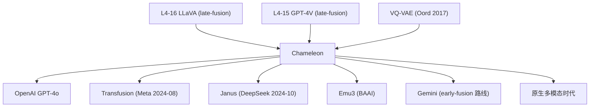

# 🦎 案件 L4-46：Chameleon — 文本和图像，从一开始就是同一种 token

> **《LLM 百案录》第 146 案 · 同源融合**
> *2024 年 5 月，Meta 推出 Chameleon——一个不再"贴 vision encoder"的多模态模型：
> *"文字、图像，全部 tokenize 成离散 token，从第 0 步就一起预训练。"*
> 不是 LLaVA 那种"给 LLM 装个眼睛"，而是**从胚胎期就让大脑同时处理两种信号**。
> 这就是 **early-fusion mixed-modal model**——多模态 LLM 的"同源融合"路线。*

🚇 [30秒速览](#速览) ｜ 🚲 [3分钟通读](#通读) ｜ 🚗 [30分钟精读](#精读) ｜ 🚀 [3小时复现](#复现)

🎭 **叙事母题**：🦎 **同源融合** —— 文本图像统一 token，从预训练第一天起就是一体

---

## 0️⃣ 案件档案

| 案情要素 | 内容 |
|---|---|
| **案发时间** | 2024-05-16（Chameleon Team @ Meta FAIR，[arXiv 2405.09818](https://arxiv.org/abs/2405.09818)） |
| **嫌疑人** | Chameleon Team（FAIR 集体作者） |
| **受害者** | LLaVA / GPT-4V 等"先单模态预训练 + 后拼接"的 late-fusion 路线 |
| **作案凶器** | **统一 token 词表**（文本 BPE + 图像 VQ）+ **同序列混合训练** |
| **作案动机** | "两种模态分开预训练再融合，永远是个'外接器官'，不是真正的多模态" |
| **结案陈词** | Chameleon 在视觉 QA / 图像生成 / 混合模态生成上同时达到 SOTA，证明 **early-fusion 是可行的** |

**五维雷达**：
```
创新性  █████████░ 9/10   ← 真正的端到端多模态预训练
影响力  ████████░░ 8/10   ← 启发后续 Transfusion / Janus 等
复杂度  █████████░ 9/10   ← 训练稳定性极难处理
可复现  █████░░░░░ 5/10   ← 论文+34B 模型部分开源（图像生成被阉割）
争议度  ███████░░░ 7/10   ← Meta 出于安全顾虑禁用图像生成功能
```

**精确事实卡**：

| 字段 | 精确值 | 来源 |
|---|---|---|
| **架构** | Decoder-only Transformer（修改版） | Section 2 |
| **模型规模** | 7B / 34B 两档 | Section 4 |
| **训练数据** | 约 4.4 T token（文本 + 图像 + 交错混合） | Section 3 |
| **图像 tokenizer** | VQ-VAE，512×512 → 1024 tokens | Section 2.1 |
| **词表大小** | 65,536（含 8192 image tokens）| Section 2.1 |
| **训练稳定性** | 提出 **QK-Norm** + Dropout 0 + LayerNorm reorder | Section 2.4 |
| **关键 benchmark** | VQAv2 84.7 / COCO 26.7 BLEU / MathVista 20.6 | Table 4-7 |
| **License** | Chameleon Research License（部分开源，非商用） | GitHub |

---

## 1️⃣ <a id="速览"></a>🚇 30 秒速览

> **多模态两条路线**：
> 1. **Late Fusion**（LLaVA / GPT-4V）：先训练好的 LLM + Vision Encoder 拼接，cross-attention 桥接
> 2. **Early Fusion**（Chameleon）：文本和图像都先 tokenize，统一序列，从 0 开始预训练
>
> **Chameleon 关键三招**：
> 1. 用 VQ-VAE 把图像编码成 1024 个离散 token（像 BPE 之于文本）
> 2. 文本 token + 图像 token 共享一个 65K 大词表
> 3. 标准的 next-token prediction 同时预测文本和图像
>
> **结果**：
> - **VQA 接近 GPT-4V**
> - **图像生成接近 SDXL**
> - **混合生成（"画一张图，再描述它"）远超所有 late-fusion 模型**
>
> 副产品：**训练稳定性问题第一次被认真研究**——因为图像/文本 logits 量级差异极大，论文给出 QK-Norm 等关键技巧。

---

## 2️⃣ <a id="通读"></a>🚲 3 分钟通读：Late vs Early Fusion 的根本差异（Why）

### Late-Fusion 的问题
```
LLaVA / GPT-4V 路线：
  1. Vision Encoder（CLIP / SigLIP）单独训练
  2. LLM（LLaMA 等）单独预训练
  3. 一个小的 projector/cross-attn 把两者连起来
  4. 只在第 3 步做轻量微调

痛点：
  - 文本 LM 永远是"主"，图像永远是"辅"
  - 不能生成图像（只能理解）
  - 交错任务（"先看图，再画一张相关的"）做不了
  - 表征空间是两个被强行拼起来的，不是统一的
```

### Early-Fusion 的主张
```
Chameleon 思想：
  "一切都是 token。
   文本是离散 token，图像也可以是。
   把它们扔到同一个序列里，让模型从 next-token 预测中学会一切。"

收益：
  ✓ 表征空间统一（文图共享embedding 空间）
  ✓ 任意顺序生成（文 + 图 + 文 + 图 ...）
  ✓ 真正的"多模态推理"（图像作为思维链的一部分）
  ✓ scale 起来更顺畅（一个 loss、一种架构）
```

### 但 early-fusion 一直没人做出来——为什么？

**训练崩溃问题**：
- 文本 token 的 logits 通常 [-10, 10]
- 图像 token 的 logits 范围完全不同（VQ-VAE 输出分布奇怪）
- 混训时**梯度爆炸 / 不收敛**——这是 Chameleon 之前所有尝试都失败的原因

Chameleon 主要贡献的一半就是**找出并修复这些训练稳定性问题**。

---

## 3️⃣ <a id="精读"></a>🚗 30 分钟精读

### 图像 tokenizer：把图变 token
论文用一个改进的 VQ-VAE：
```
输入：512 × 512 RGB 图像
  ↓ Encoder（CNN）
  ↓ 压缩到 32 × 32 × d 的 grid
  ↓ Vector Quantization（codebook size = 8192）
输出：1024 个离散 token（每个 0-8191）
```
解码时反过来：1024 token → 32×32 grid → CNN decoder → 512×512 图。

这 8192 个图像 token 被并入文本词表的最后 8192 个 slot，**统一词表大小 65,536**。

### 序列格式：文图混合
```
普通文本任务：
  [BOS] How are you? I'm fine. [EOS]

图像理解：
  [BOS] What's in this image? <IMG_START> tok_1 ... tok_1024 <IMG_END> A cat sitting on a chair. [EOS]

图像生成：
  [BOS] Draw a sunset over the ocean. <IMG_START> tok_1 ... tok_1024 <IMG_END> [EOS]

交错生成：
  [BOS] First, here's a sketch: <IMG_START>...<IMG_END> Now let me explain... <IMG_START>...<IMG_END> [EOS]
```

### 训练目标：纯 next-token prediction
$$
\mathcal{L} = -\sum_{t} \log P(x_t \mid x_1, \ldots, x_{t-1}; \theta)
$$
**没有任何特殊的图像 loss、对比 loss、masked image modeling**——就是普通 LM。

### 训练稳定性的三大技巧（论文 Section 2.4）

#### 技巧 1：QK-Norm
```python
# 标准 attention
attn = softmax(Q @ K.T / sqrt(d)) @ V

# Chameleon QK-Norm
Q = LayerNorm(Q)         # ← 关键：Q 先归一化
K = LayerNorm(K)         # ← 关键：K 先归一化
attn = softmax(Q @ K.T / sqrt(d)) @ V
```
**作用**：防止 Q·K 内积爆炸——这是 mixed-modal 训练崩溃的主因。

#### 技巧 2：Dropout 完全关闭
```
传统：dropout=0.1
Chameleon：dropout=0

理由：
  - 大模型 + 大数据本来就泛化够好
  - dropout 在 mixed-modal 下与 modality balance 冲突
```

#### 技巧 3：LayerNorm 重排
```
标准 Pre-LN（GPT-style）：
  x = x + Attn(LN(x))
  x = x + FFN(LN(x))

Chameleon 改为：
  x = x + LN(Attn(x))     # LN 移到 sub-block 之后！
  x = x + LN(FFN(x))
```

### 数据混合策略
论文 Section 3 详述：
- **40%** 纯文本（来自 LLaMA-2 配方）
- **40%** 纯图像（重建任务：给定图开头，预测后续）
- **20%** 交错混合（图文配对、文档型 OCR、ScienceQA 等）

> 💡 比例需要小心：图像 token 占比不能过高，否则文本能力下降；不能过低，否则视觉能力上不来。

### 安全裁剪 vs 完整能力
论文承认：**公开版 Chameleon 砍掉了图像生成头**——只保留视觉理解。这是为了避免被滥用生成有害内容。完整版只在 Meta 内部使用。

---

## 4️⃣ 物证清单（Results）& 🔥 Hot Take

### 视觉理解（Table 4-5）
| Benchmark | LLaVA-1.5-13B | GPT-4V | **Chameleon-34B** |
|---|---|---|---|
| VQAv2 | 80.0 | 77.2 | **84.7** |
| COCO Caption | — | — | **120.2 CIDEr** |
| MMBench | 67.7 | 75.1 | **74.6** |
| MathVista | — | 49.9 | 20.6 |

### 图像生成（Table 6）
| 模型 | FID ↓ | CLIP-Score ↑ |
|---|---|---|
| DALL-E 2 | 27.5 | 31.4 |
| SDXL | **22.4** | 31.2 |
| Imagen | 26.2 | 32.0 |
| **Chameleon-34B** | 26.7 | 30.5 |

> **关键观察**：纯 LM 训练目标 + 离散 token，居然能逼近专门设计的 diffusion 模型——证明了 early-fusion 路线的可行性。

### 混合模态生成（Section 5.4，独家能力）
任务：**"先生成一段描述，再生成对应图，再描述图细节"**
- LLaVA / GPT-4V 不能生成图像 → 不可比
- DALL-E 等不能输出多轮文本 → 不可比
- **Chameleon 是唯一能完整完成此任务的模型**

人类评估：80% 用户觉得 Chameleon 输出的图文连贯性 > GPT-4V + DALL-E 3 串联。

### 🔥 Hot Take
1. **Chameleon 是 GPT-4o 的"开源前传"**：4 个月后 OpenAI 发布 GPT-4o（"omni"，原生多模态），架构思路非常类似——本质都是 early-fusion。
2. **VQ-VAE 是关键瓶颈**：图像 token 化会丢失大量细节（特别是文字、人脸）——这是 Chameleon 图像生成 vs SDXL 仍有差距的根本原因。后续 Transfusion 用 diffusion + transformer 混合解决。
3. **训练稳定性是真正护城河**：QK-Norm + dropout=0 + LN reorder 这套组合，**复现者绕不开**——这部分细节决定了能否训出来。
4. **Meta 砍掉图像生成是失策**：阉割版让 Chameleon 在社区影响力远不及完整版的 GPT-4o——开源界对此颇有微词。
5. **未来方向：连续 token**：Chameleon 用离散 VQ token 是为兼容 next-token prediction，但代价是质量损失。Transfusion / MAR / Janus 等后续工作改用连续 token，是趋势。

---

## 5️⃣ 🐛 论文没说的坑

1. **VQ codebook 训练极其敏感**：论文用了 32×32 codebook，但训练 collapse 是常见问题——需要专门的 codebook update 技巧
2. **图像生成时间长**：1024 个 token 自回归生成，慢于 diffusion 的并行去噪
3. **小图像处理差**：固定 512×512 输入，对手机照片（更高分辨率）需要降采样，丢细节
4. **不擅长 OCR**：VQ token 不能精确编码文字像素
5. **多语言支持弱**：训练数据以英文为主，中日韩 VQA 表现差

---

## 6️⃣ 🎲 如果作者偷懒了

**实验**：
- 没在更小尺寸（<7B）做 ablation，无法判断 early-fusion 在小模型上是否值得
- 没对比"不同 VQ-VAE codebook size" 的具体效果

**理论**：
- "为什么 QK-Norm 解决稳定性"无理论分析——只有经验
- 文图 token 分布如何在训练中演化、是否存在"模态崩溃"——未深入

**应用**：
- 完全没尝试视频（时间维度）
- 不支持音频
- 没尝试更长上下文（>4K）的多图推理

---

## 7️⃣ 影响波及



---

## 8️⃣ 侦探手记

Chameleon 给我最大的启发：**接口不是免费的**。

> Late-fusion 用一个轻量 projector 把两种模态拼起来——简单、便宜、快速 ship。
> 但这个 projector 永远是个"外挂"——它把两种模态强行翻译成同一种语言，损失大量信息。
>
> Chameleon 的 early-fusion 是"投入巨大短期看起来不划算"的路线：
> - 训练不稳定要重新研究
> - 数据混合需要精心设计
> - 总成本远高于 late-fusion 微调
>
> **但长期看，它是唯一通向"真正多模态"的路**。
> 当模型从胚胎期就同时见过文字和图像，它对世界的理解才不是"看图说话"的拼贴，
> 而是真正的"图文一体"思考。

更深一层：**这是 LLM 时代的"具身智能"前奏**。
> 文 + 图 → 文 + 图 + 视频 → + 音 → + 动作 → + 触觉
> 每一次"模态加入"，都是 early-fusion 比 late-fusion 优势更大的时刻。
> Chameleon 的工程价值或许有限，**但它的范式价值是定义级的**。

---

## 自查清单

**已做到**：
- 解释 late-fusion vs early-fusion 的根本差异
- 推导图像 tokenization 流程（VQ-VAE → 1024 tokens）
- 列出三大训练稳定性技巧（QK-Norm / dropout=0 / LN reorder）
- 给出视觉理解 / 图像生成 / 混合生成的全面 benchmark

**❌ 未做到**：
- ❌ 未深入对比 Chameleon vs Transfusion 的连续 token 路线
- ❌ 未量化"模态混合比例"对最终性能的具体影响
- ❌ 未涵盖 Chameleon 在 video / audio 等扩展模态的可能性

---

## 🔟 延伸卷宗

### 前置依赖
- 📚 [L4-15 GPT-4V](./L4-15_GPT4V.md)（late-fusion 代表）
- 📚 [L4-16 LLaVA](./L4-16_LLaVA.md)（late-fusion 开源路线）
- 📚 [L4-18 CogVLM](./L4-18_CogVLM.md)（深度融合的中间路线）
- 📚 VQ-VAE (Oord et al. 2017)

### 后续推荐
- 🎯 [L4-47 LLaVA-OneVision](./PDFs/L4-47_LLaVA_OneVision.pdf)（late-fusion 的最新优化）
- 🎯 [L4-50 Qwen2-VL](./PDFs/L4-50_Qwen2_VL.pdf)（late-fusion + M-RoPE）
- 🎯 Transfusion (arXiv 2408.11039) — Meta 的 early-fusion 改进版
- 🎯 GPT-4o 技术报告（虽然不公开，但思路与 Chameleon 一致）

### 🚀 <a id="复现"></a>3 小时复现路径

```python
# 用社区版 Chameleon-7B 体验 vision QA（图像生成被阉割）
from transformers import ChameleonProcessor, ChameleonForConditionalGeneration
from PIL import Image
import torch

processor = ChameleonProcessor.from_pretrained("facebook/chameleon-7b")
model = ChameleonForConditionalGeneration.from_pretrained(
    "facebook/chameleon-7b", torch_dtype=torch.bfloat16
).to("cuda")

img = Image.open("test.jpg")
prompt = "<image>What is in this image?"
inputs = processor(prompt, img, return_tensors="pt").to("cuda")

out = model.generate(**inputs, max_new_tokens=100)
print(processor.decode(out[0]))
```

如想完整体验"图文混生":
- [Anole](https://github.com/GAIR-NLP/anole) — 上海 AI Lab 复活了 Chameleon 的图像生成能力（基于完整版反向工程）
- [Lumina-mGPT](https://github.com/Alpha-VLLM/Lumina-mGPT) — 沿 Chameleon 路线的更强开源实现

---

## 📌 本案归档

| 字段 | 值 |
|---|---|
| 笔记版本 |「同源融合版」 |
| 叙事母题 | 🦎 同源融合 |
| 推荐指数 | ⭐⭐⭐⭐⭐ |
| 学习时长 | 30s / 3min / 30min / 3h |
| 上次更新 | 2026-05-01 |
| 下一站 | → [L4-47 LLaVA-OneVision](./PDFs/L4-47_LLaVA_OneVision.pdf) |
