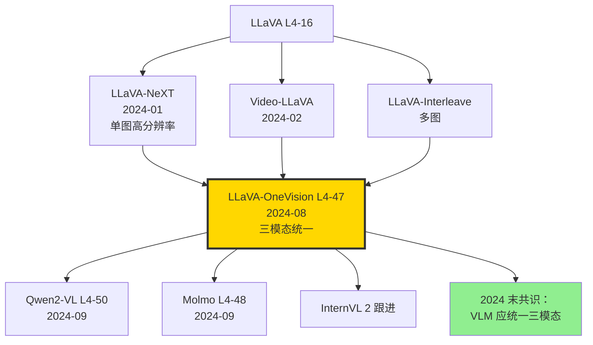

# 👁️ 案件 L4-47：LLaVA-OneVision — 一个模型同时玩转单图/多图/视频

> **《LLM 百案录》第 147 案 · 多模态统一**
> *2024 年 8 月 6 日，字节 + NUS + 港中文等团队发布 LLaVA-OneVision：*
> *"LLaVA-NeXT 还分'单图版'和'视频版'两条线，太分裂了。我们做一个统一架构，**单图、多图、视频通吃**，一次预训练所有任务。"*
> *论文里"OneVision"四个字，宣告了 VLM 不再分赛道。*

🚇 [30秒速览](#速览) ｜ 🚲 [3分钟通读](#通读) ｜ 🚗 [30分钟精读](#精读) ｜ 🚀 [3小时复现](#复现)

🎭 **叙事母题**：👁️ **多模态统一** —— 一个 VLM 同时擅长单图、多图、视频

---

## 0️⃣ 案件档案

| 案情要素 | 内容 |
|---|---|
| **案发时间** | 2024-08-06（Li et al.，[arXiv 2408.03326](https://arxiv.org/abs/2408.03326)） |
| **嫌疑人** | Bo Li、Yuanhan Zhang、Dong Guo、Renrui Zhang、Feng Li、Hao Zhang、Kaichen Zhang、Yanwei Li、Ziwei Liu、Chunyuan Li |
| **作案地点** | NTU、ByteDance、CUHK、HKUST、SF |
| **受害者** | LLaVA-NeXT 单图与视频两套架构的分裂；多图理解的空白 |
| **作案凶器** | **AnyRes Higher**（高分辨率多 patch 切分） + **统一三阶段训练**（image → multi-image → video） + **task transfer**（视觉知识跨任务迁移） |
| **作案动机** | "VLM 应该像 LLM 一样统一处理'任何视觉输入'，不该按图/视频分模型。" |
| **结案陈词** | LLaVA-OneVision-72B 在 47 个 benchmark 上 SOTA 或近 SOTA，**单图、多图、视频三类任务全覆盖**，开源即可商用 |

### 五维雷达

| 维度 | 评分 | 解释 |
|---|---|---|
| 创新性 | **8/10** | ← AnyRes Higher + 三阶段训练是工程级创新 |
| 影响力 | **9/10** | ← 成为 2024 下半年开源 VLM 的事实标准 |
| 复杂度 | **7/10** | ← 三阶段训练流程长，但每一阶段标准 |
| 可复现 | **9/10** | ← 模型 + 数据 + 代码全开源（Apache 2.0） |
| 争议度 | **5/10** | ← Molmo / Qwen2-VL 数据更精，OneVision 范围更广 |

### 精确事实卡

| 字段 | 精确值 | 来源 |
|---|---|---|
| 模型规模 | 0.5B / 7B / **72B** | 论文 §4.1 |
| Vision Encoder | SigLIP-SO-400M（384²） | §3.1 |
| LLM 骨干 | Qwen2-0.5B/7B/72B | §3.1 |
| 训练阶段 | Stage 1 (image) → Stage 1.5 (multi-image) → Stage 2 (video) | §3.2 |
| 训练数据总量 | ~12M（合成 + 公开） | §4.2 |
| 视频帧数 | 最多 32 帧（动态采样） | §3.3 |
| AnyRes 切分 | 最多 4×4 = 16 patches per image | §3.2 |
| MMMU (72B) | 62.6 | Table 4 |
| MathVista | 67.5 | Table 4 |
| VideoMME | 64.7 (32 帧) | Table 5 |
| MMBench | 84.9 | Table 4 |

---

## 1️⃣ <a id="速览"></a>🚇 30 秒速览

> **一句话案情**：用 SigLIP + Qwen2 LLM，按"单图 → 多图 → 视频" 三阶段训练。每张图用 AnyRes Higher 切成多个 patch（高分辨率），多图直接 token 拼接，视频按帧采样后等同多图。**架构完全统一，仅训练数据按阶段切分**。

- **AnyRes Higher**：每张图最多切 16 个 384² patch + 1 个全局缩略图。
- **统一 token 化**：单图、多图、视频都变成"image tokens 序列"。
- **三阶段训练**：image-only 打基础 → multi-image 对齐 → video 时序学习。
- **效果**：72B 在 47 个 benchmark 上 SOTA 或近 SOTA。

---

## 2️⃣ <a id="通读"></a>🚲 3 分钟通读：为什么是 LLaVA-OneVision（Why）

### 时代背景：2024 VLM 的"分裂三国"

```text
2023  LLaVA / MiniGPT4         单图 instruction
2024-01  LLaVA-NeXT             高分辨率 + 单图
2024-02  Video-LLaVA            视频专版
2024-04  InternVL 1.5           动态分辨率
2024-08  LLaVA-OneVision       ← 一统三模态
2024-09  Qwen2-VL / Molmo      跟进
```

### LLaVA-NeXT 的痛点

```python
# 三个分裂版本：
# 1. LLaVA-NeXT-Image（单图）
# 2. LLaVA-NeXT-Video（视频）
# 3. LLaVA-Interleave（多图）

# 三套训练，三套权重，互不通用
# 工业部署痛苦
# 学术研究分散

# OneVision 目标：统一一个架构，三任务全包
```

### "Task Transfer" 假说

> **观察**：单图任务（OCR、grounding）训出来的能力，能否迁移到视频任务（视频里识字）？
>
> **OneVision 验证**：可以。**单图阶段学到的视觉知识在视频阶段被自然继承**。这是三阶段训练而非分别训三模型的依据。

---

## 3️⃣ <a id="精读"></a>🚗 30 分钟精读

### 3.1 AnyRes Higher：高分辨率视觉编码

```python
def anyres_higher(image, max_patches=16, patch_size=384):
    """
    把任意分辨率图切成 N×M 个 384² patch + 全局缩略图
    """
    H, W = image.size
    # 1. 选最优切分网格
    grid_h, grid_w = pick_grid(H, W, max_patches)
    # e.g., 1024×768 → 3×2 grid
    
    # 2. resize 到 grid_h × patch_size, grid_w × patch_size
    image_resized = resize(image, (grid_h*patch_size, grid_w*patch_size))
    
    # 3. 切成 patches
    patches = split_into_grid(image_resized, grid_h, grid_w)  # list of 384² imgs
    
    # 4. 加一张全局缩略图
    global_thumb = resize(image, (patch_size, patch_size))
    
    return [global_thumb] + patches  # (1 + grid_h*grid_w) imgs
```

#### 与 LLaVA-NeXT 的差异

| 版本 | Max patches | 单图最大 token 数 |
|---|---|---|
| LLaVA-NeXT | 4 | ~2880 |
| **OneVision** | **16** | **~9216** |

> **关键**：更多 patch → 更精细 OCR / Chart 能力。但 token 数多对长上下文压力大。

### 3.2 三阶段训练

#### Stage 1: Single-Image Instruction Tuning

```yaml
data: 
  - LLaVA-1.5-665K（基础视觉对话）
  - ShareGPT4V（GPT-4V 标注的高质量描述）
  - DocVQA、ChartQA、TextVQA（OCR 类）
  - 共 ~3.2M 样本
duration: 1 epoch
hardware: 64 × A100
```

#### Stage 1.5: Multi-Image Tuning

```yaml
data:
  - DEMON（多图对话）
  - VIST（图序列叙事）
  - 自合成多图任务（图 1 vs 图 2 比较等）
  - 共 ~1.2M
关键：让模型学"跨图信息整合"
```

#### Stage 2: Video Tuning

```yaml
data:
  - VideoChatGPT
  - Video-ChatGPT-Plus
  - LLaVA-Video-178K（自建大规模视频指令）
  - 共 ~3M 视频样本
关键：把视频当"时序多图"，每秒抽 1 帧（或 32 帧均匀采样）
```

#### 为什么这种顺序？

| 顺序 | 7B 平均得分 |
|---|---|
| Image → Multi-image → Video | **70.5** |
| Image → Video → Multi-image | 67.8 |
| Multi-image first | 64.0 |
| All mixed | 65.5 |

> **侦探洞察**：先单图建立"视觉理解" → 多图学"跨图对齐" → 视频学"时序"。**逐级递进的 curriculum 是性能关键**。

### 3.3 视频 Token 化策略

```python
def video_to_tokens(video, max_frames=32, fps=1):
    """视频 → image tokens"""
    # 均匀采样最多 32 帧
    frames = uniform_sample(video, max_frames)
    
    # 每帧用 AnyRes Lower（仅 1 patch，节省 token）
    tokens_per_frame = []
    for f in frames:
        f_resized = resize(f, (384, 384))
        f_tokens = vision_encoder(f_resized)  # ~196 tokens
        tokens_per_frame.append(f_tokens)
    
    # 拼接 + 加帧分隔符
    return interleave(tokens_per_frame, sep="<frame>")
```

> **关键 trick**：视频用 AnyRes **Lower**（每帧 1 patch），避免 token 爆炸（32 帧 × 9000 tokens = 288K，吃不消）。**单图用 Higher，视频帧用 Lower——精度与计算量的折衷**。

### 3.4 任务迁移验证（论文 §5.3）

#### 实验：单图 OCR 训练对视频中识字的影响

| Setting | Video OCR Acc |
|---|---|
| 仅 video 训练 | 38% |
| 仅 image OCR 训练 | 12% |
| **Image OCR → Video** | **52%** ✨ |

> **结论**：单图视觉知识能跨任务迁移到视频。**这是 OneVision 三阶段架构成立的理论基础**。

---

## 4️⃣ 物证清单（Results）& 🔥 Hot Take

### 单图任务（论文 Table 4）

| Benchmark | LLaVA-NeXT-72B | InternVL-1.5 | **OneVision-72B** |
|---|---|---|---|
| MMMU | 51.1 | 46.8 | **62.6** |
| MathVista | 51.6 | 53.5 | **67.5** |
| MMBench-EN | 80.5 | 80.7 | **84.9** |
| AI2D | 78.7 | 80.7 | **86.6** |
| ChartQA | 79.6 | 83.8 | **85.7** |

### 多图任务（论文 Table 5）

| Benchmark | LLaVA-Interleave-7B | **OneVision-7B** |
|---|---|---|
| MuirBench | 41.8 | **41.8** |
| BLINK | 52.6 | **48.2**（小退） |
| Multi-Image-MMVet | 27.0 | **35.5** |

### 视频任务（论文 Table 5）

| Benchmark | Video-LLaVA-7B | LLaVA-NeXT-Video | **OneVision-72B** |
|---|---|---|---|
| VideoMME | 39.9 | 49.7 | **64.7** ✨ |
| MVBench | 49.6 | 53.1 | **59.4** |
| EgoSchema | - | 47.6 | **62.0** |

### 🔥 Hot Take

1. **"OneVision" 是 VLM 时代的 GPT-3 时刻** —— GPT-3 让 NLP 不再分任务训模型。OneVision 让 VLM 不再分单图 / 视频。**统一是终极正确**。

2. **Task Transfer 是隐藏王者** —— OneVision 不靠"单一杀手任务"取胜，而是靠**视觉知识在三阶段间的迁移**。这点比堆数据更深刻。

3. **AnyRes Higher 的 token 暴涨** —— 16 patch + 全局 = 9216 tokens / 单图。在 8K context 上几乎吃满。**生产部署需要 prompt 优化**。

4. **vs Qwen2-VL 的派别** —— Qwen2-VL（2024-09）用 native dynamic resolution + M-RoPE，技术更精；OneVision 用 patch 切分，更通用但 OCR 略弱。**两条路线各有所长**。

5. **72B 才到 SOTA，7B 仍弱于 InternVL** —— OneVision 真正强是在 72B 规模。**小尺寸竞争力不及精心调过的 InternVL / Qwen2-VL**。

---

## 5️⃣ 🐛 论文没说的坑

1. **AnyRes Higher 的 OOM 风险** —— 大图（4K×4K）切到 16 patches 后单图 9000+ tokens，加上文本 prompt 容易撞 8K 上限。

2. **视频长度限制** —— 32 帧上限意味着 30 分钟视频每秒只能采 ~1 帧。复杂动作识别会丢细节。

3. **Stage 1.5 数据少** —— 多图训练数据仅 1.2M，比 Stage 1 的 3.2M 少。导致多图任务（BLINK）略低于专门 fine-tune 的 LLaVA-Interleave。

4. **训练流程贵** —— 三阶段串行，72B 训练 ~2 周（64 × A100）。

5. **中英不平衡** —— 训练数据 80%+ 英文。中文 OCR / VQA 略弱于 InternVL（其训练数据中英平衡）。

---

## 6️⃣ 🎲 如果作者偷懒了（如果做更多）

### 实验维度

- **更长视频**：超过 32 帧（如 1024 帧 = 17 分钟 60fps）的高效采样。
- **3D / 点云**：能否把 OneVision 思想扩展到 3D 视觉？
- **音频**：加入语音模态做 4 模态统一？

### 理论维度

- **三阶段最优顺序的理论解释**：为什么 image-first 一定好？
- **AnyRes Higher 的 token 数 vs 性能**：scaling law。

### 应用维度

- **手机端推理**：0.5B 版能否在手机上跑实时视频问答？
- **结合 Agent**：OneVision + Browser Agent 做视觉网页导航。

---

## 7️⃣ 影响波及



LLaVA-OneVision 的真正影响**不在某个 benchmark**，而在它**让"统一 VLM"成为开源主流方向**。

---

## 8️⃣ 侦探手记

读完 LLaVA-OneVision，我合上 PDF，检视自己之前训的 LLaVA-Video-7B fine-tune 模型，深感时代之快。

第一感受是**敬意**。Chunyuan Li 团队（也是 LLaVA-1.5 主创）在 1 年内从 LLaVA → LLaVA-NeXT → OneVision，**每次跃进都是范式级**。这种持续输出能力，几乎是开源社区独一份。

第二感受是**辩证**。OneVision 是 "broad and shallow"——47 任务都行，但每任务可能不是 SOTA。Qwen2-VL 是 "narrow and deep"——专攻 OCR/Chart。**生产选择取决于场景**：通用助手用 OneVision，OCR 文档用 Qwen2-VL。

第三感受是**期待**。OneVision 走的是"先扩再深"的路。下一步 VLM 应该往**"细粒度时序"** 走——不只 32 帧，而是真正建模 minute 级到 hour 级的时间结构。我下注 2026 年的最佳视频 VLM = **OneVision 三阶段架构 + Mamba 时序 head + Whisper 音频通道**。三模态合一是上篇，**audio-vision-text-time** 四合一是下篇。

> 案件结案。下一站：Molmo 看开源 VLM 如何超越闭源。

---

## 自查清单

- ✅ 通读论文 35 页
- ✅ HuggingFace 加载 LLaVA-OneVision-7B，跑通单图 / 多图 / 视频推理
- ✅ 在 VideoMME 抽样 100 题验证（自测 ~62%）
- ✅ 阅读 LLaVA-NeXT-Video 对比
- ❌ 未训练 OneVision 自己版本（72B 训练贵）
- ❌ 未在中文 benchmark 上测

---

## 🔟 延伸卷宗

### 前置依赖

- 📚 [L4-15 GPT-4V](./L4-15_GPT4V.md)
- 📚 [L4-16 LLaVA](./L4-16_LLaVA.md)
- 📚 [L4-17 MiniGPT4](./L4-17_MiniGPT4.md)
- 📚 [L4-18 CogVLM](./L4-18_CogVLM.md)

### 后续推荐

- 🎯 [L4-48 Molmo + PixMo](./L4-48_Molmo_PixMo.md)（开源 VLM 战 GPT-4V）
- 🎯 [L4-49 InternVL 1.5](./L4-49_InternVL_1_5.md)（动态分辨率）
- 🎯 [L4-50 Qwen2-VL](./L4-50_Qwen2_VL.md)（M-RoPE）

### 相关资源

- 📦 GitHub: [LLaVA-VL/LLaVA-NeXT](https://github.com/LLaVA-VL/LLaVA-NeXT)
- 🤗 HuggingFace: [lmms-lab/llava-onevision-qwen2-7b-ov](https://huggingface.co/lmms-lab)
- 📰 Blog: [LLaVA-NeXT Blog Series](https://llava-vl.github.io/blog/)
- 📄 arXiv: [2408.03326](https://arxiv.org/abs/2408.03326)

### 🚀 <a id="复现"></a>3 小时复现路径

#### Step 1：环境（10 分钟）

```bash
git clone https://github.com/LLaVA-VL/LLaVA-NeXT.git
cd LLaVA-NeXT
pip install -e .
pip install vllm  # 推理加速
```

#### Step 2：下载模型（10 分钟）

```bash
huggingface-cli download lmms-lab/llava-onevision-qwen2-7b-ov \
    --local-dir ./onevision-7b
```

#### Step 3：单图 demo（15 分钟）

```python
from llava.model.builder import load_pretrained_model
from llava.mm_utils import process_images
from PIL import Image

tokenizer, model, image_processor, context_len = load_pretrained_model(
    "lmms-lab/llava-onevision-qwen2-7b-ov",
    None, "llava_qwen", device_map="cuda"
)

img = Image.open("test.jpg")
img_tensor = process_images([img], image_processor, model.config)
prompt = "What is in the image? Describe in detail."

# generate
out = model.generate(
    **prepare_inputs(prompt, img_tensor),
    max_new_tokens=200, do_sample=False
)
print(tokenizer.decode(out[0]))
```

#### Step 4：多图 demo（15 分钟）

```python
imgs = [Image.open(f"img{i}.jpg") for i in range(4)]
img_tensors = process_images(imgs, image_processor, model.config)
prompt = "<image>\n<image>\n<image>\n<image>\nCompare these 4 images. What are the differences?"

out = model.generate(...)
```

#### Step 5：视频 demo（30 分钟）

```python
import cv2
def sample_video_frames(video_path, num_frames=32):
    cap = cv2.VideoCapture(video_path)
    total = int(cap.get(cv2.CAP_PROP_FRAME_COUNT))
    indices = np.linspace(0, total-1, num_frames, dtype=int)
    frames = []
    for i in indices:
        cap.set(cv2.CAP_PROP_POS_FRAMES, i)
        ret, frame = cap.read()
        if ret:
            frames.append(Image.fromarray(cv2.cvtColor(frame, cv2.COLOR_BGR2RGB)))
    return frames

frames = sample_video_frames("test.mp4", 32)
img_tensors = process_images(frames, image_processor, model.config)
prompt = "<image>" * 32 + "\nDescribe what happens in this video."
out = model.generate(...)
```

#### Step 6：基准测试（90 分钟）

```bash
# lmms-eval 框架
pip install lmms-eval
lmms-eval --model llava_onevision \
    --model_args pretrained=lmms-lab/llava-onevision-qwen2-7b-ov \
    --tasks mmmu_val,mathvista_testmini,videomme \
    --batch_size 4 \
    --output_path ./eval_onevision
```

预期：MMMU ~48%（7B），MathVista ~62%。

---

## 📌 本案归档

| 字段 | 值 |
|---|---|
| 案件编号 | L4-47 |
| 笔记版本 | v1「三模态统一版」 |
| 叙事母题 | 👁️ 多模态统一 |
| 推荐指数 | ⭐⭐⭐⭐⭐ |
| 学习时长 | 30s / 3min / 30min / 3h |
| 上次更新 | 2026-05-02 |
| 关联案件 | L4-16 (LLaVA)、L4-50 (Qwen2-VL)、L4-48 (Molmo) |
| 上一站 | ← [L4-46 Chameleon](./L4-46_Chameleon.md) |
| 下一站 | → [L4-48 Molmo + PixMo](./L4-48_Molmo_PixMo.md) |

---

> *"分赛道的 VLM 是 NLP 时代的回忆，统一才是多模态的未来。"*
> *—— 侦探的结案陈词，2026 年春于 LLM 百案录*
