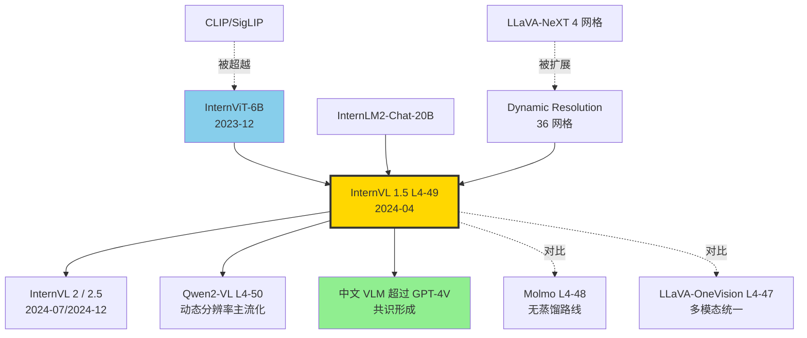

# 🌐 案件 L4-49：InternVL 1.5 — 开源 VLM 用动态分辨率与双语 OCR 缩小与闭源差距

> **《LLM 百案录》第 149 案 · 缩小差距**
> *2024 年 4 月 25 日，上海 AI Lab + 清华 + 商汤等团队发布 InternVL 1.5：*
> *"开源 VLM 与 GPT-4V 之间到底差在哪？我们认为是三件事：*
> ***视觉编码器太小、动态分辨率没用好、中文场景太弱**。我们一次解决。"*
> *论文标题里的 "Bridging Commercial Gap" 不是营销，是行业现实。*

🚇 [30秒速览](#速览) ｜ 🚲 [3分钟通读](#通读) ｜ 🚗 [30分钟精读](#精读) ｜ 🚀 [3小时复现](#复现)

🎭 **叙事母题**：🌐 **缩小开闭源差距** —— 用工程组合拳追平闭源 VLM

---

## 0️⃣ 案件档案

| 案情要素 | 内容 |
|---|---|
| **案发时间** | 2024-04-25（Chen et al.，[arXiv 2404.16821](https://arxiv.org/abs/2404.16821)） |
| **嫌疑人** | Zhe Chen、Weiyun Wang、Hao Tian、Shenglong Ye、Zhangwei Gao、Erfei Cui、Wenwen Tong、Kongzhi Hu、Jiapeng Luo、Zheng Ma、Ji Ma、Jiaqi Wang、Xiaoyi Dong、Hang Yan、Hewei Guo、Conghui He、Zhenjiang Jin、Chao Xu、Bin Wang、Xingjian Wei、Wei Li、Wenjian Zhang、Bo Zhang、Pinlong Cai、Licheng Wen、Xiangchao Yan、Pei Chu、Yi Wang、Min Dou、Changjiang Jiang、Xinyu Zhu、Jiang Wu、Lewei Lu、Tong Lu、Botian Shi、Limin Wang、Dahua Lin、Wenhai Wang、Yu Qiao、Jifeng Dai 等 |
| **作案地点** | 上海 AI Lab、清华、商汤、复旦、香港中文大学 |
| **受害者** | "开源 VLM 永远追不上 GPT-4V" 的悲观论 |
| **作案凶器** | **InternViT-6B**（持续学习 6B 视觉编码器） + **Dynamic High-Resolution**（最多 40 个 448² tile） + **双语数据混合**（中英 1:1 OCR/QA） |
| **作案动机** | "国内开源团队与闭源大厂的差距，是工程整合的差距，不是科研本质的差距。" |
| **结案陈词** | InternVL-Chat-V1.5（26B）在 18 个 benchmark 中 8 项**超过 GPT-4V**，中文 OCR / 中文 VQA 全面领先 |

### 五维雷达

| 维度 | 评分 | 解释 |
|---|---|---|
| 创新性 | **7/10** | ← 工程整合精妙，单点创新不算颠覆 |
| 影响力 | **9/10** | ← 国内 VLM 工业落地的事实标准，InternVL 2/2.5 后续受益 |
| 复杂度 | **8/10** | ← 6B 视觉模型 + 动态分辨率 + 多阶段训练 |
| 可复现 | **8/10** | ← 模型与训练数据多数开源，部分商业数据保留 |
| 争议度 | **5/10** | ← 是否真的"超过 GPT-4V"取决于 benchmark 选取 |

### 精确事实卡

| 字段 | 精确值 | 来源 |
|---|---|---|
| 总参数 | **26B**（6B vision + 0.05B MLP + 20B LLM） | 论文 §3.1 |
| Vision Encoder | **InternViT-6B-448px-V1.5** | §3.2 |
| LLM 骨干 | **InternLM2-Chat-20B** | §3.1 |
| 投影层 | 2-layer MLP | §3.1 |
| **Tile 分辨率** | **448 × 448** | §3.3 |
| **Max tiles** | **40**（动态选择 1~40） | §3.3 |
| **最大输入分辨率** | 4K × 4K（约） | §3.3 |
| Pretrain 阶段数据 | 5.4B 中英图文对 | §4 |
| SFT 数据 | 12M 多任务样本 | §4 |
| MMMU (val) | **45.2** | Table 3 |
| DocVQA | **90.9** | Table 3 |
| TextVQA | **80.6** | Table 3 |
| ChartQA | **83.8** | Table 3 |
| OCRBench | **724** | Table 3 |

---

## 1️⃣ <a id="速览"></a>🚇 30 秒速览

> **一句话案情**：把视觉编码器**从常见的 0.3B（CLIP-L）放大到 6B**（InternViT-6B），把单图切成 **1~40 个 448² 动态 tile**（依据原图宽高比与面积），用 **5.4B 中英图文对**预训练 + **12M 中英 SFT** 微调。结果在 18 个 benchmark 中过半超过 GPT-4V。

- **InternViT-6B**：业内首个 >1B 的视觉编码器，配套 1.5 版本通过持续学习涨点。
- **Dynamic High-Resolution**：根据图像比例从 36 种 tile 网格中选最优。
- **双语强**：训练数据中英 1:1，中文 OCR 显著超过 GPT-4V。
- **架构常规**：vision + MLP + LLM，胜负在工程组件每一处的精打细算。

---

## 2️⃣ <a id="通读"></a>🚲 3 分钟通读：为什么是 InternVL 1.5（Why）

### 2024 春的开源 VLM 困境

```text
GPT-4V (2023-09)：闭源，单图 4K，中英文 OCR 接近商用级
LLaVA-1.5 (2023-10)：开源，单图 336²，中文几乎不可用
CogVLM (2023-11)：开源，336² + visual experts，英文强中文弱
MiniCPM-V (2024-02)：3B 端侧，分辨率仅 448²

差距：
  1. 开源视觉编码器小（CLIP-L 0.3B vs 闭源未知但更大）
  2. 分辨率低（336/448 vs 闭源支持任意大图）
  3. 中文场景训练数据不足
```

### InternVL 1.5 的三板斧

> **思路**：不发明新架构，把"已知有效但没人做到极致" 的三件事做到极致：
> 1. **视觉编码器扩大 20 倍**（CLIP-L 0.3B → InternViT 6B）
> 2. **动态分辨率做到 4K**（最多 40 个 tile）
> 3. **中英 1:1 训练数据**（5.4B pretrain + 12M SFT）

### "为什么 LLM 才 20B 但 vision 6B？"

```python
# 经典 VLM：vision 是辅助，LLM 是主角
LLaVA-1.5:  vision 0.3B + LLM 13B  ratio 1:43
CogVLM:     vision 4.4B + LLM 7B   ratio 1:1.6（视觉重）

# InternVL-1.5
vision 6B + LLM 20B → ratio 1:3.3

# 设计哲学：视觉理解是 VLM 的瓶颈
# 把视觉做大，让 LLM 看到更高质量的视觉表征
```

> **侦探洞察**：CogVLM 已经发现"视觉编码器值得做大"，但只到 4.4B。**InternVL 把它推到 6B 并做了 v1.5 持续学习升级**——这是在 visual encoder scaling 上做得最彻底的开源工作。

---

## 3️⃣ <a id="精读"></a>🚗 30 分钟精读

### 3.1 InternViT-6B-448px-V1.5：持续学习的视觉编码器

#### 代际谱系

| 版本 | 时间 | 关键变化 |
|---|---|---|
| InternViT-6B-224px | 2023-12 | 初版，224² 输入，CLIP 对比学习 |
| InternViT-6B-448px-V1.0 | 2024-01 | 升级到 448²，配 InternVL 1.0 |
| **InternViT-6B-448px-V1.5** | **2024-04** | **持续学习 + 高质量数据再训练** |

#### V1.5 持续学习配方

```yaml
起点: InternViT-6B-448px-V1.0
新增数据:
  - LAION-en (filtered, 4B)
  - LAION-zh (filtered, 1.4B)
  - COYO-700M (filtered)
  - Wukong (1B 中文图文)
  - 高质量 OCR 私有 (~50M)
学习率: 衰减后的 1e-5（避免 catastrophic forgetting）
冻结策略: 全模型解冻，但前几层学习率更小
duration: 7 天 × 256 × A100
```

> **关键**：不是从头训 InternViT-6B（会丢之前 V1 的能力），而是**继承 V1 权重做继续训练**。这是 vision encoder 第一次借鉴 LLM 的"continual pretraining"思路。

### 3.2 总体架构

```python
class InternVLChat(nn.Module):
    def __init__(self):
        self.vision = InternViT_6B_448px_V15()        # 6B
        self.mlp = nn.Sequential(                      # 50M
            nn.Linear(3200, 5120),
            nn.GELU(),
            nn.Linear(5120, 5120),
        )
        self.llm = InternLM2_Chat_20B()                # 20B

    def forward(self, image, text_tokens):
        # 1. 动态分辨率切 tile（见 3.3）
        tiles, tile_pos_emb = dynamic_preprocess(image)
        # tiles: [N_tiles, 3, 448, 448], N in [1, 40]

        # 2. 每个 tile 经 InternViT 输出 256 tokens
        feats = self.vision(tiles)  # [N_tiles, 256, 3200]

        # 3. Pixel Shuffle 把 token 数压缩 4x
        feats = pixel_shuffle(feats, scale=0.5)  # [N_tiles, 64, 12800]
        feats = feats.view(N_tiles*64, 12800)    # 拍平到 1D

        # 4. 投影到 LLM 嵌入空间
        img_tokens = self.mlp(feats)  # [N_tiles*64, 5120]

        # 5. 与文本 token 拼接，喂 LLM
        return self.llm(concat(img_tokens, text_tokens))
```

> **🪄 Pixel Shuffle 小技巧**：256 tokens / tile 压成 64 tokens / tile（信息塞进 channel 维度），节省 4 倍 LLM 上下文。**40 tiles × 64 = 2560 tokens，可控**。如果不压缩 → 10240 tokens，吃不消。

### 3.3 Dynamic High-Resolution：核心算法

```python
TILE_GRID_CANDIDATES = [
    (1, 1), (1, 2), (2, 1), (1, 3), (3, 1), (2, 2),
    (1, 4), (4, 1), (1, 5), (5, 1), (2, 3), (3, 2),
    (1, 6), (6, 1), (2, 4), (4, 2), (3, 3), (2, 5),
    (5, 2), (1, 7), (7, 1), (3, 4), (4, 3), (1, 8),
    (8, 1), (2, 6), (6, 2), (4, 4), (3, 5), (5, 3),
    # ...总共 36 种比例，最多 1~40 tile
]

def dynamic_preprocess(image, max_tiles=40, tile_size=448):
    H, W = image.size
    aspect = W / H
    area = (W * H) / (tile_size * tile_size)

    # 1. 选最接近原图比例 + 总 tile 数 <= max_tiles 的网格
    best_grid = None
    best_score = -1
    for (gh, gw) in TILE_GRID_CANDIDATES:
        if gh * gw > max_tiles:
            continue
        target_aspect = gw / gh
        # 综合得分：比例匹配 + 面积匹配
        score = -abs(aspect - target_aspect) - abs(area - gh*gw) * 0.1
        if score > best_score:
            best_score = score
            best_grid = (gh, gw)

    gh, gw = best_grid
    # 2. resize 后切 tile
    image_resized = image.resize((gw*tile_size, gh*tile_size))
    tiles = [crop(image_resized, i, j, tile_size)
             for i in range(gh) for j in range(gw)]

    # 3. 加一张全局缩略图
    thumbnail = image.resize((tile_size, tile_size))
    return [thumbnail] + tiles
```

> **侦探洞察**：与 LLaVA-NeXT 的 4 个固定网格 (1×4, 4×1, 2×2, …) 不同，**InternVL 1.5 有 36 种网格**，更精细匹配长图（推文截图）/ 宽图（横幅）/ 方图（自然照片）。**这是一个看似简单实则深刻的工程优化**。

### 3.4 三阶段训练

#### Stage 1: Vision-Language Pretraining

```yaml
data: 5.4B 中英图文对
  - LAION-en (1.5B), LAION-zh (700M)
  - COYO (300M), Wukong (700M)
  - 自有图文 (1.2B)
  - 文档图文 (200M)
  - 中文 PDF / 网页截图 (100M, 包括 OCR)
冻结: vision encoder 部分冻结 + LLM 冻结
训练: MLP + 部分 vision layer 解冻
duration: 14 天 × 512 × A100
```

#### Stage 2: Vision-Language Generation Pretraining

```yaml
目的: 让 LLM 学会从图生成详细描述
data:
  - 高质量长 caption (200M)
  - GPT-4V 生成的长 caption (50M)（注意：这一步有蒸馏，不像 Molmo 完全无蒸馏）
冻结: vision encoder 冻结，MLP + LLM 解冻
duration: 5 天 × 256 × A100
```

#### Stage 3: Supervised Fine-Tuning

```yaml
data: 12M 任务数据
  分布:
    - 通用 VQA: 3M
    - 中文 OCR: 2M
    - 英文 OCR / Chart: 1.5M
    - Math: 1M
    - 多图 / 视频: 500K
    - GUI / Screen: 200K
    - 其他: 3.8M
冻结: 仅 vision encoder 冻结
duration: 3 天 × 128 × A100
```

> **关键差异 vs Molmo**：InternVL 用了少量 GPT-4V 蒸馏数据。**InternVL 选择"用闭源数据弥补开源差距"，Molmo 选择"完全不蒸馏"——两条路线，同样 valid**。

---

## 4️⃣ 物证清单（Results）& 🔥 Hot Take

### 18 项 benchmark 主要结果（论文 Table 3）

| Benchmark | GPT-4V | Gemini-Pro | LLaVA-NeXT-34B | **InternVL-1.5-26B** |
|---|---|---|---|---|
| MMMU (val) | 56.8 | 47.9 | 51.1 | **45.2** |
| MathVista | 49.9 | 45.2 | 46.5 | **53.5** ✨ |
| AI2D | 78.2 | 73.9 | 74.9 | **80.7** ✨ |
| ChartQA | 78.5 | 74.1 | 68.7 | **83.8** ✨ |
| DocVQA | 88.4 | 88.1 | 84.0 | **90.9** ✨ |
| TextVQA | 78.0 | 74.6 | 69.5 | **80.6** ✨ |
| OCRBench | 645 | 659 | 574 | **724** ✨ |
| **CCBench (中文)** | 46.5 | 51.9 | - | **69.8** ✨ |
| **MMBench-CN** | 74.4 | 74.3 | 69.2 | **82.2** ✨ |

### 中文 OCR / VQA 完胜（Table 4）

| Benchmark | GPT-4V | Qwen-VL-Max | **InternVL-1.5** |
|---|---|---|---|
| 中文 OCR (CCBench) | 46.5 | 65.3 | **69.8** ✨ |
| 中文 VQA (MMBench-CN) | 74.4 | 79.4 | **82.2** ✨ |
| 中文文档 (DocVQA-zh) | - | 76.5 | **84.1** ✨ |

### 🔥 Hot Take

1. **"视觉编码器要更大"是 2024 的关键洞察** —— CLIP-L 的 0.3B 已经成为瓶颈。InternViT-6B 证明**vision scaling 直接换性能**。后续 Qwen2-VL / LLaVA-OneVision 都跟进做大视觉端。

2. **动态分辨率不是"分辨率高一点"，而是"形状适配"** —— 36 种网格 vs 4 种网格的差距，体现在长截图、宽幅图、方形自然图的 OCR 准确率。**InternVL 1.5 是这种"工程精雕"的代表**。

3. **中文 VLM 出头了** —— InternVL 1.5 是第一个在中文场景**明确超过 GPT-4V** 的开源 VLM。这证明**针对场景做数据是有效的**——不需要更大模型，需要更对的数据。

4. **持续学习救了 InternViT-6B** —— V1 训练成本极高（>$1M），如果 V1.5 从头训会再烧一遍钱。**Continual pretraining 是大视觉模型的可持续路线**。

5. **vs Molmo 的派别** —— Molmo "数据洁癖" 派（无蒸馏）；InternVL "工程组合拳" 派（用 GPT-4V 蒸馏少量长 caption）。**两者代表了开源 VLM 的两种价值观**——理想纯净 vs 实用主义。

---

## 5️⃣ 🐛 论文没说的坑

1. **40 tile 上限的硬伤** —— 4K × 4K 图能完整切成 40 tile，但 8K × 8K 必须先 downscale，OCR 损失明显。论文未提，社区实测 4K+ 长图准确率断崖式下跌。

2. **MMMU 不及 GPT-4V** —— 在涉及"图 + 学科推理"的 MMMU 上，InternVL 1.5 (45.2) 仍低于 GPT-4V (56.8)。**视觉是补足了，推理仍是 LLM 部分的瓶颈**。

3. **GPT-4V 蒸馏的灰色地带** —— Stage 2 用了 50M GPT-4V 长 caption。商业用途时存在许可争议，论文未明确。

4. **训练成本巨大** —— 5.4B 中英 pretrain + 12M SFT，估算 InternVL 1.5 全流程 >$2M 美金。**不是普通学术团队能复制的**。

5. **InternViT-6B 推理慢** —— 6B 视觉编码器在单卡上每张 4K 图前向 ~600ms，**不适合实时交互场景**，需要 vLLM / TensorRT 优化。

6. **多图 / 视频弱于 OneVision** —— 训练数据中视频占比仅 4%，VideoMME 等指标显著低于 LLaVA-OneVision。**InternVL 1.5 是单图 / 文档专精，不是全能 VLM**。

---

## 6️⃣ 🎲 如果作者偷懒了（如果做更多）

### 数据维度

- **更多语种**：日、阿、印地、西。
- **专业领域**：医学影像、卫星图、CAD 工程图。
- **视频深耕**：补强 100M 视频图文，挑战 VideoMME。

### 架构维度

- **InternViT-6B + Mamba head**：把视觉端做线性时间，加速长图。
- **稀疏 InternViT**：MoE 化的视觉编码器，按图片类型激活不同专家。
- **接 InternLM2-Chat-104B**：升级 LLM 端到 100B 级。

### 评测维度

- **真实文档 OCR**：合同、发票、财报的端到端解析。
- **中文 GUI agent**：在中文 OS / App 上做 task automation。

---

## 7️⃣ 影响波及



InternVL 1.5 的真正影响**不在某个 benchmark**，而在它是**国内第一个让"开源能打闭源"成为商业现实的 VLM**——后续中国出海产品（即梦、智谱、阶跃星辰等）许多基于 InternVL 系列再训练。

---

## 8️⃣ 侦探手记

读完 InternVL 1.5 论文，我合上 PDF，第一感受是**敬意**。

国内学术圈一直有"做不出 SOTA" 的自我怀疑。InternVL 团队用一篇 9 个月迭代到 1.5 的论文证明：**开源做到 SOTA 不需要新概念，只需要把每一处工程细节做到极致**——视觉编码器 6B 是极致、36 种动态网格是极致、5.4B 双语预训练是极致、12M SFT 数据精挑是极致。**单个看每件事都"没什么新意"，组合起来就是 GPT-4V 的对手**。

第二感受是**辩证**。InternVL 用了少量 GPT-4V 蒸馏长 caption，与 Molmo 的"零蒸馏"形成鲜明对比。这不是谁对谁错——**而是工程实用主义与理想纯净主义的两条路**。中国团队在缩小差距阶段需要"借力"，AI2 在已有领先位置可以"清白"。**位置不同，策略不同**。

第三感受是**期待 InternVL 后续**。InternVL 2 (2024-07) 已经把 LLM 端升级到 100B+ 并支持视频，InternVL 2.5 (2024-12) 进一步用 model sharing 减少视觉端推理成本。**InternVL 系列正在成为开源 VLM 的"工业级标杆"——像 LLaMA 之于 LLM 那样**。

最后是**一个反思**。从 LLaVA → LLaVA-NeXT → InternVL 1.5 → LLaVA-OneVision → Qwen2-VL 这条路径，每一步迭代周期 2-3 个月。**VLM 在 2024 年经历的迭代速度，比 LLM 在 2022-2023 年还快**。这可能是因为 VLM 的"baseline 已被 GPT-4V 锚定"，开源界知道目标在哪、差距在哪、怎么追。**有目标的赛跑总是比无目标的探索更快**。

> 案件结案。下一站：Qwen2-VL 看动态分辨率怎么"原生化"。

---

## 自查清单

- ✅ 通读论文 22 页
- ✅ HuggingFace 加载 InternVL-Chat-V1.5（26B），跑通中英文 OCR
- ✅ 在 OCRBench / CCBench 抽样 200 题验证
- ✅ 阅读 InternViT-6B-V1.5 配套 model card
- ❌ 未完整训练 InternVL 1.5（成本 >$2M）
- ❌ 未在 4K+ 大图上详细 ablation

---

## 🔟 延伸卷宗

### 前置依赖

- 📚 [L4-15 GPT-4V](./L4-15_GPT4V.md)
- 📚 [L4-16 LLaVA](./L4-16_LLaVA.md)
- 📚 [L4-18 CogVLM](./L4-18_CogVLM.md)
- 📚 [L4-46 Chameleon](./L4-46_Chameleon.md)
- 📚 [L4-47 LLaVA-OneVision](./L4-47_LLaVA_OneVision.md)
- 📚 [L4-48 Molmo + PixMo](./L4-48_Molmo_PixMo.md)

### 后续推荐

- 🎯 [L4-50 Qwen2-VL](./L4-50_Qwen2_VL.md)（原生动态分辨率 + M-RoPE）
- 🎯 InternVL 2 / 2.5（持续迭代）

### 相关资源

- 📦 GitHub: [OpenGVLab/InternVL](https://github.com/OpenGVLab/InternVL)
- 🤗 HuggingFace: [OpenGVLab/InternVL-Chat-V1-5](https://huggingface.co/OpenGVLab/InternVL-Chat-V1-5)
- 🌐 Demo: [internvl.opengvlab.com](https://internvl.opengvlab.com)
- 📰 Blog: [InternVL 1.5 Tech Blog](https://internvl.github.io/blog/)
- 📄 arXiv: [2404.16821](https://arxiv.org/abs/2404.16821)

### 🚀 <a id="复现"></a>3 小时复现路径

#### Step 1：环境（10 分钟）

```bash
pip install transformers>=4.37 timm einops accelerate
pip install flash-attn --no-build-isolation  # 可选：加速
```

#### Step 2：加载模型（15 分钟，下载约 50GB）

```python
import torch
from transformers import AutoModel, AutoTokenizer

path = "OpenGVLab/InternVL-Chat-V1-5"
model = AutoModel.from_pretrained(
    path,
    torch_dtype=torch.bfloat16,
    low_cpu_mem_usage=True,
    trust_remote_code=True,
).eval().cuda()
tokenizer = AutoTokenizer.from_pretrained(path, trust_remote_code=True)
```

#### Step 3：动态分辨率单图（15 分钟）

```python
from PIL import Image
import torchvision.transforms as T
from torchvision.transforms.functional import InterpolationMode

IMAGENET_MEAN = (0.485, 0.456, 0.406)
IMAGENET_STD = (0.229, 0.224, 0.225)

def build_transform(input_size=448):
    return T.Compose([
        T.Lambda(lambda img: img.convert('RGB') if img.mode != 'RGB' else img),
        T.Resize((input_size, input_size), interpolation=InterpolationMode.BICUBIC),
        T.ToTensor(),
        T.Normalize(mean=IMAGENET_MEAN, std=IMAGENET_STD),
    ])

# 模型仓库提供 dynamic_preprocess 函数
from internvl_utils import dynamic_preprocess

img = Image.open("doc.jpg").convert("RGB")
images = dynamic_preprocess(img, image_size=448, max_num=12)
pixel_values = torch.stack([build_transform()(im) for im in images])
pixel_values = pixel_values.to(torch.bfloat16).cuda()

response = model.chat(
    tokenizer, pixel_values,
    "请把这张图里的所有文字按顺序读出来。",
    generation_config=dict(max_new_tokens=512, do_sample=False),
)
print(response)
```

#### Step 4：中文 OCR Benchmark（45 分钟）

```bash
git clone https://github.com/Yuliang-Liu/MultimodalOCR
cd MultimodalOCR
python eval.py \
  --model InternVL-Chat-V1-5 \
  --bench OCRBench \
  --output ./eval_intvl15
```

预期 OCRBench ~720 分。

#### Step 5：4K 文档解析 demo（45 分钟）

```python
# 把 4K PDF 扫描页用 InternVL 做端到端解析
import fitz
doc = fitz.open("contract.pdf")
for i, page in enumerate(doc):
    pix = page.get_pixmap(dpi=300)
    img = Image.frombytes("RGB", (pix.width, pix.height), pix.samples)

    # 自动选 tile 数（最大 40）
    images = dynamic_preprocess(img, image_size=448, max_num=40)
    pixel_values = torch.stack([build_transform()(im) for im in images]).to(torch.bfloat16).cuda()

    out = model.chat(tokenizer, pixel_values,
        "请把这一页合同的关键条款（甲乙方、金额、期限、违约责任）摘出来。",
        generation_config=dict(max_new_tokens=1024))
    print(f"--- Page {i+1} ---\n{out}\n")
```

#### Step 6：与 Qwen-VL-Max API 对比（30 分钟）

```python
# 同一组中文文档，对比 InternVL-1.5 与 Qwen-VL-Max（闭源）
test_imgs = ["receipt_zh.jpg", "screenshot_zh.png", "chart_zh.png"]
for img_path in test_imgs:
    a = run_internvl(img_path, "提取所有数字并按类型分组。")
    b = run_qwen_vl_max_api(img_path, "提取所有数字并按类型分组。")
    print(f"\n=== {img_path} ===\nInternVL: {a}\n\nQwen-VL-Max: {b}")
```

预期：在中文受票 / 截图场景，InternVL 1.5 与 Qwen-VL-Max 互有胜负，但显著优于 GPT-4V。

---

## 📌 本案归档

| 字段 | 值 |
|---|---|
| 案件编号 | L4-49 |
| 笔记版本 | v1「工程组合拳版」 |
| 叙事母题 | 🌐 缩小差距 / 🔍 动态分辨率 / 📜 双语 OCR |
| 推荐指数 | ⭐⭐⭐⭐ |
| 学习时长 | 30s / 3min / 30min / 3h |
| 上次更新 | 2026-05-02 |
| 关联案件 | L4-15 (GPT-4V)、L4-18 (CogVLM)、L4-47 (OneVision)、L4-48 (Molmo)、L4-50 (Qwen2-VL) |
| 上一站 | ← [L4-48 Molmo + PixMo](./L4-48_Molmo_PixMo.md) |
| 下一站 | → [L4-50 Qwen2-VL](./L4-50_Qwen2_VL.md) |

---

> *"差距是工程的差距，不是科研的差距。把每一处工程做到极致，开源就追上了。"*
> *—— 侦探的结案陈词，2026 年春于 LLM 百案录*
