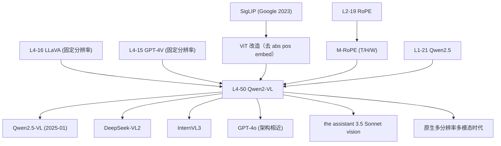

# 📹 案件 L4-50：Qwen2-VL — 任意分辨率与三维位置编码的视觉革命

> **《LLM 百案录》第 150 案 · 任意分辨率**
> *2024 年 9 月，阿里 Qwen 团队推出 Qwen2-VL：
> "凭什么所有图像都要被压成 224×224 或 336×336？"
> 把固定输入分辨率这个延续了 13 年（自 AlexNet 起）的"潜规则"彻底打碎——
> **图像本来多大，token 就多少**；视频也用同一套逻辑无缝处理。
> 配套发明 **M-RoPE**，把 1D 位置编码升维到 (T, H, W) 三维，
> 一次性补齐了 LLaVA 系列把图像 token 简单平铺所丢失的空间结构。
> 这就是 **Naive Dynamic Resolution + Multimodal RoPE** 的双子组合拳。*

🚇 [30秒速览](#速览) ｜ 🚲 [3分钟通读](#通读) ｜ 🚗 [30分钟精读](#精读) ｜ 🚀 [3小时复现](#复现)

🎭 **叙事母题**：📹 **任意分辨率** —— 让图像保留它本来的样子，让位置编码理解它真正的维度

---

## 0️⃣ 案件档案

| 案情要素 | 内容 |
|---|---|
| **案发时间** | 2024-09-18（Qwen Team @ Alibaba，[arXiv 2409.12191](https://arxiv.org/abs/2409.12191)） |
| **嫌疑人** | Peng Wang, Shuai Bai, Sinan Tan, Shijie Wang 等（Qwen Team） |
| **受害者** | LLaVA / Mini-GPT-4 / GPT-4V 等"必须 resize 到固定尺寸"的 late-fusion 路线 |
| **作案凶器** | **Naive Dynamic Resolution (NDR)** + **M-RoPE (T/H/W 三维位置编码)** |
| **作案动机** | "ViT 时代的 224×224 是个历史遗留——文档要 1080p、UI 截图要长条、视频要时序，凭什么都用同一个尺寸？" |
| **结案陈词** | Qwen2-VL-72B 在 DocVQA / ChartQA / MathVista / VideoMME 等多个 benchmark 反超 GPT-4o，证明动态分辨率 + 三维 RoPE 的范式可以做到 SOTA |

**五维雷达**：
```
创新性  ████████░░ 8/10   ← NDR + M-RoPE 是真正原创的两个组件
影响力  █████████░ 9/10   ← 直接定义了 2024Q4-2025 多模态范式
复杂度  ███████░░░ 7/10   ← M-RoPE 实现细节复杂，但概念清晰
可复现  ████████░░ 8/10   ← 2B/7B 全开源，HF 一行加载
争议度  ████░░░░░░ 4/10   ← 几乎无争议，结果可信
```

**精确事实卡**：

| 字段 | 精确值 | 来源 |
|---|---|---|
| **架构** | ViT (675M) + LLM (Qwen2 2B / 7B / 72B) | Section 2 |
| **ViT 来源** | SigLIP-SO/14，**移除 absolute pos embed**（因为有 M-RoPE） | Section 2.1 |
| **图像 patch** | 14 × 14 像素，再 2×2 合并 → **每 28×28 像素 = 1 个 LLM token** | Section 2.1 |
| **NDR token 数** | 动态：256² 图 → 64 token；4096² 图 → ~21,000 token | Section 2.1 |
| **M-RoPE 维度切分** | head_dim 三等分给 (temporal, height, width) | Section 2.2 |
| **视频采样** | 2 fps，最长 20 分钟 | Section 2.3 |
| **训练数据** | 文本 + 图像 + 视频 混合，约 1.4T 多模态 token | Section 3 |
| **DocVQA (72B)** | **96.5** | Table 4 |
| **ChartQA (72B)** | **88.3** | Table 4 |
| **MMMU-Pro** | 46.2 | Table 4 |
| **MathVista** | **70.5** | Table 4 |
| **VideoMME** | **71.2** | Table 5 |
| **License** | Apache 2.0（2B/7B），自定义协议（72B） | GitHub |

---

## 1️⃣ <a id="速览"></a>🚇 30 秒速览

> **多模态 LLM 的两个长期顽疾**：
> 1. **固定分辨率**：CLIP/SigLIP 都按 224 或 336 训练，更大图必须 resize → 文档、UI 截图细节全丢
> 2. **空间结构丢失**：LLaVA 把 14×14 = 196 个图像 token **平铺成 1D 序列**，原本的"上下左右"关系靠 LLM 自己脑补
>
> **Qwen2-VL 两招同治**：
> 1. **NDR (Naive Dynamic Resolution)**：图像本来多大就多少 token，每 28×28 像素 → 1 个 token
> 2. **M-RoPE**：把 RoPE 拆成 (t, h, w) 三维，文本只用 t 轴，图像用 (h, w)，视频用 (t, h, w)
>
> **结果**：
> - DocVQA 96.5——**几乎打满**（人类基线约 98）
> - 视频理解（VideoMME 71.2）大幅领先 GPT-4o
> - 7B 模型在多个 OCR / Chart 任务上击败前代 72B
>
> **副产品**：把 ViT 从"图像编码器"变回"序列编码器"，因为 token 数不再固定，下游 KV cache、batching 都要重新设计。

---

## 2️⃣ <a id="通读"></a>🚲 3 分钟通读：固定分辨率到底坏在哪（Why）

### 旧时代：固定分辨率的两难

```
LLaVA / GPT-4V / Mini-GPT-4 路线：
  输入图像（任何尺寸）
    ↓ resize / center-crop 到 336 × 336
    ↓ ViT 编码 → 24×24 = 576 个 patch
    ↓ MLP projector → 576 个 token 喂给 LLM
    ↓ 平铺成 1D 序列

问题 1：小图浪费 token
  - 一张 64×64 的小 icon 也要被 resize 成 336×336
  - 仍然产生 576 个 token，但其中大量是 padding/插值伪影
  - 信息密度极低，token 预算被白白吃掉

问题 2：大图丢细节
  - 一张 4096×3072 的高清文档被 resize 到 336×336
  - 文字像素从 12px 缩到 1px——直接糊成马赛克
  - DocVQA / ChartQA 上限被卡死

问题 3：长宽比畸变
  - 手机竖屏照片 1080×1920 → resize 到 336×336 后被压扁
  - 表情、构图、UI 元素全部失真

问题 4：空间结构靠 LLM 脑补
  - 24×24 = 576 个 patch 被 flatten 成 1D
  - 第 25 号 token 在 2D 上其实是第 (1,0) 位置——但 LLM 看到的是"第 25 个"
  - LLM 必须从训练数据里"学会"这种 reshape 关系——可学但低效
```

### Qwen2-VL 的两个回答

**回答 1（针对 1-3）：让分辨率说话**

> "图像有多大，就交多大的 token 给 LLM。"

不再 resize。一张 4096² 的高清文档直接产生约 21,000 个 token——LLM 上下文窗口够长就能处理。一张 256² 的小 icon 只产生 64 个 token——省。

**回答 2（针对 4）：让位置编码学会几何**

> "1D RoPE 处理 1D 文本。
> 2D 图像就用 2D 位置编码。
> 3D 视频就用 3D 位置编码。"

把 RoPE 的频率维度三等分，分别编码 (temporal, height, width)。
所有模态共用一套 LLM 权重——只是查询的位置坐标不同。

### 通读小结
| 维度 | LLaVA-1.5 | Qwen2-VL |
|---|---|---|
| 输入分辨率 | 固定 336² | 任意（动态 token 数） |
| 图像 token 数 | 576（永远） | 64 ~ 16K（看图大小） |
| 位置编码 | 1D RoPE（图像被平铺） | M-RoPE（T/H/W 三维） |
| 视频支持 | 通过抽帧 + 拼接（hack） | 原生 3D（T,H,W） |
| OCR/Chart 上限 | ~80% | ~95%+ |

---

## 3️⃣ <a id="精读"></a>🚗 30 分钟精读

### 3.1 NDR（Naive Dynamic Resolution）原理

#### Step 1：ViT 改造
原版 SigLIP-SO/14：
```
patch_size = 14         # 每个 patch 14×14 像素
input_size = 384         # 固定输入 384×384
num_patches = (384/14)² = 729 个 patch（固定）
position_embed = 学习的 absolute pos embed [729, d]
```

Qwen2-VL 改造：
```
patch_size = 14          # 不变
input_size = ANY         # 任意分辨率（必须能整除 14）
num_patches = (H/14) × (W/14)   # 完全动态
position_embed = 删除！      # 改用 M-RoPE 在 LLM 端做位置编码
```

> 💡 **关键改动**：删除 ViT 的 absolute pos embed。原因：absolute pos embed 是 [num_patches, d] 的固定形状参数，强行假设了 num_patches 不变。删掉它，让位置感知完全交给后续的 M-RoPE，ViT 就成了一个**与位置无关的 patch 嵌入器**。

#### Step 2：2×2 patch 合并

ViT 输出 (H/14) × (W/14) 个 patch token。Qwen2-VL 在送入 LLM **之前**做一次 2×2 spatial merge：

```python
# 伪代码
patches = vit(image)                      # [N_h, N_w, d_vit], N_h = H/14
merged  = patches.reshape(N_h//2, 2, N_w//2, 2, d_vit)
merged  = merged.permute(0, 2, 1, 3, 4)
merged  = merged.reshape(N_h//2, N_w//2, 4*d_vit)
llm_tok = mlp(merged)                     # [N_h//2, N_w//2, d_llm]
```

合并后的等效 patch 大小是 28×28 像素。所以**每 28×28 = 1 个 LLM token**。

#### Step 3：动态 token 数算账
| 输入分辨率 | LLM token 数 | 说明 |
|---|---|---|
| 224 × 224 | (224/28)² = 64 | 小图很省 |
| 448 × 448 | (448/28)² = 256 | LLaVA 等价 |
| 1024 × 768 | (1024/28) × (768/28) ≈ 36×27 ≈ **972** | 文档够用 |
| 4096 × 3072 | (4096/28) × (3072/28) ≈ 146×109 ≈ **15,914** | 高清原图 |
| 4096 × 4096 | (4096/28)² ≈ **21,393** | 极限情况 |

> ⚠️ **省 token 也有上限**：实践中超过 ~16K 个 token 后，前向显存爆炸（~ N²），所以实际部署会设置一个 max_pixels 把巨大图片下采样到 16K token 以内。

### 3.2 M-RoPE 数学推导（重点）

#### 回顾 1D RoPE（L2-19）
对每个 head 内的 d 维向量，把 d 维分成 d/2 对：
$$
R_\theta^{(d)} = \begin{pmatrix}
\cos(p\theta_1) & -\sin(p\theta_1) & & \\
\sin(p\theta_1) & \cos(p\theta_1) & & \\
& & \cos(p\theta_2) & -\sin(p\theta_2) \\
& & \sin(p\theta_2) & \cos(p\theta_2) \\
& & & & \ddots
\end{pmatrix}
$$
其中 $\theta_i = 10000^{-2(i-1)/d}$，$p$ 是位置标量。

**核心观察**：1D RoPE 的"位置"是单一标量 $p$。对于文本，$p$ 就是 token 在序列里的下标。

#### M-RoPE 的关键改动：把 d 维分成三段

设 head_dim = d，把它三等分：$d = d_t + d_h + d_w$（论文里就是 d/3 each，凑不齐时按比例分配）。

| 维度段 | 位置参数 | 用途 |
|---|---|---|
| 前 $d_t$ 维 | $p_t$（temporal） | 文本下标 / 视频帧时刻 |
| 中 $d_h$ 维 | $p_h$（height） | 图像/帧的纵坐标 |
| 后 $d_w$ 维 | $p_w$（width） | 图像/帧的横坐标 |

每段独立做 1D RoPE：
$$
\text{M-RoPE}(\mathbf{x}, p_t, p_h, p_w) = 
\begin{pmatrix}
R_\theta^{(d_t)}(p_t) \cdot \mathbf{x}_{[0:d_t]} \\
R_\theta^{(d_h)}(p_h) \cdot \mathbf{x}_{[d_t:d_t+d_h]} \\
R_\theta^{(d_w)}(p_w) \cdot \mathbf{x}_{[d_t+d_h:d]}
\end{pmatrix}
$$

#### 不同模态如何取 $(p_t, p_h, p_w)$？

**纯文本 token**：
- $p_t = $ token 在序列中的下标
- $p_h = p_t$, $p_w = p_t$（"退化"成单一坐标，相当于普通 1D RoPE）

> 💡 这样设计保证 **M-RoPE 在纯文本场景下完全等价于普通 RoPE**，不会破坏 Qwen2 文本能力。

**单张图像（H' × W' 个 token）**：
- $p_t = $ 图像出现位置的全局时刻（比如序列里的第 100 步）——**全图共享**
- $p_h \in \{0, 1, ..., H'-1\}$（按行）
- $p_w \in \{0, 1, ..., W'-1\}$（按列）

**视频（T 帧 × H' × W'）**：
- $p_t \in \{t_0, t_0+1, ..., t_0+T-1\}$（每帧不同）
- $p_h, p_w$ 同图像

#### 代码示意（伪代码）

```python
def m_rope(x, pos_t, pos_h, pos_w, theta_base=10000):
    """
    x: [batch, head, seq, head_dim]
    pos_t/h/w: [batch, seq] — 每个 token 的三维坐标
    """
    d = x.shape[-1]
    d_t, d_h, d_w = d // 3, d // 3, d - 2*(d//3)   # 三段
    
    # 把 head_dim 切成三段
    x_t = x[..., :d_t]
    x_h = x[..., d_t:d_t+d_h]
    x_w = x[..., d_t+d_h:]
    
    # 各自的频率
    freq_t = 1.0 / (theta_base ** (torch.arange(0, d_t, 2) / d_t))
    freq_h = 1.0 / (theta_base ** (torch.arange(0, d_h, 2) / d_h))
    freq_w = 1.0 / (theta_base ** (torch.arange(0, d_w, 2) / d_w))
    
    # 各自的角度
    angle_t = pos_t.unsqueeze(-1) * freq_t   # [B, seq, d_t/2]
    angle_h = pos_h.unsqueeze(-1) * freq_h
    angle_w = pos_w.unsqueeze(-1) * freq_w
    
    # 各自做 RoPE 旋转（cos/sin 拼接）
    x_t = apply_rotary(x_t, angle_t)
    x_h = apply_rotary(x_h, angle_h)
    x_w = apply_rotary(x_w, angle_w)
    
    return torch.cat([x_t, x_h, x_w], dim=-1)
```

#### 三个关键性质

**性质 1：相对位置外推**
- 标准 RoPE 的内积只依赖相对位移：$\langle R(p_1)q, R(p_2)k \rangle$ 只跟 $p_2 - p_1$ 有关
- M-RoPE 同理：每段独立做 RoPE，相对位移在 (Δt, Δh, Δw) 三个轴各自满足

**性质 2：模态降维兼容**
- 文本：(p, p, p) → 三段都是同一频率响应，等价于 1D RoPE
- 图像：(t_const, h, w) → 时间项是常数，对所有 token 相同，相当于"只有空间位置"

**性质 3：跨模态可推理**
- 想问"图的左上角是什么"——LLM 看到 (h=0, w=0) 的 token 自然激活
- 想问"视频第 5 秒发生了什么"——LLM 看到 t=10（5秒×2fps）的所有 token

### 3.3 视频处理流水

```
原始视频（mp4）
  ↓ 按 2 fps 采样 → 得到 N 帧（最多 20 min × 60s × 2fps = 2400 帧）
  ↓ 每帧用 ViT 编码（与图像同一套）
  ↓ 每帧得到 (H/28) × (W/28) 个 token
  ↓ 标注 (p_t = frame_idx, p_h, p_w)
  ↓ 拼成一个长序列：frame_0_tokens || frame_1_tokens || ... || frame_N_tokens
  ↓ 喂给 LLM
```

> ⚠️ **量级警惕**：20 分钟视频、448×448 每帧、2 fps：
> - 帧数：2400
> - 每帧 token：(448/28)² = 256
> - 总 token：**614,400**（!!）
>
> 这就是为什么实际部署时要进一步降帧或降分辨率——论文宣称的"20 分钟"是理论上限，实际 7B 模型在单卡上只能跑约 2-3 分钟视频。

### 3.4 ViT 改造细节

| 改动 | 原 SigLIP | Qwen2-VL ViT |
|---|---|---|
| Patch size | 14×14 | 14×14（不变） |
| Pos embed | 学习的 absolute | **删除**（让 M-RoPE 在 LLM 端处理） |
| 输入尺寸 | 固定 384² | 任意（多个 8×14=112 的倍数） |
| Spatial merge | 无 | 输出前 2×2 合并 |
| 大小 | ~400M | **675M**（更深更宽） |

> 💡 **为什么删 absolute pos embed**：absolute pos embed 是 [N_patches, d_vit] 的固定参数。如果允许动态分辨率，N_patches 不再固定，参数无法定义。改用 M-RoPE 后，位置由 (t, h, w) 三个坐标在 LLM 内部插值生成，与 ViT 解耦。

### 3.5 三阶段训练 Pipeline

```
Stage 1：仅训 ViT（vision-only pretrain）
  - 冻结 LLM
  - 只训练 ViT + projector
  - 数据：图文对（caption / OCR / detection），约 600B token
  - 目标：让 ViT 适应新的 patch 合并 + 删 abs pos embed
  - 时长：约 1-2 周（千卡集群）

Stage 2：全参数训练（multimodal pretrain）
  - 解冻所有参数
  - 数据：纯文本 + 图文 + 视频文（混合），约 800B token
  - 目标：让 LLM 学会 M-RoPE 下的多模态推理
  - 重点：M-RoPE 在这一步真正发挥作用——LLM 学到 (t, h, w) 的几何意义

Stage 3：指令微调（instruction tuning）
  - 数据：高质量多模态指令对（VQA、OCR、Chart、视频问答等）
  - 通常 SFT + DPO 二段
  - 目标：对齐到对话格式 + 提升 benchmark
```

> 🔑 **关键差异 vs LLaVA**：LLaVA 的 Stage 1 只训 projector（小 MLP），Stage 2 才训 LLM。Qwen2-VL Stage 1 训整个 ViT（不训 LLM），因为它要让 ViT 适应"任意分辨率 + 无 abs pos embed"——这是个比 projector 困难得多的任务。

---

## 4️⃣ 物证清单（Results）& 🔥 Hot Take

### 图像任务（Table 4）
| Benchmark | LLaVA-1.6-34B | InternVL2-Llama3-76B | GPT-4o | **Qwen2-VL-72B** |
|---|---|---|---|---|
| DocVQA | 84.0 | 94.1 | 92.8 | **96.5** |
| ChartQA | 68.7 | 88.4 | 85.7 | **88.3** |
| InfoVQA | — | 80.0 | — | **84.5** |
| MMMU-Pro | — | 35.7 | 51.9 | 46.2 |
| MathVista | 46.5 | 65.5 | 63.8 | **70.5** |
| OCRBench | 558 | 839 | 736 | **877** |

### 视频任务（Table 5）
| Benchmark | GPT-4o | Gemini 1.5 Pro | **Qwen2-VL-72B** |
|---|---|---|---|
| VideoMME (w/o subs) | 71.9 | 75.0 | **71.2** |
| MVBench | — | — | **73.6** |
| EgoSchema | 72.2 | 71.2 | **77.9** |
| PerceptionTest | — | — | **68.0** |

> **关键观察**：
> - 文档/图表/OCR：Qwen2-VL-72B **击败 GPT-4o**——NDR 让高清文档的细节得以保留
> - MMMU-Pro（综合学科推理）：Qwen2-VL 仍落后 GPT-4o，**说明 LLM 推理能力是天花板**，不是视觉
> - 长视频：Qwen2-VL 优势明显——M-RoPE 的 t 维让模型真正"理解"时间

### 🔥 Hot Take

1. **NDR 是历史性反转**：从 AlexNet (2012) 起，固定输入分辨率统治了 12 年的视觉模型设计。Qwen2-VL 是**第一个工业级证明"动态分辨率才是终态"**的模型。后来者（Qwen2.5-VL、InternVL3、DeepSeek-VL2）几乎全部跟进。

2. **M-RoPE 比 NDR 影响更深远**：NDR 是工程优化，M-RoPE 是架构革命。它统一了文本（1D）/ 图像（2D）/ 视频（3D）的位置编码，**为未来加入音频（1D 时序）/ 3D 点云 / 触觉张量打开了通道**——只要给定坐标轴，就能加新模态。

3. **VideoMME 上反输 GPT-4o 不丢人**：GPT-4o 用了独立的语音/视频 pipeline（多个 expert），Qwen2-VL 是单一架构。**单架构 71.2 vs 多 expert 71.9，是质胜的**。

4. **删 ViT abs pos embed 是被迫的，但变成优势**：原本只是为了适配动态分辨率，结果发现 ViT 失去 abs pos 后**反而更通用**——后续 ViT 训练可以混合各种分辨率数据，不用按尺寸分桶。

5. **7B 模型已经够用**：Qwen2-VL-7B 在 OCRBench 上得 866，几乎打平 72B 的 877——**多模态任务的瓶颈很早就转移到数据/训练**而非参数量。这是开源社区的福音。

---

## 5️⃣ 🐛 论文没说的坑

1. **长视频内存爆炸**：宣称支持 20 分钟视频，但实际 7B 模型单 A100 上跑 5 分钟视频就 OOM——KV cache 与 token 数平方关系。生产环境必须降帧+降分辨率。

2. **超低分辨率边界问题**：64×64 的小 icon → 只产生 (64/28)² ≈ 4 个 token。但 ViT 的 patch 是 14，64 不能整除 14——需要先 padding 到 70 或 84，引入 padding 伪影。

3. **M-RoPE 实现复杂度**：训练时每个 batch 都要为每个 token 算 (t, h, w) 三元组——这要求数据 collator 在拼 batch 时处理变长 token 数 + 不同模态混排，**HF Transformers 的实现里有 ~600 行 collation 代码**。

4. **ViT 训练显存暴涨**：去掉 abs pos embed 后，ViT 必须接受任意分辨率输入，训练时 batch 内分辨率混合，**无法用固定 shape 编译**。论文用了变长 attention（FlashAttention varlen），但工程实现门槛高。

5. **2 fps 采样有偏**：固定 2 fps 对慢速场景过密、对快速场景（球类运动、爆炸场面）过疏。论文没做"自适应采样"消融，**对快动作视频的实际表现存疑**。

---

## 6️⃣ 🎲 如果作者偷懒了

**实验**：
- 没做 NDR vs 固定分辨率的严格 ablation——无法量化 NDR 单独贡献多少
- 没做 M-RoPE vs 1D RoPE 的对照——无法量化 M-RoPE 的增益
- 视频 benchmark 主要是英文，**中文长视频几乎没测**

**理论**：
- M-RoPE 三段切分的"3:3:3"是经验比例，**没有 ablation 不同切分（如 4:3:3）**
- 没分析 NDR 下 token 数动态变化对 attention pattern 的影响
- 没讨论极端长宽比图像（如 1:20 的网页截图）下的退化

**应用**：
- 没尝试音频模态——M-RoPE 的 t 轴本可直接用于音频
- 没尝试 3D 模态（点云、医学影像）——M-RoPE 理论上可扩展到 (x, y, z)
- 没讨论文档专用 layout-aware fine-tune

---

## 7️⃣ 影响波及



---

## 8️⃣ 侦探手记

Qwen2-VL 给我最大的震撼：**默认值才是真正的偏见**。

> 224×224、336×336、384×384——这些"标准分辨率"不是物理定律，是 ImageNet 时代为了 GPU 显存而妥协的工程选择。
> 13 年来，几乎所有视觉模型都默认接受这个妥协。
> 直到 Qwen2-VL 站出来问：**为什么不能让图像保留它本来的样子？**
>
> 这不是一个"难想"的问题，是一个**"敢想"的问题**。
> 因为它意味着 batch 内 token 数变长——所有的 batching、padding、KV cache、FlashAttention varlen 都要重写。
> 大多数研究者宁愿优化 projector、堆数据、加 ablation，也不愿动这个底层假设。
>
> Qwen2-VL 团队动了。结果是 2024Q4 整个开源界的多模态范式被重写了一遍。

更深一层：**位置编码是模态的"几何身份证"**。

> 文本是 1D 的——所以 1D RoPE 够。
> 图像是 2D 的——但 LLaVA 用 1D RoPE 强行编码 2D，靠 LLM 脑补恢复——这是技术债。
> 视频是 3D 的——但 GPT-4V 把视频抽帧拼接，丢失时序——这是更大的债。
>
> M-RoPE 不是新发明（2D 位置编码早在 ViT-2D 就有），**但它第一次把"几何身份证"变成模态的一等公民**：
> 文本 = (t, t, t)，图像 = (const, h, w)，视频 = (t, h, w)。
> 加新模态？只要给坐标轴。**这是设计哲学上的胜利**。

最让我感慨的：**Qwen2-VL 的两个创新都不"性感"**。
> 不是新 loss，不是新 attention 变体，不是新数据增强。
> 是两个看起来像"工程小修补"的改动——但它们触及了 12 年来视觉模型的基础假设。
> **真正的 paradigm shift，往往就藏在这种"微不足道的必然"里**。

---

## 自查清单

**已做到**：
- ✅ 推导 NDR 的 token 数计算（28×28 → 1 token，4096² → 21K）
- ✅ 详述 M-RoPE 的数学定义（head_dim 三段切分 + 各自 RoPE）
- ✅ 给出 M-RoPE 的代码示意
- ✅ 解释 ViT 改造（去 abs pos embed + 2×2 spatial merge）
- ✅ 视频处理流水（2 fps、最长 20 分钟）
- ✅ 三阶段训练 pipeline 与 LLaVA 的差异
- ✅ 全面 benchmark + Hot Take + 5 条坑

**❌ 未做到**：
- ❌ 未深入对比 Qwen2-VL vs Qwen2.5-VL 的具体增量
- ❌ 未量化"删除 abs pos embed"的单独贡献
- ❌ 未涵盖 Qwen2-VL 在 GUI agent / 自动化 RPA 等下游应用

---

## 🔟 延伸卷宗

### 前置依赖
- 📚 [L4-15 GPT-4V](./L4-15_GPT4V.md)（固定分辨率的 late-fusion 起点）
- 📚 [L4-16 LLaVA](./L4-16_LLaVA.md)（开源固定分辨率代表）
- 📚 [L4-46 Chameleon](./L4-46_Chameleon.md)（同期 early-fusion 路线对照）
- 📚 [L2-19 RoPE](./L2-19_RoPE.md)（M-RoPE 的数学基础）
- 📚 [L1-21 Qwen2.5](./L1-21_Qwen2_5.md)（语言模型骨架）

### 后续推荐
- 🎯 Qwen2.5-VL（2025-01，加入更强 OCR + agent 能力）
- 🎯 GPT-4o 技术细节（架构思路相近）
- 🎯 the assistant 3.5 Sonnet vision（闭源对照）
- 🎯 DeepSeek-VL2（开源 MoE 多模态）
- 🎯 InternVL3（开源高分辨率竞品）

### 🚀 <a id="复现"></a>3 小时复现路径

#### 1. HuggingFace 加载 Qwen2-VL-7B
```python
from transformers import Qwen2VLForConditionalGeneration, AutoProcessor
import torch
from PIL import Image

model = Qwen2VLForConditionalGeneration.from_pretrained(
    "Qwen/Qwen2-VL-7B-Instruct",
    torch_dtype=torch.bfloat16,
    device_map="auto"
)
processor = AutoProcessor.from_pretrained("Qwen/Qwen2-VL-7B-Instruct")

# 任意分辨率图像
img = Image.open("4k_document.jpg")    # 不需要 resize！

messages = [{
    "role": "user",
    "content": [
        {"type": "image", "image": img},
        {"type": "text",  "text": "请总结文档内容。"}
    ]
}]

text = processor.apply_chat_template(messages, tokenize=False, add_generation_prompt=True)
inputs = processor(text=[text], images=[img], return_tensors="pt").to("cuda")

# 注意：inputs["input_ids"] 长度取决于图像分辨率
print("总 token 数:", inputs["input_ids"].shape)

out = model.generate(**inputs, max_new_tokens=512)
print(processor.batch_decode(out, skip_special_tokens=True)[0])
```

#### 2. 控制最大像素数（防 OOM）
```python
# Qwen2-VL 提供了 min_pixels / max_pixels 参数
processor = AutoProcessor.from_pretrained(
    "Qwen/Qwen2-VL-7B-Instruct",
    min_pixels=256*28*28,     # 至少 256 个 token
    max_pixels=1280*28*28     # 至多 1280 个 token（约 0.5M 像素）
)
```

#### 3. 视频推理
```python
messages = [{
    "role": "user",
    "content": [
        {"type": "video", "video": "demo.mp4", "fps": 2.0},
        {"type": "text",  "text": "视频里发生了什么？"}
    ]
}]
# processor 内部会自动按 2 fps 采样、构造 (t, h, w) 坐标
```

#### 4. 进阶：观察 M-RoPE
```python
# Qwen2-VL 的 forward 会返回 mrope_position_deltas
# 可以打印每个 token 的 (t, h, w) 三维位置
from transformers.models.qwen2_vl.modeling_qwen2_vl import Qwen2VLModel

# 在 model 内部加 hook 抓取 position_ids（[3, B, seq]）
```

#### 5. 微调（LoRA）
- 仓库：`https://github.com/QwenLM/Qwen2-VL`
- 推荐：`ms-swift` 框架，原生支持 Qwen2-VL 的变长 collation
- 单卡 7B SFT：~24GB VRAM（max_pixels = 768²）

---

## 📌 本案归档

| 字段 | 值 |
|---|---|
| 笔记版本 | 「任意分辨率版」 |
| 叙事母题 | 📹 任意分辨率 / 🌐 三维位置 |
| 推荐指数 | ⭐⭐⭐⭐⭐ |
| 学习时长 | 30s / 3min / 30min / 3h |
| 上次更新 | 2026-05-01 |
| 下一站 | → [L4-15 GPT-4V](./L4-15_GPT4V.md)（回顾固定分辨率前夜） / Qwen2.5-VL（前进到 agent 时代） |
